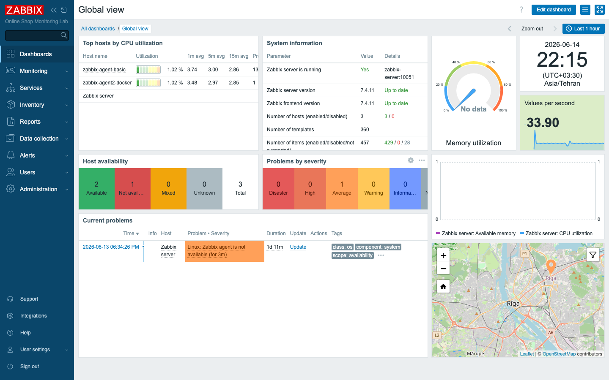
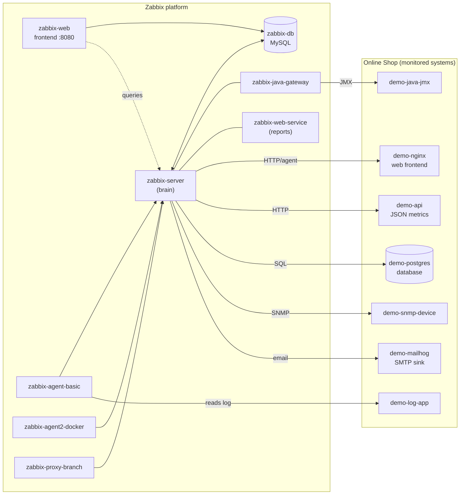

# Module 1: Introduction to Zabbix

## Learning Objectives

By the end of this module you will be able to explain what monitoring actually
is — not as a buzzword, but as a concrete engineering practice — and articulate
why an organization is willing to spend real money and engineering time on it.
You will be able to describe what Zabbix is, where it sits among the other tools
you may have heard of, and the surprisingly wide range of things it can watch.
And you will be able to look at the architecture of the lab you are about to
build and name every moving part: which container is the brain, which ones do the
collecting, where the data lives, and how a human finally sees it. Nothing in
this module asks you to configure Zabbix. The goal is to build the mental map
that every later module hangs on, so that when you start clicking and typing in
Module 2 you already understand *what* you are wiring together and *why*.

## Topics

### Our storyline: monitoring the "Online Shop"

Most courses teach a monitoring tool the way a dictionary teaches a language:
one isolated feature at a time, each demonstrated on a throwaway example you
forget by the next page. We are going to do the opposite. From this module to the
final project, you and I are building **one** monitoring platform for **one**
imaginary company, and every new technique earns its place by solving a real
problem that company has.

The company runs an **Online Shop**. Picture the kind of small business that
sells things over the internet: there is a website that customers browse, an API
behind it that processes orders and talks to payment systems, a database that
stores the catalog and the orders, a Java service doing some background work, a
stream of application logs, a network device moving traffic around, an email
channel for sending alerts, and — because someone in management cares — a
promise about uptime that the business has made to its customers, otherwise known
as a service-level agreement.

That list is not random. Each piece corresponds to a real container in your lab,
and each one is a different *kind* of thing to monitor, which is exactly why it
makes such a good teaching vehicle. A website is monitored differently from a
database; a database is monitored differently from a network switch. By the time
you have watched all of them, you will have practiced nearly every collection
method Zabbix offers.

So keep this picture in your head as we go. Every item you create, every trigger
you write, every dashboard you assemble exists to answer a genuine question about
the Online Shop — *Is it up? Is it fast enough? Is it about to run out of
something?* When a later module introduces a feature, your first question should
be: "What does this let me find out about the shop that I couldn't find out
before?" That habit is the difference between collecting data and actually
monitoring.

### What is monitoring?

It is worth slowing down on this word, because "monitoring" gets used loosely and
the looseness causes real confusion later. At its core, monitoring is a loop of
four activities, and you can remember the whole discipline as four verbs:
**collect → store → detect → notify**.

You **collect** measurements from your systems — how much CPU a server is using,
how long the API took to answer, how many orders are sitting in a queue. You
**store** those measurements over time, because a single number is nearly
useless; the value of "CPU is at 80%" depends entirely on whether it has been at
80% for months or jumped there ten seconds ago. You **detect** when a stored
measurement crosses from "normal" into "something is wrong" — a judgment the
monitoring system makes automatically, around the clock, so a human doesn't have
to stare at graphs. And when something *is* wrong, you **notify** the right
person, through the right channel, with enough context to act.

Run that loop continuously and you have turned the question every operations team
dreads — *"Is everything OK right now?"* — from an anxious guess into a fact you
can see on a screen and, just as importantly, prove from history after the fact.

There is one distinction worth drawing early, because beginners routinely
collapse these three into a single vague notion of "working," and the
distinction will shape how you design every check in this course:

- **Availability** — is the thing up and reachable at all? *Is the Online Shop
  website answering requests, yes or no?* This is binary and it is the floor:
  if the answer is no, nothing else matters.
- **Performance** — given that it is up, is it doing its job *well*? *Is the API
  responding in 60 milliseconds, or is it crawling along at 6 seconds?* A system
  can be 100% available and still be failing its users.
- **Capacity and trends** — where is this heading over time? *The database disk
  is 70% full today; at the rate it is filling, when does it hit 100%?* This is
  the question that lets you fix problems on a Tuesday afternoon instead of at 3
  a.m. on a holiday weekend.

Good monitoring covers all three, and a recurring theme of this course is that
Zabbix was built from the ground up to do exactly that — not just to ping things
and tell you they are alive.

### Why monitoring matters

Here is the blunt version. Without monitoring, you learn about problems from your
users — which is the worst possible source, because by the time a customer is
angry enough to complain, the damage is already done and you are now both late
*and* on the back foot.

With monitoring, the whole timeline shifts earlier. You see the failed-payment
queue backing up *before* customers start tweeting about charges that didn't go
through. You watch the disk filling *before* it fills and takes the database down
with it. And after an incident — because there is always eventually an incident —
you have the recorded history to reconstruct what actually happened, instead of
arguing from memory and hunches.

Across IT operations, DevOps, cloud engineering, networking, and up at the
business level, this is the line that separates teams that **react** to outages
from teams that **prevent** them. It is also the technical foundation underneath
every service-level agreement a company signs: you cannot promise "99.9% uptime"
to a customer if you have no reliable way to measure your own uptime. Monitoring
is how a promise about reliability becomes something you can actually keep and
demonstrate.

### What Zabbix is

With that groundwork laid, here is the one-sentence definition: **Zabbix is an
open-source, enterprise-grade monitoring platform.** Now let's unpack each part
of that sentence, because every word is doing work.

*Open-source* means it is free software with no per-host or per-metric licensing
fee. That matters more than it first appears: many commercial monitoring tools
charge per monitored device, which quietly pushes teams to monitor *less* to save
money — exactly the wrong incentive. With Zabbix, monitoring one more host costs
you nothing but the resources to collect the data.

*Enterprise-grade* means it is not a toy. The same software you are about to run
on a single laptop scales up to environments pushing hundreds of thousands of
monitored values per second, which is why you find Zabbix in banks, telecoms, and
large cloud operations, not just in hobby labs.

*Monitoring platform* — and this is the key word — means Zabbix is not one
narrow tool but an integrated set of capabilities. It monitors almost anything:
servers, containers, network devices, applications, databases, web endpoints, log
files, and even abstract "business services" you define yourself. It collects
that data several ways — through agents you install on a host, through agentless
protocols like SNMP, HTTP, JMX, ODBC, and SSH, and through a flexible API. It
stores everything in a relational database. It evaluates rules called
**triggers** to decide when a measurement means trouble. And it drives
**actions**, such as sending an email, when trouble appears. Collection, storage,
detection, and notification — the entire four-verb loop from earlier — all live
in one product.

Throughout this course we target one specific release: **Zabbix 7.4**. Versions
matter in Zabbix; menus get renamed, syntax evolves, and features come and go
between releases. When you read older blog posts or recall something from a
previous version, treat it as a hint, not gospel, and trust what 7.4 actually
shows you.

### What Zabbix can monitor — common use cases

The easiest way to feel the breadth of Zabbix is to map its major use cases
directly onto the Online Shop, and then notice which module turns each one from a
concept into a working configuration. Every row in this table is a promise about
where the course is going:

| Use case | Online-Shop example in our lab | Covered in |
|---|---|---|
| Server / host monitoring | CPU, memory, disk of the lab containers | Day 1 (Mod 5–8) |
| Application monitoring | the `demo-api` orders/queue metrics | Day 2 (Mod 9, 11) |
| Database monitoring | `demo-postgres` availability & connections | Day 3 (Mod 22) |
| Website monitoring | `demo-nginx` availability & response time | Day 3 (Mod 21) |
| Log monitoring | error lines from `demo-log-app` | Day 3 (Mod 19) |
| Network device monitoring | `demo-snmp-device` over SNMP | Day 3 (Mod 20) |
| Java application monitoring | `demo-java-jmx` heap/threads via JMX | Day 3 (Mod 22) |
| Business service monitoring | the "Online Shop" service tree & SLA | Day 4–5 (Mod 28, 35) |

Notice that no single collection method covers that whole list. A website wants an
HTTP check; a switch wants SNMP; a Java app wants JMX; a database wants a SQL
query. Part of becoming competent with Zabbix is developing an instinct for which
tool fits which target — and the table above is, in effect, the syllabus for
building that instinct.

### Zabbix compared with other tools (high level)

You do not need to memorize tool comparisons to pass the certification, and you
certainly don't need to win arguments about them on the internet. But it helps to
place Zabbix on the map relative to names you have probably encountered, because
understanding the trade-offs clarifies what Zabbix is *for*.

**Nagios** is one of the elders of open-source monitoring. It pioneered the idea
of automated availability checks, and a great deal of later tooling traces its
lineage back to it. Its philosophy, though, leans heavily on plug-ins and
external add-ons: out of the box it is strong on "is this up?" checks and leaner
on long-term graphing and data storage, which you typically bolt on separately.

The **Prometheus + Grafana** stack represents the modern, cloud-native school of
thought. Prometheus excels at collecting time-series metrics, especially from
containerized and Kubernetes environments, using a pull-based model; Grafana
gives you beautiful dashboards on top. It is an excellent combination, but it is
exactly that — a *combination*. Collection, storage, alerting, and visualization
are separate pieces you assemble and operate.

**Zabbix** sits in a different spot: it is deliberately *all-in-one*. Collection,
storage, triggering, alerting, visualization, network and host discovery, and a
complete API all ship inside the single product, with first-class support for
agent-based, SNMP, and agentless monitoring from the moment you install it. That
integrated breadth is precisely why it maps so cleanly onto a mixed environment
like our Online Shop, where a web server, a database, a Java service, and a
network device all need watching and you would rather not run four different
monitoring systems to do it.

## Docker-Based Demonstration

Everything in this course runs on Docker, and that choice is doing you a favor
worth pausing on. Docker lets every participant run the *entire* monitoring
platform — the server, the database, the web frontend, the agents, the proxy,
the gateways, and every system being monitored — on a single machine, configured
identically for everyone, and resettable to a clean state at any time. No two
students drift into subtly different setups; no one spends the first afternoon
fighting an installer. You get the same lab the author tested against.

In this opening module the instructor does not configure anything. Instead they
**show the finished lab architecture**, so you see the destination before the
journey begins. It is much easier to understand why you are building each piece
when you have already glimpsed the whole.

The instructor brings the stack up and lists what is running:

```bash
docker compose -f compose_lab.yaml up -d
docker compose -f compose_lab.yaml ps
```

Here is the verified output from the lab — fifteen containers running, with the
key infrastructure pieces reporting `healthy`:

```text
demo-api               Up (running)
demo-java-jmx          Up (running)
demo-log-app           Up (running)
demo-mailhog           Up (running) (healthy)
demo-nginx             Up (running)
demo-postgres          Up (running)
demo-snmp-device       Up (running)
zabbix-agent-basic     Up (running)
zabbix-agent2-docker   Up (running)
zabbix-db              Up (running) (healthy)
zabbix-java-gateway    Up (running)
zabbix-proxy-branch    Up (running)
zabbix-server          Up (running)
zabbix-web-service     Up (running)
zabbix-web             Up (running) (healthy)
```

Take a moment to read that list rather than skim it. Half of those names start
with `zabbix-` — those are the monitoring platform itself. The other half start
with `demo-` — those are the Online Shop, the things being watched. That single
naming convention is your first map of the lab, and it will hold for the entire
course.

The instructor then opens the frontend at **<http://localhost:8080>** and logs in
as `Admin` / `zabbix` to show that this loose collection of containers is, taken
together, a single working monitoring product. Deploying it yourself is the job
of Module 2; right now you are simply being shown the whole board before the game
starts.


*The finished monitoring product: the built-in Global view dashboard showing host
availability, problems, system status, and top hosts across the lab. You build
toward views like this over the coming modules.*

### The lab architecture

The lab splits cleanly into two groups of containers, and almost everything you
learn for the rest of the week is a relationship between them. The **Zabbix
platform** does the monitoring. The **demo systems** are the Online Shop being
monitored. Here is how they connect:



Diagrams like this reward a slow read, so let's walk it deliberately, because
each of these roles gets its own module later and this is your first introduction
to all of them at once:

> **Reading the diagram:** the **server** (`zabbix-server`) is the brain — it
> collects measurements, evaluates triggers, and decides when to act. The
> **database** (`zabbix-db`) is its memory, storing every value and every piece
> of configuration. The **frontend** (`zabbix-web`) is the face: a web
> application that lets humans see what the server knows and tell it what to do.
> **Agents** sit on or beside the monitored hosts and report their measurements
> inward to the server. The **proxy** (`zabbix-proxy-branch`) collects on behalf
> of a remote location and forwards everything to the server in one stream —
> think of a branch office reporting back to headquarters. The **Java gateway**
> and the **web service** are specialist helpers, one for speaking JMX to Java
> applications and one for generating scheduled PDF reports. And the entire
> right-hand box is the Online Shop — the collection of systems you will spend
> the week learning to watch.

If some of those roles feel abstract right now, that is completely expected. You
are not meant to fully understand the proxy or the Java gateway yet; you are meant
to know they exist and roughly what they do, so that when Module 14 spends an hour
on proxies it lands on prepared ground rather than empty space.

## Hands-On Lab

This module is deliberately conceptual: the goal is to *read* the architecture
fluently, not to configure anything yet. If the stack is not running on your
machine, that is perfectly fine — Module 2 is where you deploy it. For now, work
from the diagram above or from the instructor's screen, and treat this as a
reading-comprehension exercise on the system you are about to build.

1. Look at the architecture diagram above (or the instructor's screen).
   **Expected:** you can see two groups — the Zabbix platform and the Online Shop.

2. On the diagram, point to the component that acts as the **monitoring server**
   (the "brain").
   **Expected:** you identify `zabbix-server`.

3. Point to the **monitored hosts** — the systems we collect data *about*.
   **Expected:** you identify the `demo-*` systems (and later the agents' own
   hosts).

4. Point to the **data collectors** — the parts that gather data and hand it to
   the server.
   **Expected:** you identify `zabbix-agent-basic`, `zabbix-agent2-docker`, and
   `zabbix-proxy-branch` (and note that the server itself collects agentless data
   such as SNMP and HTTP).

5. Point to the **database backend** (where data is stored) and the **web
   interface** (where humans view it).
   **Expected:** you identify `zabbix-db` and `zabbix-web`.

6. Point to the **alerting system** — where a notification would be delivered.
   **Expected:** you identify `demo-mailhog` (our local SMTP sink, used in
   Module 27).

7. In one sentence each, write down which Online Shop component answers each
   question: *Is the website up? Is the API healthy? Is the database reachable?*
   **Expected:** `demo-nginx`, `demo-api`, `demo-postgres` respectively.

Do not rush past step 7. Putting the mapping into your own words — *this
container answers this question* — is the single most useful thing you can take
out of this module, because every configuration task for the rest of the course
is ultimately an instance of it.

## Expected Outcome

By the end of this module you can explain, in plain language a non-engineer would
follow, what Zabbix is and why organizations rely on it. You can look at the lab
architecture and correctly name the monitoring server, the monitored hosts, the
data collectors, the database, the frontend, and the alerting path — and say what
each one is *for*, not just what it is called. And you understand the Online Shop
storyline that the remaining thirty-nine modules build on, so that every feature
you meet from here on has somewhere concrete to live.
