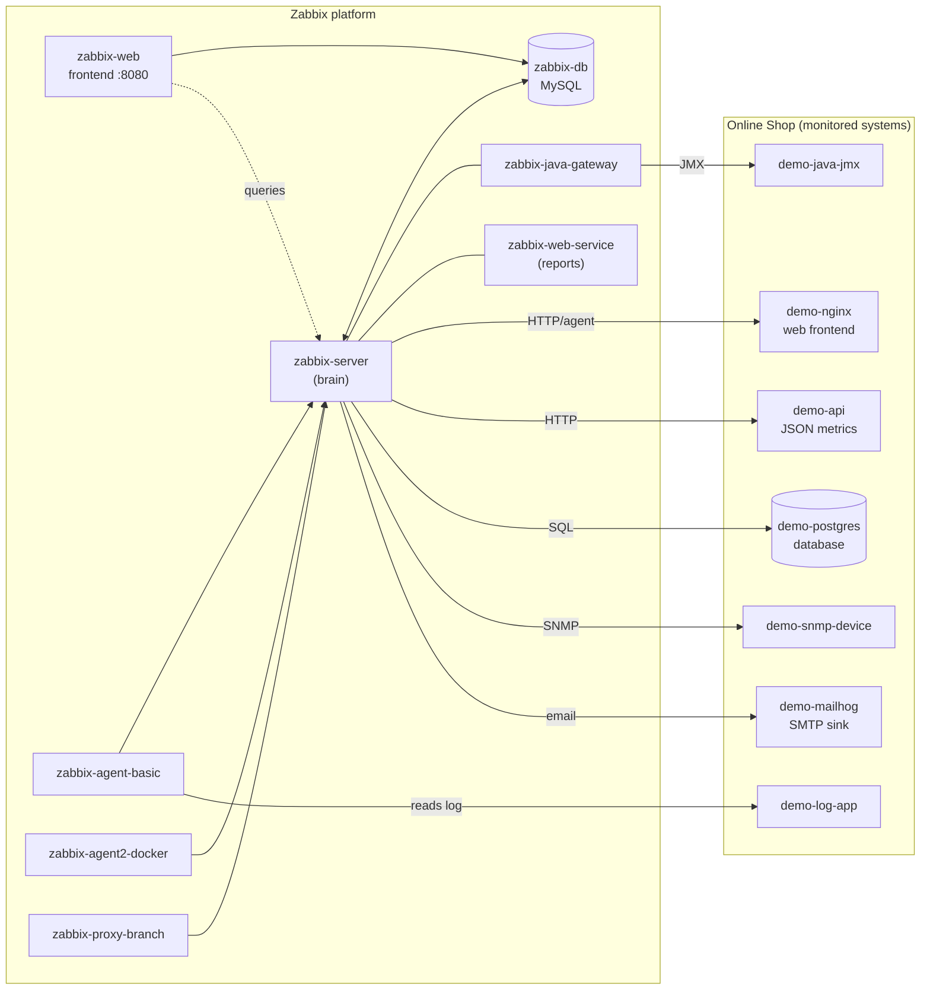

# Module 1: Introduction to Zabbix

## Learning Objectives

By the end of this module participants can explain what monitoring is and why it
matters, describe what Zabbix is and the kinds of things it can monitor, and
identify the major components of the Docker-based lab they will build across the
rest of the course.

## Topics

### Our storyline: monitoring the "Online Shop"

Throughout this course we are not learning Zabbix features in isolation — we are
building a single, growing monitoring platform for a small fictional company that
runs an **Online Shop**. The shop has a web frontend, an API, a database, a
Java service, application logs, a network-like device, an alerting channel, and a
business-level SLA. Every module adds *one more capability* to this same
environment, so by the final project you have monitored a complete, realistic
system end to end. Keep this picture in mind: each new item, trigger, or
dashboard exists to answer a real question about the Online Shop.

### What is monitoring?

Monitoring is the practice of continuously collecting measurements from your
systems, storing them over time, deciding when a measurement means something is
wrong, and telling the right people when it does. Four verbs capture it:
**collect → store → detect → notify**. A monitoring system turns the question
"is everything OK?" from a guess into a fact you can see on a screen and prove
from history.

There is an important distinction worth making early:

- **Availability** — is the thing up and reachable? (Is the Online Shop website
  answering requests?)
- **Performance** — is it doing its job *well*? (Is the API responding in
  60 ms or 6 seconds?)
- **Capacity / trends** — where is it heading? (Is the database disk filling up
  and, if so, when will it run out?)

Good monitoring covers all three. Zabbix is built to do exactly that.

### Why monitoring matters

Without monitoring, you find out about problems from your users — the worst
possible source. With monitoring you detect the failed payment queue *before*
customers complain, you see the disk filling *before* it fills, and after an
incident you have the history to explain what actually happened. In IT
operations, DevOps, cloud, networking, and at the business level, monitoring is
the difference between **reacting** to outages and **preventing** them, and it is
the foundation of any service-level agreement (SLA).

### What Zabbix is

**Zabbix is an open-source, enterprise-grade monitoring platform.** It is free
software (no per-host licensing), it scales from a single laptop lab like ours up
to hundreds of thousands of monitored values per second, and it monitors almost
anything: servers, containers, network devices, applications, databases, web
endpoints, logs, and business services. It collects data through agents, agentless
protocols (SNMP, HTTP, JMX, ODBC, SSH), and a flexible API, stores it in a
relational database, evaluates **triggers** to detect problems, and drives
**actions** (such as email alerts) when problems occur. This course targets
**Zabbix 7.4**.

### What Zabbix can monitor — common use cases

| Use case | Online-Shop example in our lab | Covered in |
|---|---|---|
| Server / host monitoring | CPU, memory, disk of the lab containers | Day 1 (Mod 5–8) |
| Application monitoring | the `demo-api` orders/queue metrics | Day 2 (Mod 9, 11) |
| Database monitoring | `demo-postgres` availability & connections | Day 3 (Mod 22) |
| Website monitoring | `demo-nginx` availability & response time | Day 3 (Mod 21) |
| Log monitoring | error lines from `demo-log-app` | Day 3 (Mod 19) |
| Network device monitoring | `demo-snmp-device` over SNMP | Day 3 (Mod 20) |
| Java application monitoring | `demo-java-jmx` heap/threads via JMX | Day 3 (Mod 22) |
| Business service monitoring | the "Online Shop" service tree & SLA | Day 4–5 (Mod 28, 35) |

### Zabbix compared with other tools (high level)

You do not need to memorise comparisons for this course, but it helps to place
Zabbix on the map. Tools like **Nagios** pioneered open-source availability
checks but lean heavily on plug-ins and external add-ons for graphing and data
storage. The **Prometheus + Grafana** stack is excellent for metrics in
cloud-native environments and uses a pull-based, time-series model with separate
tools for collection, storage, alerting, and dashboards. **Zabbix** is notable
for being an *all-in-one* platform: collection, storage, triggering, alerting,
visualization, discovery, and a full API all ship in one product, with strong
support for agent-based, SNMP, and agentless monitoring out of the box. That
breadth is exactly why it maps so well onto a mixed environment like our Online
Shop.

## Docker-Based Demonstration

Docker lets every participant run the *entire* monitoring platform — server,
database, frontend, agents, proxy, gateways, and all the systems being monitored —
on one machine, identically, and reset it at any time. In this first module the
instructor simply **shows the finished lab architecture** so participants see the
destination before the journey.

The instructor brings the stack up and lists it:

```bash
docker compose -f compose_lab.yaml up -d
docker compose -f compose_lab.yaml ps
```

Verified output from the lab (15 containers running; key ones report `healthy`):

```text
demo-api               Up (running)
demo-java-jmx          Up (running)
demo-log-app           Up (running)
demo-mailhog           Up (running) (healthy)
demo-nginx             Up (running)
demo-postgres          Up (running)
demo-snmp-device       Up (running)
zabbix-agent-basic     Up (running)
zabbix-agent2-docker   Up (running)
zabbix-db              Up (running) (healthy)
zabbix-java-gateway    Up (running)
zabbix-proxy-branch    Up (running)
zabbix-server          Up (running)
zabbix-web-service     Up (running)
zabbix-web             Up (running) (healthy)
```

The instructor then opens the frontend at **<http://localhost:8080>** and logs in
as `Admin` / `zabbix` to show that this collection of containers is, together, a
working monitoring product. (Deploying it yourself is Module 2 — here you are just
seeing the whole board.)

### The lab architecture

Two groups of containers make up the lab. The **Zabbix platform** does the
monitoring; the **demo systems** are the Online Shop being monitored.



> **Reading the diagram:** the **server** is the brain that collects and
> evaluates everything; the **database** stores it; the **frontend** is how
> humans see it; **agents** sit on (or beside) monitored hosts and report in; the
> **proxy** collects on behalf of a remote site and forwards to the server; the
> **Java gateway** and **web service** are helper components for JMX and report
> generation. The right-hand box is the Online Shop we will spend the week
> learning to watch.

## Hands-On Lab

This module is conceptual; the goal is to *read* the architecture, not configure
anything yet. (If the stack is not running, that is fine — Module 2 deploys it.)

1. Look at the architecture diagram above (or the instructor's screen).
   **Expected:** you can see two groups — the Zabbix platform and the Online Shop.

2. On the diagram, point to the component that acts as the **monitoring server**
   (the "brain").
   **Expected:** you identify `zabbix-server`.

3. Point to the **monitored hosts** — the systems we collect data *about*.
   **Expected:** you identify the `demo-*` systems (and later the agents' own
   hosts).

4. Point to the **data collectors** — the parts that gather data and hand it to
   the server.
   **Expected:** you identify `zabbix-agent-basic`, `zabbix-agent2-docker`, and
   `zabbix-proxy-branch` (and note that the server itself collects agentless data
   such as SNMP and HTTP).

5. Point to the **database backend** (where data is stored) and the **web
   interface** (where humans view it).
   **Expected:** you identify `zabbix-db` and `zabbix-web`.

6. Point to the **alerting system** — where a notification would be delivered.
   **Expected:** you identify `demo-mailhog` (our local SMTP sink, used in
   Module 27).

7. In one sentence each, write down which Online Shop component answers each
   question: *Is the website up? Is the API healthy? Is the database reachable?*
   **Expected:** `demo-nginx`, `demo-api`, `demo-postgres` respectively.

## Expected Outcome

Participants can explain, in plain language, what Zabbix is and why organizations
use it, and they can look at the lab architecture and correctly name the
monitoring server, the monitored hosts, the data collectors, the database, the
frontend, and the alerting path. They understand the Online Shop storyline that
the rest of the course builds on.

## Instructor Notes

- **Lab vs production.** Everything here runs as Docker containers on one host so
  the class is identical for everyone and resettable in seconds. In production,
  these same roles are spread across VMs, bare-metal, cloud instances, or
  Kubernetes; the **server** and **database** are usually dedicated, the
  **frontend** sits behind a real web server with TLS, **agents** are installed
  on each monitored machine, and a **proxy** runs at each remote site or branch
  office. Stress that the *concepts and components are identical* — only the
  packaging differs.
- **Simulations to flag now (set expectations early):** `demo-snmp-device` stands
  in for a real router/switch; `demo-mailhog` stands in for a real mail/SMS
  gateway; `demo-java-jmx` is a generic Tomcat instead of the company's real Java
  app. We will call these out again in their own modules.
- **Common student questions.** "Is Zabbix free?" — yes, open source, no per-host
  license. "Does it need agents?" — no; it also does SNMP, HTTP, JMX, ODBC, SSH
  agentlessly, but agents give the richest host metrics. "Do I need to install
  anything in this module?" — no; installation is Module 2.
- **Timing.** ~45 minutes: ~25 min concept, ~15 min architecture walk-through,
  ~5 min Q&A. Do **not** start configuring — resist the urge; Module 2 is next.
- **Don't show passwords as permanent.** The default `Admin` / `zabbix` login is
  changed in Module 2; mention it now so no one treats it as the real password.

## Lab-State Delta

Module 1 is conceptual and **adds no configuration** to Zabbix. No hosts, items,
triggers, templates, or dashboards were created. (The lab stack itself was
brought up and verified as the course baseline before this module.)
