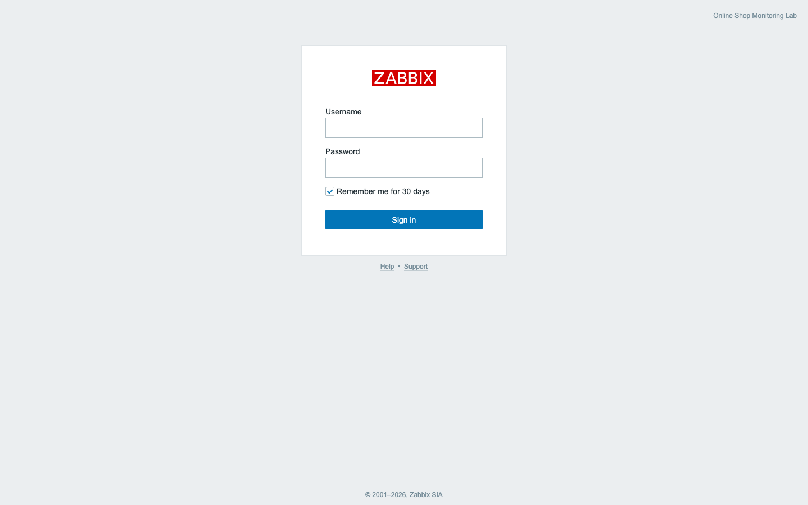
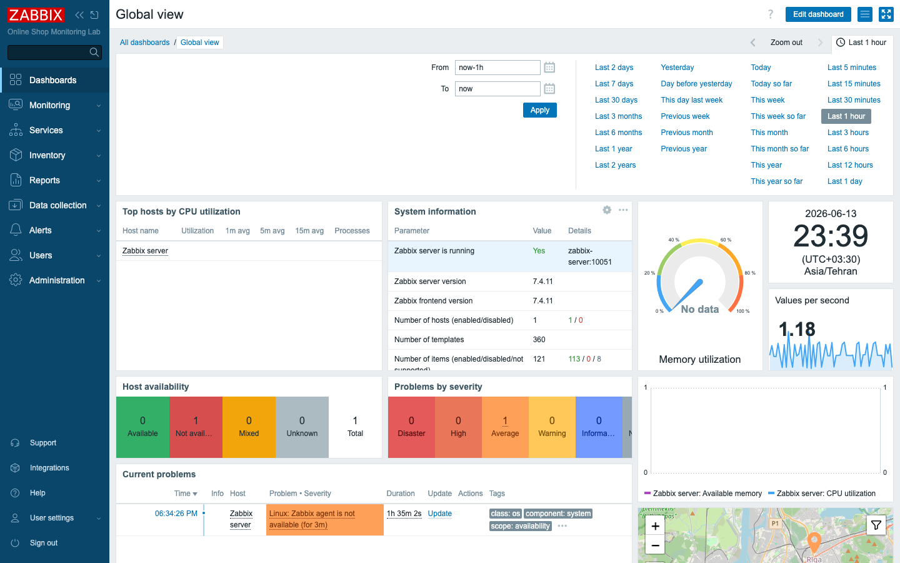
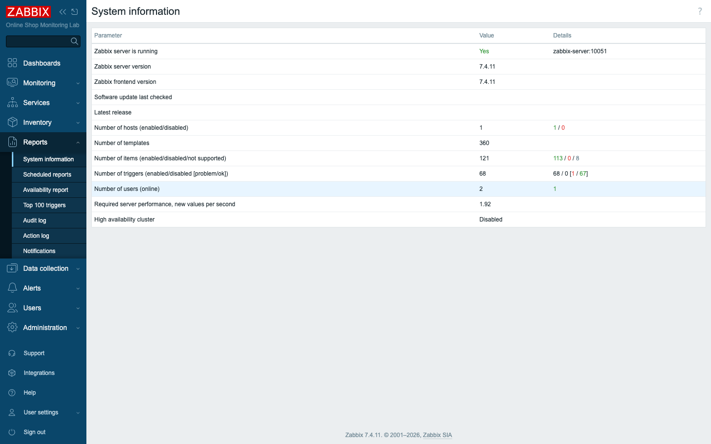
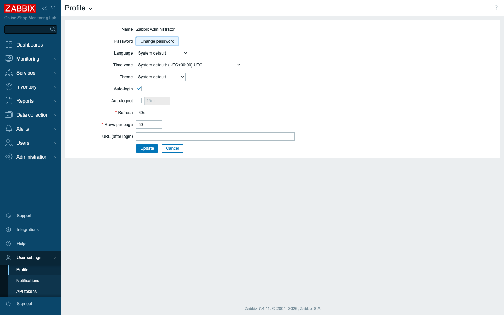
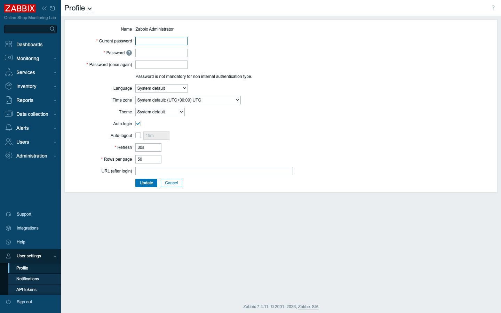

# Module 2: Deploying Zabbix with Docker Compose

## Learning Objectives

By the end of this module you will be able to describe the major components of a
Zabbix deployment and explain how they fit together — which part is the brain,
which part is the memory, and which part is the face that humans actually look
at. You will deploy the complete course lab with a single Docker Compose command,
open and log in to the Zabbix 7.4 frontend, change the default administrator
password, and confirm that the Zabbix server is genuinely up and collecting. In
Module 1 you studied the architecture from the outside; here you bring it to
life on your own machine and prove it works.

## Topics

### Why this module matters for the Online Shop

You cannot monitor anything until the thing doing the monitoring exists. Before
we ever create our first item or write our first trigger for the Online Shop, we
need the monitoring platform itself standing up and healthy. So this module is
where we lay the foundation for the entire week. We bring the whole lab online —
not just the Zabbix platform, but also the Online Shop systems we will spend the
next four days learning to watch — and then we confirm the whole thing is
running before we move on. Treat this as load-bearing work: every one of the
remaining 38 modules runs on top of exactly what you deploy here, so a healthy
start now saves you a great deal of confusion later.

### Zabbix architecture — the components you are deploying

The first thing to understand about Zabbix is that it is not a single program you
install and run. It is several cooperating services, each with a distinct job,
that together form a monitoring platform. In a production environment these
services might be spread across many machines; in our lab we run each one as its
own container, which has the happy side effect of making the boundaries between
them obvious. When you can point at a container and say "that one stores the
data, that one evaluates the rules," the architecture stops being abstract.

Here is each piece and the role it plays:

- **Zabbix server** (`zabbix-server`) — the "brain." It collects metrics,
  evaluates triggers, generates problems and events, and runs actions
  (e.g. sends alerts). It is the only component that writes monitoring logic
  decisions.
- **Database** (`zabbix-db`, MySQL) — the system of record. All configuration
  (hosts, items, triggers, templates) **and** all collected history and trends
  live here. If the database is down, Zabbix cannot function.
- **Frontend / web interface** (`zabbix-web`, nginx + PHP) — what humans use. It
  reads and writes configuration in the database and queries the server for live
  status. Served on **port 8080** in our lab.
- **Zabbix agent** (`zabbix-agent-basic`) and **Zabbix agent 2**
  (`zabbix-agent2-docker`) — lightweight collectors that run on (or beside)
  monitored hosts and report metrics such as CPU, memory, disk, and processes.
  Zabbix agent 2 (written in Go) adds built-in plugins (Docker, databases, and
  more).
- **Zabbix proxy** (`zabbix-proxy-branch`) — an optional remote collector that
  gathers data on behalf of the server for a remote site, then forwards it. We
  configure it on Day 2 (Module 14); it is already running here, ready to use.
- **Java gateway** (`zabbix-java-gateway`) — a helper the server uses to poll
  Java applications over JMX (Module 22).
- **Web service** (`zabbix-web-service`) — a helper that renders dashboards to
  PDF for scheduled reports (Module 33).

If a few of those roles still feel hazy — the proxy, the Java gateway, the web
service — that is fine. You met them briefly in Module 1, and each one earns a
full module of its own later. For now it is enough to know they exist and to
recognize them in the container list you are about to see.

### Docker Compose overview

To deploy all of that with one command, we lean on two related technologies, and
it is worth being precise about what each one does. **Docker** packages each
service and its dependencies into a *container* — a self-contained, isolated
process that runs identically on any machine. A container bundles the program
together with everything it needs to run, so it behaves the same on your laptop
as it does on the author's, regardless of what else is installed underneath.

A single container is useful, but a Zabbix deployment is a *set* of containers
that have to find and talk to one another. That is the problem **Docker Compose**
solves: it describes a *set* of containers, their configuration, volumes, and the
network that connects them, in a single YAML file. One command
(`docker compose up`) starts the whole set; another (`docker compose down`) stops
it. For us, that single file is **`compose_lab.yaml`** — it defines all eight
platform containers and all seven Online Shop demo systems on one shared network
named `zabbix-lab`, so every container can reach the others by name (for example
the server reaches the database at `zabbix-db`). That name-based addressing is
what lets the configuration stay simple: nothing hard-codes an IP address,
because the network resolves container names for you.

### Why Docker is ideal for a training lab

Choosing Docker for this course was not incidental, and three properties in
particular make it the right vehicle for learning:

- **Identical for everyone.** Every participant runs the exact same versions and
  configuration — no "works on my machine."
- **Resettable.** A broken lab is fixed with `down` then `up`; a clean slate is
  one command away.
- **Self-contained.** The platform *and* the systems being monitored live in one
  file, so cloning this repository gives you the complete environment.

Taken together, these mean you can experiment fearlessly. If you misconfigure
something badly enough to wedge the lab, you have not damaged anything permanent —
a reset returns you to a known-good baseline in seconds, and you try again.

### Training deployment vs production deployment

There is one habit of mind to build right at the start, and it is important
enough that it recurs in nearly every module: always know what your lab shortcut
maps to in the real world. This single-host, all-in-one Docker stack is perfect
for learning, but it is **not** how Zabbix is run in production. In production:

- the **server** and **database** are usually on dedicated, sized hosts (the
  database especially, because it grows with history and trends);
- the **frontend** runs behind a hardened web server with **TLS** and real
  certificates (here we use plain HTTP on port 8080);
- **agents** are installed on each monitored machine (VM, bare-metal, cloud
  instance) rather than as sidecar containers;
- a **proxy** runs at each remote site/branch office or DMZ;
- credentials come from a secrets manager — **not** the plain, well-known
  passwords we use here for convenience.

The *components and the way they cooperate are identical*; only the packaging,
sizing, and hardening differ. Keep that mapping in mind every time we take a lab
shortcut. The goal of this course is not only that you can click through Zabbix,
but that you understand the operational reasoning a production deployment would
demand.

## Docker-Based Demonstration

The instructor deploys the whole lab from a clean clone of the course repository.
Watching it come up from nothing makes the point that the entire environment —
platform plus monitored systems — is reproducible from a single file.

```bash
# 1. Clone the course repository (contains the lab AND the course content)
git clone https://github.com/datatweets/zabbix-certified-specialist-lab.git
cd zabbix-certified-specialist-lab

# 2. Start the entire lab (first run builds the demo images — a few minutes)
docker compose -f compose_lab.yaml up -d

# 3. List the stack
docker compose -f compose_lab.yaml ps
```

> **Note:** the default branch `main` already contains everything — no
> `git checkout` is needed. The first `up` **builds** the custom demo images
> (`demo-api`, `demo-snmp-device`, `demo-log-app`) and **pulls** the rest, so it
> takes a few minutes. Later starts are nearly instant.

Once the stack settles, the verified output looks like this — all 15 containers
report `running`, and the platform database, frontend, and mail sink additionally
report `healthy`:

```text
NAME                   STATUS
demo-api               Up (running)
demo-java-jmx          Up (running)
demo-log-app           Up (running)
demo-mailhog           Up (running) (healthy)
demo-nginx             Up (running)
demo-postgres          Up (running)
demo-snmp-device       Up (running)
zabbix-agent-basic     Up (running)
zabbix-agent2-docker   Up (running)
zabbix-db              Up (running) (healthy)
zabbix-java-gateway    Up (running)
zabbix-proxy-branch    Up (running)
zabbix-server          Up (running)
zabbix-web-service     Up (running)
zabbix-web             Up (running) (healthy)
```

With the stack confirmed healthy, the instructor then opens
**<http://localhost:8080>**, logs in, and shows **Reports → System information**
confirming the server is running on Zabbix 7.4. That last step is the one that
matters: a container that says `running` is merely a process that started, while
the System information page proves the server, database, and frontend are
actually talking to one another.

## Hands-On Lab

Now it is your turn to do exactly what the instructor demonstrated. Each step
states what confirms success. If a step fails, stop and fix it before moving on —
later modules assume a healthy lab.

1. **Install Docker Desktop** (if not already installed) and confirm it is
   running. Docker Desktop bundles both the Docker Engine and the Compose plugin,
   and the lab will not start until it is up.
   ```bash
   docker --version
   docker compose version
   ```
   **Expected:** both commands print a version (Docker Engine and the Compose
   v2 plugin). Docker Desktop's whale icon shows "running."

2. **Clone the course repository and enter it.** This single repository holds both
   the lab definition and the course content, so one clone gives you everything.
   ```bash
   git clone https://github.com/datatweets/zabbix-certified-specialist-lab.git
   cd zabbix-certified-specialist-lab
   ```
   **Expected:** the clone completes and `ls` shows `compose_lab.yaml` and a
   `content/` folder.

3. **Start the lab.** This one command brings up all 15 containers; the `-d` flag
   runs them in the background so your terminal returns to you.
   ```bash
   docker compose -f compose_lab.yaml up -d
   ```
   **Expected:** Docker builds/pulls images, then prints `Started` for each
   container. The first run may take several minutes.

4. **Check the running containers.** This is your first health check — it tells
   you which containers came up cleanly and which are still settling.
   ```bash
   docker compose -f compose_lab.yaml ps
   ```
   **Expected:** 15 containers listed, all `running`; `zabbix-db`, `zabbix-web`,
   and `demo-mailhog` additionally show `(healthy)`. (If `zabbix-web` is still
   `starting`, wait ~30 s and re-run.)

5. **Open the Zabbix web interface** at **<http://localhost:8080>** in your
   browser. This is the frontend container (`zabbix-web`) answering on the port
   Compose published for it.
   **Expected:** the Zabbix sign-in page appears with the **ZABBIX** logo and
   **Username** / **Password** fields.

   
   *The login page. The "Online Shop Monitoring Lab" label top-right comes from
   the lab's configured server name.*

6. **Log in with the default administrator account.** These are the built-in
   credentials every fresh Zabbix install ships with — note the capital `A`.
   - Username: `Admin` (capital A)
   - Password: `zabbix`
   - Click **Sign in**.

   **Expected:** you land on **Dashboards → Global view** with widgets such as
   *System information*, *Host availability*, and *Problems by severity*.

   
   *The default dashboard. The left-hand menu is your main navigation:
   Dashboards, Monitoring, Services, Inventory, Reports, Data collection, Alerts,
   Users, Administration.*

7. **Verify the Zabbix server is running.** A green dashboard is reassuring, but
   the definitive proof is on the System information page, which reads the
   server's live status. In the left menu go to
   **Reports → System information**.
   **Expected:** the table shows **Zabbix server is running: Yes** (details
   `zabbix-server:10051`), **Zabbix server version: 7.4.11**, and **Zabbix
   frontend version: 7.4.11**. You will also see 1 host, 360 templates, and a
   non-zero "Required server performance" — proof the server is collecting.

   
   *System information confirms the server↔database↔frontend chain is healthy.*

8. **Change the default administrator password.** Leaving a well-known default
   password in place is a habit worth breaking early, so we change it now. In the
   left menu open **User settings → Profile**.

   
   *Your personal profile page — language, time zone, theme, and auto-refresh
   live here too. Click **Change password** to reveal the password fields.*

   Click **Change password** and fill in:
   - **Current password:** `zabbix`
   - **Password:** a new password of your choice
   - **Password (once again):** the same new password

   Click **Update**.

   **Expected:** a green "User updated" confirmation. The default `zabbix`
   password no longer works; your new password does on the next sign-in.

   

9. **Confirm the new password works.** The only way to be sure a credential change
   took effect is to use it, so sign out and back in. Sign out
   (**User settings → Sign out**), then sign back in with `Admin` and your new
   password.
   **Expected:** you log in successfully with the new password.

## Expected Outcome

At this point you have the complete course lab running locally — all 15
containers healthy — you can log in to the Zabbix 7.4 frontend at
`http://localhost:8080`, you have changed the default administrator password, and
you have confirmed via **Reports → System information** that the Zabbix server is
running on version 7.4.11. The platform is alive and the Online Shop systems are
standing by; from the next module on, every feature you learn has somewhere real
to run.
