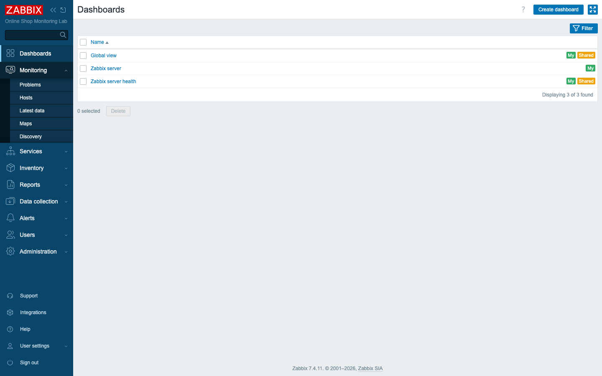
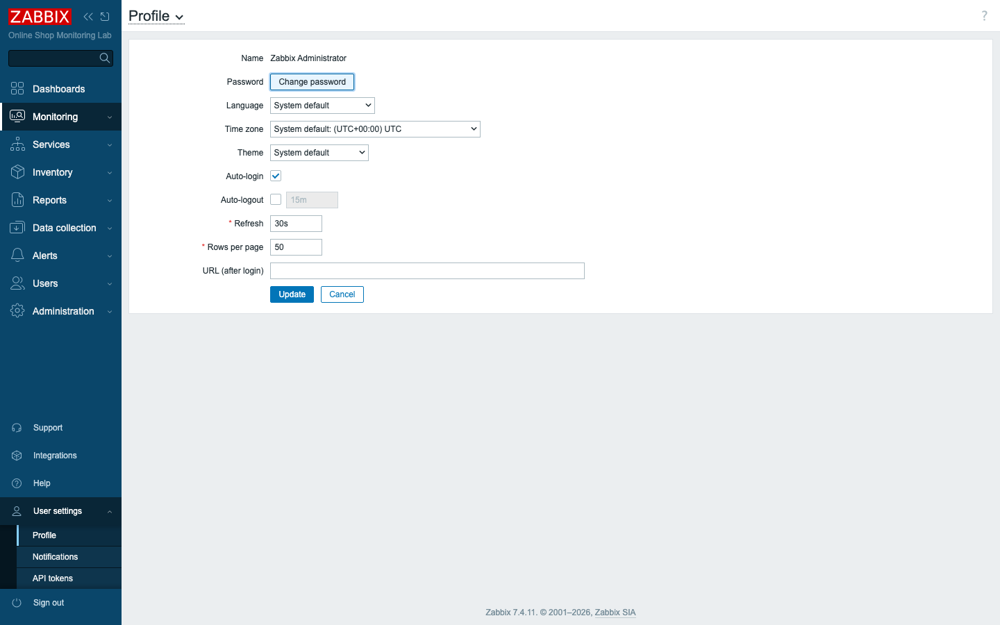
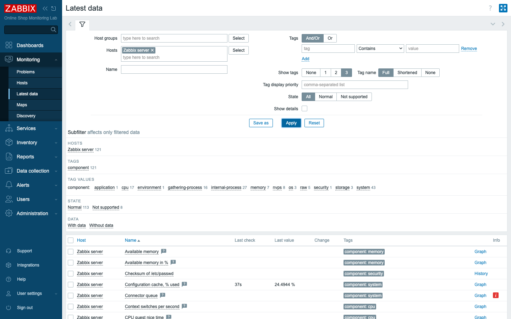
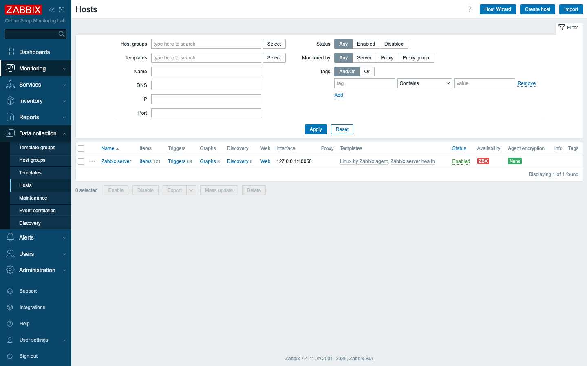
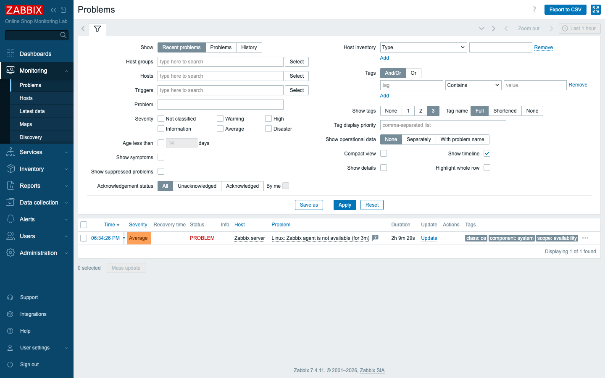
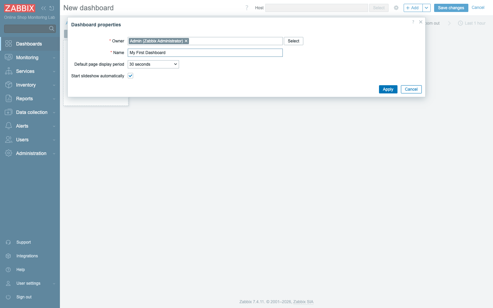
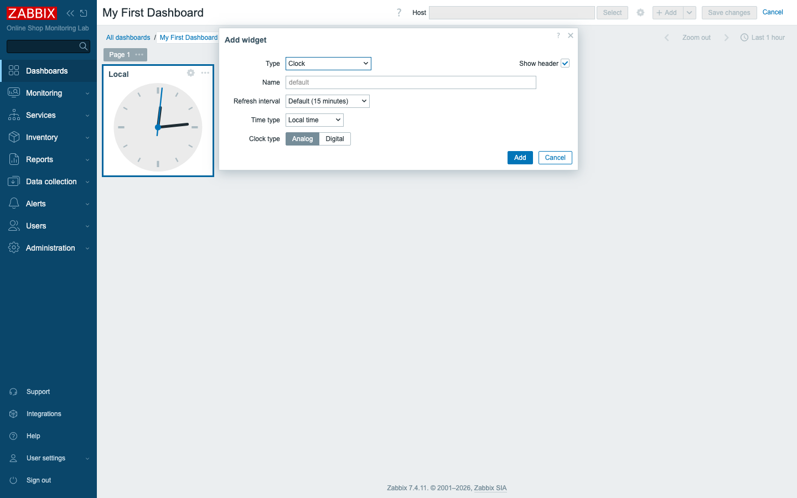
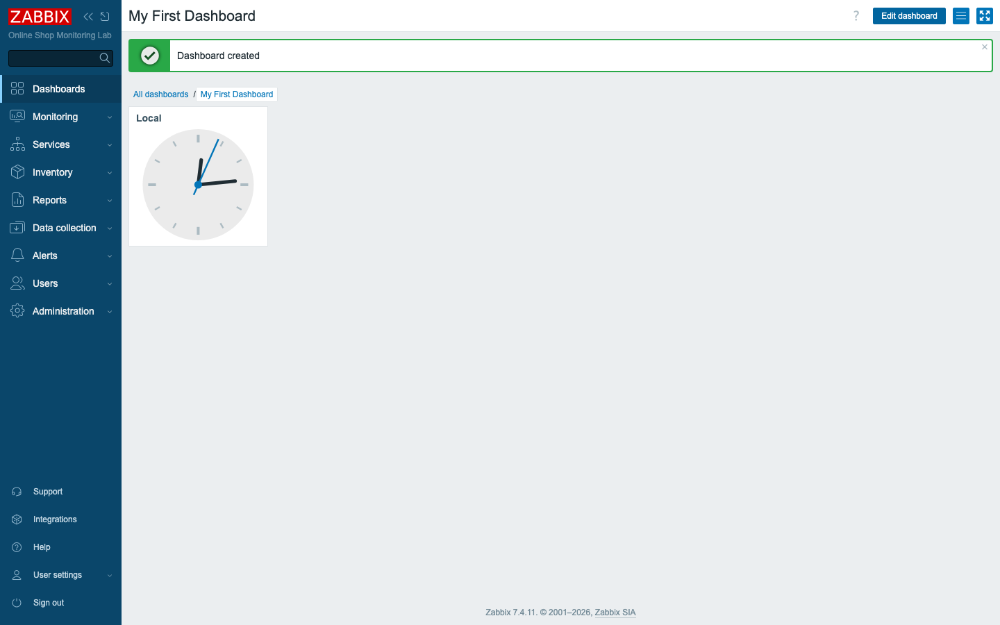

# Module 3: Zabbix User Interface

## Learning Objectives

By the end of this module participants can navigate the main sections of the
Zabbix 7.4 web interface, adjust their personal profile settings (time zone,
language, theme, and auto-refresh), find the built-in Zabbix server host and its
collected data, review problems and system status, and build a simple personal
dashboard.

## Topics

### Why the interface matters for the Online Shop

Everything you configure and everything you observe about the Online Shop happens
through this web interface — adding hosts, writing triggers, reading graphs,
acknowledging problems. Spending a few minutes now to learn *where things live*
makes every later module faster. The good news: Zabbix 7.4 keeps a consistent
layout, so once you learn the pattern, you can find anything.

### The main menu (left sidebar)

The dark menu down the left side is your primary navigation. Each top-level
section expands to reveal its pages. These are the sections you will use, with
the 7.4 names (verified in the lab):

- **Dashboards** — at-a-glance views built from widgets (this is your home page).
- **Monitoring** — the *live* operational views: **Problems**, **Hosts**,
  **Latest data**, **Maps**, **Discovery**. This is where you look when you ask
  "what's happening right now?"
- **Services** — business-service monitoring and SLAs: **Services**, **SLA**,
  **SLA report** (Day 4–5).
- **Inventory** — hardware/asset inventory: **Overview**, **Hosts**.
- **Reports** — **System information**, **Scheduled reports**, **Availability
  report**, **Top 100 triggers**, **Audit log**, **Action log**, **Notifications**.
- **Data collection** — the *configuration* side: **Template groups**, **Host
  groups**, **Templates**, **Hosts**, **Maintenance**, **Event correlation**,
  **Discovery**. This is where you *build* monitoring. *(In older Zabbix this menu
  was called "Configuration" — in 7.4 it is "Data collection.")*
- **Alerts** — **Actions**, **Media types**, **Scripts** (Day 4).
- **Users** — **User groups**, **User roles**, **Users**, **API tokens**,
  **Authentication** (Day 4).
- **Administration** — global/system settings: **General**, **Audit log**,
  **Housekeeping**, **Proxy groups**, **Proxies**, **Macros**, **Queue**.

> **The key mental model:** **Data collection** is where you *configure* what to
> monitor; **Monitoring** is where you *see* the results. Beginners often hunt
> for live data under Data collection (config only) or try to add items under
> Monitoring (views only). Configure under **Data collection**, observe under
> **Monitoring**.

*The left sidebar is the main menu; the collapse arrows at the top shrink it to
icons when you need more screen space.*

### Personal profile settings

At the bottom of the menu, **User settings → Profile** holds *your* personal
preferences (they do not affect other users):

- **Language** and **Time zone** — Zabbix shows timestamps in your chosen time
  zone, which matters when you correlate a problem with a real-world event.
- **Theme** — light (blue/"Blue"), **Dark**, or **System default**.
- **Auto-login** / **Auto-logout** — stay signed in, or expire idle sessions.
- **Refresh** — how often live pages reload (default 30 s).
- **Rows per page** — list page size (default 50).

*The Profile page. The same page hosts the Change password button you used in
Module 2.*

## Docker-Based Demonstration

The instructor signs in to **<http://localhost:8080>** and tours the interface
live:

- expands **Monitoring** and opens **Problems**, then **Latest data**;
- opens **Data collection → Hosts** to show the built-in *Zabbix server* host;
- opens **Reports → System information** to show overall status;
- opens **User settings → Profile** to show time zone / theme;
- finishes by creating a one-widget dashboard under **Dashboards**.

No configuration is changed except each participant's own profile and a personal
practice dashboard.

## Hands-On Lab

1. **Sign in** at **<http://localhost:8080>** with `Admin` and your password
   (the one you set in Module 2).
   **Expected:** you land on **Dashboards → Global view**.

2. **Set your profile preferences.** Open **User settings → Profile** (bottom of
   the left menu). Set your **Time zone** to your local zone, optionally switch
   **Theme** to **Dark**, then click **Update**.
   **Expected:** a green "User updated" message; if you chose Dark, the interface
   immediately switches to the dark theme. Timestamps now display in your time
   zone.

3. **Explore dashboards.** Click **Dashboards**, then open **Global view**.
   **Expected:** you see widgets such as *System information*, *Host
   availability*, *Problems by severity*, and *Current problems*.

4. **Open Latest data.** Go to **Monitoring → Latest data**. In the filter, click
   the **Hosts** field, type `Zabbix server`, select it, and click **Apply**.
   **Expected:** a list of collected items appears for the Zabbix server host —
   for example *Available memory* and *Configuration cache, % used* — each with a
   **Last check** time and **Last value**. This is live data the server is
   collecting about itself.

   
   *Latest data is filter-driven: choose a host group or host to display its
   metrics. The colored tags (component: memory, cpu, …) come from the linked
   template.*

5. **Find the built-in Zabbix server host.** Go to **Data collection → Hosts**.
   **Expected:** one host, **Zabbix server**, is listed with its item, trigger,
   and graph counts, the templates *Linux by Zabbix agent* and *Zabbix server
   health*, and an interface of `127.0.0.1:10050`. Its **Availability** shows a
   red **ZBX** — that is expected in this lab (the built-in host's agent address
   points inside the server container, which has no agent). We add real,
   reachable hosts starting in Module 5.

   
   *The Hosts configuration list. Note the Host Wizard, Create host, and Import
   buttons top-right — you will use these later.*

6. **Review problems.** Go to **Monitoring → Problems**.
   **Expected:** the current problems list. In a fresh lab this may be empty or
   show only internal/self-monitoring problems — that is fine; we generate real
   problems in later modules.

   

7. **Review system status.** Go to **Reports → System information**.
   **Expected:** **Zabbix server is running: Yes**, the server/frontend versions
   (7.4.11), and counts of hosts, items, and triggers — a quick health summary of
   the whole installation.

8. **Create a personal dashboard.**
   1. Go to **Dashboards**, click **All dashboards**, then **Create dashboard**.
   2. In **Dashboard properties**, set **Name** to `My First Dashboard` and click
      **Apply**.
      
   3. Click **+ Add** (top-right) to open **Add widget**. Set **Type** to
      **Clock**, leave the defaults, and click **Add**.
      
   4. Click **Save changes**.

   **Expected:** a green "Dashboard created" message and your new dashboard shows
   a working clock widget. It now appears under **All dashboards**.

   

## Expected Outcome

Participants can confidently move around the Zabbix 7.4 interface: they know that
**Data collection** is for configuration and **Monitoring** is for live views,
they have personalised their profile (time zone/theme), they can locate a host
and its latest data, they can check overall status under Reports, and they have
built and saved a personal dashboard.

## Instructor Notes

- **Lab vs production.** The interface is identical in production; only the URL
  (a real hostname over HTTPS instead of `localhost:8080`) and the breadth of
  hosts/data differ. The navigation skills learned here transfer directly.
- **The "Configuration → Data collection" rename.** Students who have seen older
  Zabbix (6.x and earlier) will look for a **Configuration** menu. Point out
  explicitly that in 7.0+ it is **Data collection**. This is the single most
  common navigation confusion.
- **Theme/timezone are per-user.** Reassure students that changing their theme or
  time zone affects only their own account, not the shared system — so they can
  experiment freely.
- **The red ZBX on the Zabbix server host is expected.** It catches students'
  eyes; explain it now (agent address is inside the container) so it is not
  mistaken for a lab fault. It disappears from the picture once we add properly
  reachable hosts in Module 5–6.
- **Widget choice.** Any widget works for the practice dashboard; *Clock* is used
  here because it needs no data source and renders immediately. Mention that
  later modules build *meaningful* dashboards (problems, graphs, item values) for
  the Online Shop.
- **Timing.** ~45 minutes: ~15 min guided tour, ~20 min hands-on, ~10 min
  dashboard creation and Q&A.

## Lab-State Delta

- **Dashboard created:** **My First Dashboard** (owner: Admin) with a single
  **Clock** widget — a personal practice dashboard, *not* one of the course's
  canonical dashboards. (Created via the UI and verified via the API:
  `dashboard.get` returns it with one `type: clock` widget.)
- **Per-user profile changes** (time zone/theme) are personal preferences, not
  monitoring configuration.
- No hosts, items, triggers, or templates were added. The built-in **Zabbix
  server** host (hostid 10084) remains the only host.
