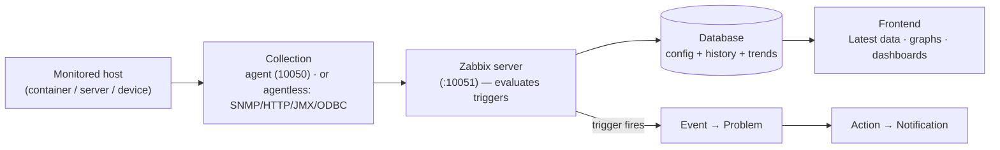
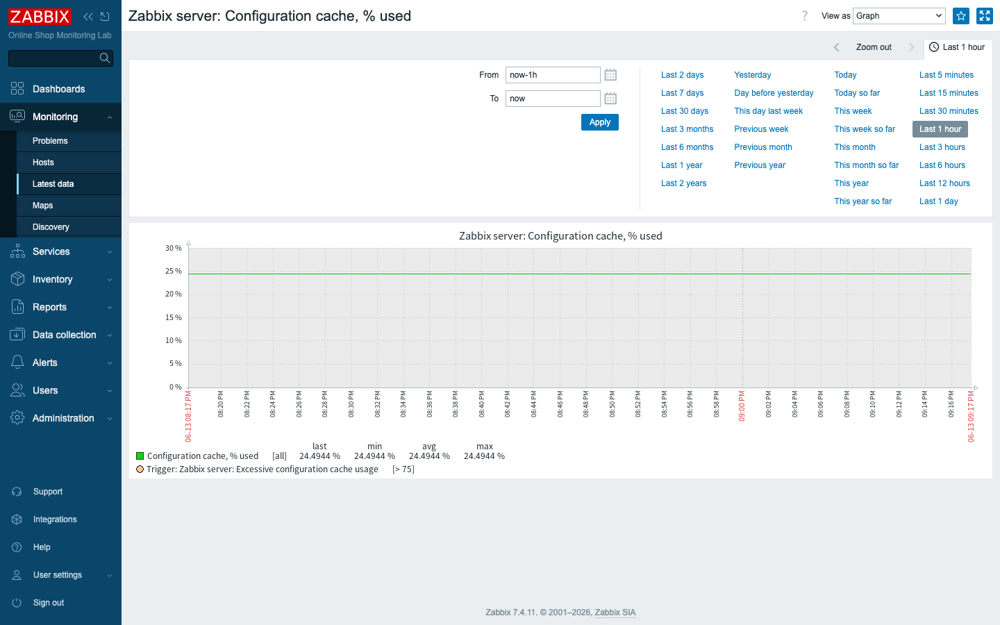
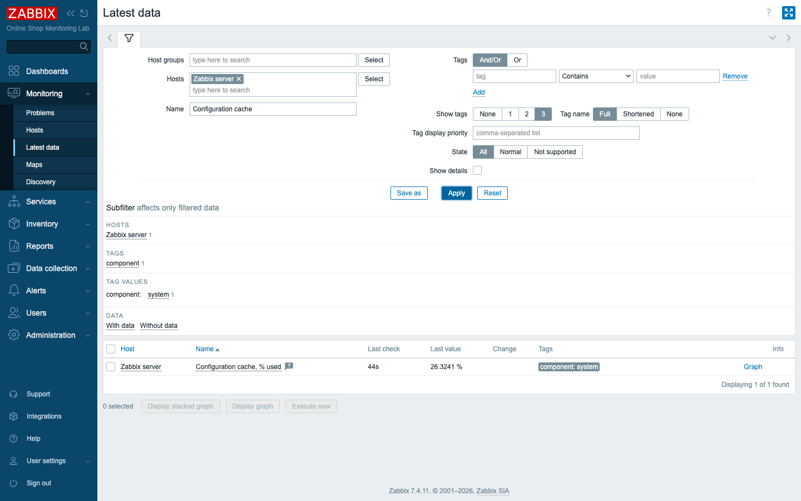

# Module 4: Zabbix Data Flow

## Learning Objectives

By the end of this module you will be able to name the core Zabbix objects — host,
host group, item, trigger, event, problem, action, notification, template, and
macro — and use each term with the precision the rest of the course demands. You
will be able to explain the difference between agent-based and agentless
collection, and the equally important difference between passive and active
checks, which is the one distinction that trips up almost everyone who learns
Zabbix. And you will be able to trace a single metric the whole way along its
journey: from a monitored container, through the server, into the database, and
finally onto a graph you can look at in the frontend. By the end you will not just
have read about that journey — you will have watched a real value make it,
command by command, in your own running lab.

## Topics

### Why understanding the flow matters

In the last module you learned *where* things live in the interface — which menu
holds what, and how to find your way around the frontend. That is navigation. This
module is about something deeper: *how data actually moves* through Zabbix, and
the exact vocabulary the product uses to describe each stage of that movement.
Before we start building monitoring for the Online Shop, you need both.

The reason the vocabulary matters so much is that almost every later module in
this course reduces to the same three-step sentence: "create an **item**, add a
**trigger**, route a **notification**." Those words are not casual labels you can
swap around; each names a specific object with a specific role, and if your mental
model blurs them together, the configuration screens in Module 5 onward will feel
arbitrary instead of logical. So we are going to make the words precise. This
module is the conceptual backbone of everything that follows — and rather than
leave it abstract, we make it concrete by tracing a real value through the live
lab, so the terms attach to things you can see.

### The core objects

These are the building blocks you will reach for in every module from here to the
final project. Read them slowly the first time; you will be using them all week.

- **Host** — anything you monitor: a server, a container, a network device, an
  application. In our lab, `demo-nginx`, `demo-api`, and `demo-postgres` will each
  become a host.
- **Host group** — a labelled collection of hosts (e.g. *Web Services*,
  *Databases*). Groups drive permissions and dashboard/filter scoping.
- **Item** — a single thing you measure on a host, identified by an **item key**
  (e.g. `system.cpu.load`, `vm.memory.size[available]`). An item collects values
  on an interval and stores them as history.
- **Trigger** — a logical expression over item data that defines a *problem
  condition* (e.g. "CPU load above 5 for 5 minutes"). A trigger is either OK or
  in a PROBLEM state.
- **Event** — a timestamped record that something happened — most commonly a
  trigger changing state (OK→PROBLEM or PROBLEM→OK).
- **Problem** — the open, unresolved state created when a trigger fires; it stays
  in the Problems view until the trigger recovers (or you close it).
- **Action** — a rule that reacts to events: *when* a problem matches these
  conditions, *do* these operations (send a message, run a script, escalate).
- **Notification** — the message an action sends (email, webhook, SMS) to a user
  via a configured **media type**.
- **Template** — a reusable bundle of items, triggers, graphs, and macros that
  you *link* to many hosts so they all get the same monitoring. (The built-in
  *Zabbix server* host gets its 176 items from linked templates.)
- **Macro** — a named, reusable value written as `{$NAME}` (e.g.
  `{$CPU.LOAD.MAX}`). Macros let templates stay generic while each host overrides
  specifics.

That list can feel like a pile of separate definitions, but the objects are not
independent — they form a chain, and understanding the chain is what makes the
vocabulary stick:

> **One sentence that ties them together:** an **item** on a **host** collects
> values; a **trigger** watches those values and, when its condition is met,
> creates an **event** that opens a **problem**; an **action** turns that problem
> into a **notification**. **Templates** and **macros** let you do this once and
> apply it everywhere.

Hold onto that sentence. Every alerting workflow you build for the Online Shop is
an instance of it.

### How data is collected: agent-based vs agentless

Before a trigger can watch anything, the data has to arrive — and Zabbix has two
broad families of ways to get it. The first question to ask about any monitored
thing is whether you can put software *on* it, because that decides which family
you use.

- **Agent-based** — a Zabbix **agent** (or **agent 2**) runs on/beside the host
  and collects rich OS- and app-level metrics (CPU, memory, disk, processes,
  logs, Docker, databases). Our `zabbix-agent-basic` and `zabbix-agent2-docker`
  are agents.
- **Agentless** — the server (or a proxy) collects directly using a protocol,
  with no agent on the target: **SNMP** (network devices), **HTTP** (web/API
  checks), **JMX** (Java, via the Java gateway), **ODBC** (databases), **ICMP
  ping**, **SSH/Telnet**, and "simple checks." We use these for `demo-snmp-device`,
  `demo-nginx`, `demo-api`, `demo-java-jmx`, and `demo-postgres`.

The split maps directly onto the Online Shop. You can install an agent on a Linux
host you control, so its CPU and memory come in agent-based. But you usually
cannot run a Zabbix agent inside a network appliance, so you reach it over SNMP
instead; and you talk to a web endpoint over HTTP because that is the language it
already speaks. Neither family is "better" — each fits a different kind of target,
and a real environment uses both.

### Passive vs active checks (agent direction)

There is a second distinction that lives *inside* the agent-based family, and it
is the one that confuses nearly everyone the first time. The trap is that
"passive" and "active" sound like they describe how busy the agent is, when in
fact they describe one thing only: *who opens the connection to whom*. Keep your
eye on the direction of the arrow and you will never get it wrong.

| | Passive check | Active check |
|---|---|---|
| Who initiates | **Server → agent** (server asks) | **Agent → server** (agent pushes) |
| Port | agent listens on **10050** | server listens on **10051** |
| Agent config | `Server=` (allowed pollers) | `ServerActive=` (where to report) |
| Good for | simple setups, on-demand polling | scale, NAT/firewalls, log monitoring |

Notice how cleanly the configuration lines up with the direction. In a passive
check the server reaches out, so the agent needs a `Server=` line naming who is
allowed to ask. In an active check the agent reaches out, so it needs a
`ServerActive=` line telling it where to report. Two different problems, two
different settings.

Log monitoring (Module 19) *requires* active checks. Both modes are agent-based —
"active/passive" is about direction, not about whether an agent is used.

### The full data flow

With the vocabulary in place, we can now draw the whole journey at once. This is
the picture every later module operates inside, so it is worth sitting with:



Read the diagram as two tracks that share a common spine. Along the top track, a
value flows left to right: the server writes both **configuration** and collected
**history/trends** to the database, and the frontend reads from the database to
draw Latest data, graphs, and dashboards. Branching off the server is the second
track: in parallel the server evaluates triggers, which produce events, problems,
and ultimately notifications. The same value, in other words, both lands on a
graph *and* gets watched for trouble — and it does so from the single point where
the server has it in hand.

## Docker-Based Demonstration

Describing the flow is one thing; watching a real value make the trip is another,
and far more convincing. Rather than only narrate it, the instructor traces an
actual value through the live lab. (All commands below were run against the
running stack; outputs are real.)

**Step A — collection (a passive agent check).** Ask the agent, from the server,
for a value — exactly what a poller does:

```bash
docker exec zabbix-server zabbix_get -s zabbix-agent-basic -k agent.hostname
# -> zabbix-agent-basic

docker exec zabbix-server zabbix_get -s zabbix-agent-basic -k 'system.cpu.load[all,avg1]'
# -> 3.009277

docker exec zabbix-server zabbix_get -s zabbix-agent-basic -k 'vm.memory.size[available]'
# -> 10366017536      (~10.4 GB)
```

Look at what just happened in terms of the table above. The server connected to
the agent on port 10050 and the agent answered — that is a passive check at the
protocol level. The `zabbix_get` tool simply does by hand what the server's
pollers do automatically thousands of times a minute.

**Step B — storage (the database).** Collecting a value is pointless if it
vanishes; the server stores collected values in the history tables so they
accumulate over time. Look at what is landing right now for the built-in host:

```bash
docker exec zabbix-db mysql -uzabbix -pzabbix zabbix -e "
SELECT i.name, ROUND(h.value,3) AS value, FROM_UNIXTIME(h.clock) AS ts
FROM history h JOIN items i ON i.itemid=h.itemid
ORDER BY h.clock DESC LIMIT 5;"
```

Real output (note the timestamp is ~1 second old — data is flowing continuously):

```text
+--------------------------------------------------+-------+---------------------+
| name                                             | value | ts                  |
+--------------------------------------------------+-------+---------------------+
| Utilization of availability manager processes, % | 0.017 | 2026-06-13 20:58:26 |
| Trend function cache, % of misses                | 0     | 2026-06-13 20:58:25 |
| Utilization of task manager processes, %         | 0.051 | 2026-06-13 20:58:24 |
| ...                                              | ...   | ...                 |
+--------------------------------------------------+-------+---------------------+
```

The table is not one undifferentiated bucket. Numeric floats land in `history`,
integers in `history_uint`; older data is rolled up into `trends` for long-term
graphs. That last point matters more than it looks: it is why a graph can show you
a year of history without the database storing every single raw sample forever.

**Step C — visualization (the frontend).** A number in a database table is not yet
something a human can act on. The same stored values become a graph. In
**Monitoring → Latest data**, filter to the *Zabbix server* host, find
**Configuration cache, % used**, and click its **Graph** link:


*The green line is the stored item history (~24.49%). The legend shows
last/min/avg/max, and the **trigger** "Excessive configuration cache usage
[> 75]" is drawn as a threshold — so this one picture shows item → history →
graph → trigger in the same view.*

That single image closes the loop we set out to follow: **agent → server →
database → frontend**, with the **trigger** watching alongside. Every word of
vocabulary from earlier now points at something on the screen.

## Hands-On Lab

This is a tracing exercise rather than a building exercise — you run each stage of
the flow yourself and confirm the value is real at every hop. There is real value
in doing this by hand once: it makes the abstract data flow physical, and it
builds a troubleshooting habit you will lean on for the rest of the course.

1. **Collect** a value straight from an agent:
   ```bash
   docker exec zabbix-server zabbix_get -s zabbix-agent-basic -k agent.hostname
   ```
   **Expected:** the command prints `zabbix-agent-basic`. (The server reached the
   agent on port 10050 and got an answer — a passive check.)

2. Try a metric value:
   ```bash
   docker exec zabbix-server zabbix_get -s zabbix-agent-basic -k 'system.cpu.load[all,avg1]'
   ```
   **Expected:** a number (the agent host's 1-minute CPU load).

3. **Store** — look at the database where the server keeps history:
   ```bash
   docker exec zabbix-db mysql -uzabbix -pzabbix zabbix -e \
     "SELECT i.name, h.value, FROM_UNIXTIME(h.clock) ts
      FROM history h JOIN items i ON i.itemid=h.itemid
      ORDER BY h.clock DESC LIMIT 5;"
   ```
   **Expected:** five rows of recent values; the newest timestamp is only a few
   seconds old, proving data is being written continuously.

4. **Visualize** — in the frontend, go to **Monitoring → Latest data**, set the
   **Hosts** filter to `Zabbix server`, click **Apply**, find **Configuration
   cache, % used**, and click **Graph**. This is the same value you just read out
   of the database in step 3, now rendered for a human.
   **Expected:** the item appears with its latest stored value; clicking **Graph**
   draws a line graph of that item over the last hour, with last/min/avg/max in
   the legend and a trigger threshold drawn on the chart.

   
   *Latest data shows the stored value (here `Configuration cache, % used`); the
   **Graph** link on the right opens the graph shown in the demonstration above.*

5. **Map the chain.** On paper or in discussion, label each component of the lab
   onto this flow:
   `Container → Agent → Zabbix server → Database → Frontend (graph/dashboard)`,
   and separately `Trigger → Event → Problem → Action → Notification`. Doing the
   mapping in your own words is what cements the vocabulary.
   **Expected:** you can place each lab piece — e.g. *Container* =
   `zabbix-agent-basic`'s host, *Database* = `zabbix-db`, *Frontend* =
   `zabbix-web`, *Notification* path ends at `demo-mailhog`.

## Expected Outcome

By the end of this module you can define every core Zabbix object and use the
terms correctly, explain agent-based versus agentless collection and passive
versus active checks, and demonstrate — with real commands and a real graph — how
a value travels from a monitored host through the server into the database and
onto the screen, with triggers watching in parallel. That mental model is the
foundation the next thirty-six modules build on: from here on, every feature you
meet is a piece of this same flow.
