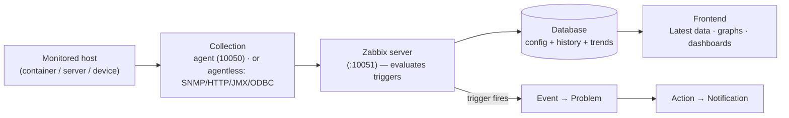

# Module 4: Zabbix Data Flow

## Learning Objectives

By the end of this module participants can name the core Zabbix objects (host,
host group, item, trigger, event, problem, action, notification, template,
macro), explain the difference between agent-based and agentless collection and
between passive and active checks, and trace a single metric all the way from a
monitored container, through the server, into the database, and onto a graph in
the frontend.

## Topics

### Why understanding the flow matters

In the last module you saw *where* things are in the interface. Before you start
building monitoring for the Online Shop, you need to understand *how data moves*
and the vocabulary Zabbix uses. Almost every later module is "create an **item**,
add a **trigger**, route a **notification**" — so these words have to be precise.
This module is the conceptual backbone; we make it concrete by tracing a real
value through the live lab.

### The core objects

These are the building blocks you will use in every module:

- **Host** — anything you monitor: a server, a container, a network device, an
  application. In our lab, `demo-nginx`, `demo-api`, and `demo-postgres` will each
  become a host.
- **Host group** — a labelled collection of hosts (e.g. *Web Services*,
  *Databases*). Groups drive permissions and dashboard/filter scoping.
- **Item** — a single thing you measure on a host, identified by an **item key**
  (e.g. `system.cpu.load`, `vm.memory.size[available]`). An item collects values
  on an interval and stores them as history.
- **Trigger** — a logical expression over item data that defines a *problem
  condition* (e.g. "CPU load above 5 for 5 minutes"). A trigger is either OK or
  in a PROBLEM state.
- **Event** — a timestamped record that something happened — most commonly a
  trigger changing state (OK→PROBLEM or PROBLEM→OK).
- **Problem** — the open, unresolved state created when a trigger fires; it stays
  in the Problems view until the trigger recovers (or you close it).
- **Action** — a rule that reacts to events: *when* a problem matches these
  conditions, *do* these operations (send a message, run a script, escalate).
- **Notification** — the message an action sends (email, webhook, SMS) to a user
  via a configured **media type**.
- **Template** — a reusable bundle of items, triggers, graphs, and macros that
  you *link* to many hosts so they all get the same monitoring. (The built-in
  *Zabbix server* host gets its 176 items from linked templates.)
- **Macro** — a named, reusable value written as `{$NAME}` (e.g.
  `{$CPU.LOAD.MAX}`). Macros let templates stay generic while each host overrides
  specifics.

> **One sentence that ties them together:** an **item** on a **host** collects
> values; a **trigger** watches those values and, when its condition is met,
> creates an **event** that opens a **problem**; an **action** turns that problem
> into a **notification**. **Templates** and **macros** let you do this once and
> apply it everywhere.

### How data is collected: agent-based vs agentless

- **Agent-based** — a Zabbix **agent** (or **agent 2**) runs on/beside the host
  and collects rich OS- and app-level metrics (CPU, memory, disk, processes,
  logs, Docker, databases). Our `zabbix-agent-basic` and `zabbix-agent2-docker`
  are agents.
- **Agentless** — the server (or a proxy) collects directly using a protocol,
  with no agent on the target: **SNMP** (network devices), **HTTP** (web/API
  checks), **JMX** (Java, via the Java gateway), **ODBC** (databases), **ICMP
  ping**, **SSH/Telnet**, and "simple checks." We use these for `demo-snmp-device`,
  `demo-nginx`, `demo-api`, `demo-java-jmx`, and `demo-postgres`.

### Passive vs active checks (agent direction)

This distinction trips up almost everyone, so be precise about *who connects to
whom*:

| | Passive check | Active check |
|---|---|---|
| Who initiates | **Server → agent** (server asks) | **Agent → server** (agent pushes) |
| Port | agent listens on **10050** | server listens on **10051** |
| Agent config | `Server=` (allowed pollers) | `ServerActive=` (where to report) |
| Good for | simple setups, on-demand polling | scale, NAT/firewalls, log monitoring |

Log monitoring (Module 19) *requires* active checks. Both modes are agent-based —
"active/passive" is about direction, not about whether an agent is used.

### The full data flow



The server writes both **configuration** and collected **history/trends** to the
database; the frontend reads from the database to draw Latest data, graphs, and
dashboards; and in parallel the server evaluates triggers, which produce events,
problems, and ultimately notifications.

## Docker-Based Demonstration

Rather than only describing the flow, the instructor traces a real value through
the live lab. (All commands below were run against the running stack; outputs are
real.)

**Step A — collection (a passive agent check).** Ask the agent, from the server,
for a value — exactly what a poller does:

```bash
docker exec zabbix-server zabbix_get -s zabbix-agent-basic -k agent.hostname
# -> zabbix-agent-basic

docker exec zabbix-server zabbix_get -s zabbix-agent-basic -k 'system.cpu.load[all,avg1]'
# -> 3.009277

docker exec zabbix-server zabbix_get -s zabbix-agent-basic -k 'vm.memory.size[available]'
# -> 10366017536      (~10.4 GB)
```

The server connected to the agent on port 10050 and the agent answered — that is
a passive check at the protocol level.

**Step B — storage (the database).** The server stores collected values in the
history tables. Look at what is landing right now for the built-in host:

```bash
docker exec zabbix-db mysql -uzabbix -pzabbix zabbix -e "
SELECT i.name, ROUND(h.value,3) AS value, FROM_UNIXTIME(h.clock) AS ts
FROM history h JOIN items i ON i.itemid=h.itemid
ORDER BY h.clock DESC LIMIT 5;"
```

Real output (note the timestamp is ~1 second old — data is flowing continuously):

```text
+--------------------------------------------------+-------+---------------------+
| name                                             | value | ts                  |
+--------------------------------------------------+-------+---------------------+
| Utilization of availability manager processes, % | 0.017 | 2026-06-13 20:58:26 |
| Trend function cache, % of misses                | 0     | 2026-06-13 20:58:25 |
| Utilization of task manager processes, %         | 0.051 | 2026-06-13 20:58:24 |
| ...                                              | ...   | ...                 |
+--------------------------------------------------+-------+---------------------+
```

Numeric floats land in `history`, integers in `history_uint`; older data is rolled
up into `trends` for long-term graphs.

**Step C — visualization (the frontend).** The same stored values become a graph.
In **Monitoring → Latest data**, filter to the *Zabbix server* host, find
**Configuration cache, % used**, and click its **Graph** link:


*The green line is the stored item history (~24.49%). The legend shows
last/min/avg/max, and the **trigger** "Excessive configuration cache usage
[> 75]" is drawn as a threshold — so this one picture shows item → history →
graph → trigger in the same view.*

That completes the chain: **agent → server → database → frontend**, with the
**trigger** watching alongside.

## Hands-On Lab

This is a tracing exercise — you run each stage of the flow yourself and confirm
the value is real at every hop.

1. **Collect** a value straight from an agent:
   ```bash
   docker exec zabbix-server zabbix_get -s zabbix-agent-basic -k agent.hostname
   ```
   **Expected:** the command prints `zabbix-agent-basic`. (The server reached the
   agent on port 10050 and got an answer — a passive check.)

2. Try a metric value:
   ```bash
   docker exec zabbix-server zabbix_get -s zabbix-agent-basic -k 'system.cpu.load[all,avg1]'
   ```
   **Expected:** a number (the agent host's 1-minute CPU load).

3. **Store** — look at the database where the server keeps history:
   ```bash
   docker exec zabbix-db mysql -uzabbix -pzabbix zabbix -e \
     "SELECT i.name, h.value, FROM_UNIXTIME(h.clock) ts
      FROM history h JOIN items i ON i.itemid=h.itemid
      ORDER BY h.clock DESC LIMIT 5;"
   ```
   **Expected:** five rows of recent values; the newest timestamp is only a few
   seconds old, proving data is being written continuously.

4. **Visualize** — in the frontend, go to **Monitoring → Latest data**, set the
   **Hosts** filter to `Zabbix server`, click **Apply**, find **Configuration
   cache, % used**, and click **Graph**.
   **Expected:** the item appears with its latest stored value; clicking **Graph**
   draws a line graph of that item over the last hour, with last/min/avg/max in
   the legend and a trigger threshold drawn on the chart.

   
   *Latest data shows the stored value (here `Configuration cache, % used`); the
   **Graph** link on the right opens the graph shown in the demonstration above.*

5. **Map the chain.** On paper or in discussion, label each component of the lab
   onto this flow:
   `Container → Agent → Zabbix server → Database → Frontend (graph/dashboard)`,
   and separately `Trigger → Event → Problem → Action → Notification`.
   **Expected:** you can place each lab piece — e.g. *Container* =
   `zabbix-agent-basic`'s host, *Database* = `zabbix-db`, *Frontend* =
   `zabbix-web`, *Notification* path ends at `demo-mailhog`.

## Expected Outcome

Participants can define every core Zabbix object and use the terms correctly,
explain agent-based vs agentless and passive vs active checks, and demonstrate —
with real commands and a real graph — how a value travels from a monitored host
through the server into the database and onto the screen, with triggers watching
in parallel.

## Instructor Notes

- **Lab vs production.** The flow is identical in production; the only structural
  change is that a **proxy** often sits between remote hosts and the server
  (`host → proxy → server → database`). We add exactly that in Module 14. The
  database is also separate and sized for retention in production.
- **`zabbix_get` is a teaching superpower.** It lets students see a raw agent
  value with no Zabbix configuration at all, which cleanly separates "is the agent
  answering?" from "is Zabbix configured correctly?" — a habit that pays off in
  troubleshooting (Module 31).
- **Why the passive check works here.** `zabbix-agent-basic` is configured with
  `Server=zabbix-server`, so it only answers pollers coming from the server
  container — which is exactly where we run `zabbix_get`. If students run it from
  elsewhere, the agent refuses; that is the allowed-server security control, not a
  bug.
- **Clock skew note.** Database timestamps reflect the container clock, which can
  differ from your laptop's wall clock; what matters is that the newest value is
  only seconds older than the database's own `NOW()`.
- **Passive vs active confusion.** Reinforce with the "who connects to whom"
  table. A quick check: *which port?* 10050 = passive (to agent), 10051 = active
  (to server).
- **Timing.** ~45 minutes: ~25 min concepts/vocabulary, ~20 min the live trace
  and chain-mapping discussion.

## Lab-State Delta

Module 4 is a **read-only** exploration of the existing lab — it adds **no**
hosts, items, triggers, templates, or dashboards. (The values observed belong to
the built-in *Zabbix server* host and its internal health items.)
