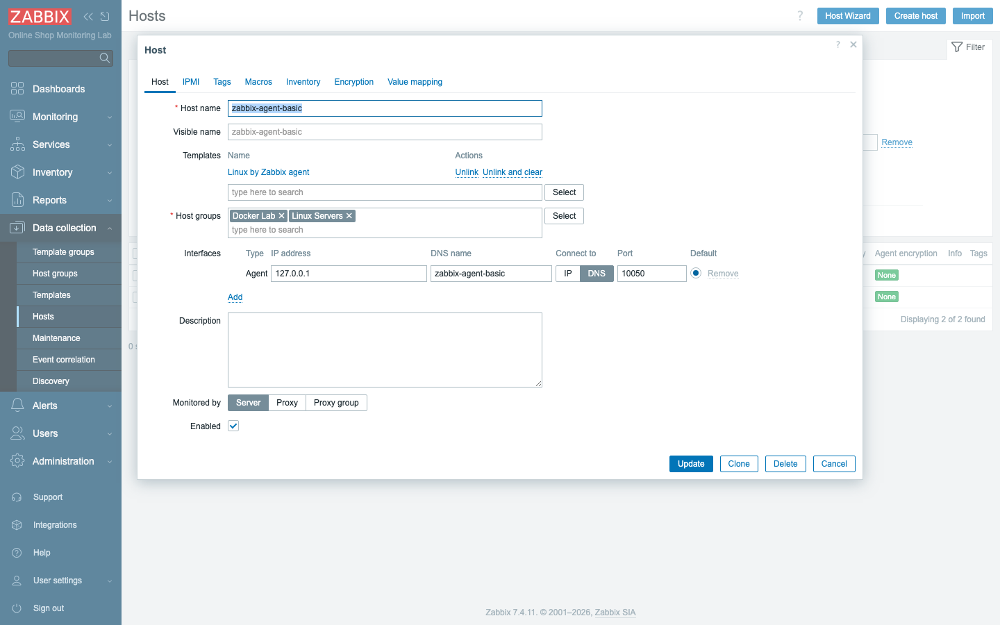
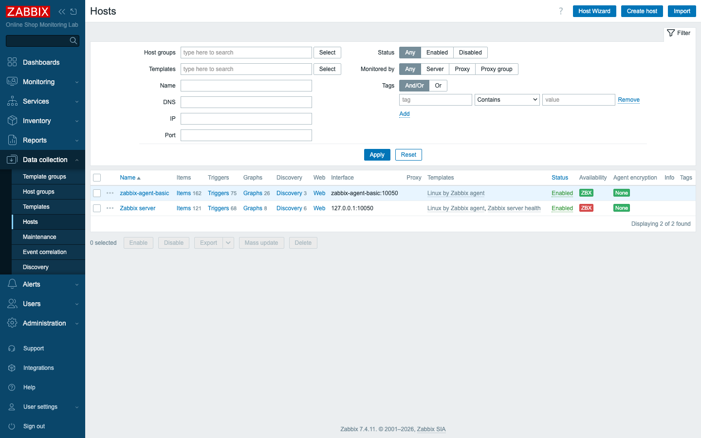
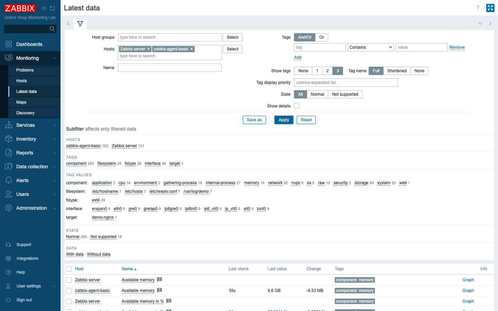
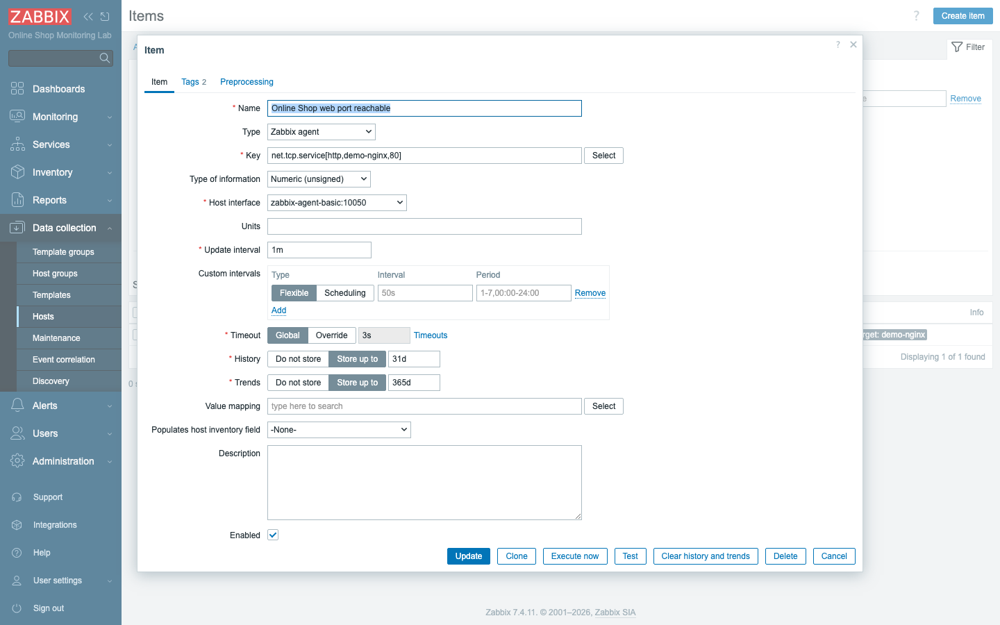
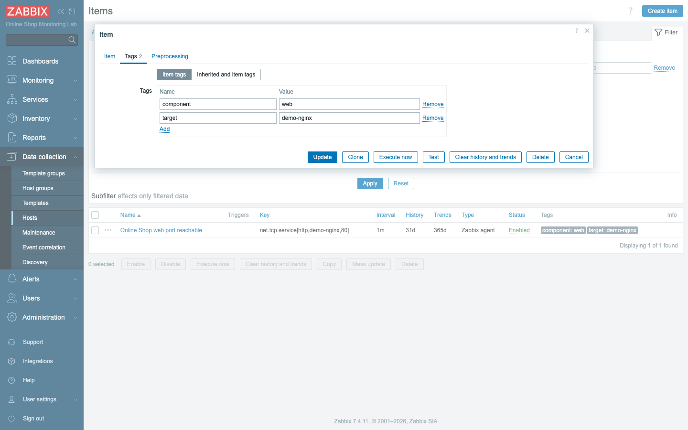
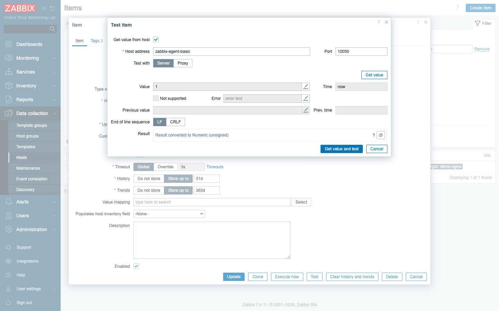

# Module 5: Configuring Basic Data Collection

## Learning Objectives

By the end of this module you will be able to create a monitored host in Zabbix,
give it a Zabbix agent interface and explain when you would reach for a DNS name
rather than a raw IP, organize that host with host groups, and link a template
that brings in dozens of metrics in a single click. You will read the resulting
data live in Latest data, and then you will create, tag, and test a custom item
of your own. This is the first module where the Online Shop lab stops being a
diagram and starts being something Zabbix is actually watching — the first real,
reachable monitoring you add to the platform you have been building.

## Topics

### From concepts to configuration

Module 4 was about understanding: you traced how a measurement travels from a
monitored system, through a collector, into the server, and finally onto a
screen. That mental model is what this module turns into clicks. We take the
`zabbix-agent-basic` container — already running on your machine, already part of
the lab — and promote it from "a container that happens to exist" to a proper
**monitored host**. The word *host* is the unit Zabbix monitors, and once this
container becomes one, Zabbix begins collecting its CPU, memory, disk,
filesystem, and network metrics on a schedule. After that, we add a single
custom item that checks something the Online Shop genuinely cares about: whether
the web frontend's port is answering. Every action in this module happens in one
place in the frontend — **Data collection → Hosts** — so it is worth fixing that
location in your mind now.

### Creating a host

A **host** is the unit you monitor: a server, a container, a network device, an
application — anything you want Zabbix to keep an eye on. Creating one is
deliberately minimal. Zabbix asks for a **host name**, membership in at least one
**host group**, and, in almost every case, an **interface** that tells it how to
reach the thing.

Of those three, the host name carries more weight than it looks. For agent
**active checks** — where the agent initiates the connection and pushes data to
the server — the name you type here must match the `Hostname` configured inside
the agent itself, or the two will never recognize each other. The host name is
also the handle you will use to refer to this host in trigger expressions later,
as in `/zabbix-agent-basic/agent.ping`. Because the name threads through so much
of what comes after, we keep it boringly consistent and name the host exactly
after the container it represents: **`zabbix-agent-basic`**.

### Host interfaces and the agent interface

If a host name says *what* you are monitoring, an **interface** says *how to
reach it*. A single host can carry several interface types, because a single
machine might be monitored in more than one way at once — **Agent**, **SNMP**,
**JMX**, and **IPMI** are the four Zabbix offers. You add the interface that
matches the collection method you intend to use. Since `zabbix-agent-basic` runs
a Zabbix agent, we give it an **Agent interface**, and that interface carries a
port: **10050** by default, which is the port the agent listens on for passive
checks (the server asking, the agent answering).

### DNS vs IP — and why DNS wins in Docker

Every interface can connect either by **IP address** or by **DNS name**, and you
pick between them with the "Connect to" toggle. The choice sounds trivial until
you remember how Docker assigns addresses. Container IPs are handed out
dynamically and can change whenever the stack restarts, so an IP you pin today
may point at the wrong container tomorrow. What *doesn't* change is the container
name: on the `zabbix-lab` network, the name `zabbix-agent-basic` is a stable DNS
name that always resolves to whatever IP that container currently holds. So we
set **Connect to: DNS** and **DNS name: `zabbix-agent-basic`**, and let the
server do the resolving for us. The result survives restarts without any manual
fix-up. In production you would more often use a stable IP or a real DNS record,
but the underlying lesson is identical: target the address that doesn't move out
from under you.

### Host groups

A **host group** is a label that gathers related hosts together. Groups are not
just tidiness for its own sake — they do real work later. They drive
**permissions** (which you will see in Module 25), and they make **filtering**
and **dashboards** scopeable, so you can say "show me everything in the
Databases group" without listing hosts by hand. Every host must belong to at
least one group, and a host may belong to several at once. We place this host in
two of the course's groups: **Docker Lab**, which holds everything in the lab,
and **Linux Servers**, which holds every Linux host. Be aware that Zabbix also
ships a built-in group named "Linux servers" with a lowercase "s" — we
deliberately use our own course groups from the canonical naming so that the
Online Shop hosts are grouped on purpose rather than by accident.

### Items and item keys

If the host is the thing you monitor, an **item** is one specific thing you
measure about it — a single metric, like available memory or the inbound traffic
on a network interface. What an item collects is pinned down by its **item key**,
a compact string that names the measurement precisely. Keys can take parameters
inside square brackets to say exactly which instance you mean, as in
`vm.memory.size[available]`, `net.if.in[eth0]`, or `vfs.fs.size[/,pused]`. You
could create dozens of items by hand this way, but you rarely should: instead, we
**link a template** that brings a curated set of items in at once. You can always
add your own items on top, which is exactly what you will do later in this module.

### Templates (a first taste)

A **template** is a reusable bundle of items, triggers, and graphs that you
attach to a host in one step. Link **Linux by Zabbix agent** to our host and it
instantly inherits roughly 150 items — CPU, memory, every filesystem, every
network interface, and much more — each already configured with a sensible
collection interval. No manual item creation, no guessing at keys. Templates are
a deep topic in their own right, and Module 18 takes them apart properly; here you
are simply a consumer of one, enjoying the payoff without yet building one
yourself.

### Update intervals, history, and trends

Every item carries three time settings, and you will set them so often that they
deserve their own moment now:

- **Update interval** — how often the value is collected (e.g. `1m`). Shorter =
  more resolution and more load.
- **History** — how long *raw* values are kept (lab default **31d**). History
  powers detailed, recent graphs.
- **Trends** — how long hourly **min/avg/max** roll-ups are kept (lab default
  **365d**). Trends power long-term graphs cheaply after history expires.

The reason these three exist as separate dials is that raw resolution is
expensive to store but cheap to reason about in the short term, while long-term
analysis only needs the summarized shape. Choosing them well is the heart of
capacity and performance planning, which Module 30 takes up in earnest.

### Item tags and timeouts

Two more per-item settings round out the picture, and both matter more in 7.x
than a newcomer expects:

- **Item tags** are `name: value` labels on an item (e.g. `component: web`).
  Tags are how 7.x filters Latest data, groups problems, and routes alerts —
  they replace the old "applications" concept. You will tag deliberately.
- **Timeout** is how long Zabbix waits for the item's value before giving up. In
  7.4 it defaults to the **Global** timeout (3s) but can be **Override**-n per
  item for slow checks.

Tags are the connective tissue of a modern Zabbix configuration: a well-chosen
tag set is what lets you slice Latest data, cluster related problems, and decide
which alerts go to whom. Get into the habit of tagging on purpose rather than as
an afterthought.

### Testing item values

Before you build triggers, dashboards, and alerts on top of an item, you want to
know the item actually works — that the key is spelled right and the host is
reachable. The item form's **Test** button does exactly that: it asks the server
(or a proxy) to fetch the value *right now* and shows you both the raw and the
processed result. A wrong key or an unreachable host shows up here, in seconds,
before it can hide inside a silent trigger you only notice failing weeks later.
Testing early is one of those small disciplines that quietly saves hours.

## Docker-Based Demonstration

The instructor's goal here is to take the `zabbix-agent-basic` container and turn
it into a monitored host while the class watches the data arrive. The container is
already running and already trusts the server — its configuration sets
`Server=zabbix-server`, which is the agent's allow-list of who may ask it
questions. Because of that, we can prove the agent answers at the protocol level
*before* touching the UI, which neatly separates "is the plumbing right?" from
"did I fill the form in correctly?":

```bash
# The server can already reach the agent (passive check, port 10050):
docker exec zabbix-server zabbix_get -s zabbix-agent-basic -k agent.ping
# -> 1
```

With the agent confirmed reachable, the instructor moves to the frontend, creates
the host, links the template, and opens **Monitoring → Latest data** to watch
roughly 150 metrics begin to populate within a minute. Seeing the values land in
real time is the moment the abstraction becomes concrete.

## Hands-On Lab

> If you are doing this on your own clone, the host does not exist yet — you
> create it here. (In a shared classroom lab it may already exist; your
> instructor will tell you whether to create a new one, e.g. `zabbix-agent-basic-2`.)

1. **Start creating the host.** Go to **Data collection → Hosts** and click
   **Create host** (top-right).
   **Expected:** the **Host** configuration dialog opens on the **Host** tab.

2. **Name the host.** In **Host name**, enter `zabbix-agent-basic`.
   **Expected:** the name is accepted; the Visible name auto-fills to match.

3. **Add host groups.** In **Host groups**, type `Docker Lab` and select it (or
   create it by typing the name and choosing "(new)"), then add `Linux Servers`
   the same way.
   **Expected:** two group chips appear: *Docker Lab* and *Linux Servers*.

4. **Add the agent interface.** Next to **Interfaces**, click **Add → Agent**.
   - Leave **IP address** as `127.0.0.1` (a value is required even when using
     DNS).
   - Set **DNS name** to `zabbix-agent-basic`.
   - Set **Connect to** to **DNS**.
   - Leave **Port** as `10050`.

   **Expected:** an Agent interface row shows DNS `zabbix-agent-basic`, Connect to
   **DNS**, port 10050.

   
   *Connect to is set to DNS so the server resolves the container name instead of
   pinning a volatile IP.*

5. **Link the Linux template.** In **Templates**, type `Linux by Zabbix agent`
   and select it.
   **Expected:** *Linux by Zabbix agent* appears in the Templates list.

6. **Save the host.** Click **Add**.
   **Expected:** the host appears in the **Hosts** list. Within a minute its
   **Availability** column shows a green **ZBX** (the server reached the agent).

   

7. **Check Latest data.** Go to **Monitoring → Latest data**, set the **Hosts**
   filter to `zabbix-agent-basic`, and click **Apply**.
   **Expected:** ~150 items populate (e.g. *Available memory* ≈ several GB, CPU
   utilization, filesystem usage), each with a **Last check** time and **Last
   value**. The data is real and updates on each item's interval.

   

8. **Create a manual item** that checks the Online Shop web frontend. In **Data
   collection → Hosts**, click **Items** on the `zabbix-agent-basic` row, then
   **Create item**, and set:
   - **Name:** `Online Shop web port reachable`
   - **Type:** `Zabbix agent`
   - **Key:** `net.tcp.service[http,demo-nginx,80]`
   - **Type of information:** `Numeric (unsigned)`
   - **Update interval:** `1m`
   - Leave **History** (`31d`) and **Trends** (`365d`) at their defaults.

   This item is interesting because it asks the agent on one host
   (`zabbix-agent-basic`) to reach across and test a port on *another* host
   (`demo-nginx`) — a first taste of using an agent to probe a service it does not
   itself run.

   **Expected:** the form accepts the key; History shows `31d`, Trends `365d`, and
   Timeout shows **Global**.

   
   *Note the History (31d), Trends (365d), and Timeout (Global) fields — the time
   settings every item has — and the Tags and Preprocessing tabs at the top.*

9. **Tag the item.** Switch to the item's **Tags** tab and add two tags:
   - `component` = `web`
   - `target` = `demo-nginx`

   These tags are what will later let you filter for "web" components or for
   anything pointed at `demo-nginx`, so spelling them consistently now pays off
   downstream.

   **Expected:** two tag rows appear.

   

10. **Test the item before saving.** Click **Test → Get value and test**.
    **Expected:** the **Value** field shows **`1`** (the demo-nginx HTTP port is
    answering; `0` would mean down). This confirms the key and host are correct.

    

11. **Save the item** (click **Add**). After up to a minute, find it in **Latest
    data** for the host.
    **Expected:** *Online Shop web port reachable* shows **Last value 1** with the
    tags `component: web` and `target: demo-nginx`.

## Expected Outcome

You have added `zabbix-agent-basic` as a fully monitored host — placed in the
*Docker Lab* and *Linux Servers* groups, reached over its agent interface by DNS,
linked to *Linux by Zabbix agent* and collecting roughly 150 metrics — and you
have created, tagged, and tested a custom item that confirms the Online Shop web
frontend is reachable. The shop you have been picturing since Module 1 now has its
first real monitoring, and every module from here builds on the host you just
created.
