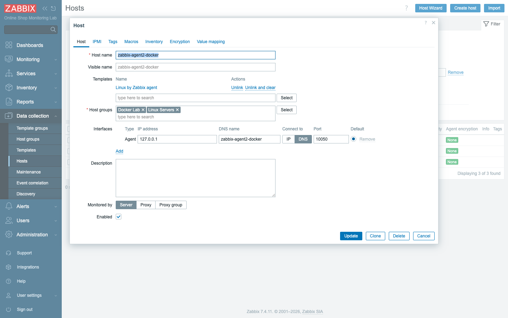
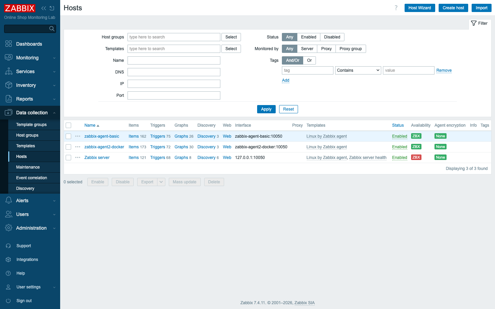
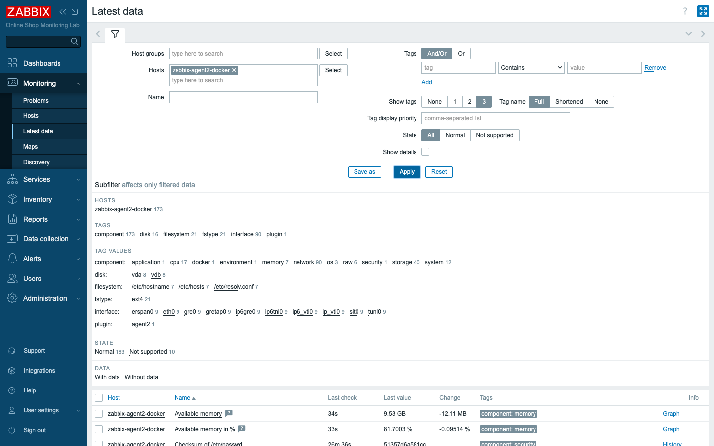
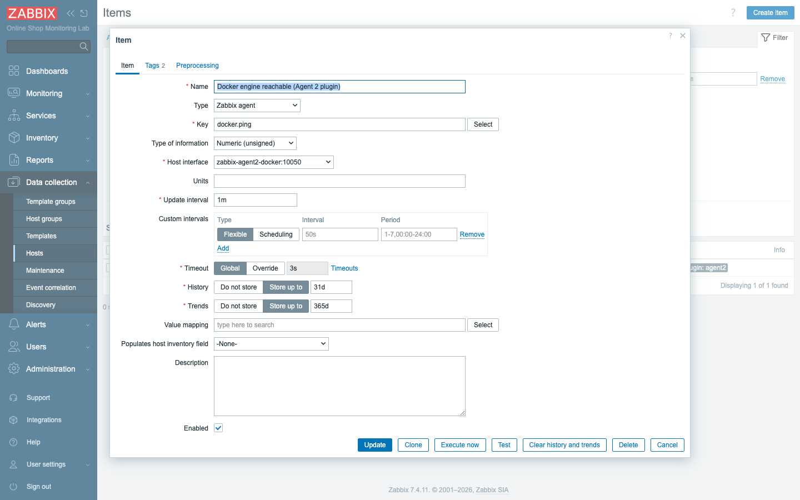
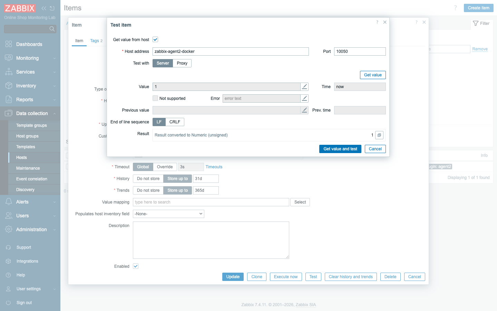
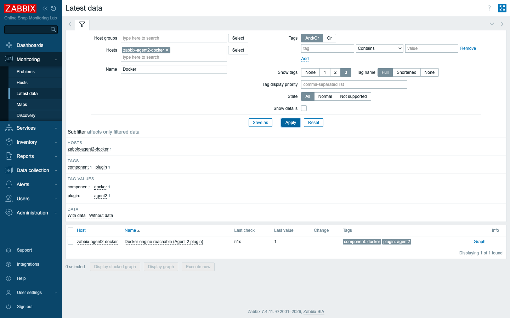
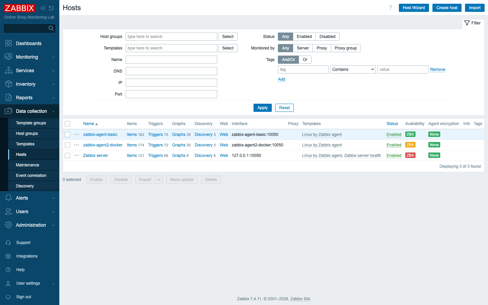

# Module 6: Basic Zabbix Agent Setup

## Learning Objectives

By the end of this module participants can explain the difference between Zabbix
agent and Zabbix agent 2, describe the key agent configuration parameters
(`Server`, `ServerActive`, `Hostname`) and how passive and active checks use them,
add the Agent 2 host to the lab and see its built-in Docker plugin in action, read
agent logs, and diagnose a broken agent connection from the error messages.

## Topics

### Why two agents — and why it matters for the Online Shop

In Module 5 you monitored `zabbix-agent-basic` with the **classic Zabbix agent**.
The lab also runs `zabbix-agent2-docker`, which uses **Zabbix agent 2**. Knowing
which agent to deploy — and how to configure and troubleshoot it — is fundamental,
because the agent is how most Online Shop hosts (the API, the database host, log
sources) will report in.

### Zabbix agent vs Zabbix agent 2

Both speak the same protocol and serve the same built-in item keys, so for basic
OS metrics they are interchangeable. The differences:

| | Zabbix agent (classic) | Zabbix agent 2 |
|---|---|---|
| Language | C | Go |
| Plugins | none (built-in keys only) | **built-in plugins** (Docker, PostgreSQL, MySQL, Redis, …) |
| Connections | one per check | can **multiplex / keep persistent** connections |
| Extending | UserParameters / loadable modules | UserParameters **and** Go plugins |
| Footprint | smallest | slightly larger, more capable |

Both report version **7.4.11** in our lab:

```bash
docker exec zabbix-server zabbix_get -s zabbix-agent-basic   -k agent.version   # 7.4.11
docker exec zabbix-server zabbix_get -s zabbix-agent2-docker -k agent.version   # 7.4.11
```

The headline advantage of agent 2 is **plugins**. Because `zabbix-agent2-docker`
has the Docker socket mounted, its built-in Docker plugin answers keys the classic
agent cannot:

```bash
docker exec zabbix-server zabbix_get -s zabbix-agent2-docker -k docker.ping   # 1
docker exec zabbix-server zabbix_get -s zabbix-agent2-docker -k docker.info
# {"ID":"...","Containers":19,"ContainersRunning":16,"Images":32,...}

# The classic agent has no Docker plugin:
docker exec zabbix-server zabbix_get -s zabbix-agent-basic -k docker.ping
# ZBX_NOTSUPPORTED: Unsupported item key.
```

### Agent configuration: the parameters that matter

An agent is configured by a small text file — `zabbix_agentd.conf` (classic) or
`zabbix_agent2.conf` (agent 2). The handful of parameters you must understand:

- **`Server`** — the IP(s)/name(s) allowed to connect for **passive** checks
  (an allow-list). If the poller's address is not here, the agent refuses it.
- **`ServerActive`** — where the agent connects to fetch and submit **active**
  checks.
- **`Hostname`** — the name the agent uses for active checks; it **must exactly
  match the host name in Zabbix** or active checks fail.
- **`ListenPort`** — the passive port (default **10050**).

> **In this Docker lab you don't edit files** — the images take environment
> variables that generate the config: `ZBX_SERVER_HOST` sets both `Server` and
> `ServerActive` (here, `zabbix-server`), and `ZBX_HOSTNAME` sets `Hostname`
> (here, `zabbix-agent-basic` / `zabbix-agent2-docker`). In production you would
> set these in the `.conf` file on each machine.

### Passive vs active checks (mapped to the parameters)

- **Passive check:** the server connects **to the agent** on port 10050 and asks
  for a value. Governed by the agent's **`Server`** allow-list. (This is what
  `zabbix_get` does.)
- **Active check:** the agent connects **to the server** on port 10051, downloads
  its list of checks, and pushes values. Governed by **`ServerActive`**, and the
  agent identifies itself by **`Hostname`**.

You can see active checks at work in the agent log (next section): until the host
existed in Zabbix, agent 2 logged *"host … not found"*; once we created the host
with a matching name, it logged *"active checks on server are active again."*

### Simple checks, and SSH/Telnet checks (agentless, conceptually)

Not everything needs an agent. **Simple checks** are basic network checks the
**server performs directly** — e.g. `net.tcp.service[http,demo-nginx,80]`,
`net.tcp.port[…]`, or `icmpping`. **SSH** and **Telnet** check item types let the
server log in and run a command, again with no agent on the target. We use these
agentless types later for the web, database, and SNMP demos; here just note that
"agent vs agentless" is a *choice per check*, not a property of the whole host.

### Agent logs

When something is wrong, the agent log is the first place to look. In Docker the
log goes to the container's stdout:

```bash
docker logs zabbix-agent2-docker --tail 5
# ... active check configuration update from [zabbix-server:10051] is working again
# ... active checks on server are active again
```

### Troubleshooting agent connectivity

Most agent problems are one of three things, each with a recognizable error from
`zabbix_get`:

- **Nothing listening / wrong port / agent down:**
  `cannot connect to [[zabbix-agent2-docker]:9999]: connection error (POLLERR,POLLHUP)`
- **Name doesn't resolve (wrong DNS/host):**
  `getaddrinfo() failed for 'does-not-exist'`
- **Connected but refused:** the agent's `Server` allow-list does not include the
  caller (you would see a refusal rather than data).

`zabbix_get` is your isolation tool: if it returns a value, the agent is fine and
the problem is in Zabbix's configuration; if it errors, the problem is network/
agent-side.

## Docker-Based Demonstration

Both agents are already running. The instructor contrasts them live: `agent.version`
on each, then the Docker plugin (`docker.ping`, `docker.info`) on agent 2 versus
`ZBX_NOTSUPPORTED` on the classic agent — proving the plugin advantage — and
finally `docker logs zabbix-agent2-docker` to show the active-check messages.

## Hands-On Lab

You already added the classic-agent host in Module 5; now add the Agent 2 host and
compare them.

1. **Confirm both agents answer.** From a terminal:
   ```bash
   docker exec zabbix-server zabbix_get -s zabbix-agent-basic   -k agent.version
   docker exec zabbix-server zabbix_get -s zabbix-agent2-docker -k agent.version
   ```
   **Expected:** both print `7.4.11`.

2. **See agent 2's Docker plugin (classic agent can't).**
   ```bash
   docker exec zabbix-server zabbix_get -s zabbix-agent2-docker -k docker.ping   # 1
   docker exec zabbix-server zabbix_get -s zabbix-agent-basic   -k docker.ping   # ZBX_NOTSUPPORTED
   ```
   **Expected:** agent 2 returns `1`; the classic agent reports the key
   unsupported.

3. **Add the Agent 2 host.** In **Data collection → Hosts → Create host**, set:
   - **Host name:** `zabbix-agent2-docker`
   - **Host groups:** `Docker Lab`, `Linux Servers`
   - **Agent interface:** DNS `zabbix-agent2-docker`, **Connect to: DNS**, port
     `10050`
   - **Templates:** `Linux by Zabbix agent`

   
   *The completed host form — identical layout to the classic-agent host from
   Module 5; only the name and DNS differ. Connect to is set to DNS.*

   Click **Add**.
   **Expected:** within a minute the host shows a green **ZBX** in the Hosts list,
   next to the classic-agent host.

   
   *`zabbix-agent-basic` (classic) and `zabbix-agent2-docker` (agent 2) side by
   side; the built-in *Zabbix server* host stays red (its agent points inside the
   server container).*

4. **Compare collected metrics.** Open **Monitoring → Latest data** and filter to
   `zabbix-agent2-docker`.
   **Expected:** the same families of Linux metrics you saw for the classic agent
   (CPU, memory, filesystems, network) — confirming both agents collect the same
   built-in keys.

   

5. **Add an Agent 2 plugin item.** On the `zabbix-agent2-docker` host, create an
   item:
   - **Name:** `Docker engine reachable (Agent 2 plugin)`
   - **Type:** `Zabbix agent`
   - **Key:** `docker.ping`
   - **Type of information:** `Numeric (unsigned)`
   - **Tags:** `component=docker`, `plugin=agent2`

   
   *Creating the `docker.ping` item — a plain Zabbix agent item, but the key is
   served by Agent 2's built-in Docker plugin.*

   Use **Test → Get value and test** before saving.

   

   **Expected:** Test returns **`1`**; after saving, Latest data shows the item =
   `1`. This metric is impossible on the classic agent.

   

6. **Read the agent log.**
   ```bash
   docker logs zabbix-agent2-docker --tail 8
   ```
   **Expected:** lines about active-check configuration updates to
   `zabbix-server:10051` "working again" / "active again" — the agent talking to
   the server for active checks.

7. **Break it, then fix it (troubleshooting).** Simulate an agent outage and watch
   the diagnosis:
   ```bash
   docker stop zabbix-agent2-docker
   docker exec zabbix-server zabbix_get -s zabbix-agent2-docker -k agent.ping
   ```
   **Expected:** the value request fails with a connection error
   (`connection error (POLLERR,POLLHUP)`), and within a few minutes the host's
   **Availability** stops being green in the Hosts list (it goes unavailable).

   
   *Compare the three hosts: `zabbix-agent-basic` is green (available),
   `zabbix-agent2-docker` has gone unavailable, and the built-in *Zabbix server*
   host is red as usual.*

   Now recover:
   ```bash
   docker start zabbix-agent2-docker
   docker exec zabbix-server zabbix_get -s zabbix-agent2-docker -k agent.ping   # 1
   ```
   **Expected:** `agent.ping` returns `1` again and availability returns to green.
   You just reproduced and fixed the most common agent problem: the agent wasn't
   reachable.

## Expected Outcome

Participants can articulate when to choose agent 2 over the classic agent, explain
`Server`/`ServerActive`/`Hostname` and how passive vs active checks use them, have
a second monitored host (`zabbix-agent2-docker`) collecting metrics plus a
Docker-plugin item that the classic agent cannot provide, and can diagnose a
broken agent from `zabbix_get` errors and the agent log.

## Instructor Notes

- **Lab vs production.** Here agent settings come from environment variables
  (`ZBX_SERVER_HOST`, `ZBX_HOSTNAME`); in production you edit
  `zabbix_agentd.conf` / `zabbix_agent2.conf` on each host. The *parameters and
  their meaning are identical* — only the delivery differs.
- **Why we did NOT link the full "Docker by Zabbix agent 2" template.** That
  template uses **low-level discovery** to auto-create items for every container
  (700+ items here) and relies on LLD concepts we don't teach until Module 23.
  We add a single `docker.ping` item now to show the plugin, and return to the
  full template after LLD.
- **Hostname must match for active checks.** The agent 2 log literally says
  *"host [zabbix-agent2-docker] not found"* until a host with that exact name
  exists. This is the #1 cause of "active checks not working" — show the log so
  students recognise it.
- **`zabbix_get` is the isolation tool.** Returns a value → agent is healthy, look
  at Zabbix config. Errors → network/agent side. Teach this split explicitly.
- **Availability lag on break.** Stopping the agent does not turn the host red
  instantly — the server retries for a short period first (UnreachablePeriod /
  UnavailableDelay). Tell students to expect a 1–2 minute delay, and use
  `zabbix_get` for the immediate signal.
- **Restart the agent if you broke it.** Make sure everyone runs
  `docker start zabbix-agent2-docker` before moving on, or later modules will show
  a red host.
- **Timing (~45 min).** ~12 min agent1-vs-agent2 + parameters, ~13 min add host +
  compare + Docker item, ~12 min logs + break/fix, ~8 min recap/Q&A.

## Lab-State Delta

Added in Module 6:

- **Host:** `zabbix-agent2-docker` (hostid `10781`) — groups *Linux Servers* +
  *Docker Lab*; **Agent interface** DNS `zabbix-agent2-docker:10050`, Connect to
  **DNS**, availability **green**; linked **Linux by Zabbix agent** (10001) →
  ~150 items (173 total).
- **Manual item:** `Docker engine reachable (Agent 2 plugin)` (itemid `70797`),
  key `docker.ping`, Zabbix agent, unsigned, interval `1m`, tags `component:docker`
  + `plugin:agent2`, value **1**.
- *Considered and rejected:* linking the full **Docker by Zabbix agent 2**
  (templateid 10318) — it generated 700+ LLD-driven items; unlinked and cleared,
  deferred to the LLD module.
