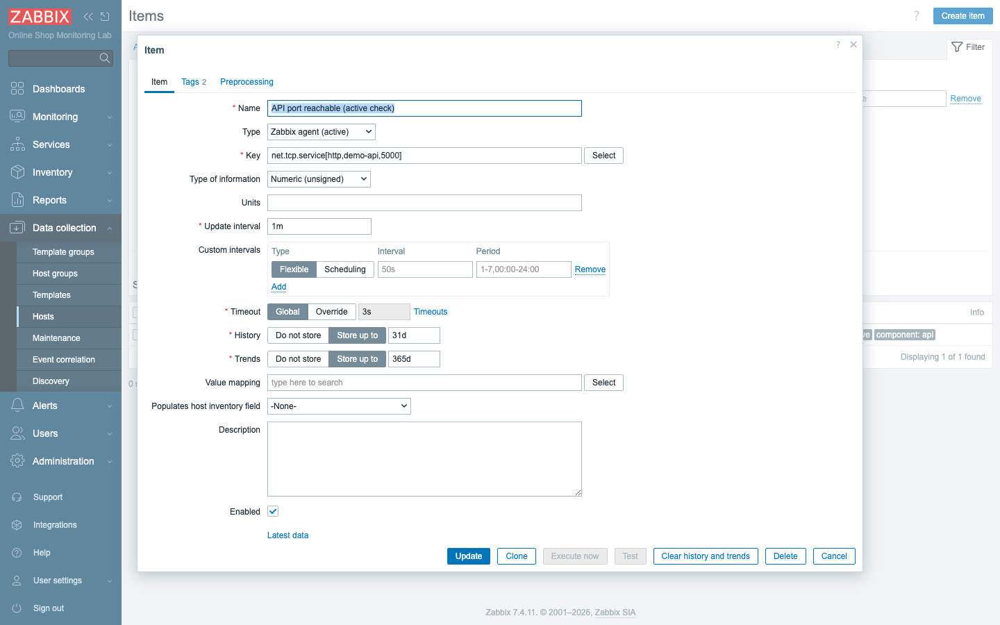
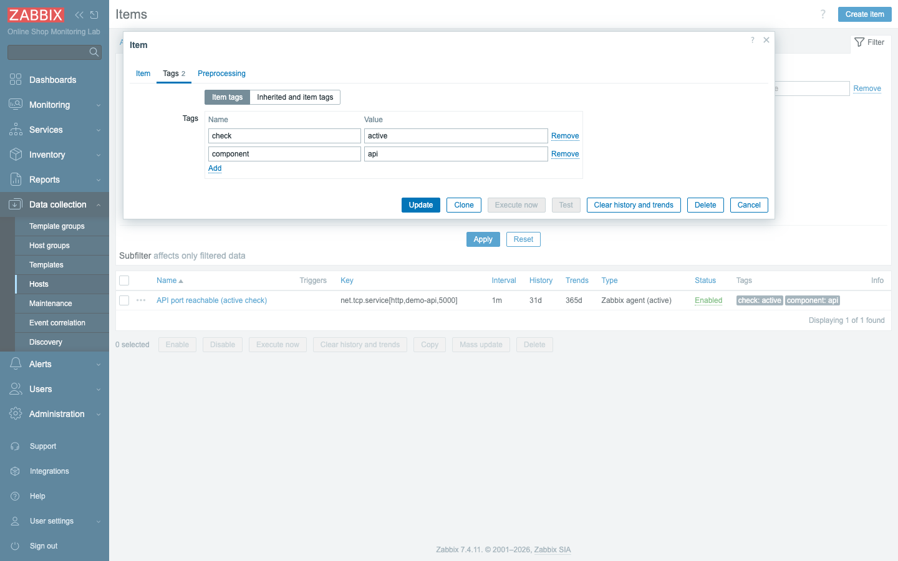
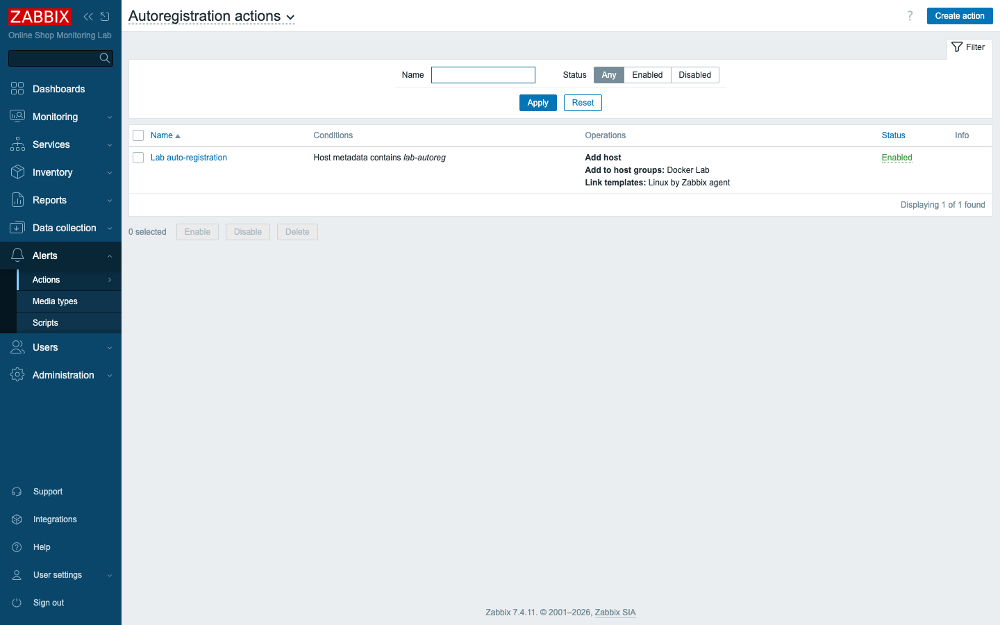
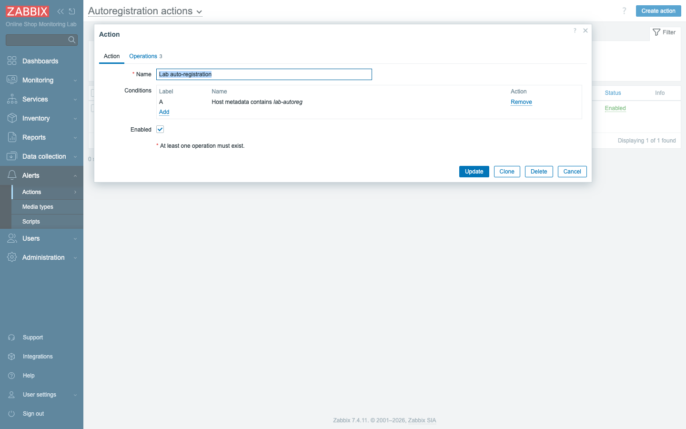
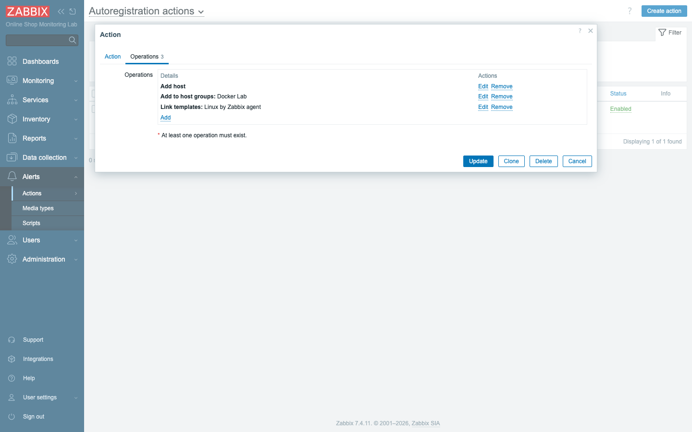
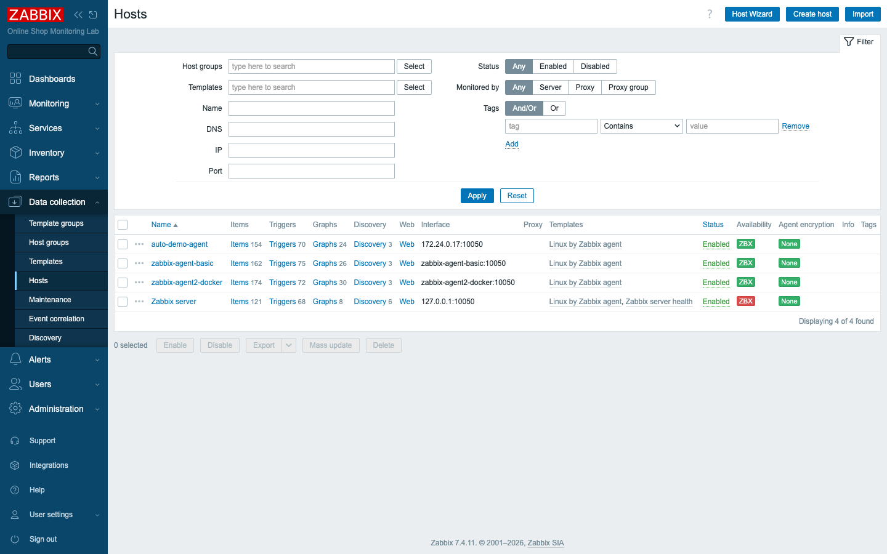

# Module 7: Agent Configuration Best Practices

## Learning Objectives

By the end of this module participants can choose between passive and active agent
mode for a given situation, name the agent performance-tuning parameters
(timeout and active-check buffering), explain why the agent `Hostname` must match
the Zabbix host name, secure an agent with the `Server` allow-list, set up
**auto-registration** so new agents add themselves, and diagnose agent
connectivity problems from logs and error messages.

## Topics

### From "make it work" to "make it right"

Modules 5 and 6 got agents reporting. This module is about doing it *well* at
scale: when to pull vs push, how to tune and secure agents, how to onboard many
hosts without clicking, and how to troubleshoot fast. The Online Shop will grow to
many hosts — these practices keep it manageable.

### Active vs passive — when to use which

Both modes are agent-based; the difference is direction (Module 4/6). The choice
matters in practice:

| Prefer **passive** when… | Prefer **active** when… |
|---|---|
| Few hosts, simple setup | Many hosts (offloads work from the server) |
| You want on-demand polling / `zabbix_get` testing | Agents are behind NAT/firewall (only outbound 10051 needed) |
| Server can reach every agent on 10050 | You need **log monitoring** (active-only) |
| | You want the agent to batch and push efficiently |

A common production pattern is **mostly active** checks (better scaling and
firewall-friendliness) with passive kept for quick diagnostics. Active checks need
the agent's `ServerActive` set and its `Hostname` to match a host in Zabbix.

### Agent performance tuning

The parameters you tune most (lab defaults shown; set via env here, via the
`.conf` file in production):

- **`Timeout`** (`ZBX_TIMEOUT`, default **3s**) — how long the agent waits for a
  check to return. Raise it only for genuinely slow checks. In 7.4 you can also
  **override timeout per item** (the item form's Timeout → Override) instead of
  raising it globally.
- **Active-check buffering** — the agent collects active values and sends them in
  batches:
  - **`BufferSize`** (`ZBX_BUFFERSIZE`, default **100**) — max values held before
    a forced send.
  - **`BufferSend`** (`ZBX_BUFFERSEND`, default **5s**) — max seconds a value
    waits before being sent.

  Buffering is why active checks scale: one connection ships many values.

### Hostname matching (the #1 active-check gotcha)

For active checks the agent identifies itself by **`Hostname`**, which **must
exactly equal** the host's name in Zabbix. If it does not, the server has no host
to attach the data to. You can see this precisely in the agent log — before the
host existed, agent 2 logged:

```text
no active checks on server [zabbix-server:10051]: host [zabbix-agent2-docker] not found
```

and after the matching host was created:

```text
active checks on server are active again
```

### Allowed-server configuration and basic agent security

- **`Server`** is a passive-check **allow-list**: only listed addresses may pull
  values. Everything else is dropped. You can prove it — a `zabbix_get` from a
  host that is *not* `zabbix-server` is refused:

  ```text
  ZBX_NOTSUPPORTED: Received empty response from Zabbix Agent at
  [zabbix-agent-basic]. Assuming that agent dropped connection because of
  access permissions.
  ```

- **`AllowKey` / `DenyKey`** restrict which item keys an agent will run — used to
  forbid dangerous keys such as `system.run[...]` on hardened agents.
- **Encryption (PSK / certificate)** secures agent↔server traffic. It is *off* in
  this lab for simplicity; we cover it in depth in Module 26 (Security). For now,
  know that production agents are usually encrypted with at least a **PSK**.

### Auto-registration (onboarding agents automatically)

Clicking "Create host" for hundreds of machines does not scale. **Active-agent
auto-registration** lets a new agent add *itself*:

1. The agent is configured with **`ServerActive`** and, optionally,
   **`HostMetadata`** (here via `ZBX_METADATA=lab-autoreg`) describing what it is.
2. An **Autoregistration action** (Alerts → Actions → Autoregistration actions)
   matches on that metadata and performs operations: **add host**, **add to host
   group**, **link template**.

When the agent first connects, the server runs the action and the host appears —
fully templated — with no manual clicks. (Network discovery and richer
auto-registration are covered in Module 15; here we use it as an agent
best-practice.)

### Troubleshooting agent connectivity (a workflow)

1. **Isolate with `zabbix_get`** (passive). Value returned → agent healthy, look
   at Zabbix config. Error → network/agent side.
2. **Read the error:**
   - `connection error (POLLERR,POLLHUP)` → nothing listening / wrong port / agent
     down.
   - `getaddrinfo() failed for '<name>'` → DNS/name wrong.
   - `dropped connection because of access permissions` → caller not in `Server`.
3. **Read the agent log** (`docker logs <agent>`): active-check and connection
   messages explain hostname/server issues.

## Docker-Based Demonstration

The instructor contrasts the four states from the outline — passive check,
active check, wrong hostname, and wrong server address:

```bash
# passive check (server pulls) — works:
docker exec zabbix-server zabbix_get -s zabbix-agent-basic -k agent.ping            # 1

# wrong server address (name doesn't resolve):
docker exec zabbix-server zabbix_get -s no-such-agent -k agent.ping
# getaddrinfo() failed for 'no-such-agent'

# allowed-server enforcement (caller not in Server allow-list):
docker exec zabbix-agent2-docker zabbix_get -s zabbix-agent-basic -k agent.ping
# ...dropped connection because of access permissions
```

For an **active** check the instructor shows the agent log line
`active checks on server are active again`, and the wrong-hostname case via the
`host [...] not found` log line.

## Hands-On Lab

1. **Confirm a passive check** (baseline):
   ```bash
   docker exec zabbix-server zabbix_get -s zabbix-agent-basic -k agent.ping   # 1
   ```
   **Expected:** `1`.

2. **Configure an active check.** On the `zabbix-agent2-docker` host, create an
   item with **Type = `Zabbix agent (active)`**:
   - **Name:** `API port reachable (active check)`
   - **Key:** `net.tcp.service[http,demo-api,5000]`
   - **Type of information:** `Numeric (unsigned)`, **interval** `1m`
   - **Tags:** `component=api`, `check=active`

   **Expected:** the form has **no Host interface** field, and **Test/Execute now
   are greyed out** — active items are pushed by the agent, not polled. After a
   couple of minutes the value is **1** in Latest data.

   

   
   *Tags identify this as an active API check (`component: api`, `check: active`).*

3. **Set up auto-registration.**
   1. Go to **Alerts → Actions → Autoregistration actions → Create action**.

      

   2. **Name:** `Lab auto-registration`. Add a **Condition**: *Host metadata
      contains* `lab-autoreg`.

      

   3. On the **Operations** tab, add: **Add host**, **Add to host groups** →
      `Docker Lab`, **Link templates** → `Linux by Zabbix agent`. Save.

      

4. **Trigger auto-registration** with a brand-new agent that carries the matching
   metadata:
   ```bash
   docker run -d --name auto-demo-agent --network zabbix-lab \
     -e ZBX_SERVER_HOST=zabbix-server \
     -e ZBX_HOSTNAME=auto-demo-agent \
     -e ZBX_METADATA=lab-autoreg \
     zabbix/zabbix-agent:alpine-7.4-latest
   ```
   **Expected:** within ~1–2 minutes a new host **`auto-demo-agent`** appears in
   **Data collection → Hosts**, already in *Docker Lab* and linked to *Linux by
   Zabbix agent* — created with **zero** manual configuration.

   

5. **Simulate an unreachable agent and diagnose it.**
   ```bash
   docker stop auto-demo-agent
   docker exec zabbix-server zabbix_get -s auto-demo-agent -k agent.ping
   ```
   **Expected:** a connection error, and after a short delay the host's
   availability is no longer green (it goes unavailable). Use the workflow:
   `zabbix_get` errors → it's network/agent-side; the agent is stopped.

6. **Clean up the demo agent.**
   ```bash
   docker rm -f auto-demo-agent
   ```
   Then delete the `auto-demo-agent` host in Zabbix (Data collection → Hosts →
   select → Delete) — it was only to demonstrate the mechanism.
   **Expected:** the throwaway host and container are gone; your real hosts remain.

## Expected Outcome

Participants can justify passive vs active for a given scenario, tune timeout and
understand active-check buffering, explain and demonstrate the `Hostname`-match
requirement and the `Server` allow-list, stand up auto-registration so new agents
onboard themselves, and follow a repeatable workflow to troubleshoot agent
connectivity.

## Instructor Notes

- **Lab vs production.** Tuning and security here are set via environment variables
  (`ZBX_TIMEOUT`, `ZBX_BUFFERSIZE`, `ZBX_METADATA`, …); in production they live in
  `zabbix_agentd.conf` / `zabbix_agent2.conf`. Production agents are normally
  **encrypted (PSK/cert)** and often **active-mostly** behind firewalls — exactly
  the practices introduced here.
- **Auto-registration vs discovery.** This is the *agent-initiated* path
  (active agent announces itself). Module 15 covers *server-initiated* network
  discovery and deeper auto-registration conditions/operations. Mention the
  forward link so students see the bigger picture.
- **Why Test is disabled on active items.** Good teachable moment: the server
  cannot poll an active item on demand — the agent owns the schedule. Use
  passive items (or `zabbix_get`) when you need on-demand testing.
- **Security caveat for `system.run`.** If you demo UserParameters/`system.run`
  later, note it is disabled by default and gated by `AllowKey`/`DenyKey` — never
  enable arbitrary command execution on production agents without restriction.
- **Make everyone clean up.** The `auto-demo-agent` container and host are
  throwaways; ensure students remove both so the lab stays tidy for Day 2.
- **Timing (~45 min).** ~12 min active/passive + tuning + security, ~8 min active
  item, ~15 min auto-registration build + trigger, ~10 min break/diagnose + clean
  up.

## Lab-State Delta

- **Active item added:** `API port reachable (active check)` (itemid `70980`) on
  `zabbix-agent2-docker` (10781) — **Type `Zabbix agent (active)`**, key
  `net.tcp.service[http,demo-api,5000]`, tags `component:api` + `check:active`,
  value **1**. (Kept — demonstrates active mode going forward.)
- **Autoregistration action added:** `Lab auto-registration` (actionid `7`,
  eventsource 2) — condition *Host metadata contains `lab-autoreg`*; operations
  add host + add to *Docker Lab* + link *Linux by Zabbix agent*. (Kept; only fires
  for agents sending that metadata.)
- **Auto-registration demonstrated then reverted:** temp container
  `auto-demo-agent` (`ZBX_METADATA=lab-autoreg`) auto-created host `auto-demo-agent`
  (hostid 10782) with the Linux template; **both removed after capture** so the
  reference lab stays clean (screenshots retained as proof).
- Verified agent error/security strings for troubleshooting: allow-list refusal
  (`dropped connection because of access permissions`), bad name
  (`getaddrinfo() failed`), no listener (`POLLERR,POLLHUP`). Screenshots in
  `content/day-1/assets/module-07/`.
