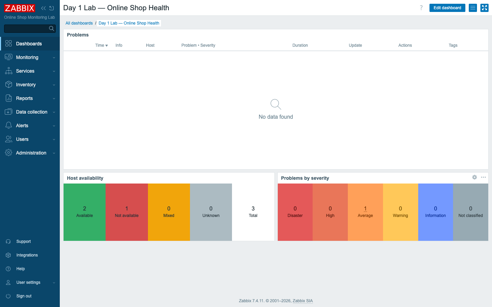
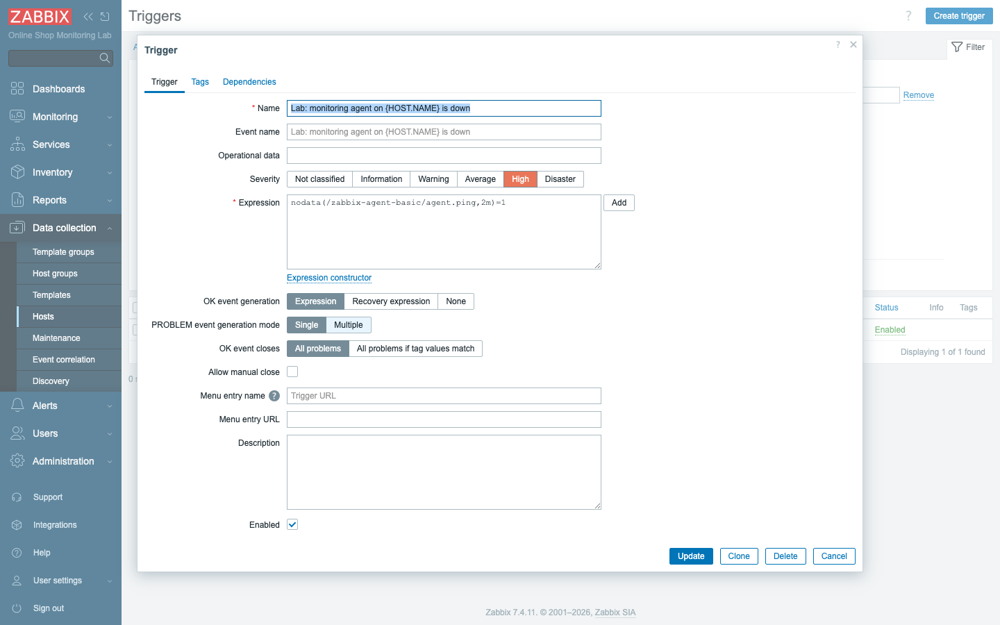
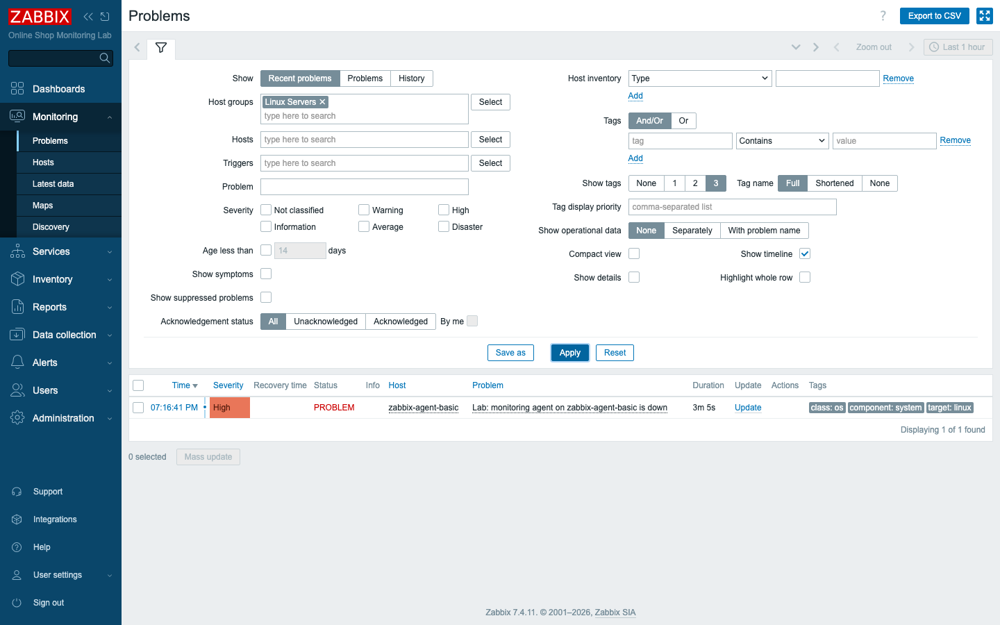
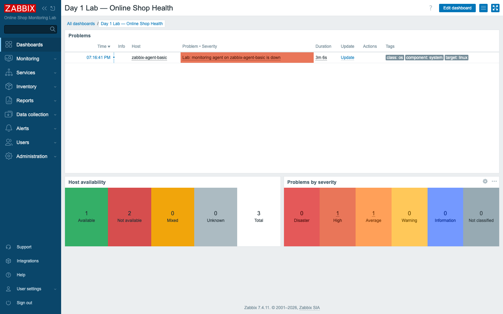

# Module 8: Practical Lab — Day 1

## Learning Objectives

By the end of this module you will be able to run a complete, end-to-end basic
monitoring workflow entirely on your own — without an instructor walking you
through each click. Concretely, you will confirm the lab is up, sign in to the
frontend, verify that a host is being watched by an agent and a linked template,
check that its data is flowing, build a small dashboard, write a trigger, then
deliberately break something, watch Zabbix notice, and watch it recover when you
put things right. This is the capstone for Day 1: it takes the seven separate
skills you have collected since Module 1 and threads them into a single,
continuous loop you can perform from memory.

## Topics

### The capstone scenario

This module is a checkpoint, not a new lecture. There is no fresh theory to learn
here; the point is to *prove* — to yourself — that the Day 1 pieces fit together.
Everything you need already exists in your lab. What you have not yet done is run
all of it in sequence, as one operation, the way you would in a real shift.

The subject of that operation is the Online Shop's Linux host,
`zabbix-agent-basic`. You will run the full monitoring loop against it, the loop
that underpins every monitoring system ever built:

> **collect → store → visualize → detect → alert → recover**

Read those six verbs left to right and you have the whole job description of a
monitoring platform. The host *collects* measurements and Zabbix *stores* them;
you *visualize* them on a dashboard so a human can take in the state of the
system at a glance; a trigger *detects* the moment a measurement crosses into
trouble; the problem surfaces as an *alert* you can act on; and when the
underlying fault is fixed, the system *recovers* on its own, with no one having
to remember to clear anything by hand.

Here is the shape of what you build. You assemble a small dashboard to give
yourself a single pane of glass, then add a trigger that watches the monitoring
agent itself. With that in place you take the agent down on purpose and watch
Zabbix detect that the host has gone silent, raise the problem on the Problems
page and on your dashboard, and then clear it automatically the moment the agent
comes back. If you worked through Modules 2 through 7, the host and its data are
already there waiting — so most of your effort goes into the last two verbs,
*detect* and *recover*, which are the pieces you have not yet wired up yourself.

## Docker-Based Demonstration

Before you run the loop, the instructor runs it once, start to finish, so you see
the whole arc before you reproduce it. They begin by showing the stack is up with
`docker compose -f compose_lab.yaml ps`, open the frontend, and confirm that
`zabbix-agent-basic` is actively collecting under **Latest data**. Then they
build a Problems dashboard, create the agent-down trigger, and — this is the part
worth watching closely — run `docker stop zabbix-agent-basic` and narrate the
problem as it appears in **Monitoring → Problems** and on the dashboard.
Finally they run `docker start` and let you see the recovery happen on its own.
Watching it once removes the suspense; you will know exactly what "success" looks
like when you do it yourself.

## Hands-On Lab

The ten steps below split into two halves, and it helps to know which is which
before you start. Steps 1 through 5 simply confirm the foundation you already
built in earlier modules — run them quickly, almost as a pre-flight check, and if
anything is missing the cross-reference in each step tells you which module to
revisit. Steps 6 through 10 are the new capstone work: a dashboard, a trigger,
the deliberate failure, the detection, and the recovery. Every step states an
Expected Result so you can tell, without guessing, whether you are on track.

1. **Start / confirm the Docker lab.**
   ```bash
   docker compose -f compose_lab.yaml ps
   ```
   **Expected:** all 15 containers are `running` (`zabbix-db`, `zabbix-web`
   healthy). If not, `docker compose -f compose_lab.yaml up -d` (Module 2).

2. **Access the frontend.** Open **<http://localhost:8080>** and sign in.
   **Expected:** the **Global view** dashboard loads.

3. **Confirm the Linux host is monitored.** Go to **Data collection → Hosts**.
   **Expected:** `zabbix-agent-basic` is listed with a green **ZBX** and an agent
   interface. (If it is missing, add it per Module 5.)

4. **Confirm the Linux template is linked.** On that host's row, check the
   **Templates** column.
   **Expected:** *Linux by Zabbix agent* is linked (≈150 items).

5. **Verify latest data.** Go to **Monitoring → Latest data**, filter to
   `zabbix-agent-basic`.
   **Expected:** live metrics (CPU, memory, filesystems) with recent **Last
   check** times.

With those five confirmations behind you, the foundation is verified: a host is
collecting, a template is linked, and data is arriving. Now you give yourself
somewhere to *see* it. A dashboard is the human-facing surface of monitoring —
the place an operator looks first to answer "is everything OK right now?" — so
before you go hunting for problems, you build the view that will display them.

6. **Create a simple dashboard.** Go to **Dashboards → All dashboards → Create
   dashboard**, name it `Day 1 Lab — Online Shop Health`, and add a **Problems**
   widget (set its **Host groups** filter to *Linux Servers* so it shows only your
   lab hosts). Optionally add **Host availability** and **Problems by severity**
   widgets. **Save changes.**
   **Expected:** an all-clear dashboard — the Problems widget shows "No data
   found" while everything is healthy, and Host availability shows your hosts
   available.

   

   A clean, all-green dashboard is not an anticlimax — it is the baseline you need.
   You can only recognize a problem if you first know what "healthy" looks like,
   and that is exactly what step 6 establishes. The next step gives Zabbix
   something to *watch for*.

7. **Create a simple trigger.** Go to **Data collection → Hosts**, click
   **Triggers** on the `zabbix-agent-basic` row, then **Create trigger**:
   - **Name:** `Lab: monitoring agent on {HOST.NAME} is down`
   - **Severity:** **High**
   - **Expression:** `nodata(/zabbix-agent-basic/agent.ping,2m)=1`

   Click **Add**.
   **Expected:** the trigger is saved and enabled. The expression reads "if
   `agent.ping` has reported no data for 2 minutes, this is a problem" — exactly
   what happens when the agent stops. *(The `{HOST.NAME}` macro fills in the host
   name in problem text.)*

   

   This is the heart of the capstone. A trigger is a rule Zabbix evaluates over
   the stored data to decide when a measurement means trouble, and `nodata` is one
   of the most useful trigger functions there is: instead of watching a value go
   too high or too low, it watches for *silence*. An agent that has stopped
   reporting is, almost by definition, a sign that something is wrong with the host
   it lives on. With the rule in place, you can now create the very silence it is
   looking for.

8. **Simulate a problem by stopping the agent.**
   ```bash
   docker stop zabbix-agent-basic
   ```
   **Expected:** the command returns immediately. The agent is now down, so it
   stops answering — `agent.ping` will go stale within ~2 minutes.

9. **Confirm the problem appears.** Watch **Monitoring → Problems** (filter Host
   groups to *Linux Servers*). After up to ~2 minutes:
   **Expected:** a **High** problem appears — *Lab: monitoring agent on
   zabbix-agent-basic is down* — with status **PROBLEM** and a growing Duration.
   Your dashboard's Problems widget shows it too, and Host availability flips the
   host to **Not available**.

   

   

   The short wait is itself a lesson. Triggers evaluate over a window of time, not
   on a single missed sample, so the problem does not appear the instant you stop
   the container — it appears once the silence has lasted the two minutes your
   expression specified. Use those minutes to watch the same event surface in two
   places at once: the Problems page, which is the operator's worklist, and the
   dashboard you built, which is the at-a-glance view. The final step closes the
   loop.

10. **Recover by restarting the agent.**
    ```bash
    docker start zabbix-agent-basic
    ```
    **Expected:** within ~1–2 minutes `agent.ping` resumes, the `nodata`
    condition clears, and the trigger returns to OK — the problem leaves the
    Problems list (or shows as **RESOLVED**) and your dashboard goes all-clear
    again. You have completed the full monitoring loop.

## Expected Outcome

You have now run a complete monitoring workflow without anyone holding your hand:
a host collected and stored data, a dashboard visualized it, a trigger detected a
failure you induced on purpose, the problem surfaced both in Problems and on the
dashboard, and recovery cleared it automatically once the cause was gone. That
sequence — collect, store, visualize, detect, alert, recover — is not just a Day 1
exercise. It is the operational loop that every later module in this course
extends, refines, and scales. Get it into your hands now and everything that
follows has somewhere solid to attach.
