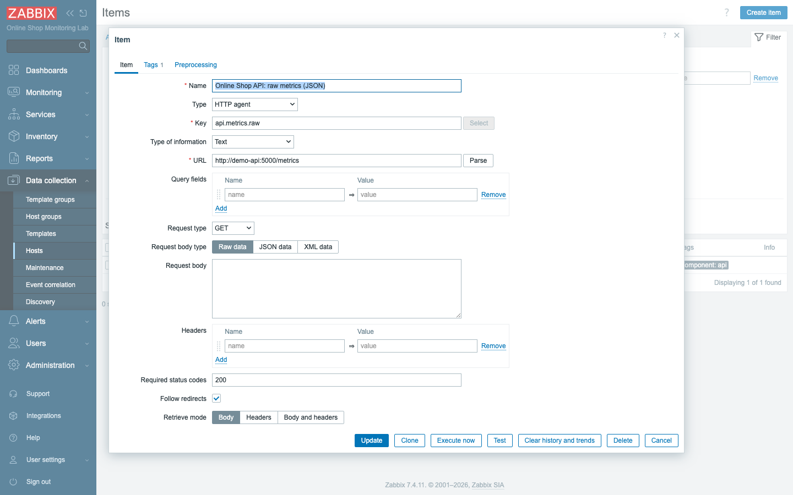
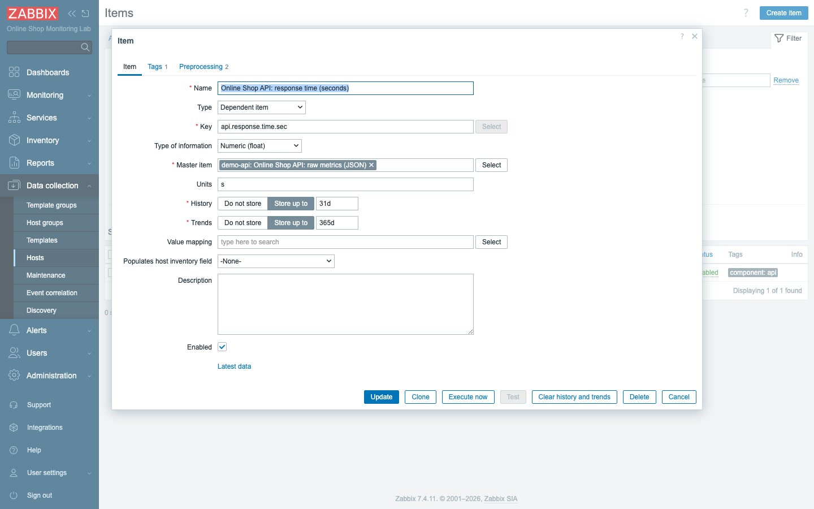
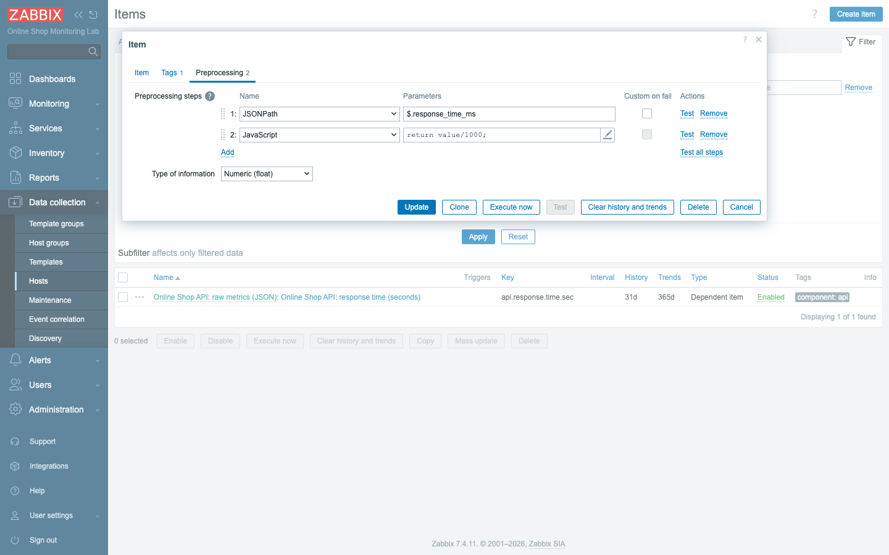
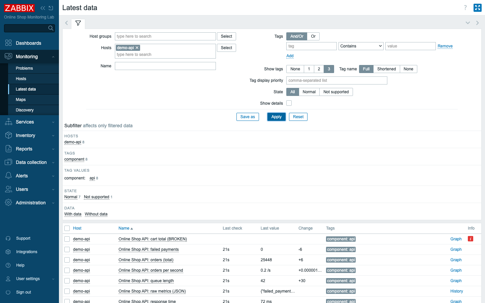
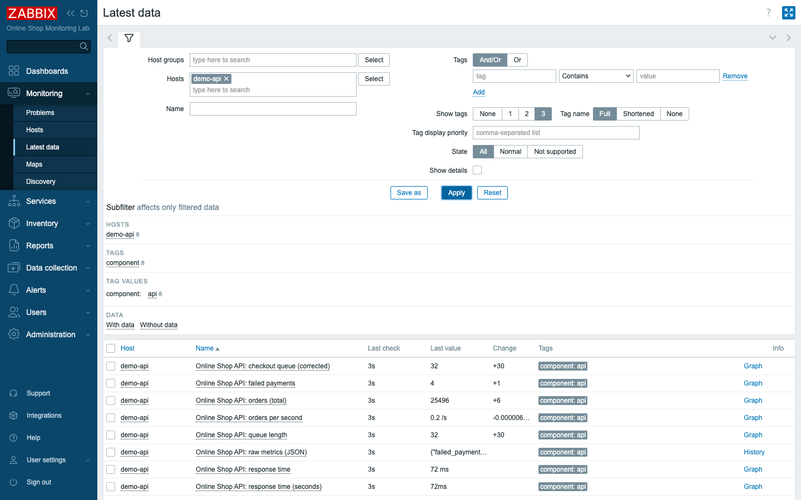

# Module 9: Advanced Data Collection

## Learning Objectives

By the end of this module you will be able to monitor a JSON API with an HTTP
agent item, split one response into many metrics using **dependent items**,
transform values with **preprocessing** (JSONPath, change-per-second,
JavaScript), choose the right value type for each measurement, set update and
flexible intervals, and diagnose and fix an **unsupported** item from the error
message it leaves behind. In short, this is the module where data collection
grows up: instead of one number from one agent check, you learn the patterns
real applications demand when they hand you structured data and expect you to
make sense of it.

## Topics

### Why "advanced" collection — one request, many metrics

On Day 1 every item was simple in the same way: one agent check produced one
value, and that value went straight into storage. That works beautifully for a
CPU percentage or a free-disk figure, where the host already breaks the world
down into single numbers for you. Real applications are not so tidy. They tend
to expose *structured* data — a whole bundle of related numbers delivered in one
response — and our Online Shop API (`demo-api`) is a perfect example. Ask it for
its metrics and it returns a JSON blob at `http://demo-api:5000/metrics`:

```json
{"failed_payments":4,"orders":19119,"queue_length":48,"response_time_ms":78}
```

There are four numbers in that one response, and they are exactly the four things
you want to watch about the API: how many payments have failed, how many orders
the shop has taken, how deep the work queue is, and how long the API takes to
answer. The naive approach would be to create four items, each polling that URL
and each throwing away three-quarters of what it gets back. That would hit the
API four times for four numbers — four times the load on a service that is
already busy serving customers.

The efficient pattern, and the one professional templates use everywhere, is
**one master item** that fetches the JSON once, plus **dependent items** that
each carve out a single field from that shared response. One request feeds many
metrics. As the Online Shop grows to dozens of API endpoints across hundreds of
hosts, this difference stops being a nicety and becomes the line between a
monitoring system that scales and one that buries the very service it is meant to
protect.

### Value types (and data-type mismatch)

Before you can store any of those numbers, Zabbix needs to know what *kind* of
thing each one is. Every item declares a single **type of information**, and that
declaration has to match the data actually arriving, or storage fails. Here are
the types this module touches:

- **Numeric (unsigned)** — whole counters (`orders`, `queue_length`).
- **Numeric (float)** — decimals (`response_time_ms`, a rate).
- **Character / Text** — strings; **Text** holds large values like our whole JSON
  blob.
- **Log** — log lines (Module 19).

The reason this matters is concrete and unforgiving. Storing text in a numeric
item, or a decimal in an unsigned item, causes a **data-type mismatch** and the
item goes **unsupported** — it stops collecting until you fix it. Zabbix will not
quietly round or coerce the value to make it fit; it expects you to have chosen
correctly. So the rule is simple: pick the type to fit the value. A counter that
is always a whole number is unsigned; anything with a decimal point is float; raw
JSON, which is a long string, is Text.

### The master + dependent item pattern

With value types understood, the master-and-dependent relationship becomes easy
to picture. The two halves play very different roles:

- A **master item** collects raw data on a schedule. Ours is an **HTTP agent**
  item (`api.metrics.raw`, type *Text*) that GETs the JSON every 30 s.
- A **dependent item** has no schedule of its own — it takes the master's latest
  value and runs **preprocessing** to extract or transform one piece. When the
  master updates, every dependent updates too.

Think of the master item as the single phone call to the API and the dependent
items as the people listening in, each writing down the one number they care
about. Because the dependents never poll on their own, they add essentially no
extra load — they are just transformations of data the master already fetched.
That is the whole trick: you pay for one request and harvest as many metrics as
the response contains.

### Item preprocessing

Preprocessing is what turns a raw response into the clean, typed value you
actually want to store. It is an ordered **pipeline** of steps applied before a
value is committed, and the value flows through them top to bottom, each step
handing its result to the next. The steps you will reach for most often:

- **JSONPath** — pull a field from JSON: `$.orders`.
- **Change per second** — turn a rising counter into a rate (e.g. orders/second).
- **JavaScript** — arbitrary transforms: `return value/1000;` (ms → s).
- **Regular expression** — extract/replace with a regex.
- **Trim / Right trim / Left trim** — strip characters.
- **Discard unchanged** — drop duplicate values to save space.

Steps run top to bottom and each has a **Test** button so you can try it on a
sample before saving. That Test button is more useful than it looks: getting a
JSONPath expression or a line of JavaScript exactly right on the first try is
rare, and being able to paste in a sample value and watch the pipeline transform
it — step by step — is the fastest way to debug a transformation without waiting
for the next poll.

### Update intervals and flexible intervals

How often does any of this actually happen? That is the job of the interval. The
master's **Update interval** controls how often it polls (30 s here). Dependent
items have **no interval** — they follow the master, updating the instant the
master delivers a fresh value. There is no point giving a dependent item its own
schedule when it has nothing of its own to fetch.

Sometimes one fixed rate is too blunt an instrument. **Flexible (custom)
intervals** let an item poll at a different rate during a time window (e.g. every
10 s during business hours, every 5 m overnight) — set under the item's *Custom
intervals*. For the Online Shop that is the difference between watching the
checkout queue closely while customers are actually shopping and easing off
overnight when nothing is happening and the extra samples would only fill the
database for no benefit.

### Unsupported items and common errors

Sooner or later an item refuses to collect, and you need to recognize that state
calmly rather than panic at the red icon. An item is **unsupported** when Zabbix
cannot get or process its value. Common causes: a wrong key/URL, an unreachable
target, a **data-type mismatch**, or a **preprocessing step that fails** (e.g. a
JSONPath that matches nothing). The good news is that Zabbix does not make you
guess: the item's **error message** tells you exactly what went wrong — read it,
fix the cause, and the item recovers on the next poll. Treat unsupported not as a
failure but as the system handing you the diagnosis, which is precisely the loop
you will lean on for the rest of the course.

## Docker-Based Demonstration

The instructor builds the whole pattern live against `demo-api`: an HTTP agent
master item that returns the JSON, four dependent items that extract fields with
JSONPath, a rate via change-per-second, and a JavaScript transform — then
deliberately points a dependent item at a field that does not exist to show the
unsupported state and its error, and fixes it. By the end you have watched the
entire arc, from one request to many clean metrics, and seen what a broken item
looks like and how its own error message leads you back to health.

## Hands-On Lab

1. **Add the API as a host.** In **Data collection → Hosts → Create host**, set
   **Host name** `demo-api`, **Host groups** `Web Services` and `Docker Lab`, and
   add **no interface** (HTTP agent items carry their own URL). Save.
   **Expected:** the `demo-api` host appears in the list.

2. **Create the master HTTP agent item.** On `demo-api`, create an item:
   - **Name:** `Online Shop API: raw metrics (JSON)`
   - **Type:** `HTTP agent`
   - **Key:** `api.metrics.raw`
   - **Type of information:** `Text`
   - **URL:** `http://demo-api:5000/metrics`
   - **Update interval:** `30s`

   This is the single request that everything else will feed from, which is why
   its type of information is Text — it stores the entire JSON string, not a
   number. Use **Test → Get value and test**, then **Add**.
   **Expected:** Test returns the JSON object; in **Latest data**, the item shows
   the raw `{"failed_payments":…}` string.

   

3. **Create a dependent item with JSONPath.** Create another item:
   - **Name:** `Online Shop API: orders (total)`
   - **Type:** `Dependent item`
   - **Key:** `api.orders`
   - **Type of information:** `Numeric (unsigned)`
   - **Master item:** `Online Shop API: raw metrics (JSON)`
   - On the **Preprocessing** tab, add a **JSONPath** step: `$.orders`

   This is your first dependent item: it never polls the API itself, it simply
   reaches into the master's stored JSON and lifts out the `orders` field.
   **Add**.
   **Expected:** within ~30 s the item shows the orders count, extracted from the
   master's JSON.

   

4. **Add the other fields** the same way: `api.queue.length` (`$.queue_length`,
   unsigned), `api.failed.payments` (`$.failed_payments`, unsigned), and
   `api.response.time` (`$.response_time_ms`, **float**, units `ms`).
   Note that response time is a **float** with units `ms` — a timing measurement
   carries a decimal point and a unit, unlike the plain counters around it.
   **Expected:** four clean metrics, all fed by the single master request.

5. **Add a rate with change-per-second.** Create `api.orders.rate`
   (*Online Shop API: orders per second*, float, units `/s`), Master item =
   the raw-metrics item, with **two** preprocessing steps:
   1. **JSONPath** `$.orders`
   2. **Change per second**

   The `orders` field is an ever-rising total, which is rarely what you want to
   alert on; the rate of change — orders per second — is the meaningful business
   signal. The two-step pipeline first extracts the counter, then converts it.
   **Expected:** the item shows orders/second (a small decimal) — Zabbix divides
   the change in the counter by the time between samples.

6. **Add a JavaScript transform.** Create `api.response.time.sec`
   (*…response time (seconds)*, float, units `s`), Master item = raw-metrics, with:
   1. **JSONPath** `$.response_time_ms`
   2. **JavaScript** `return value/1000;`

   Here preprocessing does unit conversion: the API reports milliseconds, but you
   would rather store seconds, so a single line of JavaScript divides by 1000.
   **Expected:** the millisecond value converted to seconds (e.g. `0.072 s`).

   
   *Each step has a Test button; "Test all steps" runs the whole pipeline on a
   sample value.*

7. **See it all in Latest data.** Go to **Monitoring → Latest data**, filter to
   `demo-api`.
   This is the payoff: one master request, and a whole panel of derived metrics
   that all refresh in lockstep with it.
   **Expected:** the raw JSON master plus all the extracted/transformed metrics,
   each updating together every 30 s.

8. **Intentionally create an unsupported item.** Create a dependent item with a
   JSONPath to a field that does not exist — e.g. `$.cart_total`. **Add**.
   Breaking something on purpose is the fastest way to learn what failure looks
   like before you meet it for real.
   **Expected:** within ~30 s the item turns **Not supported** (red error icon in
   Latest data). Its error reads:
   ```text
   cannot extract value from json by path "$.cart_total": no data matches the
   specified path
   ```

   

9. **Diagnose and fix it.** Look at the **master** item's raw value to see which
   fields the API actually returns (`failed_payments`, `orders`, `queue_length`,
   `response_time_ms` — there is no `cart_total`). Edit the broken item and
   correct the JSONPath to a real field (e.g. `$.queue_length`). **Update.**
   The master's raw value is your source of truth here: it shows exactly what the
   API offers, so the fix is never a guess.
   **Expected:** on the next poll the item leaves the *Not supported* state and
   shows a value — the error clears.

   

## Expected Outcome

You can now monitor a JSON API efficiently with one master item and several
dependent items, transform raw values with JSONPath, change-per-second, and
JavaScript preprocessing, choose correct value types, and recognize, diagnose
(from the error message and the master's raw value), and fix an unsupported item.
More than a set of clicks, you have the pattern that every production template
uses to watch APIs, databases, and cloud services without over-polling them — and
the troubleshooting reflex that turns a red icon into a quick fix rather than a
mystery.
