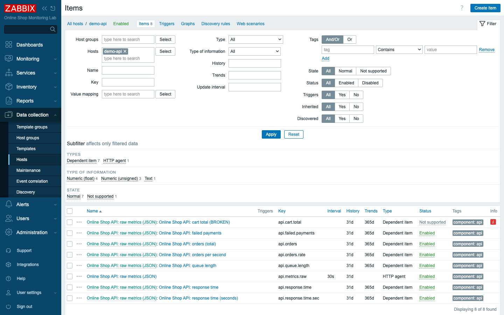

# Module 9: Advanced Data Collection

## Learning Objectives

By the end of this module participants can monitor a JSON API with an HTTP agent
item, split one response into many metrics using **dependent items**, transform
values with **preprocessing** (JSONPath, change-per-second, JavaScript), choose
the right value type, set update and flexible intervals, and diagnose and fix an
**unsupported** item.

## Topics

### Why "advanced" collection — one request, many metrics

Day 1 collected one value per item from an agent. Real applications expose
*structured* data — our Online Shop API (`demo-api`) returns a JSON blob at
`http://demo-api:5000/metrics`:

```json
{"failed_payments":4,"orders":19119,"queue_length":48,"response_time_ms":78}
```

Polling that URL once per metric would hammer the API four times for four numbers.
The efficient pattern is **one master item** that fetches the JSON, plus
**dependent items** that each carve out one field — one request, many metrics.

### Value types (and data-type mismatch)

Every item stores one **type of information**, and it must match the data:

- **Numeric (unsigned)** — whole counters (`orders`, `queue_length`).
- **Numeric (float)** — decimals (`response_time_ms`, a rate).
- **Character / Text** — strings; **Text** holds large values like our whole JSON
  blob.
- **Log** — log lines (Module 19).

Storing text in a numeric item, or a decimal in an unsigned item, causes a
**data-type mismatch** and the item goes **unsupported**. Pick the type to fit the
value.

### The master + dependent item pattern

- A **master item** collects raw data on a schedule. Ours is an **HTTP agent**
  item (`api.metrics.raw`, type *Text*) that GETs the JSON every 30 s.
- A **dependent item** has no schedule of its own — it takes the master's latest
  value and runs **preprocessing** to extract or transform one piece. When the
  master updates, every dependent updates too.

### Item preprocessing

Preprocessing is an ordered **pipeline** of steps applied before a value is
stored. The steps you will use most:

- **JSONPath** — pull a field from JSON: `$.orders`.
- **Change per second** — turn a rising counter into a rate (e.g. orders/second).
- **JavaScript** — arbitrary transforms: `return value/1000;` (ms → s).
- **Regular expression** — extract/replace with a regex.
- **Trim / Right trim / Left trim** — strip characters.
- **Discard unchanged** — drop duplicate values to save space.

Steps run top to bottom and each has a **Test** button so you can try it on a
sample before saving.

### Update intervals and flexible intervals

The master's **Update interval** controls how often it polls (30 s here).
Dependent items have **no interval** — they follow the master. **Flexible
(custom) intervals** let an item poll at a different rate during a time window
(e.g. every 10 s during business hours, every 5 m overnight) — set under the
item's *Custom intervals*.

### Unsupported items and common errors

An item is **unsupported** when Zabbix cannot get or process its value. Common
causes: a wrong key/URL, an unreachable target, a **data-type mismatch**, or a
**preprocessing step that fails** (e.g. a JSONPath that matches nothing). The
item's **error message** tells you exactly what went wrong — read it, fix the
cause, and the item recovers on the next poll.

## Docker-Based Demonstration

The instructor builds the whole pattern live against `demo-api`: an HTTP agent
master item that returns the JSON, four dependent items that extract fields with
JSONPath, a rate via change-per-second, and a JavaScript transform — then
deliberately points a dependent item at a field that does not exist to show the
unsupported state and its error, and fixes it.

## Hands-On Lab

1. **Add the API as a host.** In **Data collection → Hosts → Create host**, set
   **Host name** `demo-api`, **Host groups** `Web Services` and `Docker Lab`, and
   add **no interface** (HTTP agent items carry their own URL). Save.
   **Expected:** the `demo-api` host appears in the list.

2. **Create the master HTTP agent item.** On `demo-api`, create an item:
   - **Name:** `Online Shop API: raw metrics (JSON)`
   - **Type:** `HTTP agent`
   - **Key:** `api.metrics.raw`
   - **Type of information:** `Text`
   - **URL:** `http://demo-api:5000/metrics`
   - **Update interval:** `30s`

   Use **Test → Get value and test**, then **Add**.
   **Expected:** Test returns the JSON object; in **Latest data**, the item shows
   the raw `{"failed_payments":…}` string.

   

3. **Create a dependent item with JSONPath.** Create another item:
   - **Name:** `Online Shop API: orders (total)`
   - **Type:** `Dependent item`
   - **Key:** `api.orders`
   - **Type of information:** `Numeric (unsigned)`
   - **Master item:** `Online Shop API: raw metrics (JSON)`
   - On the **Preprocessing** tab, add a **JSONPath** step: `$.orders`

   **Add**.
   **Expected:** within ~30 s the item shows the orders count, extracted from the
   master's JSON.

   

4. **Add the other fields** the same way: `api.queue.length` (`$.queue_length`,
   unsigned), `api.failed.payments` (`$.failed_payments`, unsigned), and
   `api.response.time` (`$.response_time_ms`, **float**, units `ms`).
   **Expected:** four clean metrics, all fed by the single master request.

5. **Add a rate with change-per-second.** Create `api.orders.rate`
   (*Online Shop API: orders per second*, float, units `/s`), Master item =
   the raw-metrics item, with **two** preprocessing steps:
   1. **JSONPath** `$.orders`
   2. **Change per second**

   **Expected:** the item shows orders/second (a small decimal) — Zabbix divides
   the change in the counter by the time between samples.

6. **Add a JavaScript transform.** Create `api.response.time.sec`
   (*…response time (seconds)*, float, units `s`), Master item = raw-metrics, with:
   1. **JSONPath** `$.response_time_ms`
   2. **JavaScript** `return value/1000;`

   **Expected:** the millisecond value converted to seconds (e.g. `0.072 s`).

   
   *Each step has a Test button; "Test all steps" runs the whole pipeline on a
   sample value.*

7. **See it all in Latest data.** Go to **Monitoring → Latest data**, filter to
   `demo-api`.
   **Expected:** the raw JSON master plus all the extracted/transformed metrics,
   each updating together every 30 s.

8. **Intentionally create an unsupported item.** Create a dependent item with a
   JSONPath to a field that does not exist — e.g. `$.cart_total`. **Add**.
   **Expected:** within ~30 s the item turns **Not supported** (red error icon in
   Latest data). Its error reads:
   ```text
   cannot extract value from json by path "$.cart_total": no data matches the
   specified path
   ```

   

9. **Diagnose and fix it.** Look at the **master** item's raw value to see which
   fields the API actually returns (`failed_payments`, `orders`, `queue_length`,
   `response_time_ms` — there is no `cart_total`). Edit the broken item and
   correct the JSONPath to a real field (e.g. `$.queue_length`). **Update.**
   **Expected:** on the next poll the item leaves the *Not supported* state and
   shows a value — the error clears.

   

## Expected Outcome

Participants can monitor a JSON API efficiently with one master item and several
dependent items, transform raw values with JSONPath, change-per-second, and
JavaScript preprocessing, choose correct value types, and recognise, diagnose
(from the error message and the master's raw value), and fix an unsupported item.

## Instructor Notes

- **Lab vs production.** The `demo-api` JSON stands in for any real application or
  exporter that returns JSON/Prometheus/XML. The master+dependent pattern is
  exactly how production templates monitor APIs, databases, and cloud services
  without over-polling.
- **Why dependent items matter.** Stress the efficiency: one HTTP request feeds
  many metrics. Polling each field separately multiplies load on both Zabbix and
  the monitored service — a real scaling problem at hundreds of hosts.
- **`Test` before you save.** The per-step **Test** (and **Test all steps**)
  button runs preprocessing on a sample value — the fastest way to get a JSONPath
  or JavaScript step right. Encourage using it.
- **Unsupported is normal, not scary.** Items go unsupported all the time during
  development; the **error message is the fix instructions**. Teach the loop:
  read the error → check the source (here, the master's raw value) → correct →
  recover. This is the data-collection half of troubleshooting (Module 31).
- **Items overview.** The host's **Items** list shows each item's **Type**
  (HTTP agent vs Dependent item) and state at a glance — useful when a host has
  many items.

  
- **Timing (~45 min).** ~12 min concepts (master/dependent, preprocessing, value
  types), ~20 min build master + dependents + transforms, ~10 min unsupported +
  fix, ~3 min recap.

## Lab-State Delta

Added in Module 9:

- **Host group:** `Web Services` (groupid `24`).
- **Host:** `demo-api` (hostid `10783`) — groups *Web Services* + *Docker Lab*,
  **no interface** (HTTP agent items use their own URL).
- **Master item:** `api.metrics.raw` (itemid `70981`) — HTTP agent, Text,
  `http://demo-api:5000/metrics`, 30 s.
- **Dependent items** (all on the master, tag `component:api`): `api.orders`
  (JSONPath), `api.queue.length`, `api.failed.payments`, `api.response.time`
  (float, ms), `api.orders.rate` (JSONPath + **change per second**, /s),
  `api.response.time.sec` (JSONPath + **JavaScript** `value/1000`, s).
- **Unsupported→fixed demo item:** `api.cart.total` (itemid `70988`) — created
  with JSONPath `$.cart_total` (no such field → *Not supported*), then corrected
  to `$.queue_length` (now *Online Shop API: checkout queue (corrected)*, value
  collecting). Kept as the fixed result. Screenshots in
  `content/day-2/assets/module-09/`.
