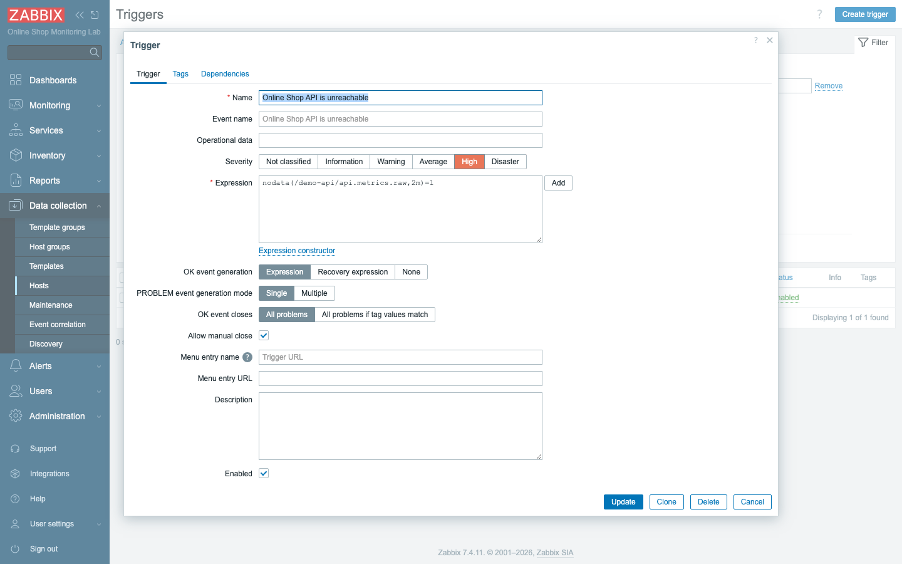
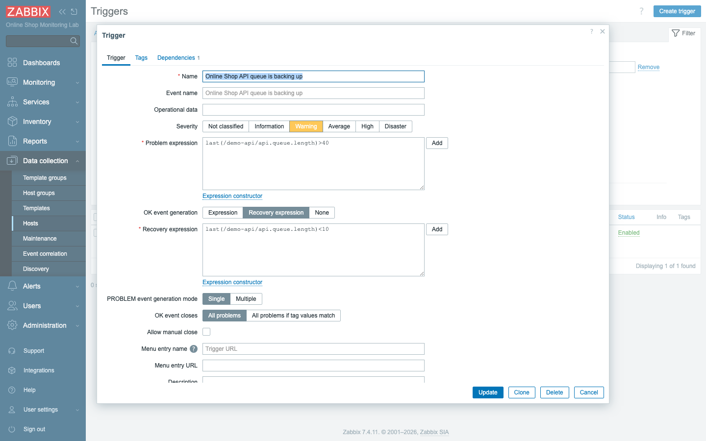
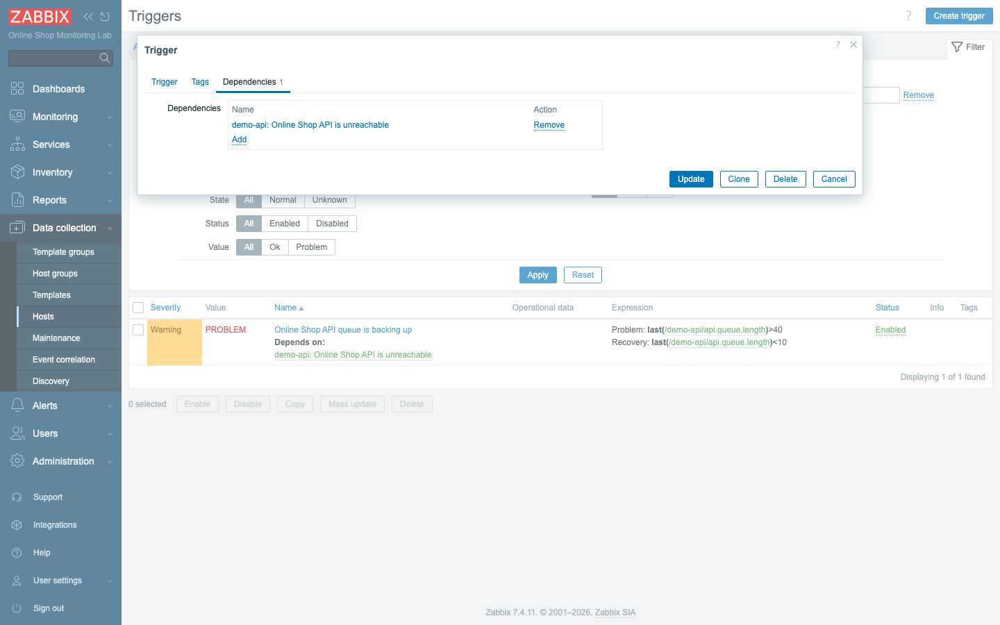
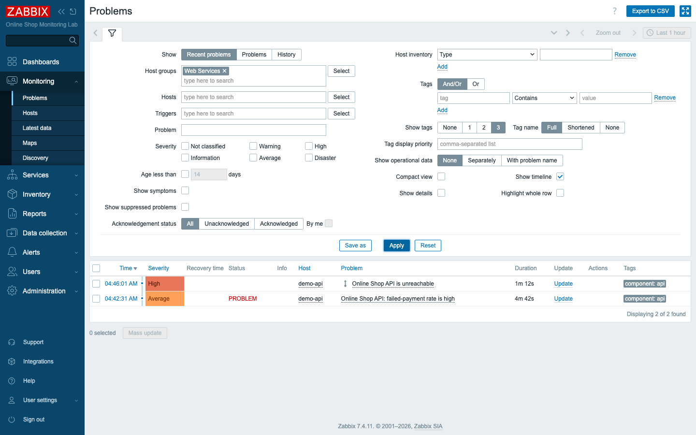
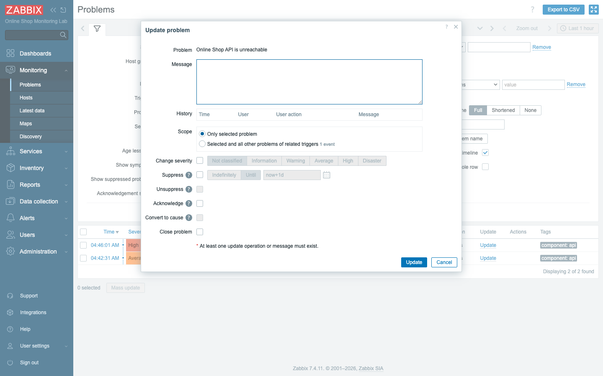
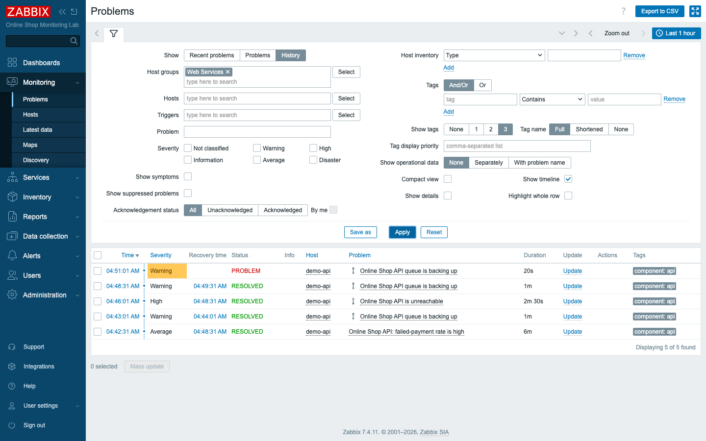

# Module 10: Triggers and Alerts

## Learning Objectives

By the end of this module you will be able to write trigger expressions in the
7.x syntax with confidence, attach a separate **recovery expression** to a
trigger so it stops flapping (a technique called hysteresis), set a severity
that reflects real-world impact, make one trigger **depend** on another so that
a single root cause does not bury you in noise, choose how a trigger generates
problem events, **manually close** a problem that will never clear on its own,
and read back the full problem history after the fact. Think of this module as
the moment the single trigger you built in Module 8 grows up into a deliberate
alerting design — one that decides not just *what* is wrong but *how loudly* to
say it and *which* problems are worth your attention.

## Topics

### From one trigger to a detection strategy

In Module 8 you wrote a trigger and watched it fire, and that was enough to prove
the mechanism works. Now we treat triggers as the design discipline they really
are, because in practice the quality of your monitoring is almost entirely the
quality of your triggers.

A **trigger** is a named condition over item data that is, at any moment, either
**OK** or in a **PROBLEM** state. That is the whole of it: a trigger looks at the
values an item has collected and answers a yes/no question — *is this a
problem?* Each time that answer flips, Zabbix records an **event** — a PROBLEM
event when the trigger fires, an **OK event** when it clears — and every open
PROBLEM event is exactly what shows up for an operator in **Monitoring →
Problems**. So the events are the bridge between raw numbers in the database and
the human-facing list of "things that need looking at."

This is why good monitoring is mostly good triggers. The items collect the
measurements, but the triggers are where you encode judgment: they decide what
counts as "wrong" for the Online Shop and how urgently to say so. Set them too
loose and real failures slip by unnoticed; set them too tight and you train your
team to ignore the alerts. The rest of this module is about getting that judgment
right.

### Trigger expression syntax (7.x)

Before you can express judgment you need the grammar to write it in. Zabbix 7.x
expressions are **function-first**, meaning you lead with a function and pass it
the item you want to evaluate, written as `/host/key`:

```text
last(/demo-api/api.queue.length)>40
nodata(/demo-api/api.metrics.raw,2m)=1
avg(/zabbix-agent-basic/system.cpu.util,5m)>90
```

Read those out loud and they almost describe themselves. The first says: take the
**last** (most recent) value of the queue-length item on `demo-api`, and fire if
it is greater than 40. The second says: if **no data** has arrived for the master
metrics item on `demo-api` for two minutes, the result is 1 — true — so fire. The
third says: take the **average** CPU utilization on `zabbix-agent-basic` over the
last five minutes, and fire if it exceeds 90.

That gives you the three families of function you will reach for constantly.
`last()` returns the single most recent value and is your tool for "what is it
*right now*." `avg()`, `min()`, and `max()` aggregate over a time window, which
smooths out brief spikes so you alert on sustained conditions rather than a single
unlucky sample. And `nodata()` is true when *nothing* has arrived for a period,
which is how you detect absence — a host that has gone silent rather than a value
that has gone bad. *(One warning if you have used older Zabbix: the legacy
`{host:key.last()}` form is not valid in 7.x. Always write function-first with
the `/host/key` reference.)*

### Recovery expression (hysteresis)

Here is a problem that bites almost everyone the first time. By default a trigger
recovers the instant its problem expression stops being true. That sounds
reasonable until you imagine a value sitting right on the threshold. If the queue
length hovers around 40, it crosses above and below the line over and over, and
your trigger obediently fires, clears, fires, clears — a behavior called
**flapping**. Each flip is a fresh problem and, later, a fresh alert, so a single
borderline metric can flood your team with dozens of meaningless notifications.

The fix is a separate **recovery expression**: you fire on one threshold and
recover on a *different, lower* one. The gap between the two is the breathing room
that prevents flapping. For the Online Shop's API queue, we fire when the backlog
climbs past 40 but refuse to call it resolved until it has dropped all the way
below 10:

- **Problem:** `last(/demo-api/api.queue.length)>40`
- **Recovery:** `last(/demo-api/api.queue.length)<10`

Now a queue oscillating around 40 cannot flap: once it has fired, it stays a
problem until the backlog genuinely drains below 10, at which point you can trust
that the pressure has actually eased. This two-threshold pattern is called
hysteresis, and it is the standard cure for noisy alerts.

### Severity

Not every problem deserves the same reaction, and **severity** is how a trigger
says so. Each trigger carries one of six levels — Not classified, Information,
Warning, Average, High, Disaster — which colors the problem in the interface and,
just as importantly, drives *which* alerts go *where* once you build notification
rules in Module 27. Severity is the dial that lets "page someone at 3 a.m." and
"mention it in the morning" coexist in the same system.

The rule of thumb is to match severity to business impact, not to technical
drama. For the Online Shop, "API unreachable" means customers cannot check out at
all, so it is **High**. "Queue backing up" means the shop is slow but still
working, so it is a **Warning** — worth watching, not worth waking anyone.

### Trigger dependencies

There is a particular kind of noise that severity alone cannot solve, and
**dependencies** exist to handle it. A dependency says: if trigger B *depends on*
trigger A, then while A is in PROBLEM, B's problems are hidden. The point is to
suppress symptoms when you already know the root cause.

Picture the API going completely down. The "API is unreachable" trigger fires —
but so might "response time high," "queue backing up," and several others, because
when a service falls over, everything that depends on it looks broken at once. You
do not want six alerts for one outage; you want the *one* that tells you the
actual problem. By making the queue trigger **depend on** the API-unreachable
trigger, you tell Zabbix: "if the whole API is down, the queue length is beside
the point — stay quiet." We will wire exactly that dependency in the lab.

### Problem generation mode & multiple problem events

A trigger also decides *how often* it is allowed to raise a problem, governed by
its **PROBLEM event generation mode**. The default is **Single**: once the trigger
fires, you get one open problem that stays open until it recovers, no matter how
many times the condition is re-met in the meantime. The alternative is
**Multiple**, which generates a brand-new problem event every single time the
condition is satisfied again. Single is what you want for a state ("the API is
down") where re-firing adds nothing; Multiple is what you want when each
occurrence genuinely matters on its own — the classic case being log lines, where
every matching error is a distinct event worth recording (you will meet this in
Module 19). A related setting, **OK event closes**, controls whether a single
recovery closes all the matching problems at once.

### Manual close and event correlation

Some problems will never auto-recover. A one-off error gets logged, the trigger
fires, and there is simply no future value that makes the condition false again —
so the problem would sit in the list forever. For these, enabling **Allow manual
close** lets an operator clear it by hand from the **Update problem** dialog. That
same dialog is the operator's general-purpose control panel for a problem: it
acknowledges, lets you add a comment, change severity, and suppress, all in one
place.

Finally, **event correlation** is the advanced cousin of dependencies. Instead of
suppressing one trigger because another is firing, correlation automatically
*pairs* related problem and OK events by tag — for example matching a "started"
log line to its later "stopped" line so the pair closes itself. We introduce it
conceptually here so the term is familiar; it is configured under *Data
collection → Event correlation* and you will not need it for this module's lab.

## Docker-Based Demonstration

To make all of this concrete, the instructor builds a small but realistic set of
Online Shop triggers on the `demo-api` host. There is an **API-unreachable**
trigger that uses `nodata`, is set to High, and allows manual close; a
**queue-backing-up** trigger that carries a recovery expression for hysteresis and
depends on the first trigger so it stays quiet during a full outage; and a
**failed-payment-rate** trigger at Average severity. With the triggers in place,
`docker stop demo-api` raises the problems in **Monitoring → Problems** so you can
watch the dependency suppress the downstream noise; `docker start demo-api` brings
the service back and clears them; and the **History** view then shows the whole
lifecycle end to end — fired, suppressed, recovered.

## Hands-On Lab

1. **Create an "unavailable" trigger (High, manual close).** On host `demo-api`,
   go to **Data collection → Hosts → Triggers → Create trigger**:
   - **Name:** `Online Shop API is unreachable`
   - **Severity:** **High**
   - **Expression:** `nodata(/demo-api/api.metrics.raw,2m)=1`
   - Tick **Allow manual close**.

   This is your absence detector: it watches the master metrics item and fires the
   moment the API stops reporting, which is the strongest possible signal that the
   shop's checkout path is down.

   **Add.**
   **Expected:** the trigger is saved; it will fire if the master API item reports
   no data for 2 minutes.

   

2. **Create a trigger with a recovery expression.** Create another trigger on
   `demo-api`:
   - **Name:** `Online Shop API queue is backing up`
   - **Severity:** **Warning**
   - **Problem expression:** `last(/demo-api/api.queue.length)>40`
   - **OK event generation:** **Recovery expression**
   - **Recovery expression:** `last(/demo-api/api.queue.length)<10`

   Selecting **Recovery expression** for OK event generation is what unlocks the
   second field; this is the hysteresis pattern in practice, firing high and
   recovering low so a queue that lingers near 40 cannot flap.

   **Expected:** the form shows both expressions; the trigger fires above 40 and
   only recovers below 10 (no flapping in between).

   

3. **Add a dependency.** On that queue trigger, open the **Dependencies** tab,
   click **Add**, and select **Online Shop API is unreachable**. **Update.**
   With this in place, a full API outage will raise one clear "unreachable" alert
   instead of also nagging you about a queue that obviously cannot be measured when
   the service is gone.
   **Expected:** the trigger now shows *Depends on: Online Shop API is unreachable*
   — while the API is unreachable, the queue problem will be suppressed.

   

4. **Create an application-error trigger (Average).** This is the Online Shop's
   equivalent of "too many HTTP 500s": create
   `Online Shop API: failed-payment rate is high`, severity **Average**,
   expression `last(/demo-api/api.failed.payments)>=5`. It reads simply — if the
   most recent failed-payment count is five or more, raise a problem — and Average
   is a fitting middle ground for "customers are losing orders but the shop is
   still up."
   **Expected:** the trigger is saved.

5. **Create a high-CPU trigger (example).** On host `zabbix-agent-basic`, create
   `High CPU utilization on {HOST.NAME}`, severity **High**, expression
   `avg(/zabbix-agent-basic/system.cpu.util,5m)>90`. Averaging over five minutes
   keeps a momentary spike from paging you; only sustained load trips it.
   **Expected:** saved. (It will not fire without real load — it is the template
   for a CPU/memory alert; `{HOST.NAME}` fills in the host name.)

6. **Simulate a problem.**
   ```bash
   docker stop demo-api
   ```
   Stopping the container is the cleanest way to make the API genuinely go silent,
   which is exactly what your `nodata` trigger is waiting for.
   **Expected:** after ~2 minutes **Monitoring → Problems** shows *Online Shop API
   is unreachable* (**High**) — and, because of the dependency, the queue problem
   stays suppressed.

   

7. **Manually update / close a problem.** In **Problems**, click **Update** on the
   *API is unreachable* row.
   This is the operator's console for a single problem — and because you ticked
   **Allow manual close** when you built the trigger, the close option is live
   here.
   **Expected:** the **Update problem** dialog opens, where you can acknowledge,
   add a message, change severity, suppress, or **Close problem** (available
   because you allowed manual close).

   

8. **Recover the problem.**
   ```bash
   docker start demo-api
   ```
   With the container running again the API resumes reporting, and the absence
   condition that was driving the trigger simply evaporates.
   **Expected:** within ~1–2 minutes the API item collects again, the trigger
   returns to OK, and the problem leaves the list.

9. **Review problem history.** In **Monitoring → Problems**, switch **Show** to
   **History** (filter Host groups to *Web Services*).
   The History view is where the whole episode becomes a record you can study after
   the fact — the kind of evidence that turns "I think it was down around lunch"
   into a precise timeline.
   **Expected:** the full lifecycle — PROBLEM and RESOLVED rows with **severity**,
   **recovery time**, and **duration** — including the self-recovering queue
   trigger firing and clearing as the value crossed its thresholds.

   

## Expected Outcome

By the end of this module you can write 7.x trigger expressions, add recovery
expressions to stop flapping, set severities that match real impact, use
dependencies to suppress downstream noise during an outage, choose the right
problem-generation mode, manually close problems that will never clear on their
own, and read problem history to reconstruct what happened. In short, you have
turned the Online Shop's raw metrics into a sensible alerting design — one that
tells your team what is wrong, how urgent it is, and what to ignore while the real
fire burns.
