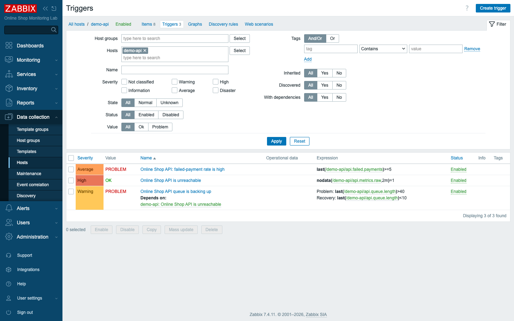

# Module 10: Triggers and Alerts

## Learning Objectives

By the end of this module participants can write trigger expressions in 7.x
syntax, add a separate **recovery expression** for hysteresis, set severities,
make one trigger **depend** on another to suppress noise, choose the
problem-generation mode, **manually close** a problem, and review problem history.
This deepens the single trigger you built in Module 8 into a real alerting design.

## Topics

### From one trigger to a detection strategy

A **trigger** is a named condition over item data that is either **OK** or in a
**PROBLEM** state. Each state change creates an **event** — a PROBLEM event when
it fires, an **OK event** when it clears — and open PROBLEM events are what you see
in **Monitoring → Problems**. Good monitoring is mostly good triggers: they decide
what counts as "wrong" and how loudly to say so.

### Trigger expression syntax (7.x)

Zabbix 7.x expressions are **function-first** and reference items as `/host/key`:

```text
last(/demo-api/api.queue.length)>40
nodata(/demo-api/api.metrics.raw,2m)=1
avg(/zabbix-agent-basic/system.cpu.util,5m)>90
```

`last()` is the most recent value; `avg()`/`min()`/`max()` aggregate over a time
window; `nodata()` is true when no data has arrived for a period. *(The old
`{host:key.last()}` form is not valid in 7.x.)*

### Recovery expression (hysteresis)

By default a trigger recovers when its problem expression becomes false — but a
value hovering on the threshold then **flaps** (problem/OK/problem…). A separate
**recovery expression** fixes this: fire on one threshold, recover on a lower one.
Our queue trigger fires at `>40` but only recovers at `<10`, so it will not flap
around 40:

- **Problem:** `last(/demo-api/api.queue.length)>40`
- **Recovery:** `last(/demo-api/api.queue.length)<10`

### Severity

Each trigger has a **severity** — Not classified, Information, Warning, Average,
High, Disaster — which colours problems and drives *which* alerts go *where*
(Module 27). Match severity to impact: "API unreachable" is **High**; "queue
backing up" is a **Warning**.

### Trigger dependencies

A **dependency** suppresses noise: if trigger B *depends on* trigger A, then while
A is in PROBLEM, B's problems are hidden. When the whole API is unreachable you
want one "API is unreachable" alert — not also "response time high", "queue
backing up", etc. We make the queue trigger **depend on** the API-unreachable
trigger.

### Problem generation mode & multiple problem events

A trigger's **PROBLEM event generation mode** is **Single** (one open problem
until it recovers — the default) or **Multiple** (a new problem event every time
the condition is met again — useful for log lines where each occurrence matters,
Module 19). **OK event closes** controls whether recovery closes all matching
problems.

### Manual close and event correlation

Some problems never auto-recover (a one-off error). Enabling **Allow manual
close** lets an operator close them from the **Update problem** dialog (which also
acknowledges, comments, changes severity, and suppresses). **Event correlation**
(advanced) automatically pairs related problem/OK events by tag — for example a
"started"/"stopped" log pair — and is introduced conceptually here (configured
under *Data collection → Event correlation*).

## Docker-Based Demonstration

The instructor builds Online Shop triggers on the `demo-api` host: an
**API-unreachable** trigger (`nodata`, High, manual close), a **queue-backing-up**
trigger with a recovery expression and a dependency on the first, and a
**failed-payment-rate** trigger (Average). Then `docker stop demo-api` raises the
problems in **Monitoring → Problems**; `docker start demo-api` clears them; and the
**History** view shows the whole lifecycle.

## Hands-On Lab

1. **Create an "unavailable" trigger (High, manual close).** On host `demo-api`,
   go to **Data collection → Hosts → Triggers → Create trigger**:
   - **Name:** `Online Shop API is unreachable`
   - **Severity:** **High**
   - **Expression:** `nodata(/demo-api/api.metrics.raw,2m)=1`
   - Tick **Allow manual close**.

   **Add.**
   **Expected:** the trigger is saved; it will fire if the master API item reports
   no data for 2 minutes.

   

2. **Create a trigger with a recovery expression.** Create another trigger on
   `demo-api`:
   - **Name:** `Online Shop API queue is backing up`
   - **Severity:** **Warning**
   - **Problem expression:** `last(/demo-api/api.queue.length)>40`
   - **OK event generation:** **Recovery expression**
   - **Recovery expression:** `last(/demo-api/api.queue.length)<10`

   **Expected:** the form shows both expressions; the trigger fires above 40 and
   only recovers below 10 (no flapping in between).

   

3. **Add a dependency.** On that queue trigger, open the **Dependencies** tab,
   click **Add**, and select **Online Shop API is unreachable**. **Update.**
   **Expected:** the trigger now shows *Depends on: Online Shop API is unreachable*
   — while the API is unreachable, the queue problem will be suppressed.

   

4. **Create an application-error trigger (Average).** This is the Online Shop's
   equivalent of "too many HTTP 500s": create
   `Online Shop API: failed-payment rate is high`, severity **Average**,
   expression `last(/demo-api/api.failed.payments)>=5`.
   **Expected:** the trigger is saved.

5. **Create a high-CPU trigger (example).** On host `zabbix-agent-basic`, create
   `High CPU utilization on {HOST.NAME}`, severity **High**, expression
   `avg(/zabbix-agent-basic/system.cpu.util,5m)>90`.
   **Expected:** saved. (It will not fire without real load — it is the template
   for a CPU/memory alert; `{HOST.NAME}` fills in the host name.)

6. **Simulate a problem.**
   ```bash
   docker stop demo-api
   ```
   **Expected:** after ~2 minutes **Monitoring → Problems** shows *Online Shop API
   is unreachable* (**High**) — and, because of the dependency, the queue problem
   stays suppressed.

   

7. **Manually update / close a problem.** In **Problems**, click **Update** on the
   *API is unreachable* row.
   **Expected:** the **Update problem** dialog opens, where you can acknowledge,
   add a message, change severity, suppress, or **Close problem** (available
   because you allowed manual close).

   

8. **Recover the problem.**
   ```bash
   docker start demo-api
   ```
   **Expected:** within ~1–2 minutes the API item collects again, the trigger
   returns to OK, and the problem leaves the list.

9. **Review problem history.** In **Monitoring → Problems**, switch **Show** to
   **History** (filter Host groups to *Web Services*).
   **Expected:** the full lifecycle — PROBLEM and RESOLVED rows with **severity**,
   **recovery time**, and **duration** — including the self-recovering queue
   trigger firing and clearing as the value crossed its thresholds.

   

## Expected Outcome

Participants can write 7.x trigger expressions, add recovery expressions to stop
flapping, set appropriate severities, use dependencies to suppress downstream
noise, choose problem-generation modes, manually close problems, and read problem
history — turning raw metrics into a sensible alerting design for the Online Shop.

## Instructor Notes

- **Lab vs production.** The expressions and options are identical in production;
  only the *thresholds* are tuned to real baselines. Encourage students to base
  thresholds on observed history (Latest data / graphs), not guesses.
- **Why recovery expressions matter.** Flapping triggers are the top cause of
  alert fatigue. The `>40 / <10` hysteresis is the canonical fix — make students
  articulate why a single threshold flaps.
- **Dependencies prevent alert storms.** When `demo-api` goes down, you want *one*
  "API unreachable" alert, not a cascade. Dependencies model "if the parent is
  broken, the children don't matter." This scales to network maps (router →
  switches → servers).
- **`nodata` vs value thresholds.** `nodata()` detects *absence* (host/agent/
  service down); value functions (`last`, `avg`) detect *bad values*. Most real
  alerting uses both.
- **The queue trigger self-fires.** Because `demo-api`'s queue metric cycles, the
  queue trigger fires and recovers on its own — handy for showing problem history,
  but point out it is a demo artifact, not a real incident.
- **Trigger overview.** The host's **Triggers** list shows every trigger's
  severity, value (OK/PROBLEM), and expression at a glance.

  
- **Timing (~45 min).** ~15 min expression/recovery/severity, ~10 min dependency +
  problem modes + manual close, ~12 min build + simulate + recover, ~8 min history
  and discussion.

## Lab-State Delta

Added in Module 10 (all kept):

- **Triggers on `demo-api` (10783):**
  - `Online Shop API is unreachable` (triggerid `32832`) —
    `nodata(/demo-api/api.metrics.raw,2m)=1`, **High**, *Allow manual close*.
  - `Online Shop API queue is backing up` (triggerid `32833`) — problem
    `last(/demo-api/api.queue.length)>40`, **recovery expression**
    `last(/demo-api/api.queue.length)<10`, **Warning**, **depends on** 32832.
  - `Online Shop API: failed-payment rate is high` (triggerid `32834`) —
    `last(/demo-api/api.failed.payments)>=5`, **Average**.
- **Trigger on `zabbix-agent-basic` (10780):**
  - `High CPU utilization on {HOST.NAME}` (triggerid `32835`) —
    `avg(/zabbix-agent-basic/system.cpu.util,5m)>90`, **High** (example; not
    firing).
- **Verified lifecycle:** stopping `demo-api` fired *API is unreachable* (High) in
  ~100 s; the queue trigger self-fired/recovered (hysteresis); restarting cleared
  them. Screenshots in `content/day-2/assets/module-10/`.
