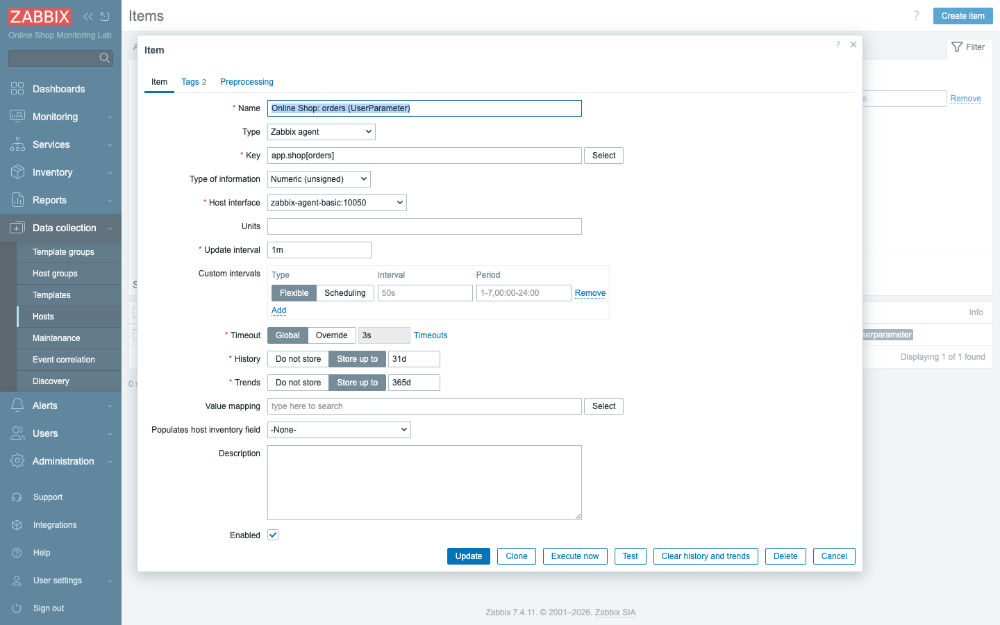
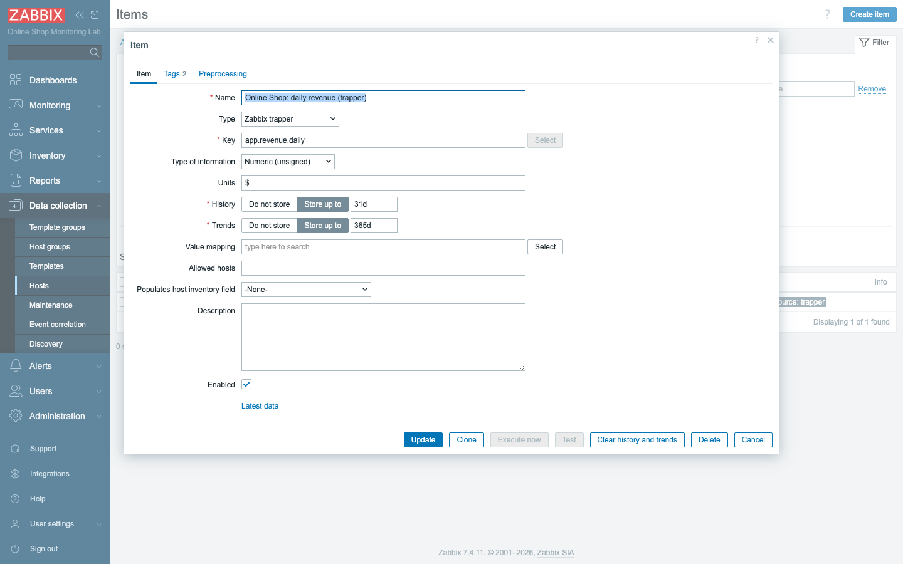
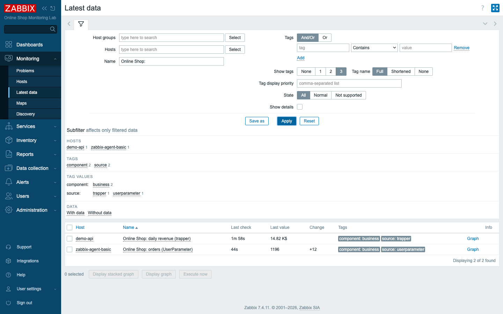
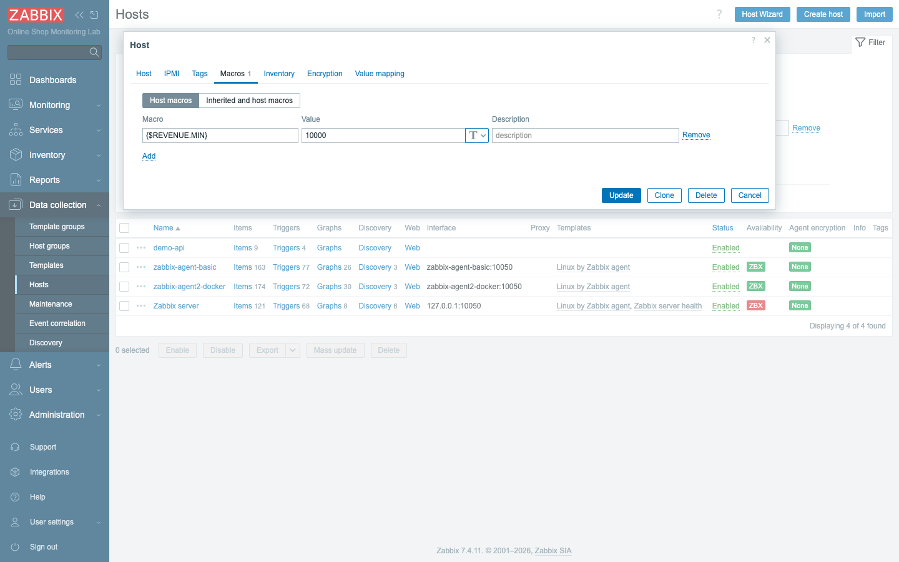
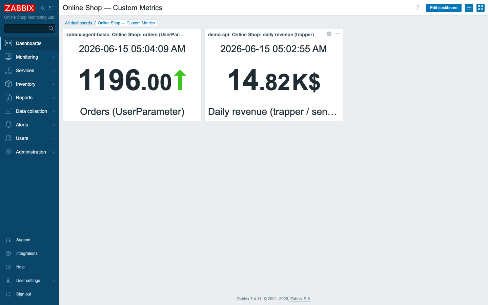

# Module 11: Custom Data Collection

## Learning Objectives

By the end of this module you will be able to push Zabbix past the boundary of
its built-in templates and teach it to watch numbers that no template could ever
ship with — numbers that belong to *your* business and no one else's. Concretely,
you will collect a custom metric with an agent **UserParameter** (a script you
write yourself), **push** a metric into Zabbix with **zabbix_sender** and a
**trapper** item, recognize the moments when an HTTP agent item is the better
choice instead, parameterize your checks with **user macros** so the same trigger
can serve many hosts, and — most importantly — develop the judgment to choose the
right collection method for a given metric rather than reaching for whichever one
you happen to remember.

## Topics

### Why custom collection — the Online Shop's own numbers

Up to this point in the course, the templates have done a great deal of work for
you. Link a template to a host and you immediately get CPU, memory, and disk
metrics, all named, typed, and graphed without your writing a single line. That
generosity has a limit, though, and the limit is worth stating plainly: a
template knows how to watch a *machine*, but it knows nothing whatsoever about
*your business*. It cannot tell you how many **orders** the Online Shop took in
the last hour, or what today's **revenue** is, because those numbers do not live
in `/proc` or in a kernel counter — they live inside your application, in a place
only your code can reach.

Those business numbers are often the ones management actually cares about. A
server at 80% CPU is interesting to you; a revenue figure that has flatlined since
2 p.m. is interesting to everyone. So in this module we close that gap: we teach
Zabbix to collect the Online Shop's own KPIs and treat them as first-class
metrics, sitting on the same dashboards, triggering the same kinds of alerts, and
stored in the same history as everything else. The shop has been telling its own
story all along; we are simply giving Zabbix a way to listen.

### Four ways to collect a custom metric

Before you write a single script, it helps to see the whole menu of options laid
out, because each one answers a different question about *where the value lives*
and *who should move it*. There are four practical ways to get a custom number
into Zabbix:

| Method | Direction | Best for |
|---|---|---|
| **UserParameter** (agent runs a script) | agent → server | metrics a script on the host can produce |
| **Zabbix sender → trapper item** | external → server (push) | values produced elsewhere (cron jobs, CI, batch) |
| **HTTP agent item** | server → endpoint (pull) | JSON/Prometheus APIs (Module 9) |
| **Custom Zabbix agent 2 plugin** | agent → server | reusable Go plugins (advanced) |

Read the middle column carefully, because the *direction* of data flow is the
real decision you are making. Sometimes the host itself can run a command and
produce the number on demand — that is a UserParameter, and the agent does the
work. Sometimes the value is born somewhere far from any agent — in a nightly
batch job or a CI pipeline — and the only sensible thing is for that process to
push the number in when it has it. Sometimes the data already sits behind an HTTP
endpoint and Zabbix can simply go fetch it. And sometimes, when you find yourself
writing the same kind of check over and over, you graduate to a compiled Go
plugin for Zabbix agent 2. This module concentrates on the first three; the
fourth is an advanced path you now know exists.

### UserParameters and custom scripts

The first and most common way to extend an agent is the **UserParameter**, and
the idea behind it is refreshingly simple: you invent a new **item key**, and you
tell the agent which shell command to run whenever Zabbix asks for that key. The
agent runs your command, captures whatever it prints to standard output, and
hands that back to the server as the metric's value. A new key, a command of your
choosing — that is the entire mechanism.

A plain UserParameter maps one fixed key to one fixed command. A **flexible**
UserParameter is more useful: it uses `[*]` in the key so that it can accept
arguments, which you then pass into the command as `$1`, `$2`, and so on. That
lets one definition serve a family of related metrics. Ours runs a small script
that returns one field of the Online Shop API, and the field name is the argument:

```ini
# /etc/zabbix/zabbix_agentd.d/online_shop.conf
UserParameter=app.shop[*],/usr/local/bin/online_shop.sh $1
```

```sh
# /usr/local/bin/online_shop.sh  (returns one numeric field)
field="$1"
wget -qO- http://demo-api:5000/metrics | grep -oE "\"${field}\":[0-9]+" | grep -oE '[0-9]+'
```

So `app.shop[orders]` runs the script with `orders`, and the agent returns the
number. The agent must **reload** the configuration to pick up a new
UserParameter. In our Docker lab the script and `.conf` are mounted into the
agent and you **recreate the container**; on a traditional host you would drop the
files in place and restart the agent service — the same idea.

The point of that last sentence is worth holding onto, because it is the seam
between the lab and the real world. The *mechanism* — a key, a command, a reload
— is identical everywhere Zabbix runs. Only the delivery of the files differs:
mounted into a container here, copied onto a disk there. Learn the mechanism once
and it travels with you.

### Zabbix sender and trapper items (the push model)

Not every number can be produced on demand by an agent sitting on the host.
Sometimes the value is born *somewhere else entirely* — at the end of a nightly
job, inside a CI pipeline that only runs on commits, or in a callback from a
payment processor that fires when a settlement clears. There is no sensible script
to poll for these, because the value simply does not exist until the moment that
process decides to produce it. For these, Zabbix turns the usual relationship
inside out: instead of the server reaching out and asking, the server sits and
waits to be told.

The item that waits is a **trapper** item (type *Zabbix trapper*). It has no
interval and it never polls anything; it does nothing at all until a value is
**sent** to it with the command-line tool **`zabbix_sender`**:

```bash
zabbix_sender -z zabbix-server -s demo-api -k app.revenue.daily -o 14820
```

This is the most flexible method: anything that can run one command can feed
Zabbix. The trapper item's **Allowed hosts** field restricts who may send.

Read the flags once and the rest is obvious: `-z` names the server to send to,
`-s` names the host the value belongs to, `-k` is the item key, and `-o` is the
value. That is the whole interface. Because it is just a command, you can put it
at the end of any script, in any language, on any machine that can reach the
server — which is exactly why this method is so reaching. And because that
openness could be abused, the trapper item's **Allowed hosts** field is your gate:
only the senders you name are permitted to write to it.

### Active vs passive, applied to custom checks

The active/passive distinction you met back in Module 7 does not go away when you
move to custom metrics — it reappears in a new costume. A UserParameter can be
polled **passively** (server asks, as we do here) or run as an **active** check
(agent pushes on a schedule) — the same active/passive choice from Module 7.
Trapper items are inherently push; HTTP agent items are pull. Match the direction
to where the data lives and how your network is shaped.

That last instruction is the whole game. If your agents cannot accept inbound
connections but can make outbound ones, active checks and trappers fit the shape
of your network; if the server can freely reach your hosts, passive polling is
simpler. The metric's *content* does not decide this — your *topology* does.

### Macros in custom checks

There is one more piece to add before the metrics are genuinely production-grade,
and it is the difference between a check that works once and a check you would
willingly copy onto a hundred hosts. **User macros** (`{$NAME}`) are named,
reusable values. They keep checks and triggers generic: define a threshold once
on the host (or template) and reference it everywhere. We add `{$REVENUE.MIN}` on
`demo-api` and use it in a trigger so the target revenue is configurable per host
without editing the expression.

Think of a macro as a named dial rather than a hard-coded number baked into the
trigger. Without it, "alert when daily revenue drops below 10000" means editing
the trigger expression itself every time a different shop has a different target —
tedious and error-prone. With `{$REVENUE.MIN}` standing in for the number, the
expression never changes; you simply turn the dial on each host. This is the
single habit that makes templates scale, and you will lean on it heavily when you
reach template design in Module 18.

## Docker-Based Demonstration

The instructor shows all three live paths for the Online Shop's KPIs: a
**UserParameter** (`app.shop[orders]`) returning the order count from a script on
the agent, a **trapper** item (`app.revenue.daily`) fed a value with
`zabbix_sender`, and a reminder that the Module 9 **HTTP agent** items are a third
custom method. All three land in **Latest data** and on a dashboard, tagged by
their `source`.

## Hands-On Lab

1. **Review the custom script and UserParameter.** In the repo, open
   `content/lab/agent-userparams/online_shop.sh` and `online_shop.conf`. The
   `compose_lab.yaml` file mounts them into `zabbix-agent-basic` at
   `/usr/local/bin/online_shop.sh` and `/etc/zabbix/zabbix_agentd.d/online_shop.conf`.
   **Expected:** you understand that the agent will run `online_shop.sh <field>`
   for the key `app.shop[<field>]`.

2. **Load the UserParameter (recreate the agent).** Recreating the container is
   how the agent rereads its configuration directory and discovers your new key.
   ```bash
   docker compose -f compose_lab.yaml up -d zabbix-agent-basic
   ```
   **Expected:** the agent restarts with the new configuration. *(On a real host
   you would instead copy the files and run `zabbix_agentd -R userparameter_reload`
   or restart the service.)*

3. **Test the UserParameter directly** — before involving Zabbix at all. Proving
   the script works on its own isolates the agent side so you never debug two
   layers at once:
   ```bash
   docker exec zabbix-server zabbix_get -s zabbix-agent-basic -k 'app.shop[orders]'
   ```
   **Expected:** a number (the current order count). If this works, the agent side
   is correct and any remaining problem is in Zabbix configuration.

4. **Create the matching item.** On host `zabbix-agent-basic`, create an item.
   Notice that a UserParameter item is just an ordinary Zabbix agent item — your
   custom key is the only thing that distinguishes it:
   - **Name:** `Online Shop: orders (UserParameter)`
   - **Type:** `Zabbix agent`
   - **Key:** `app.shop[orders]`
   - **Type of information:** `Numeric (unsigned)`
   - **Tags:** `component=business`, `source=userparameter`

   **Expected:** within ~1 minute the item shows the order count in Latest data.

   

5. **Push a metric with zabbix_sender (trapper item).** On host `demo-api`, create
   a **Zabbix trapper** item:
   - **Name:** `Online Shop: daily revenue (trapper)`
   - **Key:** `app.revenue.daily`
   - **Type of information:** `Numeric (unsigned)`, **Units** `$`

   Then push a value — this is the moment the trapper item finally receives
   something to store:
   ```bash
   docker exec zabbix-server zabbix_sender -z zabbix-server -s demo-api -k app.revenue.daily -o 14820
   ```
   **Expected:** `zabbix_sender` reports `processed: 1; failed: 0`, and the value
   appears in Latest data. A trapper item has no interval and **Test/Execute now
   are disabled** — it only receives.

   

6. **See both custom metrics in Latest data.** Go to **Monitoring → Latest data**
   and filter **Name** to `Online Shop:`. Seeing them side by side proves that two
   completely different collection paths land in the same place:
   **Expected:** the UserParameter `orders` (on `zabbix-agent-basic`) and the
   trapper `daily revenue` (on `demo-api`), each tagged with its `source`.

   

7. **Add a macro and a trigger on a custom metric.** On host `demo-api`, open the
   **Macros** tab and add `{$REVENUE.MIN}` = `10000`. Then create a trigger that
   reads the dial rather than a hard-coded number:
   - **Name:** `Online Shop: daily revenue below target ({$REVENUE.MIN})`
   - **Severity:** **Warning**
   - **Expression:** `last(/demo-api/app.revenue.daily)<{$REVENUE.MIN}`

   **Expected:** the trigger uses the macro for its threshold, so the target is
   configurable per host without touching the expression. (At `14820 > 10000` it
   stays OK; send a smaller value to see it fire.)

   

8. **Show the metrics on a dashboard.** Create a dashboard
   `Online Shop — Custom Metrics` with two **Item value** widgets — one for the
   `orders` UserParameter item, one for the `daily revenue` trapper item.
   **Expected:** a dashboard displaying your business KPIs alongside everything
   else Zabbix collects.

   

## Expected Outcome

Participants can extend Zabbix with their own metrics three ways — a UserParameter
script run by the agent, values pushed with `zabbix_sender` into a trapper item,
and HTTP agent items (Module 9) — parameterise checks and triggers with user
macros, and decide which method fits a given source.
