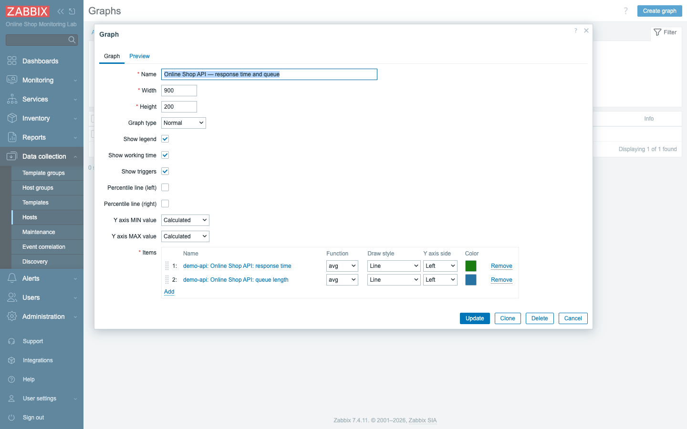
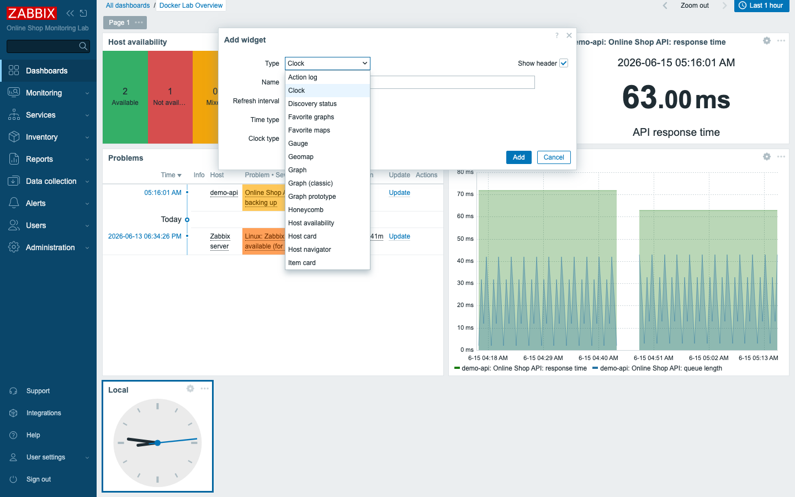
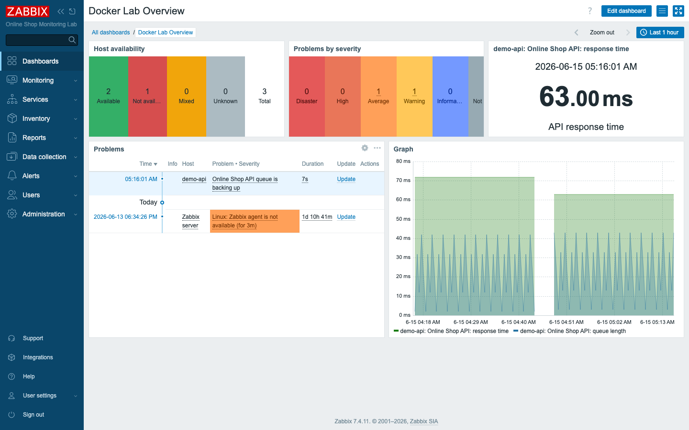
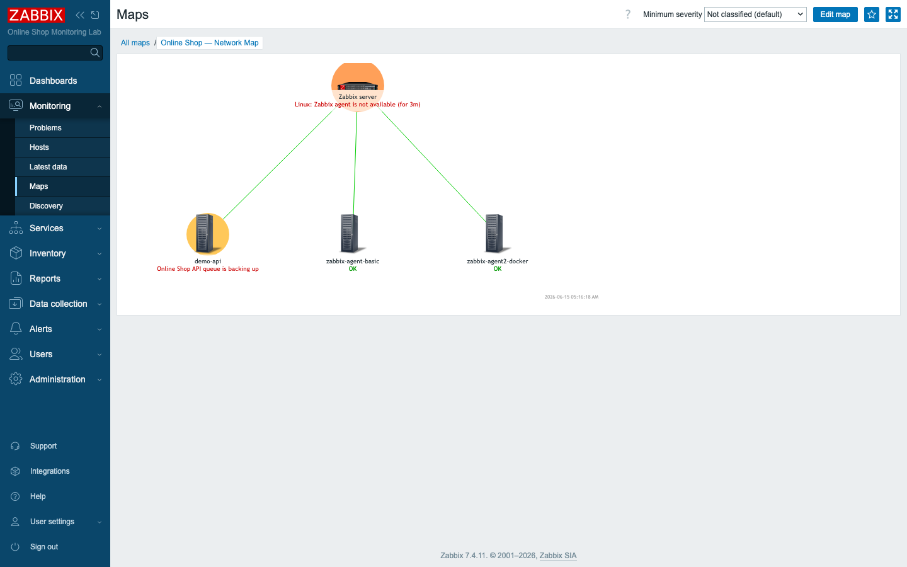

# Module 12: Visualization Tools

## Learning Objectives

By the end of this module you will be able to turn the Online Shop's collected
metrics into views that people actually look at and act on. You will build
ad-hoc and **classic graphs**, assemble **dashboards** out of widgets (Problems,
Host availability, Item value, Graph, Problems by severity), and draw a
status-aware **network map** that colors itself as the lab's health changes. And
you will be able to explain — in a way that shapes every dashboard you ever build
— the difference between an **operational** dashboard aimed at the people fixing
things and a **management** dashboard aimed at the people deciding things.

## Topics

### From numbers to a view

Up to this point everything you have collected about the Online Shop has lived in
Latest data as rows of numbers. That is fine for a single lookup, but it is a poor
way to understand a system at a glance. Humans absorb *pictures* far faster than
they read tables: a rising line, a red square, a gauge near the top of its range —
the eye catches these in an instant, where it would take seconds to parse the same
truth out of a column of digits. Visualization is the step where monitoring stops
being a data store and becomes something *useful*: the goal is that one glance at
one screen answers the only two questions that really matter in the moment — "is
everything OK, and if not, where?" This module builds the Online Shop's first
real dashboards, graphs, and map, the views you and your colleagues will keep
open on a second monitor.

### Latest data and graphs

You already met **Latest data** back in Module 3 — it is the raw table, the
unadorned list of every item and its most recent value. From that table you can do
something immediately useful: select one or more numeric items and click **Display
graph** to get a quick **ad-hoc graph**. This is the fastest way to eyeball a
metric over time, and you used it in Module 4. An ad-hoc graph is throwaway by
design — you build it in the moment to answer a question, then you close it. There
is nothing to save and nothing to name.

A **classic graph** is the opposite: it is a *saved, configured* chart that you
define once and reuse. You pick several items, give each one a color, choose its
draw style (line, filled, or bars), and decide which side of the Y-axis it belongs
to, and Zabbix renders them together as a single named object. Because a classic
graph is a configuration object rather than a momentary view, it lives per host
under **Data collection → Hosts → Graphs**, and from there you can drop it onto
dashboards or pull it into reports. Think of the ad-hoc graph as a question you
ask out loud, and the classic graph as an answer you write down so you never have
to ask again.

### Dashboards and widgets

A **dashboard** is a grid of **widgets**, and each widget shows exactly one thing.
That one-widget-one-job discipline is what keeps a dashboard readable: rather than
a single cluttered screen trying to say everything, you compose small focused
panels that each answer a narrow question, and the layout itself tells the story.
Zabbix ships many widget types, and a handful of them you will reach for
constantly:

- **Problems** — the live problem list (what is wrong now).
- **Problems by severity** — counts per severity (the health "traffic lights").
- **Host availability** — how many hosts are up / down / unknown.
- **Item value** — one metric as a big number (a KPI).
- **Graph** — an SVG time-series chart (one or more items).
- plus Clock, Gauge, Geomap, Top hosts, Maps, and more.

Each of these is a different *question*: Problems answers "what is broken?", Host
availability answers "how much of the fleet is reachable?", Item value answers
"what is this one number right now?", and Graph answers "how has this been
trending?" A good dashboard is a deliberate set of such questions arranged so the
most urgent one lands first.

### Maps

A **map** (Monitoring → Maps) is a picture of your infrastructure — icons for
hosts, lines for the links between them — that **colors itself by status**. When a
host has an active problem the map highlights it and surfaces the problem text
right there on the icon; when everything is healthy it stays calm. This is a very
different kind of view from a graph or a problem list, because it carries
*topology*: it shows not just that something is wrong but where it sits in
relation to everything else, so you can see at a glance whether the red thing is
an isolated leaf or a hub that half your services depend on. Maps answer "what is
the topology, and where is the red?" in a single look, which is exactly what you
want for network and service overviews where layout itself is information.

### Dashboard design: operational vs management

Here is a truth that shapes everything you build from now on: the same data serves
two very different audiences, and trying to serve both with one dashboard serves
neither well. The split is between operational and management views.

- An **operational dashboard** is for the people fixing things: dense, live,
  detailed — current problems, graphs, queues, host availability. Refreshes
  often; optimised for *action*.
- A **management dashboard** is for stakeholders: sparse, high-level — SLA %,
  service status, trends. Optimised for *reassurance and decisions*.

The engineer on call wants every detail, refreshing every few seconds, because
their job is to find the broken thing and fix it. The director wants a single
reassuring screen — green means we are meeting our promises, a number means we are
trending the right way — because their job is to decide, not to debug. Feed the
director the operational dashboard and they drown; feed the engineer the
management dashboard and they are blind.

A few design rules follow from this and are worth internalizing: one purpose per
dashboard, the most important thing top-left where the eye lands first, related
widgets grouped together, no cramming, and severity colors used consistently so
red always means the same thing. The course's canonical dashboards (*Docker Lab
Overview*, *Web and API Monitoring*, *Zabbix Health*, *Business SLA*,
*Troubleshooting*) each exist precisely because each has one clear job.

## Docker-Based Demonstration

The instructor builds an **operational** dashboard for the lab — *Docker Lab
Overview* — combining Host availability, Problems by severity, an Item value KPI
(API response time), a live Problems list, and an SVG Graph of the API's response
time and queue. Then a classic graph and a network map of the lab hosts, showing
how each visual answers a different question.

## Hands-On Lab

> We visualise data that already exists (agent metrics, the `demo-api` metrics,
> and the triggers from Modules 9–11). Database and business-service dashboards
> come once that data exists (Modules 22 and 28).

Everything you assemble below draws on data the Online Shop is already producing,
so each step is about *presentation*, not collection — you are giving existing
numbers a shape the eye can use.

1. **Make an ad-hoc graph.** In **Monitoring → Latest data**, filter to `demo-api`,
   tick **Online Shop API: response time** and **queue length**, and click
   **Display graph**. This is the quickest possible way to see two metrics side by
   side and confirm they are moving the way you expect.
   **Expected:** a quick line graph of both metrics over the last hour.

2. **Create a classic graph.** Go to **Data collection → Hosts**, click **Graphs**
   on `demo-api`, then **Create graph**:
   - **Name:** `Online Shop API — response time and queue`
   - Add two **Items**: *response time* (colour green) and *queue length*
     (colour blue), both **Draw style: Line**.

   **Add.** Because this graph is saved and named, you can now reuse the exact same
   chart on any dashboard or report instead of rebuilding it each time.
   **Expected:** a saved graph you can reuse on dashboards (see the graph builder
   above).

3. **Create an operational dashboard.** Go to **Dashboards → All dashboards →
   Create dashboard**, name it `Docker Lab Overview`, then **+ Add** these widgets:
   - **Host availability**
   - **Problems by severity**
   - **Item value** → the `demo-api` *response time* item (a KPI number)
   - **Problems** (filter to your lab host groups)
   - **Graph** → a data set for the `demo-api` *response time* and *queue* items

   **Save changes.** Notice how the five widgets together cover the full operational
   question — what is up, what is wrong and how badly, the one number that matters,
   the live problem list, and the trend behind it.
   **Expected:** a single screen answering "is everything OK?" — availability,
   severity counts, a KPI, the live problem list, and a trend graph.

   

4. **Create a network map.** Go to **Monitoring → Maps → Create map**, name it
   `Online Shop — Network Map`, open it, and add host elements for `zabbix-server`,
   `demo-api`, `zabbix-agent-basic`, and `zabbix-agent2-docker`; link each demo/
   agent host to the server. **Update.** The links you draw are what give the map
   its topology: a glance now shows not just which host is red but where it sits.
   **Expected:** a topology that colours itself by status — hosts with active
   problems highlight and show their problem text; healthy hosts read **OK** in
   green.

   

5. **Compare the audiences.** Look at your *Docker Lab Overview* (operational) and
   sketch what a *management* version would show instead (SLA %, service status,
   fewer widgets). This is the design judgment that separates a dashboard people
   use from one they ignore.
   **Expected:** you can articulate why the same data needs two different views.

## Expected Outcome

You can build ad-hoc and classic graphs, assemble a multi-widget operational
dashboard (Problems, Host availability, Item value, Graph, Problems by severity),
create a status-aware network map, and explain operational-vs-management dashboard
design — turning the Online Shop's metrics into views people actually use rather
than rows of numbers nobody reads.
