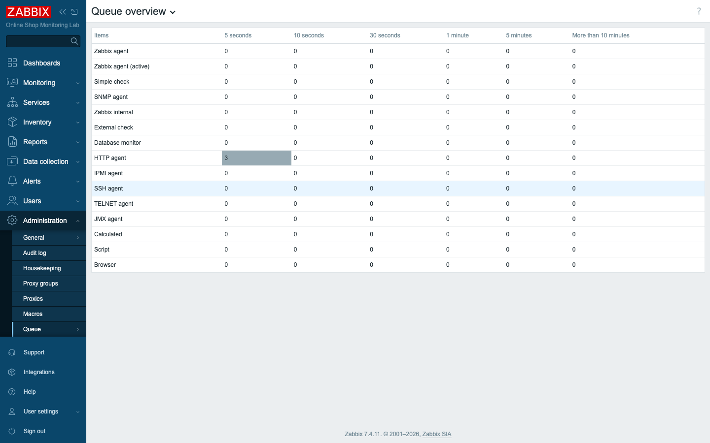
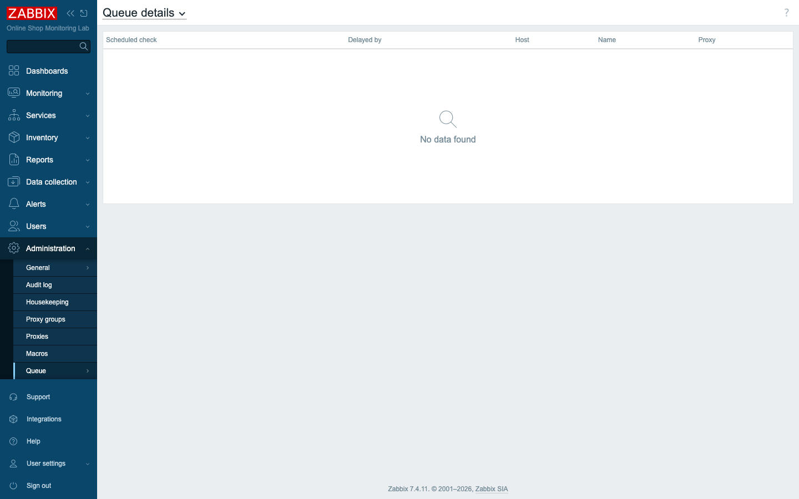
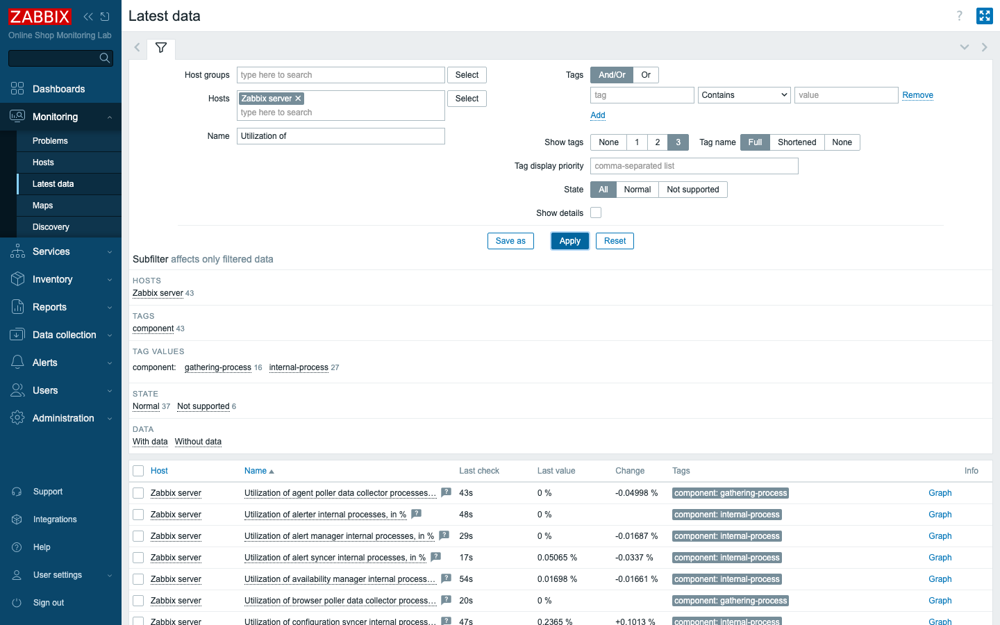
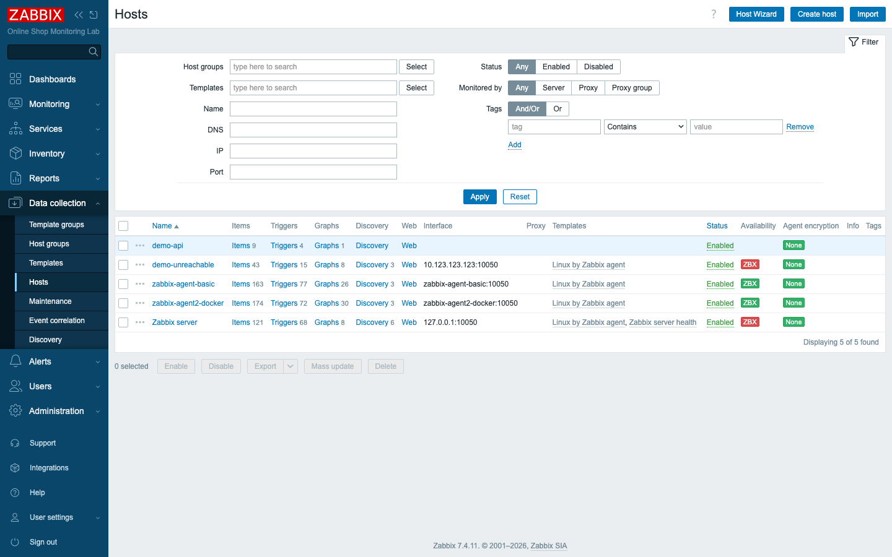

# Module 13: Understanding Zabbix Queue

## Learning Objectives

By the end of this module participants can read the Zabbix **queue**, explain why
items become delayed, name the processes that collect and process data (pollers,
unreachable pollers, trappers, preprocessors), use the server's **internal
metrics** to judge capacity, and follow a workflow to investigate data-collection
delays.

## Topics

### What is the queue?

The **queue** is the list of items that are **due to be collected but have not
been processed yet**. Open it at **Administration → Queue**. In a healthy system
the queue is **near zero** — everything is collected on time. A queue that grows,
especially into the **"More than 10 minutes"** column, means data is arriving late:
your graphs lag, and triggers evaluate on stale values. The queue is therefore an
early-warning gauge for the whole collection pipeline.

### How to read it

**Queue overview** is a matrix: each **row** is an item *type* (Zabbix agent,
Zabbix agent active, SNMP, HTTP agent, Zabbix internal, Calculated, …) and each
**column** is a delay bucket (5s, 10s, 30s, 1m, 5m, **>10m**). A number tells you
*how many* items of that type are *that* far behind. **Queue details** drills into
the individual delayed items — the exact item, host, and how long it is delayed —
so you can see *what* is stuck, not just *how much*.

### Why items become delayed

- **Unreachable hosts.** When the server cannot reach a host, its checks cannot
  complete; while the server retries, those items sit in the queue.
- **Slow checks.** A check that takes longer than its interval (a slow HTTP
  endpoint, a heavy SQL query, an SNMP device that responds slowly) falls behind.
- **Not enough collectors.** Too few pollers for the number/frequency of items —
  the classic capacity problem.
- **A slow proxy.** A proxy that cannot keep up delays everything behind it
  (Module 14).
- **Preprocessing backlog.** If values arrive faster than preprocessing can
  transform them, the **preprocessing queue** grows.

### The processes that move data

- **Pollers** actively *pull* values (passive agent, SNMP, HTTP, …). In modern
  Zabbix many pollers are **asynchronous**, so one slow check no longer blocks the
  others — but limited poller capacity still bounds throughput.
- **Unreachable pollers** handle hosts that are currently unreachable, retrying
  them separately so they do not starve healthy hosts.
- **Trappers** receive *pushed* values (`zabbix_sender`, active agents) — there is
  no polling delay, but a trapper backlog can still form under very high volume.
- **Preprocessors** apply preprocessing steps (JSONPath, JavaScript, change-per-
  second from Module 9) before values are stored.

### Internal Zabbix metrics

The server measures *itself*. The **Zabbix server** host carries internal
`zabbix[...]` items (from the *Zabbix server health* template) that quantify
capacity:

- `zabbix[process,<type>,avg,busy]` — how **busy** each collector/process is
  (e.g. agent poller, history syncer). Sustained high values mean that process is
  a bottleneck — add more of it.
- `zabbix[preprocessing_queue]` — items waiting for preprocessing.
- `zabbix[wcache,...]`, `zabbix[rcache,...]`, `zabbix[vcache,...]` — cache usage.
- `zabbix[requiredperformance]` — required new values per second.

These are the numbers you trend and alert on for performance (Module 30).

### Unsupported items and delayed checks

**Unsupported** items (Module 9) are retried on a separate, slower schedule, so a
flood of them wastes collector time and can indirectly delay healthy items —
another reason to keep items supported.

### Performance bottlenecks

A growing queue is a *symptom*; the cause is one of the above. The diagnosis is
always "**which** item type is delayed (queue overview) → **which** items (queue
details) → **why** (unreachable? slow? under-resourced?) → fix the cause."

## Docker-Based Demonstration

The instructor opens **Administration → Queue** and shows the healthy near-zero
baseline, explains the matrix, then introduces a delay by adding an **unreachable
host** and watching it go unavailable. Finally the **internal metrics** in Latest
data show poller utilization — proving the lab has plenty of headroom (which is
*why* the queue stays empty).

## Hands-On Lab

1. **Open the queue screen.** Go to **Administration → Queue → Queue overview**.
   **Expected:** a matrix of item types and delay buckets, almost all **zero** —
   the healthy state. Note the **"More than 10 minutes"** column: anything there
   is a red flag.

2. **Look at queue details.** Switch to **Queue details**.
   **Expected:** the list of individual delayed items (likely *No data found* in
   our healthy lab) with columns *Scheduled check*, *Delayed by*, *Host*, *Name*.

3. **Create an unreachable host to cause delays.** In **Data collection → Hosts →
   Create host**, add `demo-unreachable` in *Docker Lab*, with an **Agent
   interface** to the IP `10.123.123.123` (an unroutable address) and link
   **Linux by Zabbix agent**. Save.
   **Expected:** the server tries to poll ~150 items it cannot reach; within
   ~1 minute the host's **Availability** turns red (ZBX) in the Hosts list.

   

4. **Observe the delayed items.** Re-open **Administration → Queue** straight after
   creating the host.
   **Expected:** briefly, the host's items appear in the queue under *Zabbix
   agent* while the unreachable poller retries them. *(In Zabbix 7.4, async
   pollers and the unavailable-host back-off keep this from snowballing — the
   spike is short-lived, and once the host is flagged unavailable its checks are
   suspended. A queue that **stays** high is the real warning sign.)*

5. **Review internal metrics.** In **Monitoring → Latest data**, filter Hosts to
   `Zabbix server` and Name to `Utilization of`.
   **Expected:** the per-process busy percentages — agent poller, history syncer,
   preprocessing, etc. In our small lab these are tiny (well under 1%), which is
   exactly why the queue stays empty: lots of spare capacity.

6. **Fix the problem.** Delete the `demo-unreachable` host (Data collection →
   Hosts → select → Delete).
   **Expected:** the unreachable checks stop, and the queue returns to its
   near-zero baseline.

## Expected Outcome

Participants can open and read the Zabbix queue (overview and details), explain
the processes that collect and preprocess data, identify why items get delayed,
use the server's internal metrics to judge whether pollers/preprocessors have
headroom, and follow a clear workflow to investigate and fix collection delays.

## Instructor Notes

- **Lab vs production.** Our lab is tiny, so the queue is *always* near zero — this
  is the healthy state, not a missing feature. In production with thousands of
  items, the queue and the `zabbix[process,...,busy]` metrics are watched daily;
  a sustained queue or a poller pinned near 100% is the signal to add pollers,
  add a proxy, or lengthen intervals (Module 30).
- **Why 7.4 queues do not explode.** Modern Zabbix uses **asynchronous** pollers,
  so one slow/hanging check no longer blocks a whole poller the way older versions
  did. Teach students that a *growing* queue now points to genuine
  under-provisioning or a systemic problem (a down proxy, a preprocessing
  backlog), not just one slow item.
- **Unreachable hosts are suspended, not hammered.** After a host is flagged
  unavailable, Zabbix backs off (UnavailableDelay) instead of retrying every
  interval — which is *why* the queue from a single dead host is brief. Make this
  explicit so students do not expect a giant permanent spike.
- **The diagnosis workflow is the takeaway.** Overview (which *type*?) → details
  (which *items*?) → cause (unreachable / slow / under-resourced) → fix. Drill
  this; it is the whole point of the module.
- **Keep items supported.** Tie back to Module 9: unsupported items are retried on
  a slower loop and waste collector capacity. A tidy, supported item set keeps the
  queue healthy.
- **Timing (~45 min).** ~12 min what/why of the queue, ~10 min processes
  (pollers/trappers/preprocessors), ~10 min unreachable-host demo + queue reading,
  ~8 min internal metrics, ~5 min diagnosis-workflow recap.

## Lab-State Delta

Module 13 is an **investigation** module. It temporarily created an unreachable
host (`demo-unreachable`) and a few slow/black-hole HTTP items to demonstrate
delays, then **removed them** — the reference lab is unchanged (4 hosts: Zabbix
server, zabbix-agent-basic, zabbix-agent2-docker, demo-api; queue back to
near-zero). No permanent configuration was added. Screenshots in
`content/day-2/assets/module-13/`.
