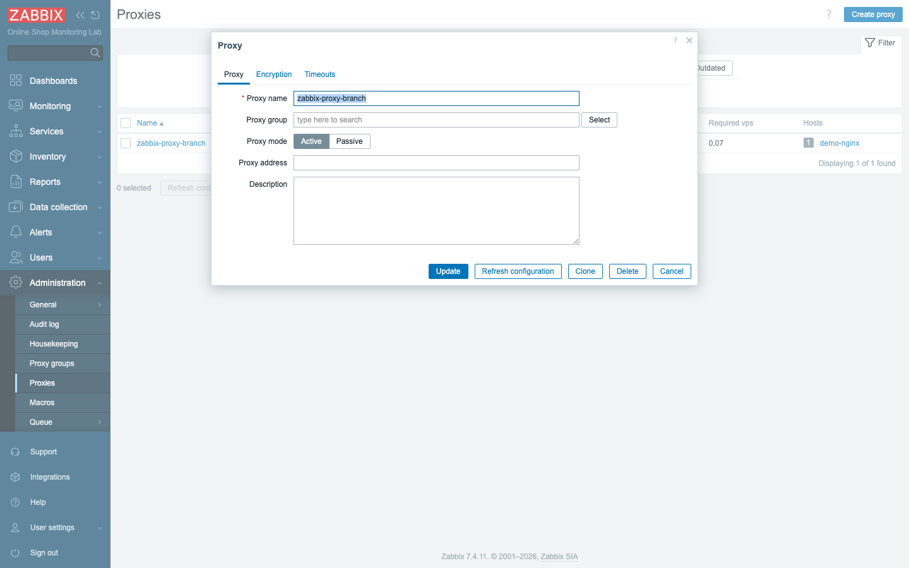
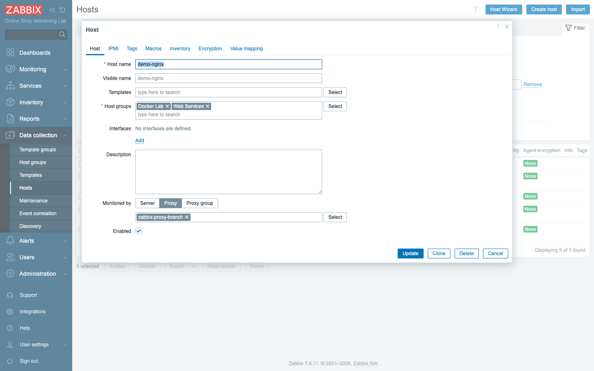
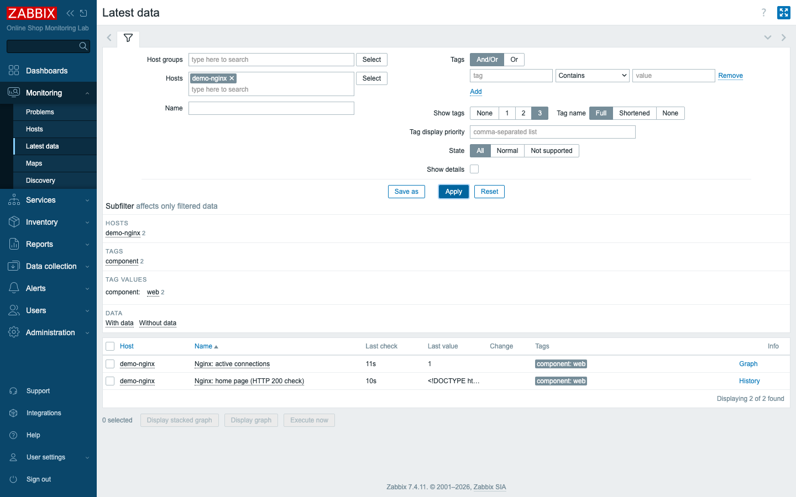
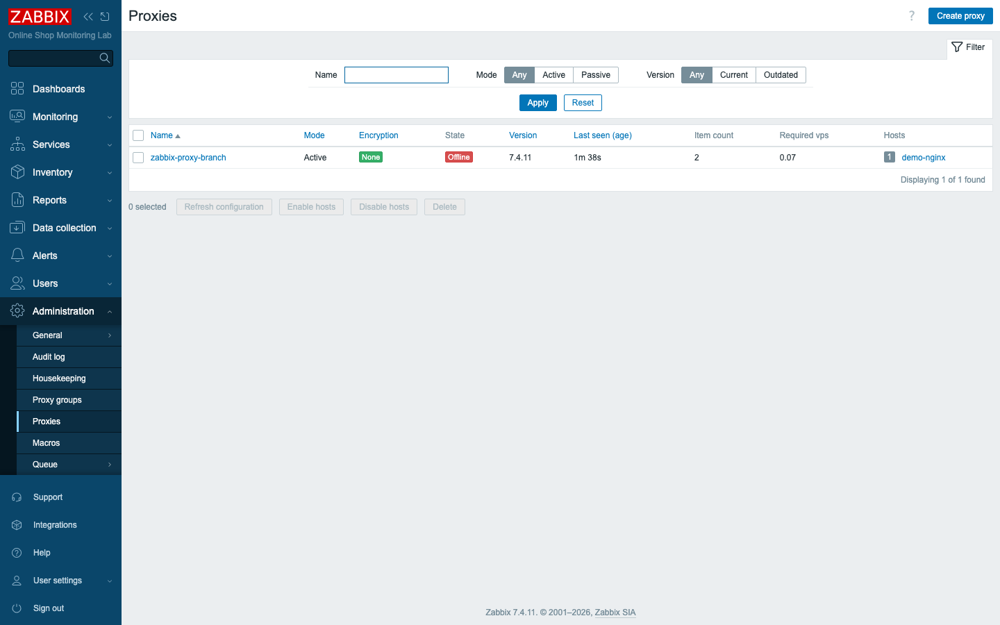

# Module 14: Working with Zabbix Proxy

## Learning Objectives

By the end of this module you will be able to explain what a Zabbix **proxy** is
and, just as importantly, when reaching for one is the right call. You will be
able to tell an **active** proxy from a **passive** one and say which situation
each fits. You will register the lab's `zabbix-proxy-branch` proxy with the
server, **assign a host to it** so that data is gathered through the proxy rather
than by the server directly, read the proxy's **health** to confirm it is doing
its job, and — the part students remember most — demonstrate exactly what happens
when a proxy goes down and then comes back, including the buffered data catching
up after the outage.

## Topics

### What is a Zabbix proxy?

Up to this point in the course, the server has done all the collecting itself: it
reaches out to each host, pulls the values, and stores them. That works fine when
the server and the hosts sit on the same friendly network, which is exactly the
situation in our single-machine Docker lab. The real world is rarely so tidy.
Hosts live behind firewalls, across slow WAN links, or in remote offices the
server cannot — or should not — poll directly. The proxy exists to handle those
cases.

A **Zabbix proxy** is a lightweight collector that does data gathering **on behalf
of the server** for a set of hosts, then forwards the results to the server in
bulk. Think of it as a deputy stationed closer to the hosts: it does the legwork
locally and reports back. What makes it more than a simple relay is that the
proxy has its **own small database** (SQLite, MySQL, or PostgreSQL) where it
**buffers** data, so if the link to the server drops, nothing is lost — the proxy
stores values and ships them when the connection returns. That buffering is the
heart of why proxies matter, and we will see it in action later in the module.
Our lab runs `zabbix-proxy-branch` (a **SQLite** proxy), which is the right
choice for a small, low-volume collector like the one a branch office would run.

### Why use a proxy? (use cases)

The question to keep in mind is not "what can a proxy do?" but "when would the
server doing the collecting itself be a problem?" A proxy is the answer whenever
the server should not — or cannot — poll hosts directly. Four situations come up
again and again:

- **Branch / remote office** — one proxy per site collects locally and sends a
  single, compressed stream to HQ instead of the server reaching across the WAN to
  every host.
- **DMZ / firewall** — hosts behind a firewall are polled by a proxy inside the
  DMZ; only the proxy→server connection crosses the boundary (one hole, not many).
- **Scale** — proxies offload collection and preprocessing from the server, so one
  server can monitor far more hosts.
- **Unstable links** — the proxy's buffer rides out network outages without data
  loss.

Notice how every one of these is really about *where the work happens*. The proxy
moves collection close to the hosts and turns many connections into one. In our
storyline, `zabbix-proxy-branch` is the **branch office** collector: it monitors
the Online Shop's web frontend (`demo-nginx`) locally and forwards to the central
server. Picture the shop's web tier running at a satellite site with only a thin
link back to headquarters — instead of the HQ server poking at that web server
over the WAN every few seconds, the branch proxy does it locally and sends one
tidy stream home.

### Active vs passive proxy

If the active-versus-passive distinction feels familiar, it should: it is the same
idea you met with agents in Module 7. The difference comes down to **who initiates
the connection**, and that single choice determines which way your firewall has to
open:

| | **Active** proxy | **Passive** proxy |
|---|---|---|
| Connection | proxy → server (10051) | server → proxy (10051) |
| Good for | proxy behind NAT/firewall (outbound only) | server reaches into a controlled network |
| Config | server just needs the proxy's **name** | server needs the proxy's **address** |

The practical consequence is worth spelling out. An **active** proxy makes the
outbound connection itself, so the server never needs to know where the proxy
lives on the network — only its name — which is perfect when the proxy sits behind
NAT or a firewall that only allows traffic out. A **passive** proxy waits to be
contacted, so the server must hold the proxy's address and reach in, which suits a
controlled network where the server is the one initiating. `zabbix-proxy-branch`
runs in **active** mode (it connects out to the server), set via `ZBX_PROXYMODE=0`
in `compose_lab.yaml`.

### Proxy health and queue

A proxy you cannot see the health of is a liability, because a silently dead proxy
means a whole set of hosts has quietly stopped reporting. The server tracks each
proxy under **Administration → Proxies**: its **mode**, **state**
(Online/Offline), **version**, **last seen** age, **item count**, and **required
VPS**. A proxy that is Offline or whose "last seen" keeps growing is not forwarding
data — that "last seen" figure is your early-warning signal, since a healthy active
proxy checks in every few seconds. Each proxy also has its **own queue** (the
buffered values waiting to be sent); a growing proxy queue means the proxy cannot
keep up or the link to the server is down. Proxy tuning is the same idea as server
tuning (Module 13): enough pollers and `DataSenderFrequency` for the load. In
other words, a proxy is a small Zabbix server in its own right, and you reason
about its capacity the same way.

## Docker-Based Demonstration

Here is the wrinkle that makes this demonstration instructive: `zabbix-proxy-branch`
is already running and *connecting* to the server, but until it is **registered**
the server rejects it (`proxy "zabbix-proxy-branch" not found`). A running proxy is
not a recognized proxy. The instructor registers it, assigns `demo-nginx` to it,
shows the `demo-nginx` data arriving **through the proxy** in Latest data, then
`docker stop zabbix-proxy-branch` to show the proxy going **Offline** and the data
stalling — and `docker start` to show recovery (and the buffered data catching up).
That stop-and-recover sequence is the payoff: it makes the proxy's buffering
visible instead of theoretical.

## Hands-On Lab

1. **Confirm the proxy is running.**
   ```bash
   docker compose -f compose_lab.yaml ps zabbix-proxy-branch
   docker logs zabbix-proxy-branch --tail 3
   ```
   Before registering anything, you want to confirm the proxy container is alive
   and actively trying to reach the server — the "not found" message is the proxy
   knocking on a door that has not yet been told its name.
   **Expected:** the container is `Up`; the log shows it trying to reach the server
   (and, until registered, the server logs `proxy "zabbix-proxy-branch" not found`).

2. **Register the proxy.** Go to **Administration → Proxies → Create proxy**:
   - **Proxy name:** `zabbix-proxy-branch` (must match the proxy's `ZBX_HOSTNAME`)
   - **Proxy mode:** **Active**

   The name match is not optional — for an active proxy, this is the only thing the
   server has to recognize it by, so a typo here means the proxy stays "not found."

   **Add.**
   **Expected:** within ~1 minute the proxy appears with **State: Online**, a
   version, and a recent "last seen".

   

3. **Check proxy health.** Look at **Administration → Proxies**.
   This is the dashboard you will return to whenever a proxy-backed host stops
   reporting; learning to read it now pays off later.
   **Expected:** `zabbix-proxy-branch` — **Active**, **Online**, version 7.4.11,
   "Last seen" a few seconds, item/host counts.

   

4. **Assign a host to the proxy.** Create a host `demo-nginx` (groups *Web
   Services* + *Docker Lab*, **no interface**). Set **Monitored by → Proxy →
   `zabbix-proxy-branch`**. Add an **HTTP agent** item, e.g.
   `Nginx: active connections` → URL `http://demo-nginx/stub_status`, with a
   regular-expression preprocessing step `Active connections: ([0-9]+)` → `\1`.
   Save.
   The host configuration is exactly what it would be if the server collected it
   directly — the single difference is the "Monitored by" choice, which reroutes
   the data path without touching anything else.
   **Expected:** the host is now collected by the proxy, not the server.

   

5. **Verify data comes through the proxy.** Go to **Monitoring → Latest data**,
   filter to `demo-nginx`.
   **Expected:** the item values appear — the **proxy** did the HTTP request to
   `demo-nginx` and forwarded the result to the server. Same data, collected one
   hop away.

   

6. **Stop the proxy and observe.**
   ```bash
   docker stop zabbix-proxy-branch
   ```
   Stopping the container simulates the branch-office WAN link going dark — the
   server has no way to reach those hosts, and the proxy is no longer there to
   forward for them.
   **Expected:** within a minute or two **Administration → Proxies** shows the
   proxy **Offline** with a growing "Last seen", and `demo-nginx`'s Latest data
   stops updating — the proxy is no longer forwarding.

   

7. **Restart and confirm recovery.**
   ```bash
   docker start zabbix-proxy-branch
   ```
   Watch closely here: the data that returns is not just new readings but also the
   values the proxy kept gathering and storing while it was cut off — this is the
   buffering feature delivering on its promise.
   **Expected:** the proxy returns to **Online**, and `demo-nginx` data resumes —
   including any values the proxy **buffered** in its SQLite database while it was
   cut off (no gap from a brief outage).

## Expected Outcome

You can explain proxy architecture and use cases, distinguish active and passive
proxies, register a proxy, move a host's collection onto a proxy, verify data
flows through it, read proxy health, and demonstrate the proxy's buffer-and-forward
behavior across an outage — which means you can now reason about monitoring a
distributed Online Shop, not just one that happens to live on a single network.
