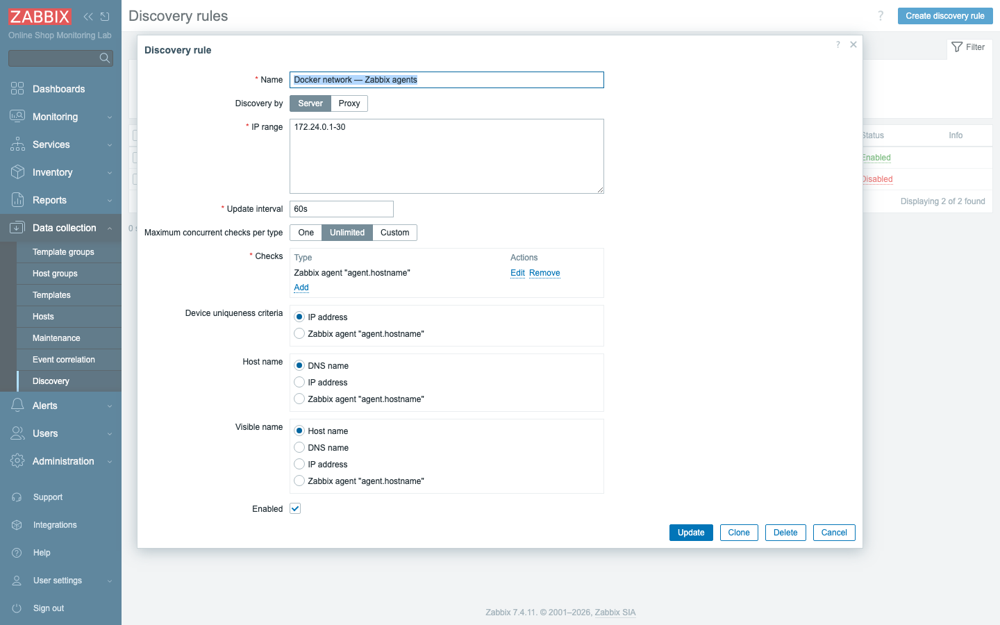
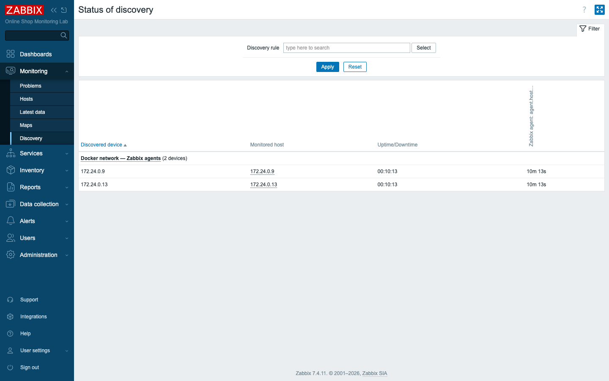
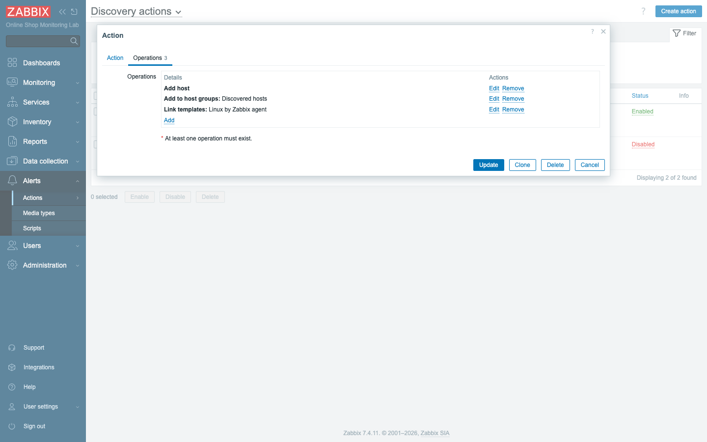
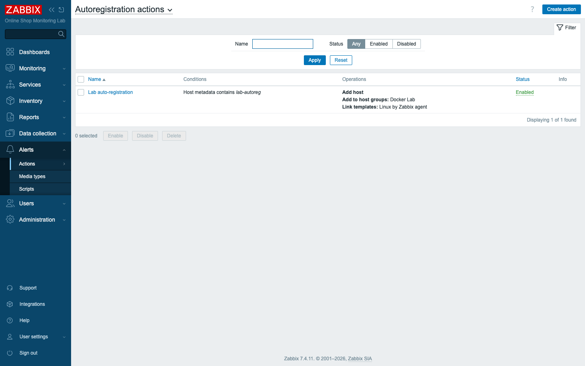
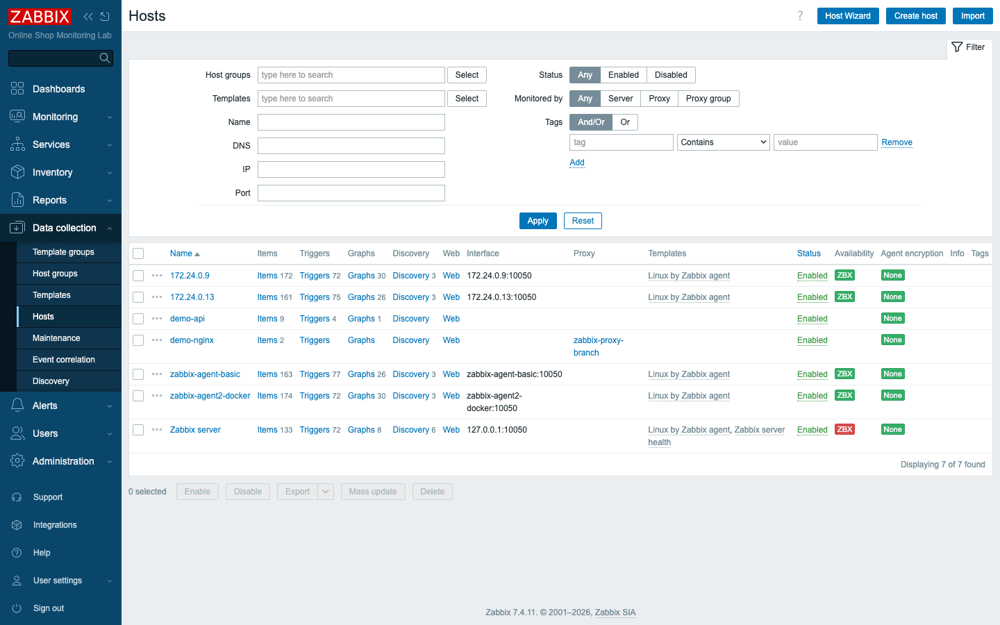

# Module 15: Network Discovery

## Learning Objectives

By the end of this module participants can onboard hosts **automatically** two
ways: server-initiated **network discovery** (scan an IP range, find services,
and act on what is found) and agent-initiated **auto-registration** (active agents
announce themselves with metadata). They can write a discovery rule with checks,
read the discovery status, and build discovery/auto-registration **actions** that
add hosts, place them in groups, and link templates with **zero clicks per host**.

## Topics

### Two ways to add hosts without clicking

Adding hosts by hand does not scale. Zabbix automates it from both directions:

| | **Network discovery** | **Auto-registration** |
|---|---|---|
| Who starts it | the **server** (or a proxy) scans | the **active agent** connects in |
| How it finds hosts | probes an **IP range** for services | the agent **announces itself** |
| You configure | a **discovery rule** + discovery action | an agent with metadata + an autoreg action |
| Best for | sweeping a known network/subnet | hosts that come and go (cloud, autoscaling) |

Both end the same way: an **action** decides what to do with each new host.

### Network discovery rules

A **discovery rule** (Data collection → Discovery) defines **what to scan and how**:

- **IP range** — e.g. `172.24.0.1-30` (single IPs, ranges, or CIDR).
- **Checks** — one or more probes per IP: **Zabbix agent** (a key like
  `agent.hostname`), **SNMP**, **HTTP/HTTPS**, **TCP**, **ICMP ping**, SSH, etc.
  Each check is a "is this service here?" test.
- **Update interval** — how often to re-scan.
- **Device uniqueness** and **host naming** — whether a discovered device is keyed
  by IP or by an agent value, and what the created host is named (DNS, IP, or an
  agent value).



### Discovery status

While the rule runs, **Monitoring → Discovery** shows every device found, which
**services** are up/down on it, and for how long. It is the live picture of what
the scan sees on the network.



### Discovery actions: conditions and operations

A discovery rule only *finds* things; a **discovery action** (Alerts → Actions →
Discovery actions) *acts*. Like trigger actions (Module 10) it has:

- **Conditions** — when to act, e.g. *Discovery status = Up* and/or *Service =
  Zabbix agent*, *Discovery rule = …*, *received value matches …*.
- **Operations** — what to do: **Add host**, **Add to host groups**, **Link
  templates**, enable/disable, set inventory, even run a script.

Our action adds each discovered agent to *Discovered hosts* and links *Linux by
Zabbix agent* — so a freshly discovered machine arrives fully monitored.



### Auto-registration and agent metadata

The agent-initiated path (introduced in Module 7): an **active** agent with
`ServerActive` set connects to the server and may carry **`HostMetadata`** (a label
describing what it is — e.g. `lab-autoreg`, `web`, `db`). An **autoregistration
action** (Alerts → Actions → Autoregistration actions) matches on that metadata
and runs the same kind of operations — add host, group, link template. This is
ideal for hosts that appear dynamically: each one registers itself the moment its
agent starts.



## Docker-Based Demonstration

Our Docker network *is* the "small network" to discover. The instructor creates a
discovery rule that scans `172.24.0.1-30` for a **Zabbix agent**, shows the two
agent containers appearing under **Monitoring → Discovery**, then builds a
discovery action that **adds and templates** them automatically — and contrasts it
with the Module 7 **auto-registration** action, where a new agent container
onboards itself.

## Hands-On Lab

1. **Create a discovery rule.** Go to **Data collection → Discovery → Create
   discovery rule**:
   - **Name:** `Docker network — Zabbix agents`
   - **IP range:** `172.24.0.1-30`
   - **Update interval:** `60s`
   - **Checks → Add:** *Zabbix agent*, Key `agent.hostname`, Port `10050`

   **Add.**
   **Expected:** the rule is saved and starts scanning the range.

2. **Discover the agents.** After a minute, open **Monitoring → Discovery**.
   **Expected:** the rule lists the discovered devices — `172.24.0.9` and
   `172.24.0.13` (the two agent containers) — with the **Zabbix agent** service
   **Up**.

3. **Create a discovery action.** Go to **Alerts → Actions → Discovery actions →
   Create action**:
   - **Name:** `Auto-onboard discovered Zabbix agents`
   - **Conditions:** *Discovery status = Up*
   - **Operations:** **Add host**; **Add to host groups** → *Discovered hosts*;
     **Link templates** → *Linux by Zabbix agent*

   **Add** (and ensure it is **Enabled**).
   **Expected:** the action will fire for each discovered, up agent.

4. **Watch hosts appear — automatically added and templated.** After the next
   discovery cycle, open **Data collection → Hosts** (filter to *Discovered
   hosts*).
   **Expected:** new hosts (named by IP, `172.24.0.9` / `172.24.0.13`) appear with
   the **Linux by Zabbix agent** template linked and a green **ZBX** — onboarded
   with no manual configuration.

   

5. **Test auto-registration with a new agent container.** This is the other path
   (Module 7). With the `Lab auto-registration` action in place (metadata contains
   `lab-autoreg`), start a fresh agent that announces itself:
   ```bash
   docker run -d --name demo-newhost --network zabbix-lab \
     -e ZBX_SERVER_HOST=zabbix-server \
     -e ZBX_HOSTNAME=demo-newhost \
     -e ZBX_METADATA=lab-autoreg \
     zabbix/zabbix-agent:alpine-7.4-latest
   ```
   **Expected:** within ~1–2 minutes `demo-newhost` appears in **Data collection →
   Hosts** — added by the *autoregistration* action, not by a scan. The agent
   onboarded **itself**.

6. **Clean up the demo.**
   ```bash
   docker rm -f demo-newhost
   ```
   Then delete the discovered/registered demo hosts you do not want to keep.
   **Expected:** the lab returns to its real hosts.

## Expected Outcome

Participants can build a network discovery rule with checks, read discovery status,
write discovery actions (conditions + operations) that add and template hosts
automatically, and explain and demonstrate agent auto-registration — so onboarding
hundreds of hosts becomes a configuration task, not a clicking task.

## Instructor Notes

- **Lab vs production.** We scan a tiny Docker subnet; in production you scan real
  VLANs/subnets and discover SNMP devices, web servers, and agents across a site.
  The rule, checks, and actions are identical — only the IP ranges and check types
  grow.
- **Discovery vs auto-registration — when to use which.** Discovery suits a
  *known network you sweep* (you control the IP plan). Auto-registration suits
  *hosts that appear on their own* (cloud instances, containers, autoscaling) and
  needs no IP list. Many sites use both. Make students articulate the difference.
- **Beware re-discovering already-monitored hosts.** In our lab the discovered
  agents are *already* monitored by DNS name, so the action created IP-named
  duplicates — useful to show the mechanism, but a real rule is scoped (by IP
  range and action conditions) so it only onboards *new* devices. *(For this
  reason the reference lab keeps the rule and action **disabled** after the demo;
  enable them to reproduce it.)*
- **Conditions keep actions safe.** Always scope a discovery action — by rule, by
  service, by IP range, by received value — so it does not sweep in things you did
  not intend. An over-broad action that adds everything is a classic mistake.
- **Metadata is the auto-registration key.** `HostMetadata` is how one
  autoregistration action can sort agents into the right groups/templates
  (`web` → web template, `db` → db template). Tie back to Module 7.
- **Timing (~45 min).** ~12 min discovery vs auto-registration + rules/checks,
  ~13 min build rule + read discovery status, ~12 min discovery action + auto-add,
  ~5 min auto-registration demo, ~3 min recap.

## Lab-State Delta

Added in Module 15 (kept as **disabled** reference examples; demo hosts removed):

- **Discovery rule:** `Docker network — Zabbix agents` (druleid `3`) — scan
  `172.24.0.1-30`, **Zabbix agent** check `agent.hostname`:10050, 60s. Left
  **disabled** so it does not re-discover the already-monitored agents.
- **Discovery action:** `Auto-onboard discovered Zabbix agents` (actionid `8`,
  eventsource 1) — condition *Discovery status = Up*; ops add host + *Discovered
  hosts* + link *Linux by Zabbix agent*. Left **disabled**.
- **Demonstrated then reverted:** the action auto-added hosts `172.24.0.9` /
  `172.24.0.13` (Linux template, green) — **deleted** after capture. Lab back to 5
  hosts. (Auto-registration uses the existing Module 7 `Lab auto-registration`
  action.) Screenshots in `content/day-2/assets/module-15/`.
