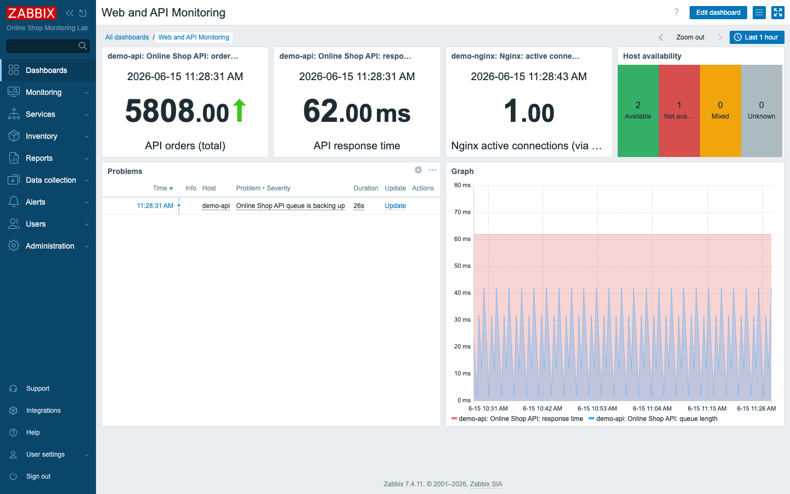
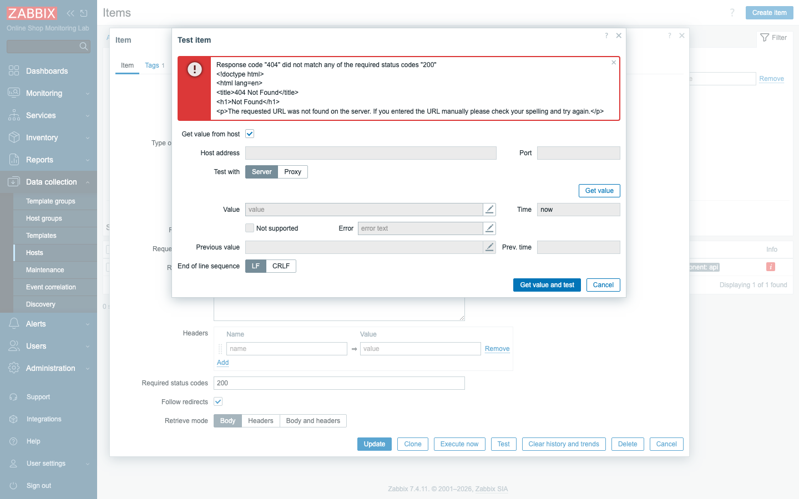
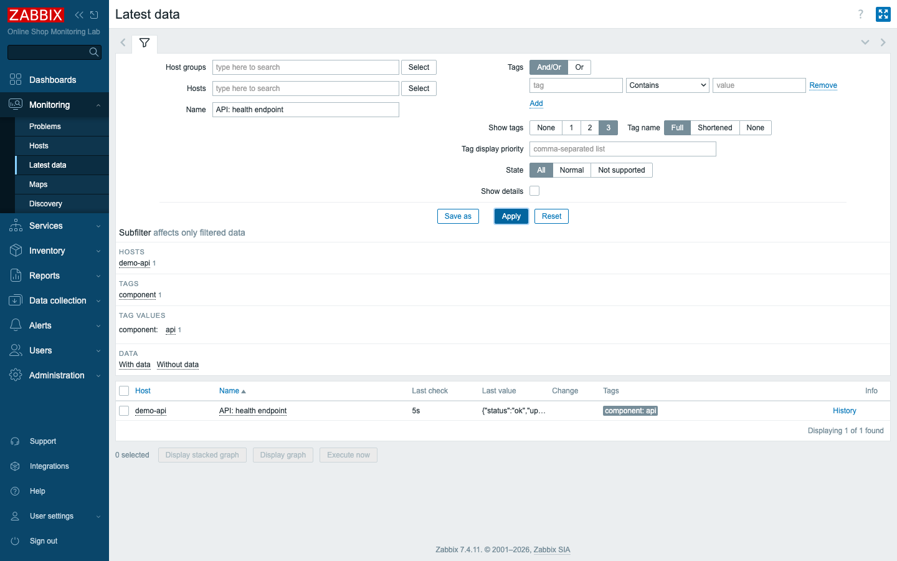
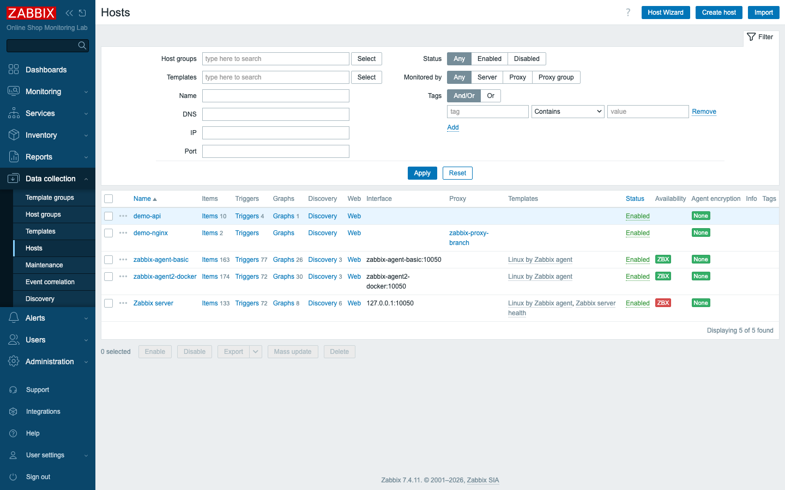

# Module 16: Practical Lab — Day 2

## Learning Objectives

By the end of this capstone participants can assemble everything from Day 2 into a
realistic monitoring setup for the Online Shop's application tier: monitor the API
with HTTP agent items and JSON extraction, alert on it with triggers, visualise it
on a consolidated dashboard, collect a host through a proxy, onboard hosts with
discovery/auto-registration, and **troubleshoot a broken item end to end**.

## Lab Scenario

Day 2 added the application layer to the Online Shop monitoring. This lab is the
**checkpoint**: you confirm each capability works together and produce a single
dashboard a team could actually watch — then prove you can diagnose and fix a
broken check, the real test of an operator.

Everything you need was built in Modules 9–15; here you tie it together:

| Capstone task | Built in | Verify |
|---|---|---|
| Monitor an API container | Module 9 | `demo-api` host collecting |
| HTTP agent items + JSON extraction | Module 9 | master `api.metrics.raw` + dependent items |
| Create triggers | Module 10 | API unreachable / queue / failed-payments |
| Create dashboards | Module 12 | build *Web and API Monitoring* |
| Add a proxy + monitor a host through it | Module 14 | `demo-nginx` via `zabbix-proxy-branch` |
| Discovery / auto-registration | Module 15 | discovery rule + autoreg action |
| **Troubleshoot one broken item** | this lab | diagnose + fix the health check |

## Docker-Based Demonstration

The instructor walks the assembled picture: `demo-api`'s JSON metrics and triggers,
`demo-nginx` collected through the proxy, the discovery/auto-registration paths,
then builds the consolidated **Web and API Monitoring** dashboard and finishes with
a live troubleshooting exercise on a deliberately broken HTTP item.

## Hands-On Lab

### A. Confirm the Day 2 monitoring (Modules 9–15)

1. **API monitoring + JSON extraction.** In **Monitoring → Latest data**, filter to
   `demo-api`.
   **Expected:** the master `Online Shop API: raw metrics (JSON)` plus the
   dependent items extracted from it (orders, queue length, response time,
   orders/second) — one HTTP request feeding many metrics.

2. **Triggers.** In **Data collection → Hosts → Triggers** on `demo-api`.
   **Expected:** your Module 10 triggers exist — *API is unreachable* (High),
   *queue is backing up* (Warning, with recovery expression + dependency),
   *failed-payment rate is high* (Average).

3. **A host through the proxy.** In **Administration → Proxies**.
   **Expected:** `zabbix-proxy-branch` is **Online** and shows host `demo-nginx`,
   which it monitors on the server's behalf.

4. **Discovery / auto-registration.** In **Data collection → Discovery** and
   **Alerts → Actions**.
   **Expected:** the `Docker network — Zabbix agents` discovery rule and the
   discovery/auto-registration actions are configured (the onboarding automation
   from Module 15).

### B. Build the consolidated dashboard

5. **Create the *Web and API Monitoring* dashboard.** Combine the day's data into
   one operational view: **Item value** widgets for *API orders*, *API response
   time*, and *Nginx active connections (via proxy)*; a **Host availability**
   widget; a **Problems** widget filtered to *Web Services*; and an **SVG Graph**
   of the API *response time* and *queue length*.
   **Expected:** a single screen showing the Online Shop's application health.

   

### C. Troubleshoot a broken item

6. **Reproduce the failure.** A new item, `API: health endpoint` (HTTP agent), has
   been added to `demo-api` but shows **Not supported**. Open it and click
   **Test → Get value and test**.
   **Expected:** a red error — `Response code "404" did not match any of the
   required status codes "200"` — and the 404 page body. The check is hitting the
   wrong URL.

   

7. **Fix it.** The URL is `http://demo-api:5000/healthz` — a typo. Confirm the real
   endpoint (`http://demo-api:5000/health` returns `{"status":"ok",…}`), correct
   the item's **URL**, and **Update**.
   **Expected:** within ~30 s the item leaves *Not supported* and collects the
   health JSON. You followed the troubleshooting loop: **read the error → check the
   source → fix → confirm recovery.**

   

### D. Present the result

8. **Show the monitored environment.** Open **Data collection → Hosts**.
   **Expected:** the Day 2 environment — `demo-api` (HTTP/JSON), `demo-nginx`
   (via the proxy), and the agent hosts — all monitored. Walk your dashboard and
   explain what each widget tells an operator, where a problem would show, and how
   you diagnosed the broken item.

   

## Expected Outcome

Participants have a working, realistic application-monitoring setup for the Online
Shop: JSON-based API metrics with dependent items, meaningful triggers, a
consolidated dashboard, a host collected through a proxy, discovery/auto-
registration in place, and the demonstrated ability to diagnose and fix a broken
check — the core competencies of Day 2.

## Instructor Notes

- **This is assessment, not new teaching.** Let participants *do* the steps with
  minimal help; the goal is to confirm the Day 2 skills stuck. The troubleshooting
  step (6–7) is the best single signal of competence.
- **The troubleshooting loop is the takeaway.** Read the exact error → reproduce
  with **Test** → check the source (here, the real URL) → fix → confirm recovery.
  This same loop applies to agents (Module 6), the queue (Module 13), and
  everything in Day 4's troubleshooting module (Module 31).
- **Common stumbles.** Forgetting the Problems widget host-group filter (so it
  shows unrelated problems); building an SVG Graph by item *pattern* vs picking the
  exact item; not noticing a host is *Monitored by proxy* when its data looks
  "missing" (the proxy may be the issue, not the item).
- **Lab vs production.** This single dashboard is exactly the kind of per-service
  operational view teams put on a wall display; the troubleshooting workflow is
  what on-call engineers do every day.
- **Encourage presentation.** Having each participant explain their dashboard out
  loud cements the "one dashboard, one question" design lesson from Module 12.
- **Timing (~45 min).** ~15 min confirm A (Day 2 recap), ~12 min build the
  dashboard, ~12 min troubleshoot the broken item, ~6 min present/discuss.

## Lab-State Delta

Added in Module 16 (kept):

- **Dashboard:** `Web and API Monitoring` (dashboardid `411`) — Item value
  (API orders, response time, Nginx-via-proxy connections), Host availability,
  Problems (Web Services), SVG Graph (API response time + queue).
- **Troubleshooting item:** `API: health endpoint` (itemid `71474`) on `demo-api`
  — HTTP agent. Created **broken** (URL `…/healthz` → 404, *Not supported*), then
  **fixed** (URL `…/health` → collecting `{"status":"ok",…}`). Kept as a working
  health check. Screenshots in `content/day-2/assets/module-16/`.
- Day 2 complete: hosts = Zabbix server, zabbix-agent-basic, zabbix-agent2-docker,
  demo-api, demo-nginx (via proxy). Proxy `zabbix-proxy-branch` online; discovery
  rule + actions configured (disabled reference).
