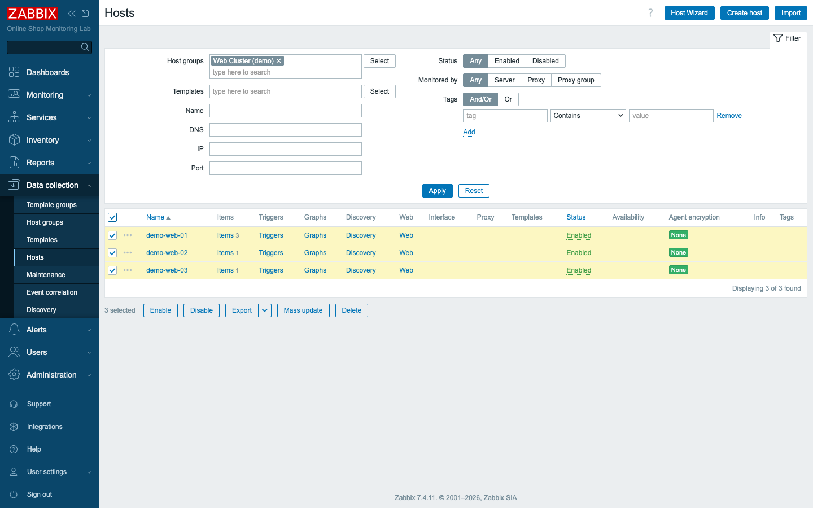
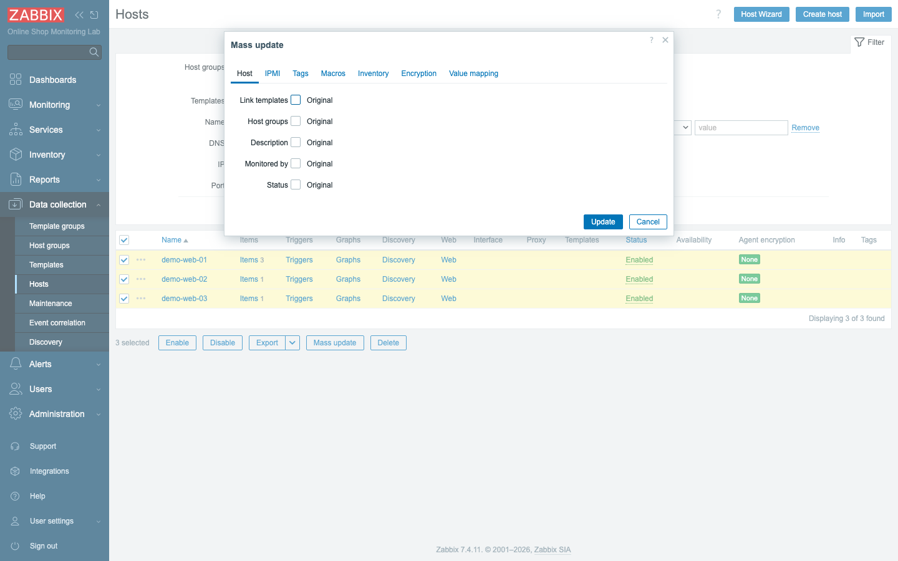
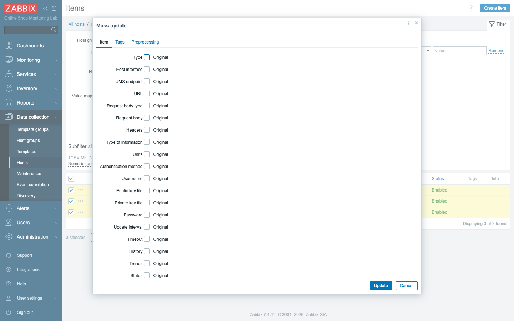
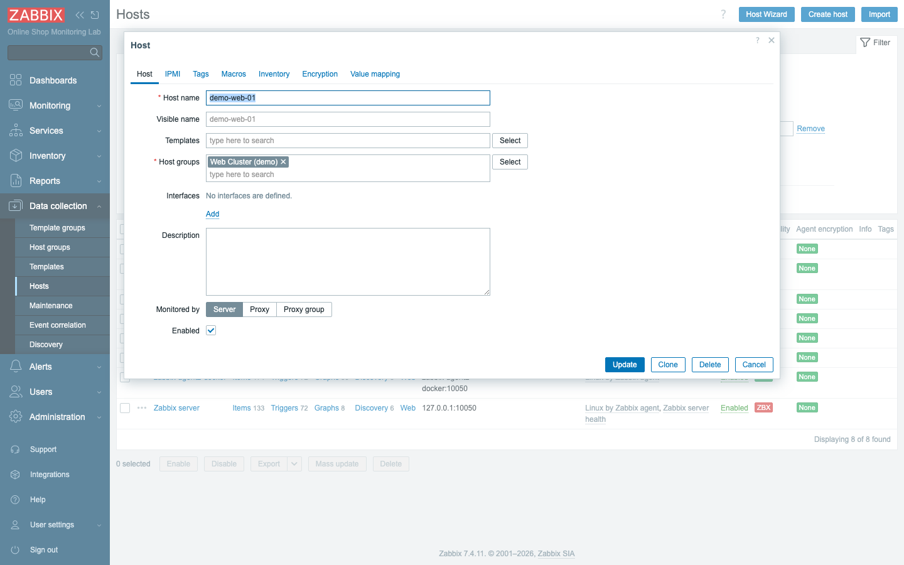
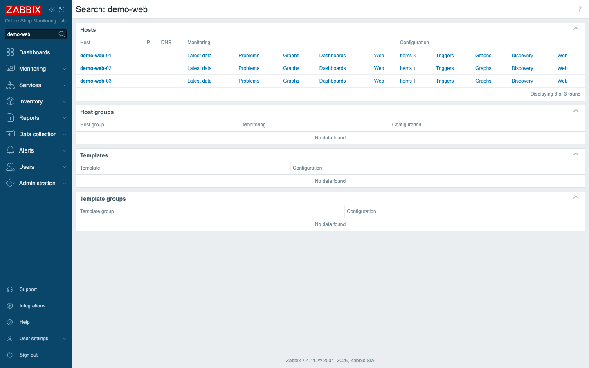

# Module 17: Mass Operations

## Learning Objectives

By the end of this module you will be able to manage many hosts and items at
once instead of one at a time. You will select multiple objects and **mass
update** their groups, templates, inventory, intervals, and status in a single
action; you will **clone** hosts and templates to spin up new ones in seconds
rather than rebuilding them by hand; and you will use **global search** to jump
straight to any object in the configuration. These are the everyday skills that
keep a growing Zabbix estate manageable rather than overwhelming.

## Topics

### Why mass operations

Back on Day 2 you added hosts the way most people first learn to — one at a time,
clicking through a form for each one. That is fine when you have a handful of
hosts. Real environments do not have a handful; they have hundreds. A web tier
might be fifty identical nodes behind a load balancer, and a fleet of agents
might number in the thousands. Editing those individually does not just take
forever, it actively invites mistakes: change one host correctly, the next one
slightly differently, and now your configuration has quietly drifted out of sync
in ways that are painful to find later.

Zabbix solves this by letting you act on **many objects in one operation**. You
can change a group, link a template, retune a collection interval, or disable a
noisy check across dozens of hosts at the same time, with a single click of
*Update*. As our Online Shop grows — imagine the web frontend scaling out from
one node to many, or a branch office bringing a rack of agents online — these are
the tools that keep the whole thing sane. Think of this module as learning to
stop typing the same change over and over, and instead tell Zabbix "apply this to
all of these" once.

### Select, then act in bulk

The mechanism behind every bulk action is the same, and once you see it in one
list you will recognize it everywhere. Every configuration list in Zabbix —
Hosts, Items, Triggers, Templates — has a column of **checkboxes** down the left
side. Tick a few rows, and a **bulk action bar** slides into view at the bottom
of the screen offering **Enable**, **Disable**, **Export**, **Mass update**, and
**Delete**. Whatever button you press there acts on *all* of the selected objects
together, not just the one you happened to click last.

That uniformity is deliberate and worth internalizing now: the checkbox-then-bar
pattern is how you operate at scale anywhere in the product. Learn it once for
hosts and you already know it for items, triggers, and templates.

### Mass update for hosts

Of those bulk buttons, **Mass update** is the one that does real work, and it has
a clever safety design you need to understand before you trust it. When you open
it, you get a dialog that mirrors the normal host form, but with a twist: every
field carries its own **enable checkbox**, and until you tick it, the field shows
*Original* and is left completely untouched. In other words, mass update changes
**only the fields you explicitly opt into** and leaves everything else exactly as
it was on each host. This is what makes it safe to apply across a hundred hosts
that are not otherwise identical — you are surgically changing one or two
attributes, not overwriting the whole configuration.

For hosts, the fields you can bulk-set include:

- **Host groups** — with **Add / Replace / Remove** (move or add many hosts to a
  group at once).
- **Link templates** — **Link / Replace / Unlink** (bulk template linking).
- **Description, Monitored by (server/proxy), Status**, **Tags**, **Macros**, and
  **Inventory** fields (on their tabs).

Pay close attention to that **Add / Replace / Remove** choice on groups and
templates, because the words mean what they say and the consequences differ
sharply. **Add** appends the new group or template alongside whatever was already
there. **Replace** wipes the existing associations and substitutes the new ones —
so replacing a template on a host that had two templates linked leaves it with
just the one you chose. **Remove** strips out a specific association. Read that
selector before you click *Update*, every time; it is the single field in this
dialog most likely to surprise you.

### Mass update for items (and triggers)

The exact same opt-in pattern works one level down, on the **items** inside a
host. Select several items and mass update lets you change their **Type**,
**Update interval**, **History**, **Trends**, **Status** (a bulk
**enable/disable**), **Tags**, and preprocessing all at once. This is the lever
you reach for when, say, a check is polling every 30 seconds and flooding your
database, and you want to relax twenty of those items to five minutes in one
motion — or when one metric has gone haywire and you need to silence it across
many items quickly. **Triggers** offer an equivalent mass update of their own,
covering severity, dependencies, tags, and enable/disable, so the same
scale-management thinking carries through to your problem detection.

### Cloning hosts and templates

Sometimes you do not want to change existing objects but to create a *new* one
that closely resembles an object you already built. Rebuilding it from a blank
form would mean re-entering everything you already got right once. **Clone**
solves this: open the existing host (or template), press **Clone**, and Zabbix
hands you a pre-filled copy of its configuration that you simply rename and save.
There is also a **Full clone**, which goes a step further and copies *discovered*
entities too — the items and triggers that low-level discovery generated, which a
plain Clone leaves behind. The workflow this enables is one you will use
constantly: build one really good example host or template, get it exactly right,
then clone it as many times as you need and adjust the small differences. The same
**Clone** button lives on templates as well.

### Global search

The last tool here is the one that saves you the most time on a daily basis once
your estate is large. The **search box** at the top-left of the interface finds
any host, host group, template, or template group by name, and the results give
you quick links straight into that object's Latest data, Problems, Items,
Triggers, and configuration. Instead of remembering which menu and which filter
gets you to a particular host, you type part of its name and jump there directly.
On a screen full of hundreds of objects, this is the fastest way to navigate. One
limitation to keep in mind: search matches the *named* objects — hosts, host
groups, templates, template groups — not individual items or triggers; for those
you still filter within their own lists.

## Docker-Based Demonstration

To show these tools without risking the real Online Shop configuration, the
instructor stands up a small, disposable **web cluster** — `demo-web-01/02/03`,
three hosts standing in for a scaled-out web tier — and then manages them *only*
in bulk. They select all three at once and mass-update the group and templates,
mass-disable a set of items, clone one host to produce a fourth, and use global
search to hop between them. The point of the demonstration is the discipline:
from start to finish, not a single host is edited individually.

## Hands-On Lab

> This lab uses a throwaway `demo-web-01/02/03` cluster so you can practise bulk
> actions without touching the real Online Shop hosts.

1. **Add multiple hosts.** Create three hosts `demo-web-01`, `demo-web-02`,
   `demo-web-03` (a *Web Cluster (demo)* group, no interface, each with an HTTP
   item to `demo-nginx`). *(Tip: build one, then **Clone** it twice — step 5.)*
   **Expected:** three hosts in the new group.

2. **Select them and open the bulk bar.** In **Data collection → Hosts**, filter
   to the *Web Cluster (demo)* group, tick the header checkbox to select all.
   **Expected:** *3 selected* with **Enable / Disable / Export / Mass update /
   Delete** at the bottom.

3. **Move hosts into a group + link a template in bulk.** Click **Mass update**:
   - Enable **Host groups** → **Add** → choose a group.
   - Enable **Link templates** → **Link** → choose a template.

   **Update.**
   **Expected:** all three hosts gain the group and template in one action.

4. **Update host inventory in bulk.** Open **Mass update** again, go to the
   **Inventory** tab, set **Inventory mode = Manual**, and fill a field (e.g.
   *Location* = `Branch DC`). **Update.**
   **Expected:** all three hosts share the inventory value — no per-host typing.

5. **Clone a host.** Open `demo-web-01`, click **Clone**, change the name to
   `demo-web-04`, and **Add**.
   **Expected:** a new host identical to the original (items included), created in
   seconds.

6. **Disable and enable items in bulk.** Open **Items** for `demo-web-01`, select
   several, click **Mass update**, enable **Status → Disabled**, **Update** — then
   repeat with **Enabled** to turn them back on.
   **Expected:** the selected items flip status together.

7. **Use global search.** Type `demo-web` in the top search box.
   **Expected:** all the cluster hosts with quick links to their data and config.

8. **Clean up.** Delete the `demo-web-*` hosts and the demo group.
   **Expected:** the lab returns to the real Online Shop hosts.

## Expected Outcome

You can now manage Zabbix at scale rather than one object at a time. You can
bulk-update host groups, templates, inventory, and status; bulk-retune and
enable or disable items (and triggers); clone hosts and templates to provision
new ones quickly; and use global search to navigate a large configuration —
accomplishing in a single action what would otherwise have been dozens of
individual edits.
