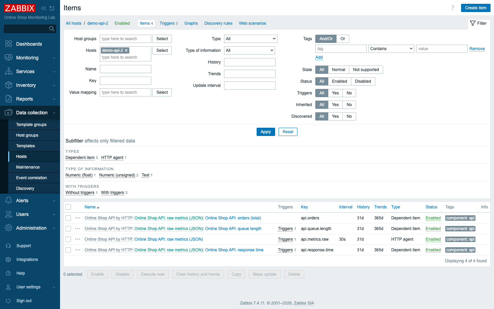
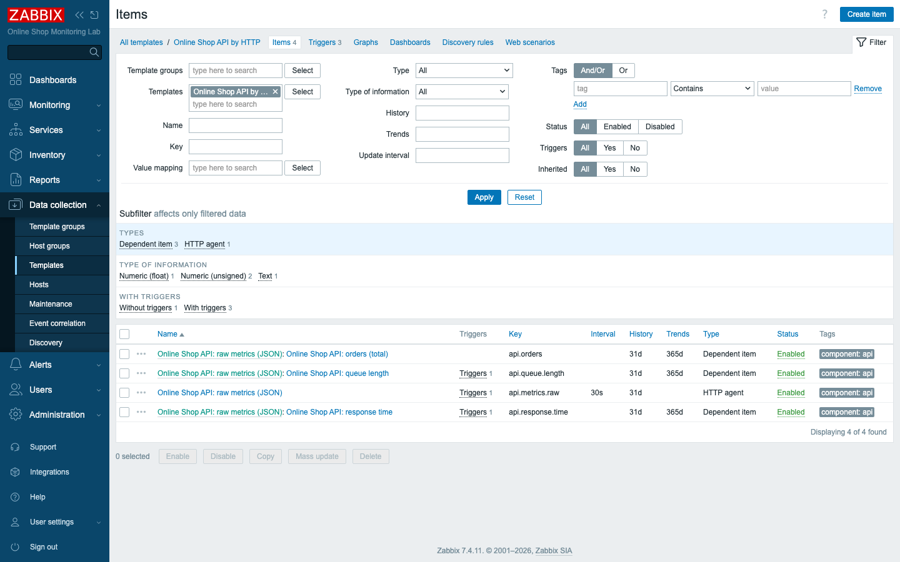
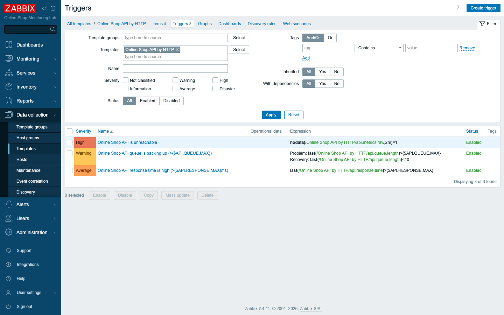
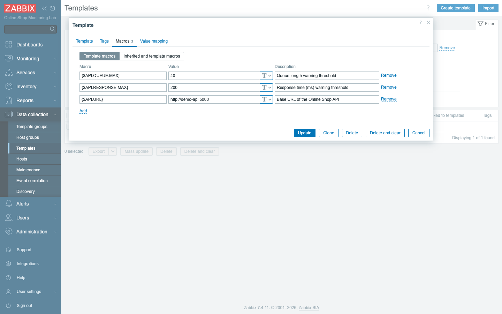
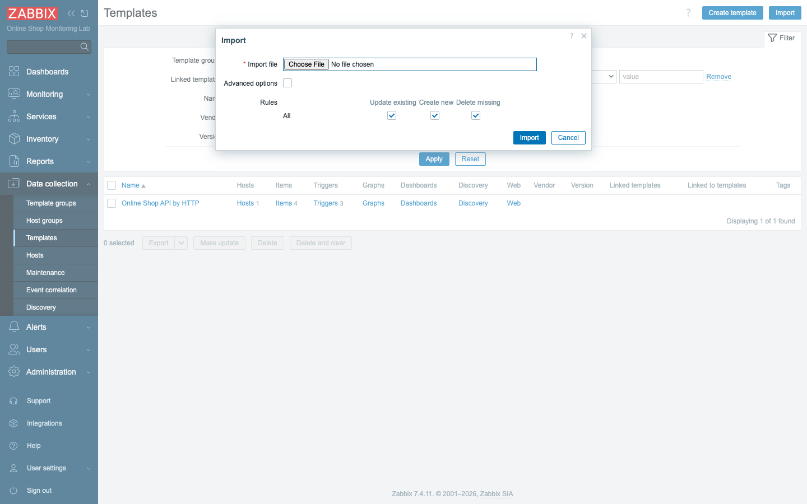

# Module 18: Advanced Templates

## Learning Objectives

By the end of this module participants can design a **reusable template**: bundle
items, triggers, and macros; **link** it to hosts so they inherit everything;
parameterise it with **macros** so each host can differ; and **export/import** it
as a versioned file. We turn the ad-hoc `demo-api` monitoring from Day 2 into one
clean, reusable *Online Shop API by HTTP* template.

## Topics

### What is a template?

A **template** is a reusable bundle of monitoring configuration — items, triggers,
graphs, dashboards, macros, and low-level discovery rules — that you **link** to
hosts. Linked hosts **inherit** everything in the template; change the template
once and every linked host updates. Templates are how Zabbix monitors hundreds of
identical hosts without copy-paste (the 360 built-in templates work this way).

### Template inheritance and linked templates

When a template is linked to a host, the host gets the template's items and
triggers as **inherited** objects — shown with the **template name as a prefix**
(and you cannot edit the inherited parts on the host, only on the template).
Templates can also be **linked to other templates** (nesting): a high-level
template links several lower-level ones, composing monitoring from reusable parts.

### Template items, triggers, graphs, dashboards

Everything you built on a host can live on a template instead. Our template
carries:

- **Items** — the HTTP master item and its JSONPath dependent items (orders, queue
  length, response time).
- **Triggers** — the queue/response-time/unreachable triggers, referencing the
  template's own items as `/Online Shop API by HTTP/key`.
- It can also carry **graphs**, **dashboards**, and **LLD rules** (Module 23).

### Template macros — the key to reuse

A template is only reusable if hosts can differ. **Template macros** (`{$NAME}`)
provide defaults that each linked host can **override**. Ours uses:

- `{$API.URL}` — the API base URL (item URL is `{$API.URL}/metrics`), so each host
  points at its own API.
- `{$API.QUEUE.MAX}`, `{$API.RESPONSE.MAX}` — trigger thresholds, tunable per host.

So linking the template to ten API instances and giving each its own `{$API.URL}`
monitors all ten with **one** definition.

### Versioning, export, and import

Templates carry a **vendor** and **version** and can be **exported** to a single
**YAML** (or XML/JSON) file — perfect for version control and moving config between
environments. **Import** reads that file back, with rules for **Update existing /
Create new / Delete missing**. The course ships this template's export at
`content/lab/templates/online-shop-api-by-http.yaml`.

### Template design best practices

- **Macros for anything that varies** (URLs, thresholds, credentials).
- **One responsibility per template**; compose with nesting rather than one giant
  template.
- **Name and group clearly** (`Templates/Online Shop`).
- **Version-control the export** so changes are reviewable.
- **Never edit inherited objects on the host** — change the template.

## Docker-Based Demonstration

The instructor builds *Online Shop API by HTTP* — the macro `{$API.URL}`, the HTTP
master item, JSONPath dependent items, and macro-driven triggers — links it to a
new host (`demo-api-2`) that inherits all of it and starts collecting immediately,
then exports the template to YAML and shows the import dialog.

## Hands-On Lab

1. **Create a template.** In **Data collection → Templates → Create template**:
   - **Template name:** `Online Shop API by HTTP`
   - **Template groups:** `Templates/Online Shop`

   **Add.**
   **Expected:** an empty template appears in the list.

2. **Add macros.** Open the template → **Macros** tab → add:
   - `{$API.URL}` = `http://demo-api:5000`
   - `{$API.QUEUE.MAX}` = `40`
   - `{$API.RESPONSE.MAX}` = `200`

   **Expected:** three template macros saved.

3. **Add items.** On the template's **Items**, create an **HTTP agent** master item
   `api.metrics.raw` with URL `{$API.URL}/metrics` (Text), then **dependent items**
   `api.queue.length` (JSONPath `$.queue_length`), `api.response.time`
   (`$.response_time_ms`, ms), `api.orders` (`$.orders`).
   **Expected:** four template items, the dependents fed by the master.

4. **Add triggers.** On the template's **Triggers**, create:
   - `Online Shop API queue is backing up` —
     `last(/Online Shop API by HTTP/api.queue.length)>{$API.QUEUE.MAX}`
   - `Online Shop API response time is high` —
     `last(/Online Shop API by HTTP/api.response.time)>{$API.RESPONSE.MAX}`
   - `Online Shop API is unreachable` —
     `nodata(/Online Shop API by HTTP/api.metrics.raw,2m)=1`

   **Expected:** three template triggers using the template's items and macros.

5. **Link the template to a host (inheritance).** Create a host `demo-api-2`
   (group *Web Services*, no interface), and on its **Templates** link
   *Online Shop API by HTTP*. Optionally override `{$API.URL}` on the host.
   **Expected:** within a minute `demo-api-2` shows the template's items
   **inherited** (template-name prefix) and collecting, plus the three triggers —
   a fully monitored host from **one link**. Link it to more API hosts the same
   way, each with its own `{$API.URL}`.

6. **Export the template.** In **Data collection → Templates**, select the
   template → **Export → YAML**.
   **Expected:** a `.yaml` file downloads — a versioned, reviewable definition of
   the whole template (see `content/lab/templates/online-shop-api-by-http.yaml`).

7. **Import it again.** Click **Import**, choose the YAML file, review the
   **Update existing / Create new / Delete missing** rules, and **Import**.
   **Expected:** the template is recreated/updated from the file — the basis for
   moving configuration between environments and for version control.

## Expected Outcome

Participants can build a reusable template with items, triggers, and macros, link
it to hosts that inherit everything, parameterise per-host behaviour with macros,
and export/import the template as a versioned file — the core skill for managing
monitoring at scale instead of editing hosts one by one.

## Instructor Notes

- **Lab vs production.** Production estates are almost entirely template-driven;
  hosts carry little but a name, an address, and macro overrides. The 360 built-in
  templates are the same machinery you just used.
- **Macros are what make a template reusable.** Hammer this: a template with
  hard-coded URLs/thresholds only fits one host. `{$API.URL}` is why one template
  monitors many API instances. Have students override it on a second host.
- **Inherited = edit on the template, not the host.** Students often try to change
  an inherited item on the host and can't. Show that the template name prefix means
  "owned by the template" — change it there and every host follows.
- **Export to Git.** The YAML export is the right unit for version control and
  code review of monitoring. We ship one in the repo; encourage treating templates
  as code.
- **Import rules matter.** *Delete missing* will **remove** objects not in the file
  — powerful and dangerous. Walk through Update/Create/Delete before importing over
  an existing template.
- **Refactor ad-hoc into templates.** `demo-api` (Day 2) has these items built
  directly on the host; this template is the reusable version. In production you
  templatise once a pattern repeats. (We keep `demo-api` as-is to preserve the
  earlier modules.)
- **Timing (~45 min).** ~10 min what/inheritance/macros, ~18 min build the template
  (macros, items, triggers), ~10 min link + inheritance, ~7 min export/import +
  best practices.

## Lab-State Delta

Added in Module 18 (template **kept** as a reusable artifact; demo host removed):

- **Template group:** `Templates/Online Shop` (templategroupid `26`).
- **Template:** `Online Shop API by HTTP` (templateid `10791`) — 3 macros
  (`{$API.URL}`, `{$API.QUEUE.MAX}`, `{$API.RESPONSE.MAX}`), 4 items (HTTP master
  `api.metrics.raw` + JSONPath dependents), 3 triggers (queue / response-time /
  unreachable, macro thresholds).
- **Exported artifact:** `content/lab/templates/online-shop-api-by-http.yaml`
  (real 7.4 export, committed for the import exercise).
- **Demonstrated then reverted:** linked to host `demo-api-2`, confirmed inherited
  items collected + triggers created, then **deleted** the host (template left
  unlinked/reusable). Lab at 5 hosts. Screenshots in
  `content/day-3/assets/module-18/`.
