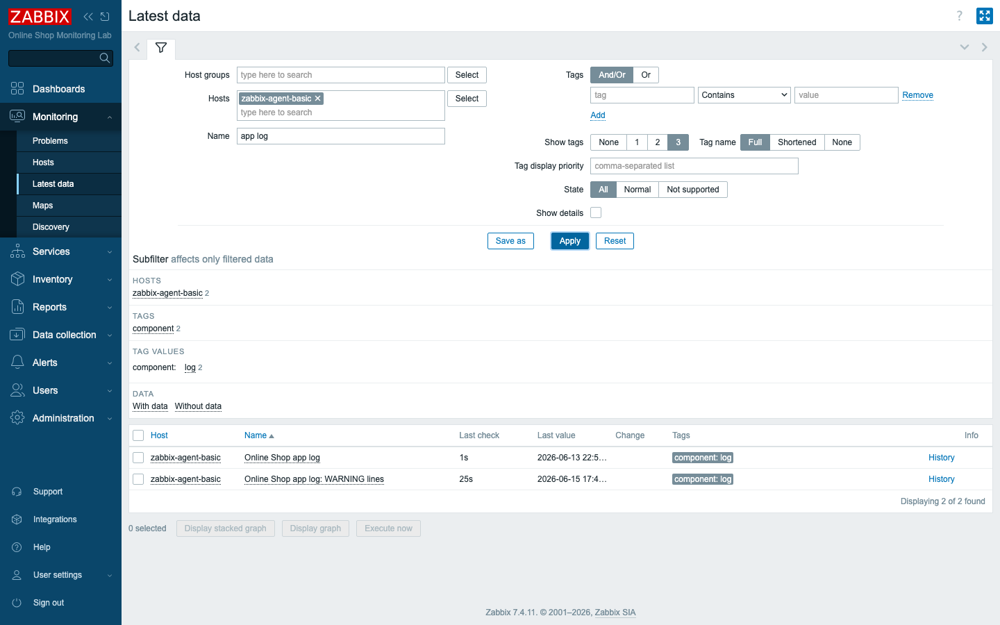
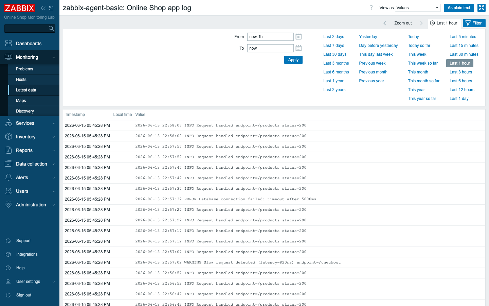
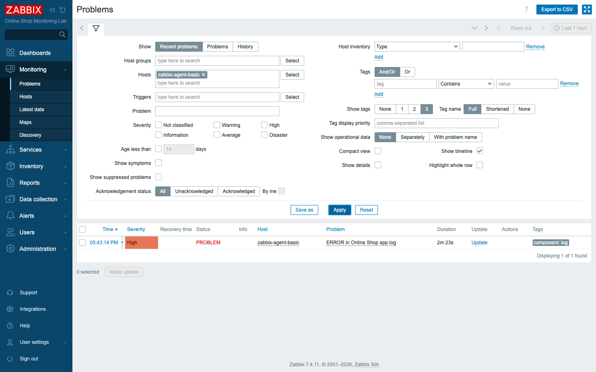

# Module 19: Monitoring Logs

## Learning Objectives

By the end of this module participants can monitor a log file with Zabbix:
create a **log item** (which requires an **active** agent), pull a log into Zabbix,
filter it with **regular expressions** to detect ERROR/WARNING lines, and fire a
**trigger** when matching messages appear — turning the Online Shop's application
log into alerts.

## Topics

### Why log monitoring

Metrics tell you *that* something is wrong; **logs** often tell you *what*. The
Online Shop's app (`demo-log-app`) writes lines like:

```text
2026-…  INFO    Request handled endpoint=/products status=200
2026-…  WARNING Slow request detected (latency=820ms) endpoint=/checkout
2026-…  ERROR   Database connection failed: timeout after 5000ms
```

Log monitoring watches that file, ships new lines to Zabbix, and lets you alert on
the ones that matter.

### Log items require an active agent

A **log item** reads a file line by line and remembers its position between checks
— so it must be an **active** check (the agent reads the file and *pushes* new
lines to the server). Passive polling cannot do this. The agent therefore needs
**`ServerActive`** set and its **`Hostname`** matching the host in Zabbix (Module 7).
The item's **Type of information** is **Log**.

![A log item: Zabbix agent (active), key log[...], type Log](assets/module-19/01-log-item-form.png)

### The log[] key and file path

The key is **`log[file,<regexp>,<encoding>,<maxlines>,<mode>,<output>,…]`**:

- **file** — the path *as seen by the agent* (here `/var/log/demo/app.log`).
- **regexp** — only lines matching this are collected (omit for *all* lines).
- **mode** — `all` or `skip` (skip existing content and read only new lines).
- **output** — extract part of the line (capture groups) instead of the whole line.

In our lab the log volume is mounted into the agent at `/var/log/demo` by
`compose_lab.yaml`, so the agent can read it.

### Detecting errors and warnings with regular expressions

The regexp parameter is the filter. We run two items:

- `log[/var/log/demo/app.log]` — **all** lines (the full stream, in Latest data).
- `log[/var/log/demo/app.log,WARNING]` — only **WARNING** lines.

You would add `log[…,ERROR]` to isolate errors. Regular expressions are also used
in **triggers** (below) and in **global regular expressions** (reusable named
patterns under Administration).



### Viewing the log in Zabbix

A log item's **history** is the captured lines with timestamps — you read the
application's log *inside* Zabbix, alongside its metrics, instead of SSH-ing to the
host.



### Triggering from log messages

To alert on errors, a trigger counts matching lines over a window:

```text
count(/zabbix-agent-basic/log[/var/log/demo/app.log],30s,"regexp","ERROR")>0
```

It fires when **any ERROR line** arrived in the last 30 seconds and recovers when
they age out. (For "every occurrence matters", set the item's *PROBLEM event
generation* to **Multiple**, Module 10.)

### Log preprocessing and dependent items

A log item can carry **preprocessing** (regex extract, replace, JavaScript) and
feed **dependent items** — for example, a dependent item that extracts the latency
number from a WARNING line into a numeric metric, or counts errors per minute. The
master+dependent pattern from Module 9 works on logs too.

## Docker-Based Demonstration

`demo-log-app` is already writing INFO/WARNING/ERROR lines to a volume the agent
reads. The instructor creates the active log item, shows the lines arriving in
Latest data and history, adds the ERROR trigger, and waits for the next ERROR line
to raise the problem.

## Hands-On Lab

1. **Confirm the log source.** The `demo-log-app` container writes to a volume
   mounted into `zabbix-agent-basic` at `/var/log/demo/app.log`:
   ```bash
   docker exec zabbix-agent-basic tail -5 /var/log/demo/app.log
   ```
   **Expected:** recent INFO lines (and the occasional WARNING/ERROR). *(In our
   lab the mount is pre-wired in `compose_lab.yaml`; on a real host the agent runs
   where the log lives.)*

2. **Create the log item.** On host `zabbix-agent-basic`, create an item:
   - **Name:** `Online Shop app log`
   - **Type:** **`Zabbix agent (active)`**
   - **Key:** `log[/var/log/demo/app.log]`
   - **Type of information:** **`Log`**
   - **Update interval:** `5s`

   **Add.**
   **Expected:** after the agent refreshes its active checks (up to ~2 min), the
   item starts collecting log lines.

3. **Add a regexp-filtered item.** Create another log item
   `log[/var/log/demo/app.log,WARNING]` (*WARNING lines*).
   **Expected:** this item collects **only** WARNING lines — the regexp is the
   filter.

4. **Watch the log in Zabbix.** Go to **Monitoring → Latest data**, filter to
   `zabbix-agent-basic`, find the log items, and click **History**.
   **Expected:** the application's log lines, with timestamps, streaming into
   Zabbix — INFO/WARNING/ERROR as the app writes them.

5. **Create a trigger for ERROR messages.** On the all-lines log item, add a
   trigger:
   - **Name:** `ERROR in Online Shop app log`
   - **Severity:** **High**, **Allow manual close**
   - **Expression:**
     `count(/zabbix-agent-basic/log[/var/log/demo/app.log],30s,"regexp","ERROR")>0`

   **Expected:** the trigger is saved.

6. **View the problem.** `demo-log-app` logs an ERROR roughly once a minute. Watch
   **Monitoring → Problems**.
   **Expected:** within ~1 minute *ERROR in Online Shop app log* appears as a
   **High** problem, then recovers ~30 s after the error (when no new ERROR is in
   the window).

   

## Expected Outcome

Participants can configure log monitoring with an active agent, read an
application log inside Zabbix, filter it with regular expressions to isolate
errors and warnings, and alert on log patterns — connecting "what the app says" to
Zabbix's problem workflow.

## Instructor Notes

- **Lab vs production.** We mount a container volume so the agent can read the log;
  in production the agent is **installed on the host that writes the log** (or the
  log is shipped to one). The `log[]` mechanics are identical.
- **Active is mandatory — the #1 gotcha.** Log items only work as **Zabbix agent
  (active)**, which means `ServerActive` set *and* the agent `Hostname` matching the
  Zabbix host name. A "log item collects nothing" problem is almost always one of
  these (Module 7). Show the active-check requirement explicitly.
- **Path is the agent's view.** The file path is whatever the **agent** sees
  (`/var/log/demo/app.log` inside the container), not the server's path. Permission
  to read the file matters too.
- **`skip` vs `all` and MaxLinesPerSecond.** By default a new log item reads from
  the *current end* and forward. The agent caps throughput at
  `MaxLinesPerSecond` (default 20) — a flood of lines can lag; raise it for chatty
  logs. Mention this as a common "logs are delayed" cause.
- **Don't alert on every line.** Filter with the regexp and count over a window;
  alerting on raw INFO volume is noise. Use **Multiple** problem generation only
  when each occurrence truly needs its own problem.
- **Logs + metrics together.** The power of doing this *in Zabbix* is correlation:
  the ERROR trigger and the API response-time graph (Module 12) on one screen.
- **Timing (~45 min).** ~10 min why + active requirement, ~15 min log item + regexp
  filtering + history, ~12 min ERROR trigger + view problem, ~8 min preprocessing/
  dependent-item concept + common-problems recap.

## Lab-State Delta

Added in Module 19 (kept — log monitoring is a permanent capability):

- **Log items on `zabbix-agent-basic` (10780):** `Online Shop app log` (itemid
  `71488`, key `log[/var/log/demo/app.log]`, active, Log) and `Online Shop app
  log: WARNING lines` (itemid `71489`, key `log[/var/log/demo/app.log,WARNING]`).
- **Trigger:** `ERROR in Online Shop app log` (triggerid `33039`) —
  `count(/zabbix-agent-basic/log[/var/log/demo/app.log],30s,"regexp","ERROR")>0`,
  **High**, manual close. Fires periodically as `demo-log-app` logs ERROR lines
  (real demo behaviour). Screenshots in `content/day-3/assets/module-19/`.
