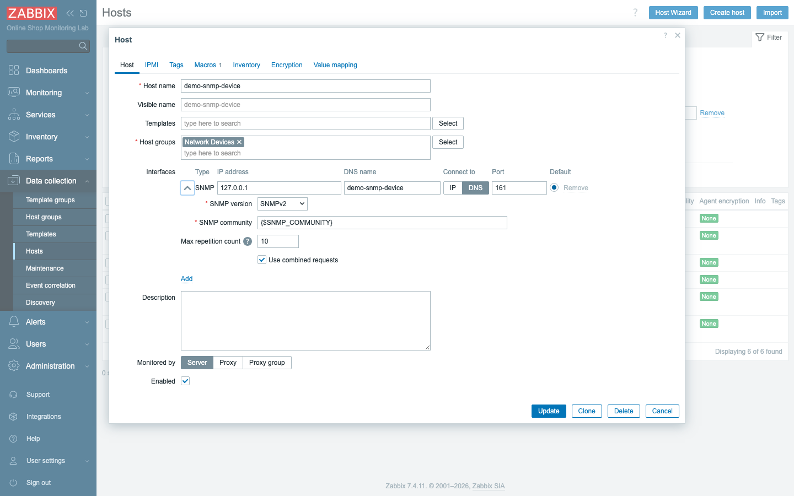
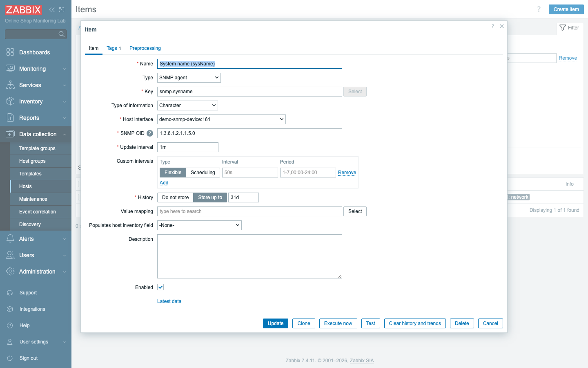
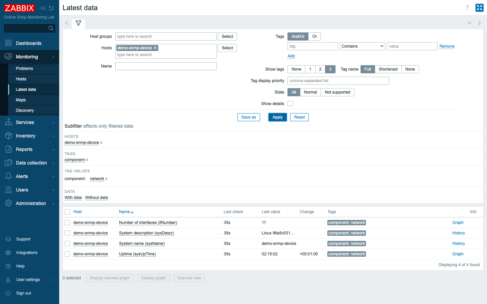
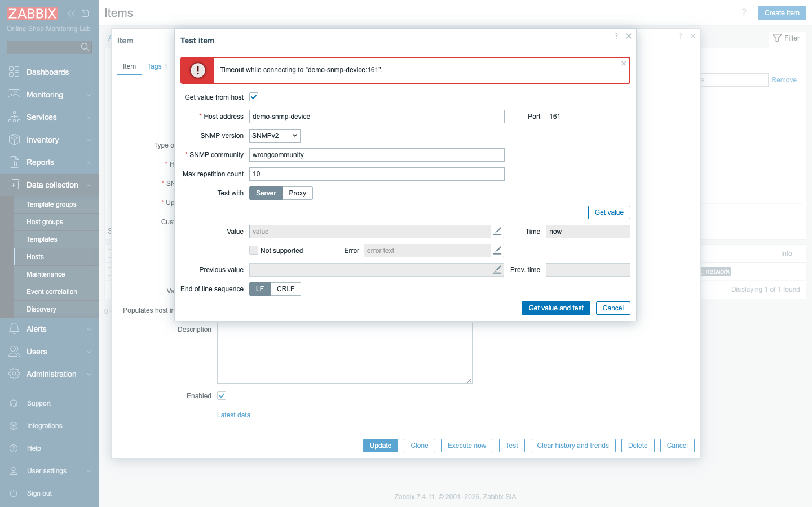

# Module 20: SNMP Monitoring

## Learning Objectives

By the end of this module participants can monitor a device over **SNMP**: explain
SNMP, OIDs, MIBs, versions, and community strings; test SNMP from the command line;
add an **SNMP host** with an SNMP interface in Zabbix; collect metrics by **OID**;
and **troubleshoot** the most common SNMP failure — a wrong community string.

## Topics

### What is SNMP, and why it matters

**SNMP** (Simple Network Management Protocol) is how you monitor devices that
**cannot run a Zabbix agent** — routers, switches, firewalls, printers, UPSs,
storage arrays. The device runs an **SNMP agent** that answers queries on
**UDP 161**; Zabbix (the *manager*) asks it for values. In our lab,
`demo-snmp-device` runs net-snmp and stands in for a network device — so you learn
SNMP without a physical router.

### OIDs and MIBs

Every value an SNMP device exposes has an **OID** (Object Identifier) — a
dotted-number address in a global tree, e.g.:

- `1.3.6.1.2.1.1.5.0` — **sysName** (the device's name)
- `1.3.6.1.2.1.1.1.0` — **sysDescr** (description)
- `1.3.6.1.2.1.1.3.0` — **sysUpTime**
- `1.3.6.1.2.1.2.1.0` — **ifNumber** (number of interfaces)

A **MIB** (Management Information Base) is a dictionary that maps human names
(`sysName`) to OIDs — so you can write `SNMPv2-MIB::sysName.0` instead of the
numbers. Zabbix ships common MIBs; vendors provide device-specific ones.

### SNMP versions and the community string

- **v1 / v2c** — simple; authentication is just a **community string** (a shared
  password, commonly `public` for read-only). v2c adds bulk requests for
  efficiency.
- **v3** — adds real authentication and encryption (user/password/privacy);
  preferred in production.

Our device uses **v2c** with community **`public`**.

### SNMP interfaces in Zabbix

An SNMP host carries an **SNMP interface** (not an agent interface): its address,
**port 161**, the **SNMP version**, and the **community** — which we store in a
macro **`{$SNMP_COMMUNITY}`** so it can differ per host and stay out of every item.



### SNMP items, templates

An **SNMP item** is type **SNMP agent**, attached to the SNMP interface, with the
**SNMP OID** to read. You can write items by OID directly (as we do), or — the
usual production path — **link a vendor SNMP template** (Zabbix ships *Generic by
SNMP*, *Cisco IOS by SNMP*, and hundreds more) that already contains the right OIDs
and low-level discovery for that device family.



### Network device monitoring

The values you collect — interface counters, CPU, memory, temperature, uptime —
are exactly what you watch on real switches and routers. SNMP + low-level discovery
(Module 23) auto-creates an item per interface, so a 48-port switch monitors itself
once the template is linked.

## Docker-Based Demonstration

`demo-snmp-device` is already running net-snmp. The instructor tests it from the
command line, adds it as an SNMP host with a v2c interface, creates a few OID
items, shows them collecting in Latest data, then **breaks the community string**
and uses the item **Test** to diagnose the timeout.

## Hands-On Lab

1. **Test SNMP from the command line.** Before involving Zabbix, prove the device
   answers (run from the device's own net-snmp tools):
   ```bash
   docker exec demo-snmp-device snmpget -v2c -c public localhost 1.3.6.1.2.1.1.5.0
   # -> SNMPv2-MIB::sysName.0 = STRING: demo-snmp-device
   docker exec demo-snmp-device snmpwalk -v2c -c public localhost 1.3.6.1.2.1.1
   ```
   **Expected:** the system subtree (sysName, sysDescr, sysUpTime, …). If this
   works, the device and community are correct.

2. **Add the SNMP host.** In **Data collection → Hosts → Create host**, set name
   `demo-snmp-device`, group `Network Devices`, add a macro
   `{$SNMP_COMMUNITY}` = `public`, and add an **SNMP interface**: DNS
   `demo-snmp-device`, port `161`, **SNMP version SNMPv2**, **SNMP community**
   `{$SNMP_COMMUNITY}`. Save.
   **Expected:** the host has one SNMP interface.

3. **Add SNMP items by OID.** Create items (Type **SNMP agent**, on the SNMP
   interface). An SNMP item still needs a **unique key** — any short name — plus
   the OID:

   | Name | Key | SNMP OID |
   | --- | --- | --- |
   | `System name (sysName)` | `snmp.sysname` | `1.3.6.1.2.1.1.5.0` |
   | `System description (sysDescr)` | `snmp.sysdescr` | `1.3.6.1.2.1.1.1.0` |
   | `Uptime (sysUpTime)` | `snmp.uptime` | `1.3.6.1.2.1.1.3.0` |
   | `Number of interfaces (ifNumber)` | `snmp.ifnumber` | `1.3.6.1.2.1.2.1.0` |

   **Expected:** four SNMP items. The **key is just a local identifier** in Zabbix
   — the **OID** is what's fetched from the device.

4. **Collect SNMP metrics.** Go to **Monitoring → Latest data**, filter to
   `demo-snmp-device`.
   **Expected:** the OID values arrive — `sysName` = `demo-snmp-device`,
   `ifNumber` = a number, `sysUpTime` climbing. You are monitoring a "network
   device" entirely over SNMP.

   

5. **Break the community string.** Change the host macro `{$SNMP_COMMUNITY}` to
   `wrongcommunity` and save.
   **Expected:** within a minute the SNMP items stop updating — the device ignores
   queries with the wrong community.

6. **Troubleshoot.** Open the `System name` item and click **Test → Get value and
   test**.
   **Expected:** a red **`Timeout while connecting to "demo-snmp-device:161"`** —
   and the dialog shows the **SNMP community** in use (`wrongcommunity`). The fix
   is plain: the community is wrong. Confirm from the CLI that `public` works but
   `wrongcommunity` times out, then set the macro back to `public`.

   

7. **Confirm recovery.** With `{$SNMP_COMMUNITY}` back to `public`, the items
   collect again.
   **Expected:** Latest data resumes.

## Expected Outcome

Participants can monitor a device over SNMP end to end: test it from the command
line, configure an SNMP host with the correct version and community, collect
metrics by OID (or via a template), and diagnose the classic wrong-community
failure — the foundation of network-device monitoring.

## Instructor Notes

- **Lab vs production.** `demo-snmp-device` is net-snmp on Linux **simulating** a
  router/switch — the SNMP mechanics (OIDs, community, version, interface) are
  identical to a real Cisco/Juniper device. In production you would link a vendor
  template and often use **SNMPv3** for security.
- **Test from the CLI first — always.** `snmpget`/`snmpwalk` proves the device,
  community, and version *before* you touch Zabbix, exactly like `zabbix_get` for
  agents (Module 6). A "Zabbix SNMP not working" problem is usually solved here.
  (The Zabbix server image has no SNMP CLI tools, so we run them from the device
  container; on a real manager you'd `apt install snmp`.)
- **Community in a macro, not in items.** `{$SNMP_COMMUNITY}` keeps the secret in
  one place and lets each device differ — and makes "rotate the community" a
  one-field change. Never hard-code it in every item.
- **The #1 SNMP failure is the community/version.** A timeout almost always means
  wrong community, wrong version (v1 vs v2c vs v3), a firewall blocking UDP 161, or
  the device's ACL not allowing the manager's IP. The item **Test** shows the exact
  community being used — invaluable.
- **Use templates and LLD for real devices.** Hand-writing OIDs is for learning;
  in production link *Generic by SNMP* or the vendor template, which uses low-level
  discovery (Module 23) to create per-interface items automatically.
- **Timing (~45 min).** ~12 min SNMP/OID/MIB/versions, ~13 min add host + items +
  collect, ~12 min break community + troubleshoot, ~8 min templates/LLD + recap.

## Lab-State Delta

Added in Module 20 (kept — the simulated network device):

- **Host group:** `Network Devices` (groupid `27`).
- **Host:** `demo-snmp-device` (hostid `10793`) — **SNMP interface**
  `demo-snmp-device:161`, **SNMPv2**, community `{$SNMP_COMMUNITY}` (= `public`).
- **SNMP items (by OID):** `sysName` (`71490`, 1.3.6.1.2.1.1.5.0), `sysDescr`
  (`71491`), `sysUpTime` (`71492`, ×0.01 timeticks→s), `ifNumber` (`71493`).
- **Demonstrated then reverted:** set `{$SNMP_COMMUNITY}` to `wrongcommunity` →
  SNMP timed out (item Test captured) → restored to `public` → recovered.
  Screenshots in `content/day-3/assets/module-20/`.
