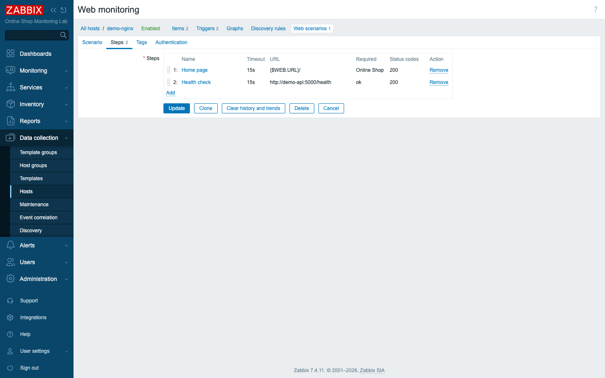
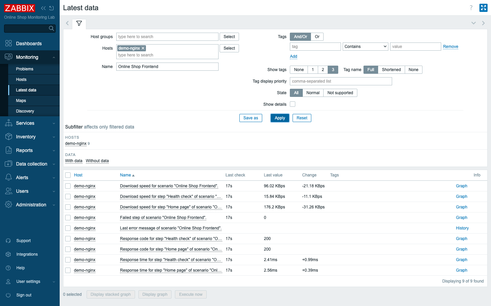
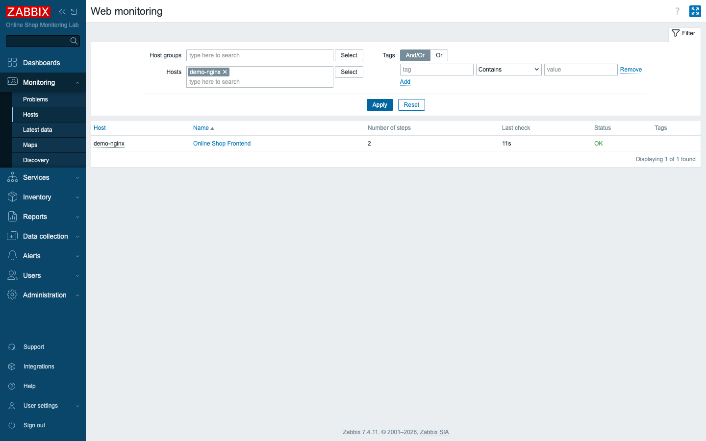
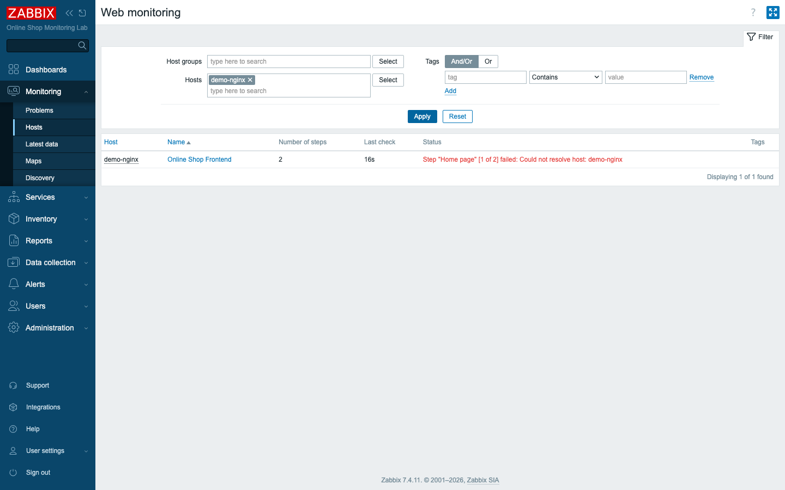

# Module 21: Web Monitoring

## Learning Objectives

By the end of this module participants can monitor a website the way a user
experiences it: build a **web scenario** with ordered **steps**, check
**availability** (status code + required string) and **performance** (response
time, download speed), alert when the site fails, and explain when to use a **web
scenario** versus an **HTTP agent** item.

## Topics

### Why web monitoring

Up to now, most of the checks we have built ask a fairly narrow question: is a
process listening, is a port open, is the host answering. Those checks are
genuinely useful, but they share a blind spot. Knowing that the web server
process is up does not tell you that the **Online Shop** is actually serving its
pages. A server can be running, accepting connections, and still hand every
visitor a blank screen, a stack trace, or a stale "under maintenance" notice.
From the customer's chair, that site is down — even though every port check is
green.

Web monitoring closes that gap by making Zabbix behave like a visitor rather than
a network probe. Instead of poking at a port, it requests real URLs, follows a
multi-step journey through the site, checks that each page returns the right
**status code** and contains the right **content**, and measures how long each
step takes. The first two of those — *did the right page load, and did it load at
all* — give you **availability**. The timing gives you **performance**. Taken
together they describe the experience from the customer's side, which is exactly
the perspective an SLA is written against (Module 28). A service-level agreement
is a promise to your users, so it has to be measured the way a user would
measure it.

We monitor `demo-nginx`, the Online Shop's web frontend.

### Web scenarios vs. HTTP agent items

Zabbix has two ways to talk HTTP, and choosing right is half of this module:

- **HTTP agent item** (Module 18) — **one request → one value**. Perfect for a
  JSON API: fetch `/metrics`, store the body, extract numbers with JSONPath. It is
  an *item*, lives in Latest data, and is single-shot.
- **Web scenario** (this module) — an **ordered, multi-step user journey**. Open
  the home page, then log in, then load the dashboard — each a **step**. Zabbix
  measures every step, keeps a session (cookies) across them, and reports the
  scenario as **OK** or **which step failed**. It is built for *websites and
  availability*, not for scraping a single number.

The dividing line is whether you care about a *value* or about a *visit*. An HTTP
agent item asks one endpoint a question and writes down the answer; it has no
memory of a previous request and no concept of "step two." A web scenario, by
contrast, walks a sequence the way a person would — carrying cookies and tokens
forward — so you can script the kind of flow that only makes sense as a series:
sign in, then load the page that only signed-in users can see, then sign out.
That continuity is the thing an item simply cannot give you.

Rule of thumb: **a number from an endpoint → HTTP agent; a page (or flow) a user
visits → web scenario.**

### Anatomy of a web scenario

Before you build one, it helps to know how a scenario is put together, because
the configuration form mirrors this structure exactly. A scenario lives on a host
(here `demo-nginx`) under **Data collection → Hosts → Web**. It has scenario-level
settings — things that apply to the whole journey — and a list of **steps**, each
of which is one request along the way.

The scenario-level settings are:

- **Update interval** — how often the whole scenario runs (we use `30s`).
- **Attempts (retries)** — retry a failing step before declaring failure (`2`).
- **Agent / HTTP proxy / Authentication / SSL** — identity and transport options.

The retry setting deserves a second look, because it is what keeps a single
hiccup from paging someone at midnight. A momentary network blip can make one
request fail even though the site is perfectly healthy a second later; setting
attempts to `2` tells Zabbix to try again before it concludes the step has
genuinely failed.

Each **step** is one HTTP request:

- **URL** — we use a macro `{$WEB.URL}/` so the address is set once per host.
- **Required status codes** — e.g. `200`; anything else fails the step.
- **Required string** — text that **must** appear in the response body
  (`Online Shop`); its absence fails the step even on a 200.
- **Post / Variables / Headers** — for forms, tokens, and carrying values between
  steps.

The required string is the quiet hero of this list. A status code of `200` only
promises that the server answered *something*; it says nothing about whether that
something is the right page. By demanding that the literal text `Online Shop`
appear in the body, you turn a vague "the server replied" into a concrete "the
shop's home page actually rendered." Without it, a site can serve an error
template with a cheerful `200` and your monitoring will never notice.



### The items a scenario creates for you

Here is a point that trips up almost everyone the first time: you do **not** create
web items by hand — saving the scenario auto-generates them (query them via the
API with `webitems:true`). Each measurement the scenario makes is stored in a
normal Zabbix item with a predictable key, and those items are what your triggers
and graphs will read later. For our scenario `Online Shop Frontend`:

- `web.test.fail[Online Shop Frontend]` — **0 = all steps passed**, otherwise the
  number of the failed step. This is the availability signal.
- `web.test.error[Online Shop Frontend]` — the last failure message.
- `web.test.in[Online Shop Frontend,<step>,bps]` — download speed (per step + total).
- `web.test.time[Online Shop Frontend,<step>,resp]` — **response time** per step.
- `web.test.rspcode[Online Shop Frontend,<step>]` — the HTTP status code returned.

Notice how cleanly these split into the two halves we keep coming back to.
`web.test.fail` and `web.test.rspcode` answer *is it working?* — availability.
`web.test.time` and `web.test.in` answer *is it working well?* — performance. And
`web.test.error` is the troubleshooting hint that turns a red status into a
sentence you can act on.



### Watching availability and performance

**Monitoring → Web** lists every scenario with its step count, last check, and a
green **OK** (or a red failed-step message). It is the at-a-glance website health
view. Think of it as the dashboard a support engineer glances at first: one row
per site, green when all is well, and a specific failed-step message the moment
something breaks — no need to go digging through individual items to find out
which page is the problem.



### Alerting on web problems

A green status page is reassuring, but nobody can watch it around the clock — and
that is the whole point of triggers. Because the scenario produces normal items,
triggers work exactly as elsewhere (Module 10), using the 7.x `/host/key` syntax:

```text
last(/demo-nginx/web.test.fail[Online Shop Frontend])>0
avg(/demo-nginx/web.test.time[Online Shop Frontend,Home page,resp],5m)>2
```

The first fires when **any step fails** (site unavailable); the second when the
home page is **consistently slow** (performance degraded) — two different SLA
breaches from one scenario. The second one is worth dwelling on: it uses `avg`
over `5m` rather than `last`, so a single slow response will not raise an alarm,
but a sustained slowdown will. That distinction — availability is judged on the
latest value, performance on a trend — is a pattern you will reuse constantly.

### Configuring HTTP agents (the other half)

For completeness: the Online Shop's **API** is monitored with **HTTP agent**
items, built in Module 18 as the `Online Shop API by HTTP` template — one request
to `/metrics`, then JSONPath preprocessing into queue/response/orders metrics.
That is the right tool for an API returning JSON; the web scenario here is the
right tool for the **web frontend**. Together they cover both faces of the Online
Shop over HTTP — the human-facing pages a visitor browses, and the machine-facing
endpoint the rest of the system talks to.

## Docker-Based Demonstration

`demo-nginx` already serves the Online Shop frontend page. The instructor creates
a web scenario with two steps (home page + an API health check), shows it turning
**OK** in Monitoring → Web, points out the auto-created items, adds availability
and performance triggers, then **stops `demo-nginx`** to show the scenario report
the exact failed step and raise a problem — then starts it and watches it recover.

## Hands-On Lab

1. **Confirm the site serves its page.** From the server's vantage point:
   ```bash
   docker exec zabbix-server wget -qO- http://demo-nginx/ | grep -i "Online Shop"
   ```
   Doing this from inside `zabbix-server` proves the page is reachable along the
   exact path the scenario will use, not just from your laptop.
   **Expected:** the line containing `<h1>Online Shop</h1>` — the content our
   scenario will require.

2. **Add a host macro for the URL.** On host `demo-nginx`
   (**Data collection → Hosts → demo-nginx → Macros**), add
   `{$WEB.URL}` = `http://demo-nginx`. Defining the address as a macro means every
   step points at one place you can change later without editing each step.
   **Expected:** the macro is saved; steps can now reference it.

3. **Create the web scenario.** On `demo-nginx`, open the **Web** tab →
   **Create web scenario**:
   - **Name:** `Online Shop Frontend`
   - **Update interval:** `30s`, **Attempts:** `2`

   Then add two **Steps**:

   | # | Name | URL | Required string | Status codes |
   | --- | --- | --- | --- | --- |
   | 1 | `Home page` | `{$WEB.URL}/` | `Online Shop` | `200` |
   | 2 | `Health check` | `http://demo-api:5000/health` | `ok` | `200` |

   **Add.**
   **Expected:** the scenario is created; Zabbix auto-generates its items.

4. **Watch it go OK.** Open **Monitoring → Web**, filter to `demo-nginx`.
   **Expected:** `Online Shop Frontend`, 2 steps, **Status OK** (green) within
   ~30 s.

5. **See the auto-created items.** Go to **Monitoring → Latest data**, filter to
   `demo-nginx`, name `Online Shop Frontend`. This is where you watch the scenario
   turn into the concrete `web.test.*` values you will alert on.
   **Expected:** nine items — *Failed step* = `0`, *Response code* = `200`,
   *Response time* ≈ a few ms, *Download speed* for each step.

6. **Add the availability and performance triggers.** On `demo-nginx`:
   - `Online Shop frontend is unavailable` — **High** —
     `last(/demo-nginx/web.test.fail[Online Shop Frontend])>0`
   - `Online Shop frontend home page slow (>2s)` — **Warning** —
     `avg(/demo-nginx/web.test.time[Online Shop Frontend,Home page,resp],5m)>2`

   **Expected:** both triggers save; no problem yet (the site is healthy).

7. **Break it — simulate an outage.** Stop the web frontend:
   ```bash
   docker stop demo-nginx
   ```
   Stopping the container is the cleanest way to prove the whole chain works end to
   end — scenario, item, trigger, and problem — without waiting for a real outage.
   **Expected:** within ~30 s `web.test.fail` becomes `1`, and **Monitoring → Web**
   shows the red message
   **`Step "Home page" [1 of 2] failed: Could not resolve host: demo-nginx`** — the
   scenario tells you *which step* failed and *why*. **Monitoring → Problems** shows
   *Online Shop frontend is unavailable* (High).

   

8. **Recover.** Bring the site back:
   ```bash
   docker start demo-nginx
   ```
   Watching the problem clear on its own confirms the trigger resolves itself once
   the underlying condition is gone — no manual acknowledgement required.
   **Expected:** within ~30 s the scenario returns to **OK**, `web.test.fail` is
   `0` again, and the problem resolves automatically.

## Expected Outcome

Participants have a working web scenario monitoring the Online Shop frontend:
availability (status code + required string), per-step performance, alerting on
failure and slowness, and the troubleshooting view that names the failed step.
They can also articulate when to reach for a web scenario versus an HTTP agent item.
