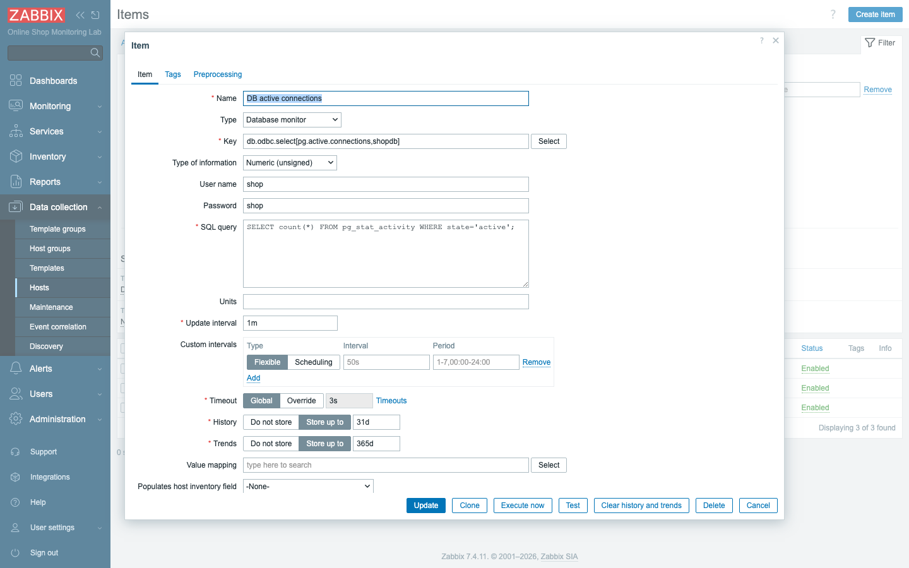
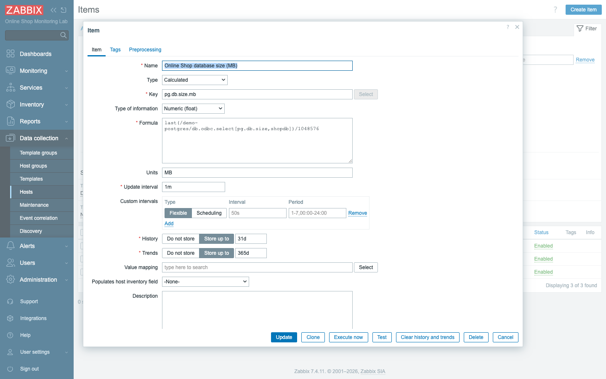
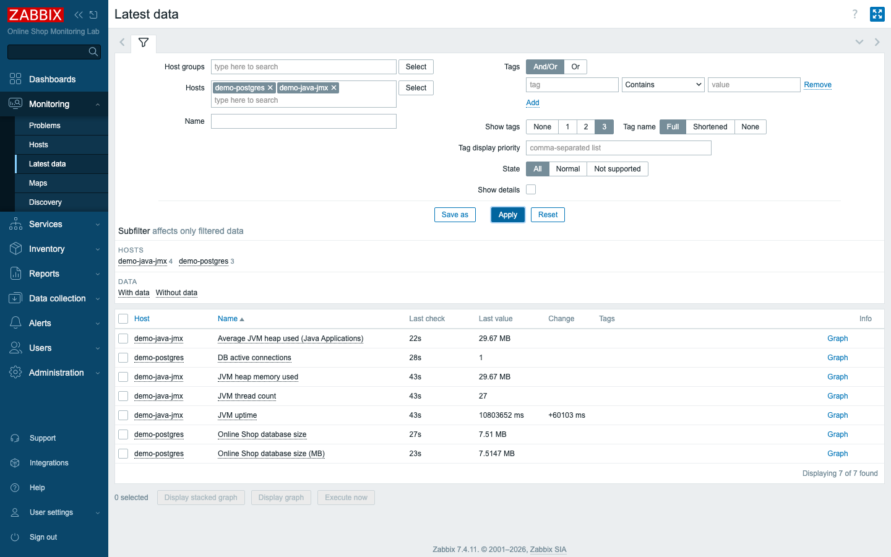

# Module 22: Performance Monitoring

## Learning Objectives

By the end of this module participants can collect performance data from sources
that are not plain agents: query a database over **ODBC**, read a Java
application's JVM over **JMX** (through the Zabbix **Java gateway**), and derive new
metrics with **calculated** and **aggregate** items — rounding out the Online
Shop's database and Java tiers.

## Topics

### Three ways to reach "deeper" performance data

Up to this point most of the Online Shop's data has flowed in through an agent
sitting on or beside a host. That covers the easy ground — CPU, memory, disk — but
the slowest, most painful moments in a real system tend to hide below that layer.
A customer's checkout stalls not because a container is down but because the
database has run out of free connections, or a background Java worker is spending
all its time garbage-collecting instead of working, or because the number you
actually care about doesn't exist anywhere yet and has to be *computed* from two
others. Each of those is a different kind of blind spot, and Zabbix ships a
purpose-built collector for each one.

- **ODBC** — run SQL against a database and store the result as an item.
- **JMX** — read a Java app's managed beans (memory, threads, uptime) via the
  **Java gateway**.
- **Calculated / aggregate items** — build new metrics from existing ones,
  on one host or across many.

The thread tying all three together is that none of them needs an agent on the
target. The server (for ODBC and calculated items) or the Java gateway (for JMX)
reaches out and fetches the value. That makes them ideal for the parts of the
Online Shop you can't or don't want to install software on — and it's exactly why
this module finally lets us monitor the database and Java tiers properly.

### Database monitoring with ODBC

The first deeper source is the database itself. The Online Shop's `demo-postgres`
holds the catalog and the orders, and when it gets into trouble — too many active
connections, a disk filling with table data — the symptoms surface everywhere
*else* before you can see the cause. To watch the cause directly, you ask the
database the same questions a DBA would: how many connections are busy right now,
how big has the data grown? In Zabbix you do that with an **ODBC item**.

An **ODBC item** (item type **Database monitor**) lets the Zabbix **server** open a
database connection and run a `SELECT`, storing the first value of the result. It
needs three things on the server:

1. An **ODBC driver** for the database (here the PostgreSQL driver
   `psqlodbcw.so`).
2. A **driver registration** in `/etc/odbcinst.ini`.
3. A **DSN** (data source name) in `/etc/odbc.ini` describing the target.

Think of the DSN as a saved connection profile: instead of repeating the host,
port, and database in every item, you name them once and refer to that name. In
this lab those three pieces are **baked into the server image**
(`content/lab/zabbix-server/`) so ODBC works out of the box; the DSN is named
**`shopdb`** and points at `demo-postgres` / database `shop`:

```ini
# /etc/odbcinst.ini
[PostgreSQL]
Driver = /usr/lib/psqlodbcw.so

# /etc/odbc.ini
[shopdb]
Driver     = PostgreSQL
Servername = demo-postgres
Port       = 5432
Database   = shop
```

With the plumbing in place, the item itself is small. The item key is
`db.odbc.select[<unique-id>,<dsn>]` — the first parameter is just a label that
keeps the key unique, the second is the DSN to connect through. The **SQL** lives
in the item's *SQL query* field and the login in *User name* / *Password*:



We collect two database performance metrics for the Online Shop, each a question a
human operator would actually ask:

- **Active connections** — `SELECT count(*) FROM pg_stat_activity WHERE
  state='active';`
- **Database size** — `SELECT pg_database_size('shop');`

The first warns you when the connection pool is saturating; the second feeds the
capacity-and-trend question — *at this growth rate, when does the disk fill?* —
that you met back in Module 1.

### Java application monitoring with JMX

The second deeper source is the Java service. The Online Shop's background worker
runs on the JVM, and the JVM is famously opaque from the outside: a process that
looks healthy at the OS level can be quietly drowning in garbage collection or
leaking heap. Java apps expose their internals through **JMX** (Java Management
Extensions) — MBeans for heap, threads, GC, uptime. The catch is that Zabbix does
**not** speak JMX directly; it asks the **Java gateway** (the `zabbix-java-gateway`
container), which connects to the app and returns the value. The server is already
wired to it (`ZBX_JAVAGATEWAY` and `ZBX_STARTJAVAPOLLERS` are set in
`compose_lab.yaml`), so the gateway is a helper standing between the server and
every Java host.

`demo-java-jmx` is a Tomcat app started with JMX on port **12345** (no auth, lab
only). The host carries a **JMX interface** (`demo-java-jmx:12345`), and items are
type **JMX agent** with a key naming the MBean and attribute:

```text
jmx["java.lang:type=Memory","HeapMemoryUsage.used"]
jmx["java.lang:type=Threading","ThreadCount"]
jmx["java.lang:type=Runtime","Uptime"]
```

Read those keys as a noun and an attribute of that noun: the *Memory* MBean's used
heap, the *Threading* MBean's thread count, the *Runtime* MBean's uptime. The exact
strings come straight from the JVM's own naming, which is why they have to be
quoted verbatim.

![A JMX agent item: jmx[] key, JMX interface, JMX endpoint](assets/module-22/02-jmx-item.png)

You won't normally have to fill in the connection string yourself. The **JMX
endpoint** `service:jmx:rmi:///jndi/rmi://{HOST.CONN}:{HOST.PORT}/jmxrmi`
is filled in by default and resolves from the host's JMX interface — the
`{HOST.CONN}` and `{HOST.PORT}` macros pull the address and port off the JMX
interface you defined on the host.

### Calculated and aggregate items

There is one more class of "deeper" data, and it isn't collected from anywhere at
all — you compute it. Sometimes the metric you want simply doesn't come off the
wire in the shape you need, and rather than collect a new thing you derive it from
things you already have.

- A **calculated item** (type **Calculated**) holds a **formula** referencing other
  items by `/host/key`. It runs on the server, no polling of the device. Example —
  database size in MB instead of bytes:

  ```text
  last(/demo-postgres/db.odbc.select[pg.db.size,shopdb])/1048576
  ```

  Here the ODBC item already gives you the size in bytes; the calculated item just
  takes its last value and divides, so a graph reads in MB without anyone touching
  the database again.

  

- An **aggregate** is a calculated item using a **`*_foreach`** function to roll up
  **many** items into one — averages, sums, counts across a host group. Example —
  average JVM heap across every host in *Java Applications*:

  ```text
  avg(last_foreach(/*/jmx["java.lang:type=Memory","HeapMemoryUsage.used"]?[group="Java Applications"]))
  ```

  Read it inside-out: `last_foreach` grabs the latest heap value from *every* host
  in the *Java Applications* group, and `avg` collapses that list into a single
  fleet-wide number. The beauty is that it re-evaluates the group at run time, so
  new Java hosts join the average on their own.

  (In Zabbix 7.x the old `aggregate` item type is gone — aggregation is just a
  calculated item with `avg/sum/count/min/max` over `*_foreach`.)

Whatever their source, all of these are ordinary items afterward: they show in
Latest data, draw graphs, and drive triggers, just like an agent metric does.



## Docker-Based Demonstration

The instructor shows the ODBC driver and DSN already present on the server, creates
the two ODBC database items, adds the `demo-java-jmx` host with a JMX interface and
three JVM items (collected through the Java gateway), then builds a calculated item
(bytes → MB) and an aggregate (`avg` heap across the Java group), and views them all
arriving together in Latest data.

## Hands-On Lab

1. **Confirm ODBC works on the server.** The PostgreSQL driver and the `shopdb`
   DSN are baked into the lab image — prove the connection:
   ```bash
   docker exec zabbix-server sh -c "echo 'SELECT count(*) FROM pg_stat_activity;' | isql -v shopdb shop shop"
   ```
   This tests the driver, the DSN, and the credentials in one shot, outside Zabbix,
   so any failure you hit later is a Zabbix problem and not a plumbing one.
   **Expected:** `Connected!` and a row count. If this fails, ODBC is misconfigured
   — fix it here before touching Zabbix.

2. **Create the host `demo-postgres`.** **Data collection → Hosts → Create host**,
   name `demo-postgres`, groups `Databases` and `Docker Lab`. No interface is
   needed — ODBC items run on the server.
   **Expected:** the host exists.

3. **Add the ODBC items.** On `demo-postgres` create two items, Type **Database
   monitor**, *User name* `shop`, *Password* `shop`:
   - `DB active connections` — key `db.odbc.select[pg.active.connections,shopdb]`,
     SQL `SELECT count(*) FROM pg_stat_activity WHERE state='active';`
   - `Online Shop database size` — key `db.odbc.select[pg.db.size,shopdb]`, SQL
     `SELECT pg_database_size('shop');`, Units `B`

   **Expected:** within a minute both collect values (a small connection count; a
   size of a few MB).

4. **Create the host `demo-java-jmx` with a JMX interface.** Create a host,
   groups `Java Applications` and `Docker Lab`, and add a **JMX interface**: DNS
   `demo-java-jmx`, port `12345`. The JMX interface is what tells the gateway where
   to connect, the same way an agent interface tells the server where the agent
   lives.
   **Expected:** the host has one JMX interface.

5. **Add the JVM items.** On `demo-java-jmx` create three items, Type **JMX agent**,
   on the JMX interface:
   - `JVM heap memory used` — `jmx["java.lang:type=Memory","HeapMemoryUsage.used"]`,
     Units `B`
   - `JVM thread count` — `jmx["java.lang:type=Threading","ThreadCount"]`
   - `JVM uptime` — `jmx["java.lang:type=Runtime","Uptime"]`, Units `ms`

   **Expected:** the Java gateway collects them within a minute — heap of tens of
   MB, a couple dozen threads, a climbing uptime.

6. **Build a calculated item.** On `demo-postgres`, create an item Type
   **Calculated**, key `pg.db.size.mb`, *Type of information* **Numeric (float)**,
   Units `MB`, Formula:
   ```text
   last(/demo-postgres/db.odbc.select[pg.db.size,shopdb])/1048576
   ```
   Notice you never query the database again here — the formula reuses the byte
   value the ODBC item already collected.
   **Expected:** it reports the same size as the ODBC item, in MB.

7. **Build an aggregate item.** On `demo-java-jmx`, create an item Type
   **Calculated**, key `jvm.heap.avg`, Units `B`, Formula:
   ```text
   avg(last_foreach(/*/jmx["java.lang:type=Memory","HeapMemoryUsage.used"]?[group="Java Applications"]))
   ```
   This is the fleet-wide average heap; the `*_foreach` filter decides which hosts
   are in the average each time it runs.
   **Expected:** with one Java host it equals that host's heap; add more Java hosts
   and it averages them — no edit required.

8. **View everything together.** **Monitoring → Latest data**, filter to
   `demo-postgres` and `demo-java-jmx`.
   **Expected:** ODBC, JMX, and calculated metrics side by side — the Online Shop's
   database and Java tiers now report performance.

## Expected Outcome

Participants can monitor a database over ODBC, a Java application over JMX via the
Java gateway, and compute derived metrics with calculated and aggregate items —
extending the Online Shop to its data and application tiers and setting up the
performance triggers and dashboards of later modules.
