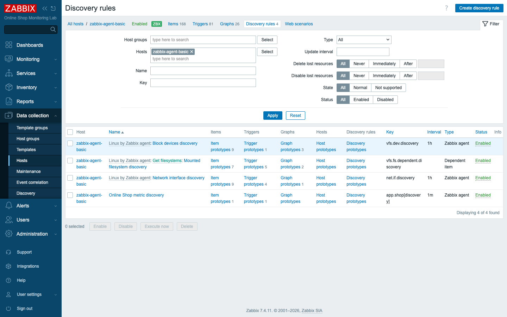
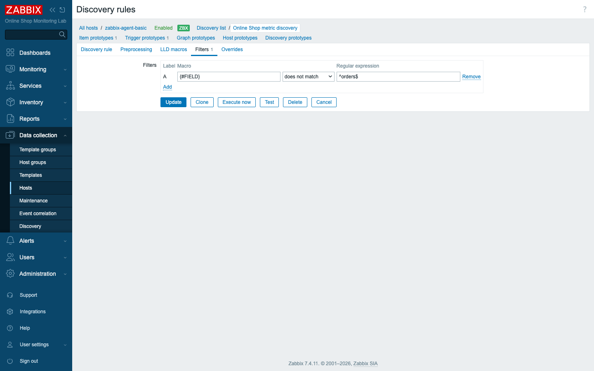
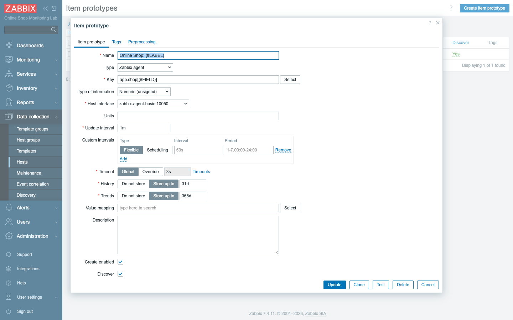
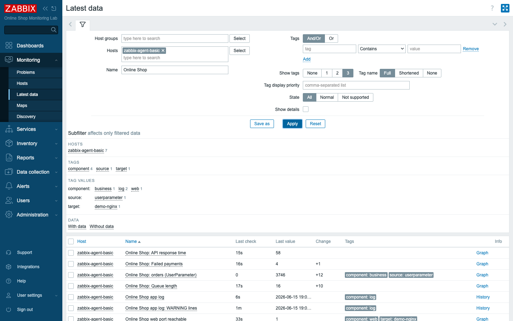

# Module 23: Low-Level Discovery (LLD)

## Learning Objectives

By the end of this module participants can explain **Low-Level Discovery**, read a
built-in discovery rule and its **prototypes**, write a **custom LLD rule** that
returns discovery JSON, use **LLD macros** and a **filter** to control what is
created, and let Zabbix **auto-generate items and triggers** instead of adding them
by hand.

## Topics

### Why LLD exists

Think back to Module 11, where we taught Zabbix to watch the Online Shop's business
metrics. You added each one **by hand** — one item per number. That worked because
there were only a handful of them and you knew their names in advance. The trouble
is that most of what you monitor is not like that. A host has an unknown number of
network interfaces, filesystems, CPUs, or services, and that number changes over
time: someone mounts a new disk, a container spins up another interface, a service
is retired. If every one of those required you to remember to log in and add an
item, your monitoring would always be a step behind reality.

**Low-Level Discovery** is Zabbix's answer to that problem. Instead of you telling
Zabbix what exists, Zabbix asks the host *"what do you have?"*, gets back a list,
and **creates an item (and trigger, and graph) for each discovered thing
automatically** — then keeps that list up to date as things come and go. You author
the *pattern* once; Zabbix does the multiplication and the housekeeping.

### The two halves: a discovery rule and its prototypes

For all its power, LLD is built from exactly two pieces, and once you see how they
fit together the rest of the module is just detail.

1. **A discovery rule** — a special item whose value is **JSON**: a list of objects,
   each describing one discovered entity with **LLD macros** (names in `{#...}`):

   ```json
   [
     {"{#IFNAME}":"eth0"},
     {"{#IFNAME}":"lo"}
   ]
   ```

   Read that as a host reporting, "I have two network interfaces, one called `eth0`
   and one called `lo`." The macro `{#IFNAME}` is the *slot*; the strings `eth0` and
   `lo` are what fills it on each pass.

2. **Prototypes** — templates for items, triggers, graphs, and even hosts, written
   **with the macros** instead of real values. For every object the rule returns,
   Zabbix substitutes the macros and creates a real entity:

   ```text
   item prototype  net.if.in[{#IFNAME}]   ->  net.if.in[eth0], net.if.in[lo]
   ```

   This substitution is the heart of LLD, so it is worth saying plainly: wherever a
   macro like `{#IFNAME}` appears in a prototype's key, name, or trigger expression,
   Zabbix replaces it with the concrete value from each discovered object and stamps
   out a real, independent entity. One prototype carrying `{#IFNAME}` over a list of
   two interfaces yields two real items; over a switch with forty-eight ports it
   would yield forty-eight — same prototype, no extra work from you.

### Built-in LLD is already running

You do not have to build LLD from nothing to see it in action — it has been working
in your lab since Day 1. The `zabbix-agent-basic` host is linked to **Linux by
Zabbix agent** (Module 6), which ships ready-made discovery rules — *Network
interface discovery* (`net.if.discovery`), *Block devices discovery*, *Mounted
filesystem discovery*. They have already discovered this host's interfaces and
created per-interface items like `net.if.in["eth0"]`. That is LLD working for you
out of the box, which means much of the "obvious" monitoring you take for granted
was generated, not typed.



### A custom LLD rule for the Online Shop

The built-in rules cover the operating system — interfaces, disks, mounts — but they
know nothing about *our* application. For the **Online Shop's own metrics** we write
a **custom** rule, and the cleanest way to feed it is from the script we already
have. We extend the Module 11 UserParameter script with a `discovery` mode that
returns LLD JSON listing the Online Shop's metrics, each with two macros — the API
field and a human label:

```json
[
  {"{#FIELD}":"orders","{#LABEL}":"Total orders"},
  {"{#FIELD}":"queue_length","{#LABEL}":"Queue length"},
  {"{#FIELD}":"failed_payments","{#LABEL}":"Failed payments"},
  {"{#FIELD}":"response_time_ms","{#LABEL}":"API response time"}
]
```

The discovery rule's key is `app.shop[discovery]` — the **same UserParameter**
(`app.shop[*]`) that already serves the metric values, just called with a
different argument. So the same script that answers `app.shop[orders]` with a number
answers `app.shop[discovery]` with the catalog of fields above. One script, two
jobs: hand out values, and describe what values exist.

### LLD macros and the filter

Notice that the JSON carries two macros per object, `{#FIELD}` and `{#LABEL}`, and
they come straight from the JSON the script emits — Zabbix reads them verbatim. But
discovering something is not the same as wanting to monitor it, and that is where a
**filter** comes in. A filter decides which discovered objects are kept, by matching
a macro against a regular expression. We already monitor `orders` manually (Module
11), so we **exclude** it — *"`{#FIELD}` does not match `^orders$`"* — and let LLD
create the rest. This is how you avoid duplicates and scope discovery to what you
care about: discovery finds everything, the filter keeps only what you asked for.



### Automating item and trigger creation

Now the payoff. One **item prototype** — `app.shop[{#FIELD}]`, named
`Online Shop: {#LABEL}` — becomes one real item per kept metric, with `{#FIELD}`
filling the key and `{#LABEL}` filling the visible name. One **trigger prototype** —
`nodata(/zabbix-agent-basic/app.shop[{#FIELD}],10m)=1` — becomes one real "no data"
trigger per item, each watching its own field. You author the pattern **once**;
Zabbix multiplies it.



When the rule runs, the items appear with live values — `queue_length`,
`failed_payments`, `response_time_ms` — while `orders` stays the original manual
item, untouched by discovery. That last point is the filter doing exactly what you
told it: `orders` was discovered but dropped, so the hand-made Module 11 item it
would have collided with is left alone.



### Lifecycle: lost resources

Discovery is not a one-time event; a discovery rule re-runs on its interval and
reconciles what it finds with what it created last time. So what happens when a
discovered object **disappears** — say an interface is removed? Zabbix doesn't
delete its items immediately, because that would throw away history the moment a
host hiccups. Instead the rule's **"Keep lost resources period"** marks them lost
and removes them after a grace window, so you keep history while it might still
matter. New objects, meanwhile, are added automatically on the next run. The list
stays current in both directions without you touching it.

## Docker-Based Demonstration

The instructor opens the host's discovery rules to show the built-in Linux LLD and
its per-interface items, then extends the Online Shop UserParameter script with a
`discovery` mode, confirms the JSON with `zabbix_get`, creates the custom discovery
rule with a filter that excludes `orders`, adds an item prototype and a trigger
prototype, runs the rule, and shows the new items and triggers appear by themselves.

## Hands-On Lab

1. **Look at built-in LLD.** On `zabbix-agent-basic`, open **Data collection →
   Hosts → Discovery rules**. Open *Network interface discovery* and its **Item
   prototypes**. Starting here grounds the abstraction in something already running,
   so you can see what a finished, working discovery rule actually looks like.
   **Expected:** prototypes like `net.if.in["{#IFNAME}"]`; in **Latest data** you
   already see real items such as `Interface eth0: Bits received` — created by LLD,
   not by hand.

2. **Add a discovery mode to the UserParameter script.** Extend
   `content/lab/agent-userparams/online_shop.sh` so `online_shop.sh discovery`
   prints the LLD JSON above, then restart the agent so the bind-mounted script
   reloads:
   ```bash
   docker restart zabbix-agent-basic
   docker exec zabbix-server zabbix_get -s zabbix-agent-basic -k 'app.shop[discovery]'
   ```
   **Expected:** the JSON array of four `{#FIELD}`/`{#LABEL}` objects. *(Restart is
   needed because editing a single bind-mounted file replaces its inode.)*

3. **Create the custom discovery rule.** On `zabbix-agent-basic`, **Create
   discovery rule**: Name `Online Shop metric discovery`, Type **Zabbix agent**,
   Key `app.shop[discovery]`, Update interval `1m`. This is the rule that will pull
   the JSON you just verified and feed it to the prototypes you add next.
   **Expected:** the rule is saved and lists under Discovery rules.

4. **Add a filter to exclude `orders`.** On the rule's **Filters** tab, add
   `{#FIELD}` **does not match** `^orders$`. The anchored regex makes sure only the
   exact field `orders` is dropped, not anything that merely contains the word.
   **Expected:** the filter is saved; `orders` will be skipped (already monitored
   in Module 11).

5. **Add an item prototype.** Under the rule → **Item prototypes → Create item
   prototype**: Name `Online Shop: {#LABEL}`, Type **Zabbix agent**, Key
   `app.shop[{#FIELD}]`, *Type of information* **Numeric (unsigned)**, interval `1m`.
   Each kept metric will get its own copy of this one pattern, with the macros filled
   in from its discovery object.
   **Expected:** one prototype that will expand per discovered metric.

6. **Add a trigger prototype.** Under the rule → **Trigger prototypes → Create
   trigger prototype**: Name `Online Shop: no data for {#LABEL}`, Severity
   **Average**, Expression
   `nodata(/zabbix-agent-basic/app.shop[{#FIELD}],10m)=1`. This gives every
   discovered item its own "is it still reporting?" check for free.
   **Expected:** one trigger prototype.

7. **Run discovery and verify.** Click **Execute now** on the rule (or wait one
   interval), then open **Monitoring → Latest data** (filter `zabbix-agent-basic`,
   name `Online Shop`).
   **Expected:** three new items — `Online Shop: Queue length`, `Failed payments`,
   `API response time` — collecting values; `orders` remains the original manual
   item. Three matching "no data" triggers now exist under the host. You added
   **one** prototype and got **three** items and **three** triggers.

## Expected Outcome

Participants can read and write LLD: understand the rule-plus-prototype model, use
the built-in OS discovery, author a custom discovery rule fed by a UserParameter,
shape results with macros and a filter, and have Zabbix auto-create and maintain
items and triggers — the technique that makes large environments manageable.
