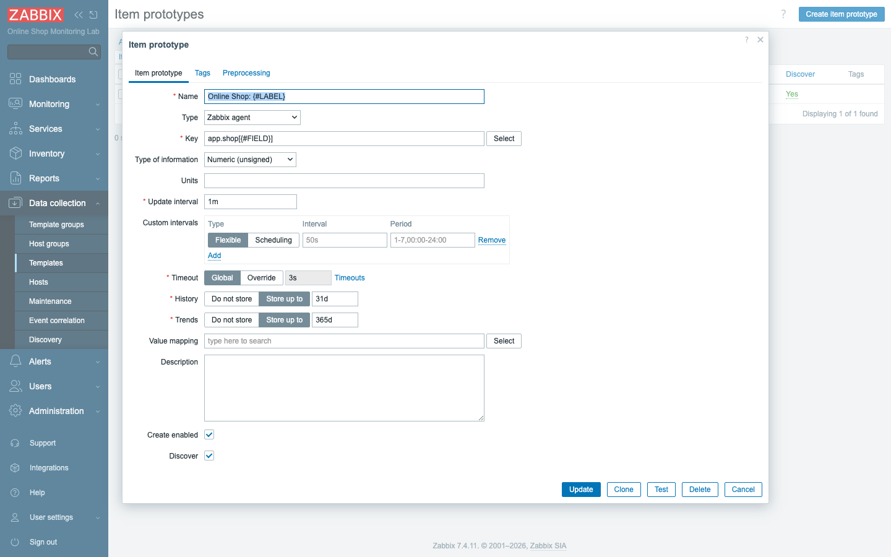
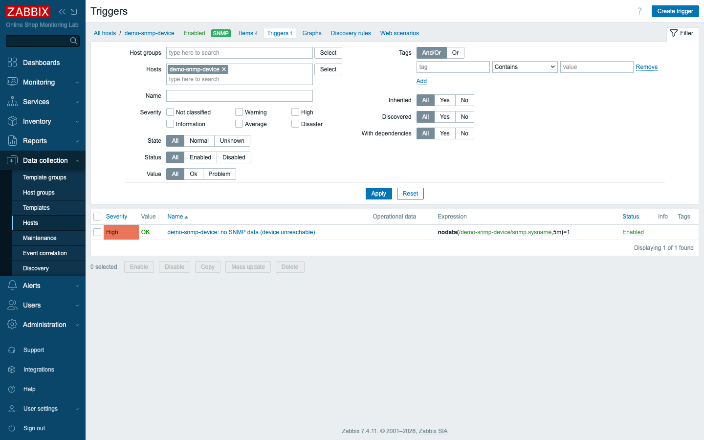
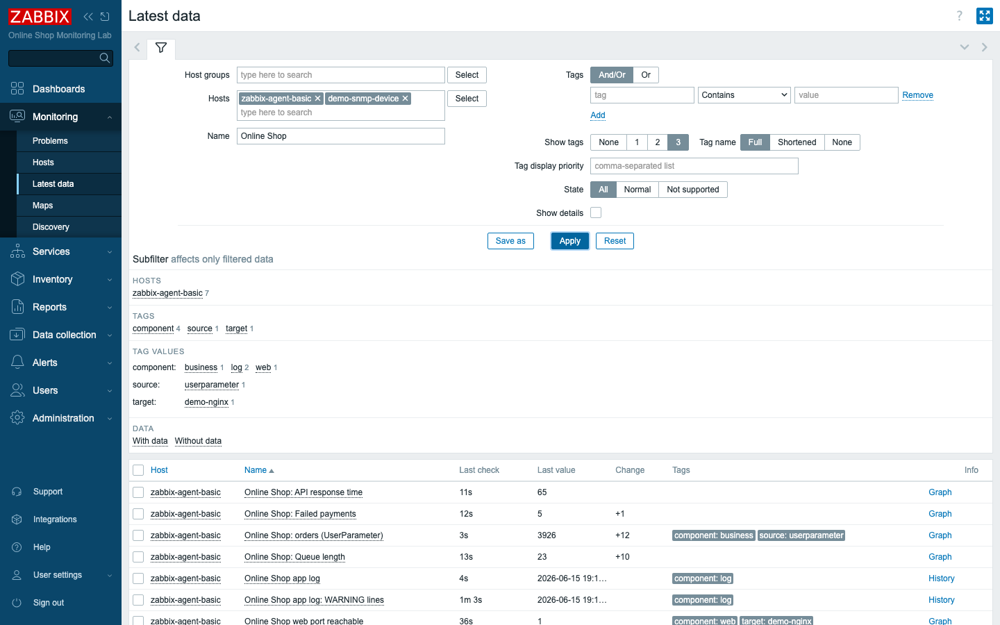

# Module 24: Practical Lab — Day 3

## Learning Objectives

By the end of this module participants can consolidate Day 3 end to end: **package**
a custom discovery rule into a **reusable, exportable template**, link it so items
and triggers are created by inheritance, **verify** SNMP and log monitoring, and add
an SNMP **availability trigger** — proving they can apply advanced templates, LLD,
SNMP, and log monitoring together.

## Topics

### What Day 3 built — and why we consolidate now

Across Day 3 you added the Online Shop's advanced monitoring: templates and mass
operations (Modules 17–18), log monitoring (Module 19), SNMP (Module 20), web and
performance/ODBC/JMX (Modules 21–22), and Low-Level Discovery (Module 23). Each was
taught in isolation. A real engineer's job — and the Specialist exam — is to make
them work **together** and to make them **reusable**.

This practical lab does exactly that. It is mostly *application*, not new theory:
you take the custom LLD you wrote in Module 23, **package it into a template** (the
Module 18 skill), link that template so a host inherits the discovery, **export** it
as YAML so it can be shared, then run **verification checkpoints** across SNMP and
log monitoring and harden the SNMP host with an availability trigger.

### From host configuration to a reusable template

In Module 23 the discovery rule lived **on the host** `zabbix-agent-basic`. That
works, but it can't be reused — every new host would need it rebuilt by hand. The
professional move is to put the rule, its item prototype, and its trigger prototype
into a **template**, then **link** the template. The host then inherits the
discovery; the items and triggers it generates are identical, but now any host you
link gets the same monitoring for free.

When the template is linked, the host's discovered items show their origin — the
discovery rule's name prefixes each item — and the manual Module 11 `orders` item
sits beside them, untouched.

### Exporting for reuse and the exam

A template is portable: **export** it to YAML (Module 18) and it can be imported
into any Zabbix 7.4 server, version-controlled, or handed to a colleague. The
exported file captures the discovery rule, its filter, and both prototypes — the
whole capability in one artifact.

### Hardening SNMP with an availability trigger

Module 20 collected SNMP metrics but didn't alert. The practical adds the missing
piece: a trigger that fires when the device stops answering SNMP — `nodata()` on the
SNMP item over a window — so an unreachable network device raises a problem.

## Docker-Based Demonstration

The instructor creates the `Online Shop App by Zabbix agent` template, moves the
custom LLD into it, removes the host-level rule, links the template, and shows the
discovered items reappear by inheritance. Then they export the template to YAML, add
the SNMP availability trigger, and run the Day-3 verification checkpoints in Latest
data.

## Hands-On Lab

### Part A — Package the custom LLD into a reusable template

1. **Create the template.** **Data collection → Templates → Create template**:
   name `Online Shop App by Zabbix agent`, template group `Templates/Online Shop`.
   **Expected:** the template exists in that group.

2. **Add the discovery rule to the template.** On the template, create an LLD rule
   identical to Module 23: Name `Online Shop metric discovery`, Type **Zabbix
   agent**, Key `app.shop[discovery]`, interval `1m`, with the **filter** `{#FIELD}`
   does not match `^orders$`.
   **Expected:** the rule is saved on the template (no interface — templates have
   none).

3. **Add the prototypes.** Under the rule, add an **item prototype**
   `Online Shop: {#LABEL}` (key `app.shop[{#FIELD}]`, Numeric unsigned) and a
   **trigger prototype** `Online Shop: no data for {#LABEL}`
   (`nodata(/Online Shop App by Zabbix agent/app.shop[{#FIELD}],10m)=1`).
   **Expected:** one item prototype and one trigger prototype on the template.

4. **Remove the host-level rule and link the template.** On `zabbix-agent-basic`,
   **delete** the host-level `Online Shop metric discovery` rule (from Module 23),
   then **link** the `Online Shop App by Zabbix agent` template to the host.
   **Expected:** the host now lists both `Linux by Zabbix agent` and `Online Shop
   App by Zabbix agent` as linked templates.

5. **Verify inheritance.** Open **Data collection → Hosts → zabbix-agent-basic →
   Items**, filter key `app.shop`.
   **Expected:** the three discovered items (`queue_length`, `failed_payments`,
   `response_time_ms`) are re-created — now **via the template's** discovery rule —
   and `app.shop[orders]` remains the manual item. Values keep collecting.

6. **Export the template.** Select the template and **Export** as **YAML**.
   **Expected:** a YAML file containing the discovery rule, its filter, and both
   prototypes — a portable artifact (saved as
   `content/lab/templates/online-shop-app-by-zabbix-agent.yaml`).

### Part B — Harden SNMP monitoring

7. **Add an SNMP availability trigger.** On `demo-snmp-device`, create a trigger:
   Name `demo-snmp-device: no SNMP data (device unreachable)`, Severity **High**,
   Expression `nodata(/demo-snmp-device/snmp.sysname,5m)=1`.
   **Expected:** the trigger saves and shows **OK** while the device answers; it
   would fire if SNMP stopped responding (as it did when you broke the community in
   Module 20).

### Part C — Verify SNMP and log monitoring

8. **Checkpoint SNMP.** **Monitoring → Latest data** for `demo-snmp-device`.
   **Expected:** `snmp.sysname`, `snmp.sysdescr`, `snmp.sysuptime`, `snmp.ifnumber`
   all collecting (Module 20).

9. **Checkpoint logs.** **Monitoring → Latest data** for `zabbix-agent-basic`, and
   **Monitoring → Problems**.
   **Expected:** the `log[...]` items are collecting and the `ERROR in Online Shop
   app log` trigger (Module 19) still raises problems as the app logs ERROR lines.

10. **See it consolidated.** In **Latest data**, filter to `zabbix-agent-basic` and
    `demo-snmp-device`, name `Online Shop`.
    **Expected:** the Online Shop's app metrics (discovered + manual) and log items
    collect together — the Day-3 picture in one view.

    

## Expected Outcome

Participants have packaged the Online Shop's custom discovery into a reusable,
exported template; a host generating its app monitoring by inheritance; an SNMP
availability trigger; and verified, working SNMP and log monitoring — a complete,
portable Day-3 result they could rebuild on any Zabbix 7.4 server.

## Instructor Notes

- **This is an integration lab — let students drive.** The mechanics were all taught
  in Modules 17–23; the goal here is fluency and joining them. Resist re-teaching;
  coach when they get stuck and point back to the specific module.
- **Why template, not host config.** Hammer the reuse argument: host-level config is
  a one-off; a template is the unit you ship, version, and reuse. Exporting to YAML
  makes it reviewable in git — the same discipline this whole course follows.
- **The refactor is non-destructive to data that matters.** Deleting the host LLD
  rule removes its *discovered* items briefly; linking the template re-creates them
  with the same keys, so history continuity is preserved and the manual `orders`
  item is never touched. Show the "via" column so students see the new origin.
- **`nodata()` is the availability primitive.** It works for SNMP, logs, agent items
  — anything that should report regularly. Tie Part B back to Module 20's broken
  community: that failure is exactly what this trigger would catch.
- **Lab vs production.** In production you would link this template to *many* app
  hosts at once (Module 17 mass operations), and the UserParameter behind
  `app.shop[*]` would be deployed by configuration management, not a bind mount.
- **Common mistakes to watch for:** forgetting the template has no interface;
  writing the trigger-prototype expression against the host instead of the template
  name; leaving the host-level rule in place and hitting a duplicate-key error on
  link; over-broad LLD filters that re-create `orders`.
- **Exam framing.** Specialist tasks combine these skills under time pressure. Drill
  the loop: *discover → prototype → filter → template → link → export → alert.*
- **Timing (~45 min).** ~20 min Part A (template + prototypes + link + verify +
  export), ~8 min Part B (SNMP trigger), ~12 min Part C (checkpoints + consolidated
  view), ~5 min recap and Day-3 wrap-up.

## Lab-State Delta

Added in Module 24 (Day-3 capstone — kept):

- **Template `Online Shop App by Zabbix agent` (templateid `10796`)** in
  `Templates/Online Shop` — contains LLD rule `Online Shop metric discovery`
  (`71515`, key `app.shop[discovery]`, filter `{#FIELD}` not match `^orders$`), item
  prototype `Online Shop: {#LABEL}` (`71516`, `app.shop[{#FIELD}]`), trigger
  prototype `Online Shop: no data for {#LABEL}` (`33046`).
- **Refactor:** the Module 23 **host-level** rule (`71510`) on `zabbix-agent-basic`
  was **deleted**; the template is now **linked** to `zabbix-agent-basic` (10780),
  which inherits the discovery (3 items + 3 triggers re-created via the template).
  Manual `app.shop[orders]` (Module 11) unchanged.
- **Exported artifact (committed):**
  `content/lab/templates/online-shop-app-by-zabbix-agent.yaml` (real 7.4 export).
- **SNMP trigger on `demo-snmp-device` (10793):** `demo-snmp-device: no SNMP data
  (device unreachable)` (triggerid `33051`,
  `nodata(/demo-snmp-device/snmp.sysname,5m)=1`, High).
- Verified collecting: SNMP items (Module 20), log items + ERROR trigger (Module
  19). Screenshots in `content/day-3/assets/module-24/`. Lab at 8 hosts.
