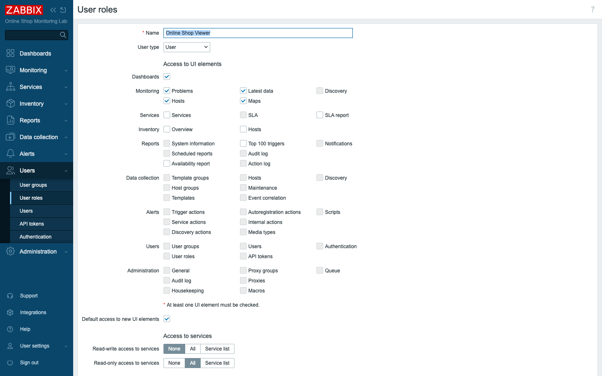
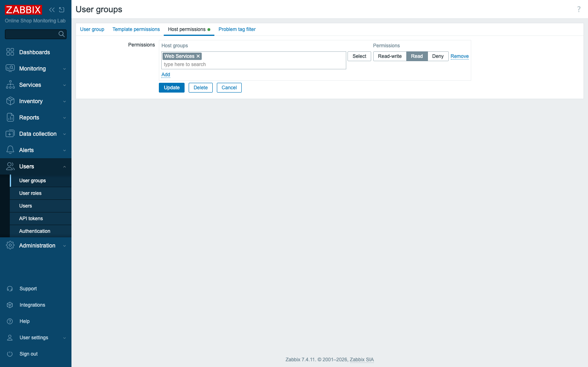
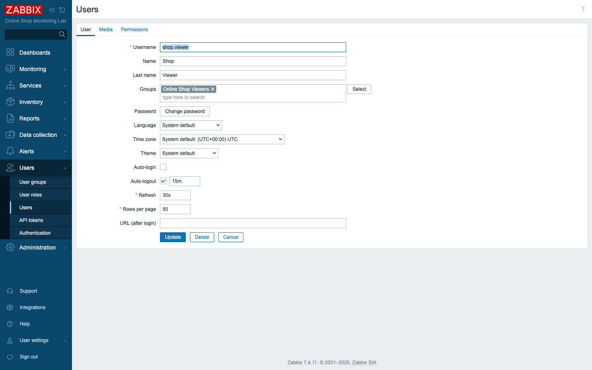
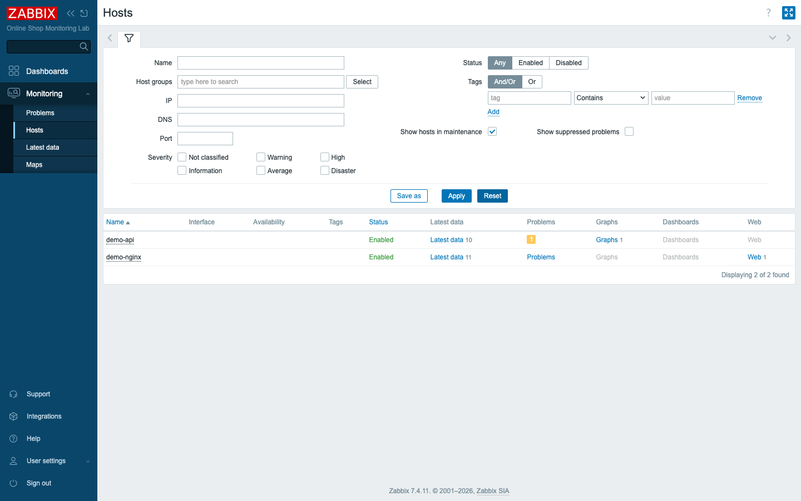

# Module 25: User Management

## Learning Objectives

By the end of this module participants can control **who sees and changes what** in
Zabbix: explain the **users / user groups / roles** model, create a **custom role**,
grant **host-group permissions** through a user group, create a user, and prove the
result by logging in as that user — applying **least privilege** to the Online Shop
team and understanding where **external authentication** fits.

## Topics

### Why access control matters

Up to now you have worked as **Admin**, who can do everything. A real Online Shop
has many people around the monitoring: an on-call viewer who should *read* the web
tier and nothing else, a monitoring admin who *configures* hosts and triggers, and a
super admin who manages *users and the platform itself*. Giving everyone Admin is a
security and operational risk. Zabbix lets you grant exactly the access each person
needs — **least privilege** — and this module builds it for the Online Shop.

### The three-part model: users, user groups, roles

Zabbix access control has three pieces, and you need all three:

- A **role** defines *what kind of capabilities* a person has — which UI sections,
  which actions, API access. Every role is based on one of three **user types**:
  **User**, **Admin**, or **Super admin**.
- A **user group** defines *what data* its members can see — **permissions on host
  groups** — plus frontend access and authentication settings.
- A **user** is a person; they are assigned **one role** and belong to **one or more
  user groups**.

> Capability comes from the **role**; visibility comes from the **user group**. A
> user needs both to be useful.

### User types and roles

The **user type** is the ceiling:

- **User** — sees only **Monitoring**-style views; cannot reach Data collection or
  Administration. The typical *viewer/operator*.
- **Admin** — can configure hosts, items, triggers, templates, and actions for the
  host groups they are permitted, but not manage users or global settings.
- **Super admin** — full control, including users, roles, and authentication; always
  sees **every** host group regardless of permissions.

A **role** refines a type: starting from *User*, you can switch off UI sections
(Inventory, Reports, Services) and disable **actions** to make a strictly read-only
viewer. We build exactly that — `Online Shop Viewer`.

### Permissions are granted on host groups, through user groups

A user is **denied everything by default** and gains visibility only where their
user group grants it, per **host group**:

- **Read** — see the hosts and their data.
- **Read-write** — see and (with an Admin role) configure them.
- **Deny** — explicitly hide them.

Two rules matter: permissions attach to **host groups**, not individual hosts; and
**Deny always wins** when a user is in multiple groups. We give the `Online Shop
Viewers` group **Read** on **Web Services** only — so its members see the web tier
and nothing else.

### Frontend access and external authentication

A user group also sets **Frontend access** (System default / Internal / LDAP / Disabled)
and can disable login entirely. Authentication itself is configured under **Users →
Authentication**:

- **Internal** — Zabbix stores the password (what this lab uses).
- **LDAP / Active Directory** and **SAML (SSO)** — **external authentication**: the
  identity provider verifies the user, while Zabbix still decides *authorization*
  from the user's group and role. This is the production norm so people use their
  corporate accounts and offboarding is centralized.

> **TO-VERIFY / concept only:** real LDAP/SAML needs an external identity provider,
> which this Docker lab does not include. We teach the concept and where to configure
> it; the lab uses Internal authentication.

### A user, assembled

The user `shop.viewer` ties it together: the `Online Shop Viewer` role (capability)
plus the `Online Shop Viewers` group (visibility).

## Docker-Based Demonstration

The instructor creates the read-only role, creates a user group with Read on Web
Services, creates the `shop.viewer` user, then **logs in as that user** in a private
window to show the effect: a trimmed menu and only the Online Shop's web hosts —
the proof that the permission model works.

## Hands-On Lab

1. **Create a read-only role.** **Users → User roles → Create user role**: Name
   `Online Shop Viewer`, **User type** `User`. Under *Access to UI elements* leave
   **Monitoring** and **Dashboards** checked but **uncheck** Inventory, Reports, and
   Services; set *Access to actions* off (read-only). **Add.**
   **Expected:** the role is saved with User type and a Monitoring-only UI.

2. **Create a user group with host-group permissions.** **Users → User groups →
   Create user group**: Name `Online Shop Viewers`. On the **Host permissions** tab,
   add host group **Web Services** with permission **Read**. **Add.**
   **Expected:** the group lists `Web Services: Read`.

3. **Create the user.** **Users → Users → Create user**: Username `shop.viewer`,
   Name/Last name as you like, **Groups** = `Online Shop Viewers`, set a strong
   password `<StrongPassw0rd!>` (it must not contain the name or username), and on
   the **Permissions** tab set **Role** = `Online Shop Viewer`. **Add.**
   **Expected:** the user exists with that role and group.

4. **Verify by logging in as the user.** Open a **private/incognito window**, sign in
   as `shop.viewer`.
   **Expected:** the left menu shows only **Dashboards** and **Monitoring** — no Data
   collection, Alerts, Users, Administration, Inventory, Reports, or Services.

5. **Confirm the data scope.** As `shop.viewer`, open **Monitoring → Hosts**.
   **Expected:** only **demo-api** and **demo-nginx** (the Web Services group) appear
   — every other host (database, SNMP, Java) is hidden. The viewer cannot
   acknowledge or edit anything (read-only).

   

6. **Look at where external auth lives (concept).** Back as Admin, open **Users →
   Authentication**.
   **Expected:** tabs for **LDAP** and **SAML** — the place you would point Zabbix at
   a corporate directory in production. Leave it on the default for the lab.

## Expected Outcome

Participants have a working least-privilege setup for the Online Shop: a read-only
role, a user group scoped to the web tier, and a user who — when logged in — sees
only what they should. They can explain user types, the role-vs-group split,
host-group permission levels, the Deny precedence rule, and the role of external
authentication.

## Instructor Notes

- **Lab vs production.** We use **Internal** authentication; production uses
  **LDAP/AD or SAML** so people log in with corporate accounts and leavers are
  disabled centrally. The authorization model (groups + roles) is identical — only
  the *authentication* source changes.
- **Capability vs visibility — the #1 confusion.** A user with an Admin role but no
  host-group permission can configure *nothing*; a user with Read everywhere but a
  User role can *see* but not change. Students must set **both** correctly. Diagnose
  "I can't see my hosts" at the user **group** first.
- **Deny wins.** When a user is in several groups, an explicit **Deny** on a host
  group overrides any Read/Read-write from another group. Use Deny deliberately to
  carve out sensitive hosts.
- **Super admin ignores permissions.** A Super admin always sees all host groups —
  never rely on permissions to hide data from a super admin; limit *who* is one.
- **Least privilege and named accounts.** Give each person their own account and the
  minimum role/permissions. Don't share the `Admin` login; create real users. The
  course's separation of *training* vs *production* users is the same idea — practice
  accounts should never carry production-level rights.
- **Password policy is enforced.** Zabbix 7.4 rejects weak passwords and ones that
  contain the username/name — expect that during the lab and choose a strong,
  unrelated password.
- **Guest access.** The built-in **Guest** user (User type) allows anonymous viewing
  if enabled; keep it disabled unless you intend public read-only dashboards.
- **Timing (~45 min).** ~12 min the model (users/groups/roles, types, permissions),
  ~10 min build the role, ~10 min user group + user, ~8 min log in and verify scope,
  ~5 min authentication concept + least-privilege recap.

## Lab-State Delta

Added in Module 25 (kept — access control for the Online Shop):

- **Role:** `Online Shop Viewer` (roleid `5`), **User type User**, UI limited to
  Dashboards + Monitoring (Inventory/Reports/Services disabled), **actions denied**
  (read-only).
- **User group:** `Online Shop Viewers` (usrgrpid `14`) — **Read** on host group
  `Web Services` (24); frontend access System default; internal auth.
- **User:** `shop.viewer` (userid `3`) — role `Online Shop Viewer`, group `Online
  Shop Viewers`. Verified by login: menu trimmed to Monitoring; only `demo-api` and
  `demo-nginx` visible; read-only.
- External authentication (LDAP/SAML) discussed as concept only (no IdP in the
  Docker lab). Screenshots in `content/day-4/assets/module-25/`.
