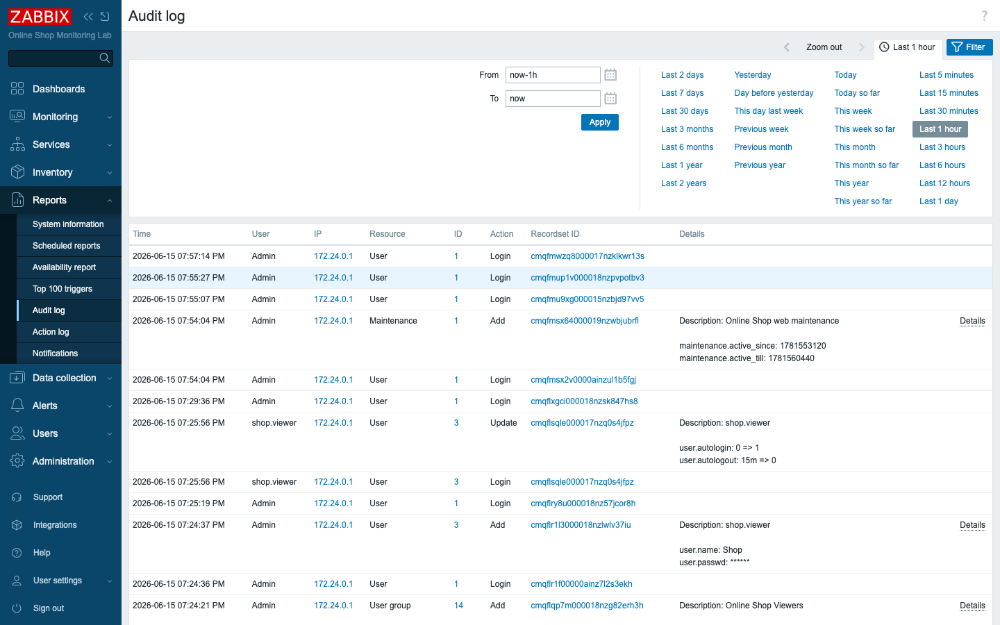
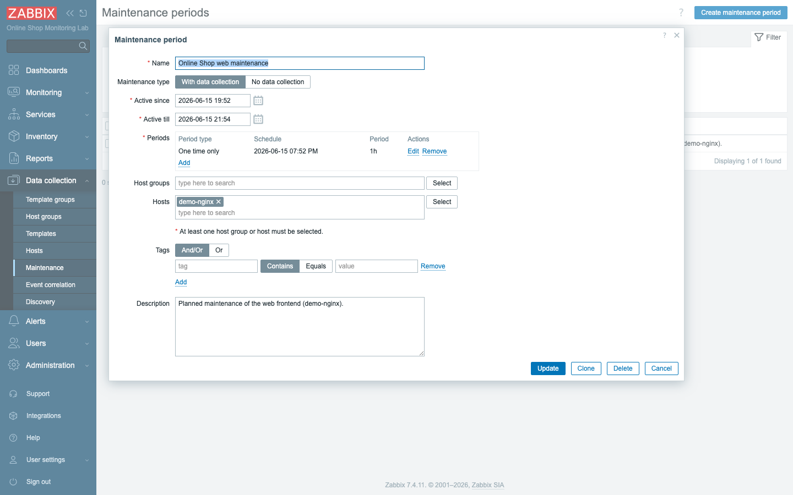
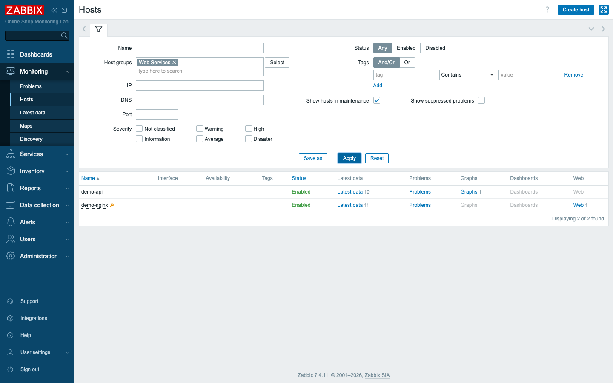
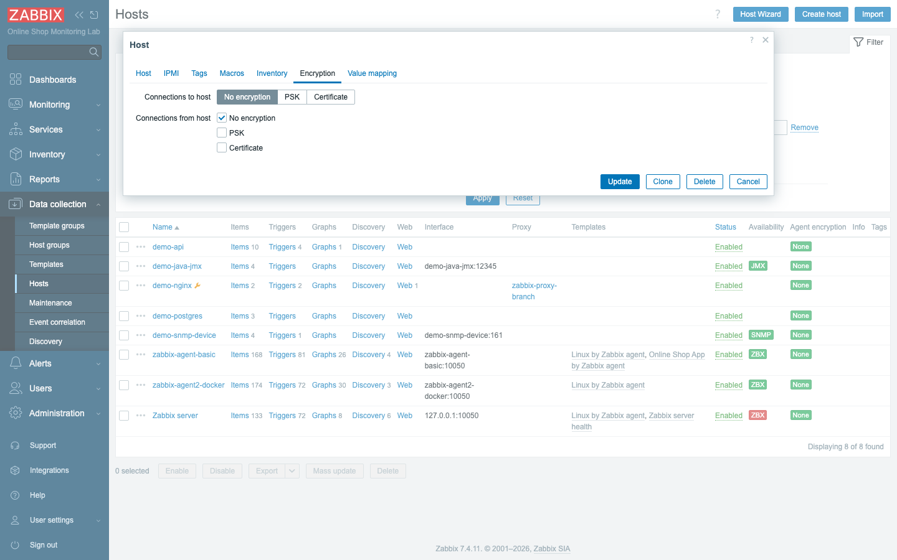

# Module 26: Security Best Practices

## Learning Objectives

By the end of this module participants can harden a Zabbix deployment: explain the
core hardening steps, use the **audit log** to track who changed what, schedule
**maintenance mode** so planned work doesn't generate false alerts, and describe
**agent allowed-server** restrictions and **PSK/certificate encryption** — plus the
Docker-specific secret-handling concerns for this lab.

## Topics

### What "securing Zabbix" actually means

Stop and think about how much trust the Online Shop has placed in its monitoring
system. To watch the web frontend, the API, the database, the Java service, and the
network device, Zabbix has to be able to reach every one of them — and to do that it
holds their addresses, their access credentials, and a map of how the whole estate
fits together. On top of that it knows who gets paged when something breaks. A tool
with that much reach and that much knowledge is, by definition, a high-value target.
If an attacker owns your monitoring server, they have a head start on owning
everything it monitors. That is why securing Zabbix is never a single switch you flip;
it is a set of layers, each closing a different kind of gap:

- **Accounts:** change defaults, use named least-privilege users (Modules 2 and 25),
  never share `Admin`.
- **Accountability:** keep an **audit trail** of configuration and login activity.
- **Operations:** use **maintenance mode** so expected downtime doesn't page anyone.
- **Transport:** restrict which server may talk to each agent, and **encrypt** the
  agent↔server channel.
- **Platform:** protect the frontend, the database, backups, and — here — Docker
  secrets.

You have already built some of these layers without calling them "security." Module 2
made you change the default `Admin` password the moment the stack came up; Module 25
gave you scoped roles and a read-only `shop.viewer` account instead of handing
everyone the keys. This module picks up where that left off and walks the layers that
are new, building on the access control you put in place in Module 25.

### Audit logging and event tracking

Imagine the worst version of a Monday morning: a trigger that used to page the on-call
has gone silent, or a host that was there last week has simply vanished from the
configuration. Someone changed something, but who, and when, and exactly what? Without
a record, you are reduced to guessing and accusations. With a record, you have a
timeline. That record is the **audit log**, and Zabbix keeps it for you automatically.

Every configuration change and login is recorded in **Reports → Audit log**: the
time, the **user**, their **IP**, the **resource** affected, the **action**
(add/update/delete/login), and a **details** diff of what changed. When a trigger
mysteriously stops firing or a host disappears, the audit log answers *who did it
and when* — essential for incident review and for any compliance regime.



The point of recording the IP and the exact diff, not just "something changed," is
that those details turn a vague suspicion into an answer you can act on. In our lab the
audit log already shows the Module 25 work — the `Online Shop
Viewers` group and `shop.viewer` user being added, with full details. Audit logging
is on by default; in production you also forward these records to a SIEM and protect
them from tampering.

### Maintenance mode

Here is a problem that catches every monitoring team eventually. Tonight you are going
to patch the Online Shop's web server and restart its web tier. You *know* the site
will go dark for a few minutes — that is the whole point of the work. But Zabbix
doesn't know that. As far as it is concerned, the web frontend just stopped answering,
which is exactly the condition it was built to scream about. So it raises problems and
pages the on-call engineer for an outage you scheduled yourself. Do that often enough
and your team learns to ignore alerts, which defeats the entire purpose of having them.

When you patch a server or restart the Online Shop's web tier, its checks will fail
— and without warning Zabbix would raise problems and **page the on-call for work
you already know about**. A **maintenance period** tells Zabbix "expected downtime
here": problems for those hosts are **suppressed** (hidden unless you opt to show
them), so alerts stay meaningful.

Think of a maintenance period as a note pinned to specific hosts that says "expect
trouble here, between these times — don't bother anyone about it." To write that note
precisely, a maintenance period has three things you configure:

- **Maintenance type** — *With data collection* (keep collecting, just suppress) or
  *No data collection* (stop polling those hosts entirely during the window).
- An **active window** (`Active since`/`Active till`) and one or more **Periods**
  (one-time, daily, weekly, monthly) that define *when* it actually applies.
- The **hosts or host groups** it covers, optionally narrowed by **tags**.

The split between the active window and the periods trips people up at first, so it is
worth pinning down. The active window is the outer boundary — the span of dates during
which this maintenance entry is allowed to do anything at all. The periods are the
actual recurring or one-time slots inside that boundary when suppression switches on.
A nightly backup window, for example, would have a wide active window of several months
and a daily period of one hour each night.



You don't have to refresh anything for the effect to appear; the server's own timer
notices when a period becomes active and applies it. Once the server's timer applies it, the host shows an **orange wrench** in
**Monitoring → Hosts**, and its problems are suppressed for the window.



### Agent security: the allowed server

An agent running on the Online Shop's web host is, in effect, a small data service
listening on the network. Left wide open, anyone who can reach it could ask it about
the host — its processes, its disk, its configuration — which is information you would
rather not hand out. The defense is simple and built in: tell the agent which server
it is allowed to talk to, and have it refuse everyone else.

A Zabbix agent should answer **only** the server you trust. The agent's
**`Server`** parameter (in this lab the `ZBX_SERVER_HOST` env value, which becomes
`Server=zabbix-server`) is an allow-list of who may query it passively;
**`ServerActive`** is where it sends active checks. Anything else is refused. In
production you pin these to your server/proxy IPs and firewall port **10050** so the
agent isn't an open data source.

### Encryption and certificate management (concept)

There is a difference between *who* may talk to the agent and *whether anyone in the
middle can read the conversation*. The allowed-server setting handles the first; it
does nothing about the second. By default, the measurements flowing from agent to
server in this lab travel in the clear, which is acceptable inside an isolated Docker
network but unacceptable the moment that traffic crosses a real, shared, or public
network.

By default the lab's agent↔server traffic is **unencrypted** — fine on an isolated
Docker network, not for production. Zabbix supports two encryption modes, configured
per host on the **Encryption** tab (and matched in the agent config):

- **PSK (pre-shared key)** — a shared identity + key on both ends. Simple, good for
  a handful of hosts.
- **Certificate (TLS)** — X.509 certificates signed by your CA. Scales to many
  hosts and integrates with PKI, at the cost of certificate management.

The trade-off between the two is the familiar one. A pre-shared key is a single secret
string you copy to both ends — quick to set up, but every host you add is another place
that one secret has to live. Certificates push the work up front (you stand up a
certificate authority and sign certs) but then scale gracefully, because adding a host
means issuing it a cert rather than redistributing a shared secret.



> **TO-VERIFY / concept only:** enabling PSK or certificates requires matching TLS
> settings in each agent's config (and, for certs, a CA and signed certs). Doing it
> wrong silently drops the connection, so this lab leaves encryption **off** and
> teaches the model and where it is set. The Encryption tab and the `tls_connect`/
> `tls_accept` fields are real; only the rollout is out of scope here.

### Frontend, backups, and Docker secrets

The last layer is the platform underneath Zabbix itself — the web UI everyone logs into,
the database holding all the history, and, because this is a Docker course, the way
secrets reach the containers. Each of these is a door that an attacker would happily use:

- **Frontend security:** serve the web UI over **HTTPS**, set a session timeout, and
  restrict access — it is the front door to everything.
- **Backups:** the configuration and history live in the **database**; a real
  deployment takes regular DB dumps (and stores templates in git, as this course
  does) so it can be restored.
- **Docker secrets vs `.env`:** this lab passes passwords as **plain environment
  values** in `compose_lab.yaml` for clarity. That is a **lab shortcut** — in
  production use **Docker/Swarm secrets** or a vault so credentials aren't sitting in
  an env file or visible in `docker inspect`.

That last point is the easiest one to overlook precisely because it works fine. A
password sitting in an environment variable does its job perfectly — and is also
readable by anyone who can run `docker inspect` against the container, which is why
production reaches for secrets management instead. You will see this for yourself in
the lab.

## Docker-Based Demonstration

The instructor reviews the audit log (pointing at the Module 25 changes), creates a
maintenance period for `demo-nginx` and shows the wrench icon appear, opens the host
**Encryption** tab to explain PSK vs certificate, shows the agent's allowed-server
setting, and contrasts the lab's plain `.env` values with Docker secrets.

## Hands-On Lab

1. **Confirm the basics are already hardened.** Verify the `Admin` password was
   changed from the default (Module 2) and that a least-privilege user exists
   (`shop.viewer`, Module 25). This first step is a sanity check that the
   foundational layers from earlier modules are still in place before you build on them.
   **Expected:** no account uses the default `Admin`/`zabbix` password; named users
   exist with scoped roles.

2. **Review the audit log.** Open **Reports → Audit log**. This is where you go first
   whenever "something changed" and you need to know who and when.
   **Expected:** entries for the recent changes — the `shop.viewer` user and `Online
   Shop Viewers` group **Add** actions, with user, IP, and a details diff. Click
   **Details** on one to read the exact change.

3. **Create a maintenance period.** **Data collection → Maintenance → Create
   maintenance period**: Name `Online Shop web maintenance`, type **With data
   collection**, an active window covering now, add a **One time only** period of
   `1h`, and add host **demo-nginx**. **Add.** Choosing *With data collection* means
   graphs keep filling in even while problems are hidden.
   **Expected:** the period is saved and listed.

4. **See maintenance take effect.** Wait up to a minute, then open **Monitoring →
   Hosts** (filter host group `Web Services`). The short wait is the server's timer
   noticing that the period has become active.
   **Expected:** **demo-nginx** shows the **orange wrench** maintenance icon; any
   problems it raises during the window are **suppressed** (tick *Show suppressed
   problems* to reveal them). `demo-api` is unaffected.

5. **Inspect agent security.** Look at the agent's allowed server:
   ```bash
   docker exec zabbix-agent-basic sh -c 'printenv | grep ZBX_SERVER_HOST'
   ```
   **Expected:** `ZBX_SERVER_HOST=zabbix-server` — the agent answers only the lab
   server. In a non-container agent this is the `Server=` line in
   `zabbix_agentd.conf`.

6. **Open the Encryption tab (concept).** Edit `zabbix-agent-basic` → **Encryption**.
   This is purely to see where the model lives; you are reading the controls, not
   changing them.
   **Expected:** *Connections to/from host* offer **No encryption / PSK /
   Certificate**; the lab uses **No encryption**. Note where PSK identity/key or a
   certificate would go — do **not** enable it (it would drop the agent connection
   without matching agent config).

7. **Discuss Docker secrets.** Inspect how a password reaches a container:
   ```bash
   docker inspect zabbix-db --format '{{json .Config.Env}}'
   ```
   **Expected:** the DB password is visible in plain environment values — a lab
   shortcut. Discuss replacing it with **Docker secrets** or a vault in production.

8. **Clean up.** Delete the maintenance period (so it doesn't suppress alerts in the
   next module). A maintenance entry left running would quietly hide real outages, so
   removing it is part of doing the job correctly.
   **Expected:** demo-nginx leaves maintenance (the wrench disappears).

## Expected Outcome

Participants can articulate and apply Zabbix hardening: named least-privilege
accounts, an audit trail they can read, maintenance windows that prevent false
alerts, agent allowed-server restrictions, the PSK/certificate encryption model, and
the difference between lab `.env` shortcuts and production secret management.
