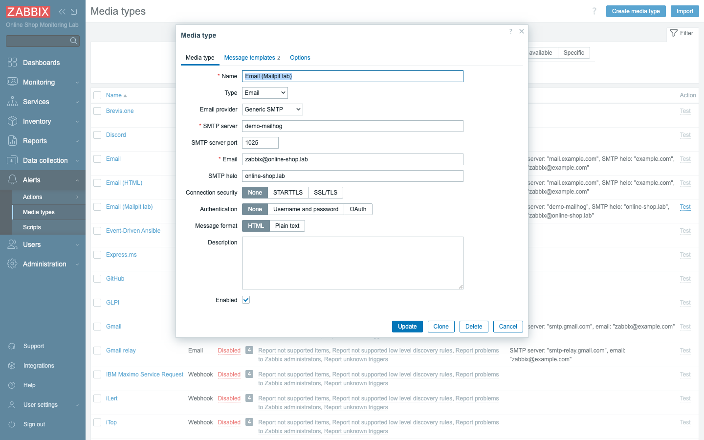
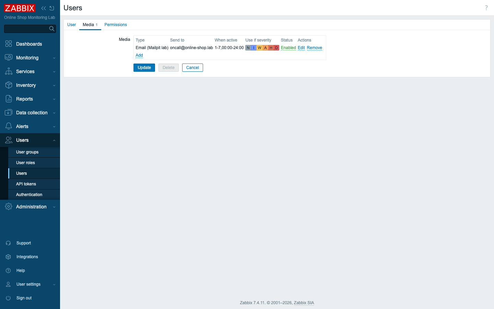
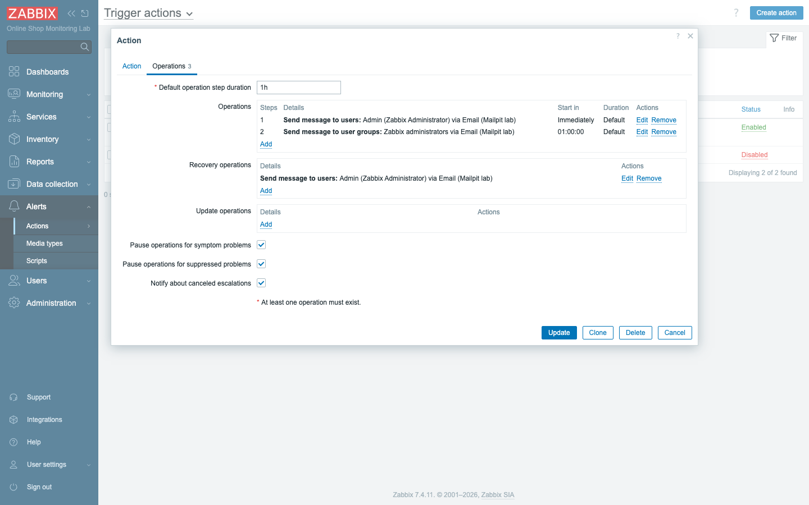
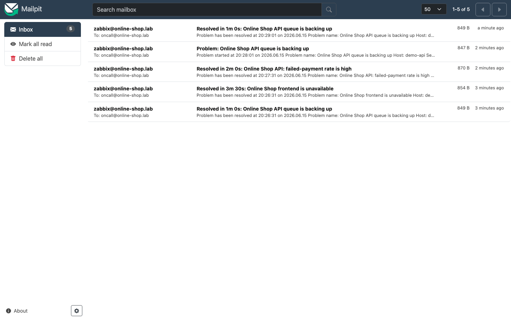

# Module 27: Alerting and Notifications

## Learning Objectives

By the end of this module participants can build **end-to-end alerting**: configure
a **media type** (email via the local Mailpit server), attach **media to a user**,
write a **trigger action** with **conditions**, **operations**, **escalation steps**,
and **recovery operations**, then prove it by generating a real problem and receiving
both a **problem** and a **recovery** email.

## Topics

### A trigger firing is not a notification

Up to this point, every problem you have created has lived in exactly one place:
the **Monitoring → Problems** screen. That screen is honest and useful, but it has
a fatal limitation as an alerting mechanism — it only works while someone is
staring at it. The web frontend going red at two in the morning is no help to the
Online Shop if the on-call engineer is asleep. Alerting is the bridge from "Zabbix
knows" to "a human is notified", and it is built from a fixed pipeline that you
must wire end to end:

```text
trigger fires → event → action (conditions match?) → operation →
   media type (how to send) + user media (where to send) + message template → notification
```

Read that pipeline left to right and notice that it is a chain, not a menu — every
link has to be present for a message to reach a person. If any link is missing —
no media type, no user media, no matching action, no message template —
**nothing is sent**, and nothing warns you that nothing was sent. This is why most
"alerting doesn't work" tickets turn out to be a single broken link in this chain
rather than anything exotic. Keep the pipeline in front of you as a checklist, and
debugging alerting becomes a matter of walking it in order.

### Media types — how a message is sent

The first link to understand is the **media type**, which defines the *channel* a
message travels over. Think of it as Zabbix's answer to the question "what kind of
delivery is this — an email, a chat post, a page?" Zabbix ships many of them out of
the box: **Email**, plus webhook integrations for **Slack, Microsoft Teams,
Discord, Telegram, PagerDuty**, and more. For the Online Shop we configure
**Email**, and we point it at the lab's local SMTP server, **demo-mailhog**
(Mailpit), so that no real mail ever leaves the lab and you can inspect every
message we generate:

- **SMTP server** `demo-mailhog`, **port** `1025`, no encryption, no auth (lab).
- A **from** address and HELO name.



Two other channels are worth understanding even though we will not build them here,
because students inevitably ask about them and because they reuse the exact same
pipeline:

- **Slack / webhook (concept):** the webhook media types post JSON to a chat
  service's incoming-webhook URL — same pipeline, different media type. No real Slack
  endpoint exists in this lab.
- **SMS (concept):** Zabbix can drive a GSM modem or an SMS-gateway webhook; both
  need external hardware/accounts, so we describe them only.

The lesson hiding in those two bullets is that the channel is interchangeable: once
you understand email, you understand Slack and SMS too, because only the media type
at the end of the chain changes.

### Message templates

A media type knows *how* to connect, but it also has to know *what to say*. That is
the job of its **message templates** — the subject and body, defined once per event
type (**Problem**, **Problem recovery**, **Problem update**). The templates are
built from **macros**, which are placeholders Zabbix fills in at send time with the
specifics of the event: `{EVENT.NAME}`, `{HOST.NAME}`, `{EVENT.SEVERITY}`,
`{EVENT.DURATION}`. Write a subject of `Problem: {EVENT.NAME}` once, and every alert
gets the real problem name substituted in automatically. The catch — and it is the
single most common first-time mistake — is that if a media type has no template for
the event type being sent, Zabbix raises *"No message defined for media type"* and
sends nothing at all. A media type with no templates is a fully built delivery truck
with no parcel inside.

### Users and media

If a media type is *how* a message is sent, **user media** is *where* it goes. The
two are deliberately separate: one administrator defines the email channel once, and
then each person attaches their own address to it. On a user's **Media** tab you add
an address (`oncall@online-shop.lab`), choose **which severities** are allowed to
reach it, and a **time period** during which it is active. Both of those filters
matter in practice — the severity filter is how you keep informational noise off
someone's phone, and the time period is how an on-call schedule is expressed.

One subtlety trips people up here, and it ties back to Module 25: a user only
actually receives an alert if they have media **and** permission to the problem's
host. Permission gates delivery just as firmly as a missing address would. If an
engineer has email media configured but no read access to the host that fired, the
notification silently does not reach them.



### Actions — conditions, operations, escalation, recovery

With the *how* and the *where* in place, the **action** supplies the *when* and the
*what* — it is the orchestrator that decides which events deserve a notification and
what sequence of steps to take when one occurs. An action has three parts worth
naming separately:

- **Conditions** scope it — we match the host group **Web Services**, so only Online
  Shop web-tier problems trigger this action (not every problem in Zabbix).
- **Operations** are the steps taken while the problem is active, arranged as an
  **escalation**: each step has a **start time** and the message recipients.
- **Recovery operations** run once the problem resolves.

The most interesting of these is the escalation, because it encodes a human policy
about *accountability*. Our action escalates: **step 1** emails the on-call
**immediately**; **step 2**, after **1 hour** unresolved, emails the whole **Zabbix
administrators** group — so an ignored problem climbs to more people. That is exactly
the behavior you want operationally: a problem nobody is acting on should grow louder
and reach more eyes rather than sit quietly in someone's inbox. A **recovery
operation** then emails the on-call when it clears, so the same people who were
alarmed also get the all-clear.



### Internal actions

Trigger problems are not the only thing worth alerting on. Zabbix also has
**internal actions**, which draw from a separate event source and notify you about
the *health of monitoring itself* — an item becoming **not supported**, a host going
**unreachable**, or an LLD rule erroring. The reason these matter is subtle but
important: when a check breaks, the danger is not a noisy alarm but a *silent* one.
A monitor that has stopped collecting will never fire a problem trigger, so without
internal actions a broken check simply goes dark and you stop noticing the very thing
you set out to watch. Use them so a *broken check* pages you instead of silently
going dark. They are configured the same way, under **Alerts → Actions → Internal
actions**.

### Alert troubleshooting

When an expected email doesn't arrive, the cure is to walk the same pipeline you saw
at the start of this module, in order, rather than guessing. Check the chain in
order: is the **action** enabled and do its **conditions** match the event? does the
**user** have **media** and **permission**? does the **media type** have a **message
template**? Each of those questions corresponds to one link in the chain, and the
first "no" you hit is your answer. Then read **Reports → Audit log** / the action's
status and the media type's **Test** button to see the system's own account of what
happened. The send result (sent / failed + error) is recorded per alert, so Zabbix
will usually tell you exactly where the message died if you ask it.

## Docker-Based Demonstration

The instructor configures the Email media type against Mailpit, adds email media to
the Admin user, builds the `Online Shop problem notifications` action with a two-step
escalation and a recovery operation, then **stops `demo-nginx`** to raise a real
problem and shows the alert email arrive in the Mailpit web UI — then starts it and
shows the recovery email.

## Hands-On Lab

1. **Confirm the local mail server.** Mailpit (the lab's `demo-mailhog`) is already
   running; its web UI is at **http://localhost:8025**. Verifying the destination
   first means that if no email arrives later, you know the problem is upstream in
   the pipeline rather than a dead mail server.
   **Expected:** an empty Mailpit inbox in the browser.

2. **Create the Email media type.** **Alerts → Media types → Create media type**:
   Name `Email (Mailpit lab)`, Type **Email**, **SMTP server** `demo-mailhog`,
   **port** `1025`, Connection security **None**, Authentication **None**, from email
   `zabbix@online-shop.lab`. This is the *how* of the pipeline — the channel every
   later step will hand its message to.
   **Expected:** the media type is saved and **Enabled**.

3. **Add message templates.** On the media type's **Message templates** tab, add a
   **Problem** template (subject `Problem: {EVENT.NAME}`) and a **Problem recovery**
   template (subject `Resolved in {EVENT.DURATION}: {EVENT.NAME}`), each with a body
   using macros. This is the step people forget, and forgetting it is what produces
   the "No message defined" error.
   **Expected:** two templates listed — without them, sends fail.

4. **Give the user email media.** **Users → Users → Admin → Media → Add**: Type
   `Email (Mailpit lab)`, Send to `oncall@online-shop.lab`, all severities, active
   `1-7,00:00-24:00`. This is the *where* — the address the channel delivers to.
   **Expected:** the Admin user shows one enabled email media.

5. **Create the trigger action.** **Alerts → Actions → Trigger actions → Create
   action**:
   - **Action** tab: Name `Online Shop problem notifications`; **New condition** →
     *Host group* = `Web Services`.
   - **Operations** tab: *Default operation step duration* `1h`. **Step 1** — *Send
     message* to **User Admin** via `Email (Mailpit lab)`. Add a **Step 2** (starts
     after 1h) — *Send message* to **User group Zabbix administrators** (escalation).
   - **Recovery operations** — *Send message* to **User Admin**.

   With this, you have wired the *when* and the *what*, scoped tightly to the web tier
   so it cannot page on unrelated problems.
   **Expected:** the action is saved and Enabled with two operation steps and a
   recovery operation.

6. **Generate a problem.** Stop the web frontend to fire the *Online Shop frontend is
   unavailable* trigger (Module 21):
   ```bash
   docker stop demo-nginx
   ```
   This is the moment the whole chain is exercised for real, from the trigger firing
   all the way to a message in the inbox.
   **Expected:** within ~1 min a problem appears in **Monitoring → Problems**, and an
   email **`Problem: Online Shop frontend is unavailable`** arrives in Mailpit.

7. **Recover the problem.** Bring it back:
   ```bash
   docker start demo-nginx
   ```
   Watching the recovery email arrive proves the other half of the lesson: an
   all-clear matters as much as the alarm.
   **Expected:** the problem resolves and a **`Resolved in … : Online Shop frontend
   is unavailable`** email arrives — the recovery operation firing.

8. **Read the inbox.** Refresh **http://localhost:8025**. Open the messages and
   confirm the macros were substituted with real values rather than left as literal
   placeholders.
   **Expected:** both the problem and the recovery email, from
   `zabbix@online-shop.lab` to `oncall@online-shop.lab`, with the macros resolved in
   the body.

   

## Expected Outcome

Participants have working end-to-end alerting in the Docker lab: an email media type,
a user with media, an action that notifies and escalates on Online Shop web-tier
problems, and verified problem **and** recovery emails — the foundation for real
on-call workflows.
