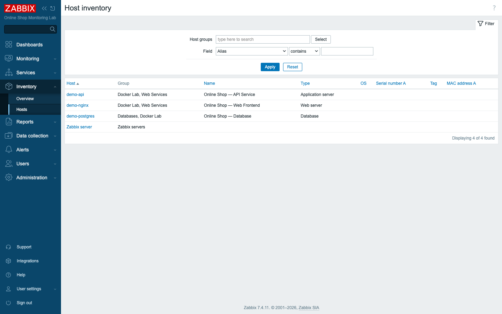
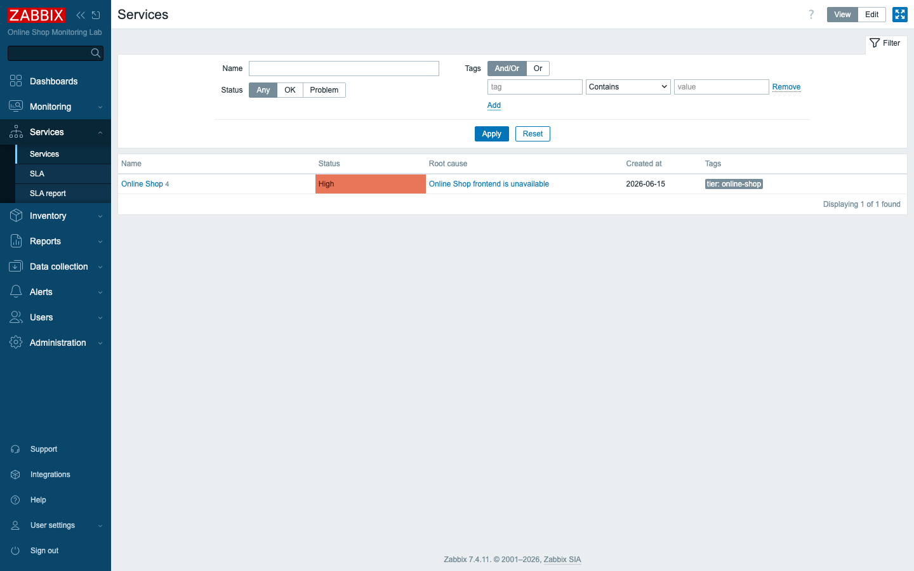
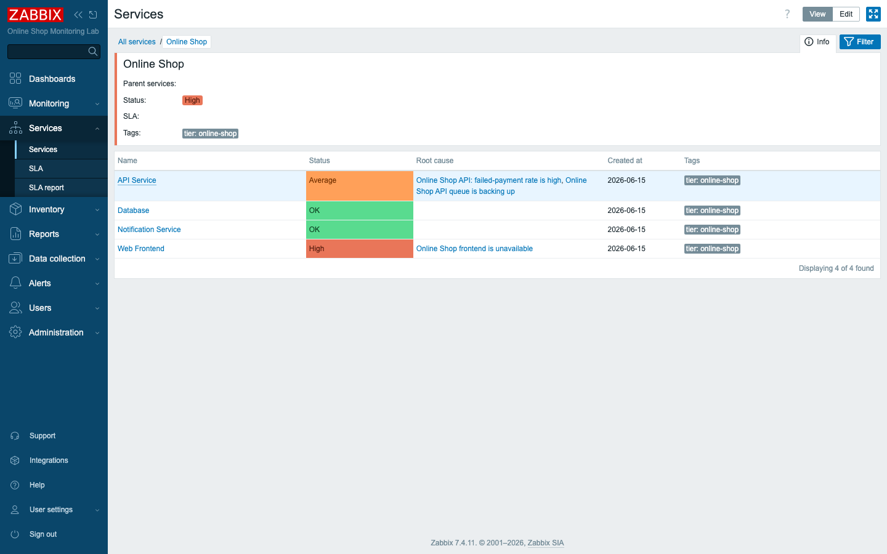
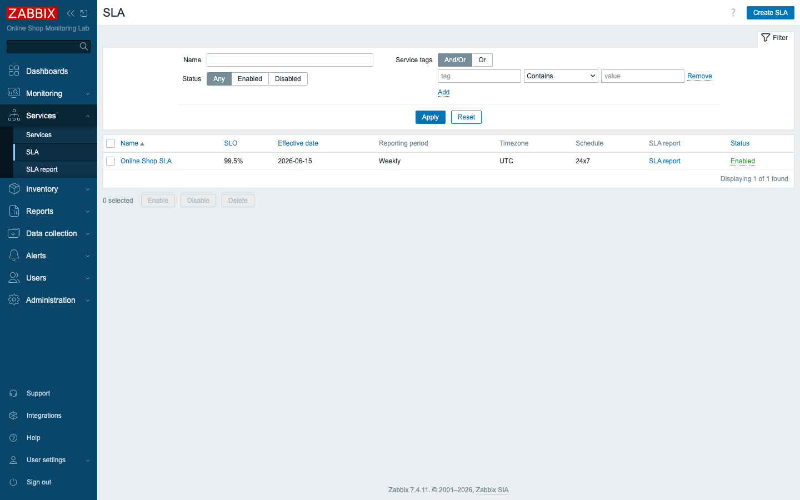

# Module 28: Inventory and Business Monitoring

## Learning Objectives

By the end of this module participants can connect technical monitoring to business
impact: populate **host inventory** (manual and automatic), build a **business
service tree** for the Online Shop, map services to problems with **tags**, watch a
failure roll up to **service status** and surface a **root cause**, and define an
**SLA** with a target and read its **SLA report**.

## Topics

### Two questions this module answers

Everything so far answers *"is this host/item healthy?"* Business monitoring answers
two higher-level questions:

- **"What do we have?"** — **host inventory**: an asset register inside Zabbix.
- **"Is the *business service* healthy, and are we meeting our promises?"** —
  **business service monitoring** and **SLA**.

These turn a wall of green/red triggers into something a manager understands: *is the
Online Shop up, and what's our uptime against the SLA?*

### Host inventory

Each host has an **inventory** record — type, name, location, contact, serial,
OS, and dozens more fields. Inventory has three **modes**:

- **Disabled** — no inventory.
- **Manual** — you fill the fields in (what we do for the Online Shop hosts).
- **Automatic** — a field is **populated from an item**: e.g. map the *system
  information* item to the OS field, and it updates itself.

**Inventory → Overview** and **Inventory → Hosts** then give you a searchable asset
list — "show every Database host", "who is the contact for demo-postgres?".



### Business service monitoring

A **service** represents something the business cares about — *"the Online Shop"* —
independent of how many hosts implement it. Services form a **tree**: the root is
the whole shop; children are its parts. Per the course's service tree:

```text
Online Shop
├── Web Frontend        (demo-nginx)
├── API Service         (demo-api)
├── Database            (demo-postgres)
└── Notification Service
```

Each parent's **status** is calculated from its children by an **algorithm** —
*most critical of child services* means the Online Shop is as unhealthy as its worst
part.

### Mapping services to problems with tags

In Zabbix 7.x a leaf service links to problems by **tags**, not by trigger. The
service has **problem tags**; any problem event carrying a matching tag counts
against it. We gave each host a **host tag** that propagates to all its problems:

- `demo-nginx` → `service=web` → **Web Frontend** service
- `demo-api` → `service=api` → **API Service**
- `demo-postgres` → `service=db` → **Database**

So when a host's trigger fires, the matching service goes red — no per-trigger wiring.

### Service status, impact, and root cause

Stop the web frontend and watch the chain: the *frontend is unavailable* trigger
fires → tagged `service=web` → **Web Frontend** turns **High** → the **Online Shop**
root, being *most critical of children*, turns **High** too. The Services view shows
the **root cause** — the exact problem dragging the service down.



Drill in and every child shows its own status and root cause — *Web Frontend: High
(frontend unavailable)*, *API Service: Average (queue backing up)* — while Database
and Notification stay OK. This is **service impact**: one screen translating
technical problems into business effect.



### SLA and SLA reports

An **SLA** sets a measurable promise: an **SLO** target (e.g. **99.5%**), a
**reporting period** (daily/weekly/monthly), a schedule (24×7), and the **services**
it covers (matched by service tags). Zabbix continuously computes the **SLI** — the
achieved availability — from service downtime, and the **SLA report** shows uptime,
downtime, and SLI per period against the target.



> In this lab the freshly-created service had only minutes of history when we first
> stopped `demo-nginx`, so its SLI started low (downtime weighed heavily against a
> few minutes of uptime) and climbs as the service stays healthy. Over a real week it
> reflects true availability against the 99.5% target.

### Business dashboards

Finally, surface this for non-engineers on a **dashboard** (Module 12). A *Business
SLA Dashboard* combines an **SLA report** widget, a **Problems** widget filtered by
the `tier=online-shop` service tag, and **Top hosts** — so leadership sees the
Online Shop's health and SLA at a glance, not item graphs.

## Docker-Based Demonstration

The instructor enables inventory on the Online Shop hosts, builds the service tree
with tag mappings, defines the 99.5% SLA, then **stops `demo-nginx`** to show Web
Frontend and the Online Shop root turn red with the root cause named — and starts it
to show recovery and the SLA report.

## Hands-On Lab

1. **Enable host inventory.** On `demo-nginx` (**Data collection → Hosts →
   demo-nginx → Inventory**), set mode **Manual** and fill **Type** `Web server`,
   **Name** `Online Shop — Web Frontend`, **Location** `Docker lab`, **Contact**
   `ops@online-shop.lab`. Repeat for `demo-api` and `demo-postgres`.
   **Expected:** **Inventory → Hosts** lists the three hosts with their fields.

2. **Tag the hosts for services.** Add a **host tag** to each (Host → Tags):
   `service=web` on demo-nginx, `service=api` on demo-api, `service=db` on
   demo-postgres.
   **Expected:** future problems on each host carry the tag.

3. **Build the service tree.** **Monitoring → Services**, switch to **Edit**, and
   create the root **Online Shop** (status calculation *Most critical of child
   services*), then child services **Web Frontend**, **API Service**, **Database**,
   **Notification Service** under it. Give each a tag `tier=online-shop`.
   **Expected:** a four-child tree under Online Shop, all **OK**.

4. **Map services to problems.** On each leaf, add a **problem tag**: `service`
   equals `web` (Web Frontend), `api` (API Service), `db` (Database).
   **Expected:** the leaves will react to their hosts' problems.

5. **Define an SLA.** **Services → SLA → Create SLA**: Name `Online Shop SLA`, SLO
   `99.5`, period **Weekly**, schedule 24×7, **Service tags** `tier` equals
   `online-shop`, and **enable** it.
   **Expected:** the SLA is **Enabled** and lists with an **SLA report** link.

6. **Simulate a web failure.** Stop the frontend:
   ```bash
   docker stop demo-nginx
   ```
   **Expected:** within ~1 min **Web Frontend** turns **High**, and the **Online
   Shop** root turns **High** with root cause *Online Shop frontend is unavailable*.

7. **Simulate a database failure (optional).** Stop the database so the *database is
   unreachable* trigger fires:
   ```bash
   docker stop demo-postgres
   ```
   **Expected:** **Database** turns red too; the root reflects the most critical
   child. Start both containers again to recover.

8. **Review SLA impact.** Open **Services → SLA report**, select **Online Shop
   SLA**.
   **Expected:** uptime, downtime, and SLI for the period — the outage you just
   caused is counted against the 99.5% target.

9. **Build a business dashboard (Module 12 technique).** Create a dashboard
   `Business SLA Dashboard` and add an **SLA report** widget and a **Problems**
   widget filtered by service tag `tier=online-shop`.
   **Expected:** a single business-facing view of Online Shop health and SLA.

## Expected Outcome

Participants can register hosts in inventory, model the Online Shop as a service
tree, drive service status from tagged problems, read service impact and root cause,
and define and report on an SLA — closing the loop from a single failing item to
"are we meeting our business promise?".

## Instructor Notes

- **Lab vs production.** The model is identical at scale — the service tree just gets
  deeper (regions → sites → services → components) and SLAs map to real contractual
  targets. Inventory is often **automatic** in production (populated from items) or
  synced from a CMDB.
- **Tags are the join.** Service status is tag-driven. We tagged **hosts** so every
  problem inherits the tag — the least-effort approach. You can also tag individual
  triggers for finer control. A service that never goes red usually has a
  **problem-tag mismatch** — verify the tag exists on the events.
- **Choose the status algorithm deliberately.** *Most critical of child services*
  means any one failure shows at the top — right for "is the shop up?". *Most
  critical if all children have problems* is for redundant components where one
  survivor keeps the service up. We hit this live: the root stayed OK until we
  switched it to *most critical of child services*.
- **SLI needs history.** A brand-new service has little data, so early SLI numbers
  swing wildly. Judge SLAs over a full reporting period, not the first hour.
- **Root cause is the payoff.** The Services view names the exact problem behind a
  red service — the fastest path from "the Online Shop is down" to "because the web
  frontend is unreachable". Show students this drill-down explicitly.
- **Business dashboards are for humans, not engineers.** Put SLA and service status
  on them, not raw item graphs. Filter by the `tier=online-shop` service tag so the
  view stays business-scoped.
- **Notification Service caveat (lab).** We include it to complete the course's
  service tree, but the lab has no dedicated monitored mail host, so it maps to
  `service=notify` and stays OK; in production it would track the alerting path's
  health (Module 27).
- **Timing (~45 min).** ~8 min inventory, ~15 min build the service tree + tag
  mapping, ~7 min SLA, ~10 min simulate failure + root cause + SLA report, ~5 min
  business dashboard + recap.

## Lab-State Delta

Added in Module 28 (kept — business monitoring for the Online Shop):

- **Host inventory (manual):** `demo-nginx` (Web server, *Online Shop — Web
  Frontend*), `demo-api` (Application server, *API Service*), `demo-postgres`
  (Database, *Database*) — type/name/location/contact populated.
- **Host tags:** `service=web` (demo-nginx 10785), `service=api` (demo-api 10783),
  `service=db` (demo-postgres 10794).
- **DB trigger:** `Online Shop database is unreachable` (triggerid `33052`,
  `nodata(/demo-postgres/db.odbc.select[pg.active.connections,shopdb],5m)=1`, High).
- **Service tree:** `Online Shop` (serviceid `1`, algorithm *most critical of child
  services*) → `Web Frontend` (`2`, problem tag service=web), `API Service` (`3`,
  service=api), `Database` (`4`, service=db), `Notification Service` (`5`,
  service=notify). All carry service tag `tier=online-shop`.
- **SLA:** `Online Shop SLA` (slaid `1`), SLO **99.5%**, weekly, 24×7, **enabled**,
  covers service tag `tier=online-shop`.
- **Verified:** stopped/started `demo-nginx` → Web Frontend + root went High with
  root cause; `sla.getsli` returned uptime/downtime/SLI for the root. demo-nginx
  recovered. Screenshots in `content/day-4/assets/module-28/`. Lab at 8 hosts.
