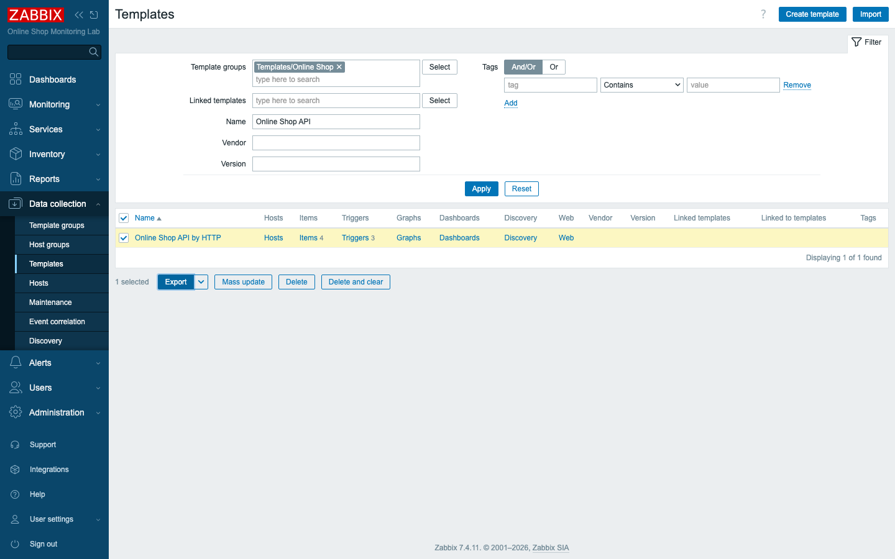
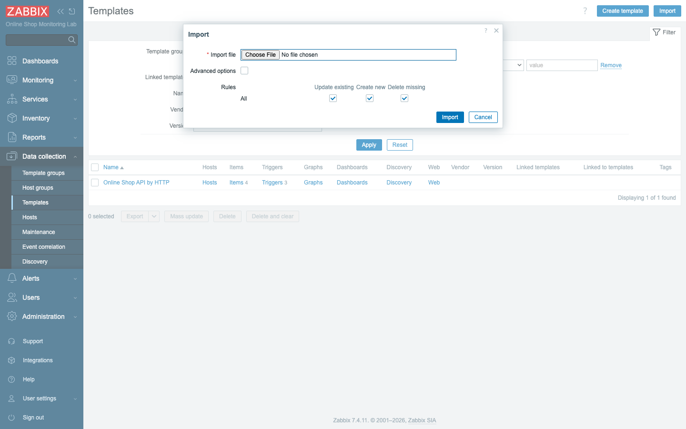
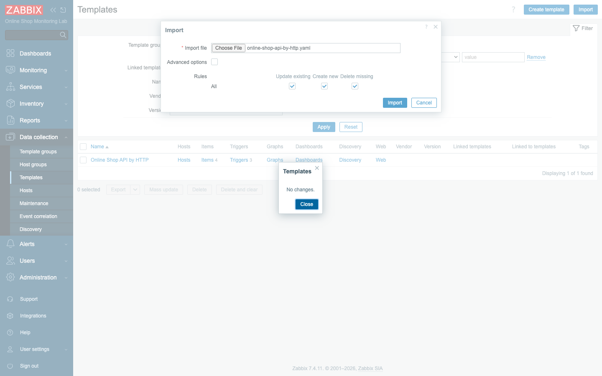

# Module 29: Configuring Zabbix Import/Export

## Learning Objectives

By the end of this module participants can move and reuse Zabbix configuration:
**export** a template to a file, **import** it back, understand the **import rules**
(create / update / delete) and the **diff preview**, version templates in **git**,
and explain how export/import supports **backup**, **template libraries**, and
**migration between environments**.

## Topics

### Why export and import

Configuration you build by clicking is trapped in one server. Export turns it into a
**portable file** you can:

- **Reuse** — apply the Online Shop's API monitoring to another team's API.
- **Version-control** — keep templates in **git**, review changes, roll back.
- **Migrate** — move config from a **dev** Zabbix to **production**.
- **Back up** — a config snapshot that survives a database loss.

This is the same discipline the whole course follows: every template we build is
exported to `content/lab/templates/` and committed.

### What can be exported, and in what format

You can export **templates**, **hosts**, **host groups**, **template groups**,
**maps**, **media types**, and **images**. Zabbix 7.4 exports in **YAML** (the
default — readable, diff-friendly), **XML**, or **JSON**. Triggers, items,
discovery rules, value maps, and tags travel **with** the template — it is the whole
unit, not just a shell.



### Importing and the import rules

Import reads a file back in. The **rules** decide how it reconciles with what already
exists, per object type:

- **Create new** — add objects in the file that don't exist yet.
- **Update existing** — overwrite matching objects with the file's version.
- **Delete missing** — remove objects that exist but are **not** in the file
  (use with care — it prunes).



### UUIDs make import idempotent

Every exported object carries a **UUID**. On import, Zabbix matches by UUID, not by
name — so re-importing an unchanged file changes nothing, and importing a **changed**
file updates exactly the changed objects. Importing our unchanged template reports
**"No changes"** — proof the diff engine works and that imports are safe to re-run.



### Template libraries

Zabbix ships a large **template library** (*Linux by Zabbix agent*, *PostgreSQL by
ODBC*, hundreds more) under template groups — that is import/export at scale. Your
own templates form a **library** too: ours live in `Templates/Online Shop`. Naming
and grouping them well is how a team keeps reusable monitoring organized.

### Backup and restore

Two layers, don't confuse them:

- **Configuration backup** — export templates/hosts to files (and git). Restores
  *what you monitor*.
- **Full backup** — a **database dump** of the Zabbix DB (`mysqldump`). Restores
  *everything*, including history, events, and users.

Export is not a substitute for a DB backup, but versioned template files are the
fastest way to rebuild monitoring config on a fresh server.

### Migration between environments

Build and test a template on a **dev** Zabbix, export it, import it on **production**
— the UUIDs keep them in sync, and git records every change. That is how monitoring
config is promoted like application code.

## Docker-Based Demonstration

The instructor exports the `Online Shop API by HTTP` template to YAML, **deletes**
it from the server, then **imports** it back from the file and shows it reappear with
all four items and three triggers intact — a full round-trip — and points out the
committed file under `content/lab/templates/`.

## Hands-On Lab

1. **Export a template.** **Data collection → Templates**, filter to the
   `Templates/Online Shop` group, tick **Online Shop API by HTTP**, click
   **Export → YAML**.
   **Expected:** a `.yaml` file downloads containing the template, its 4 items, and
   3 triggers.

2. **Inspect the file.** Open it.
   **Expected:** human-readable YAML — `zabbix_export:` with `version: '7.4'`,
   `template_groups`, the template, its items (master HTTP agent + JSONPath
   dependents), triggers, and **uuid** fields.

3. **Delete the template.** Back in the list, tick it and **Delete** (it is unlinked,
   so nothing on a host breaks).
   **Expected:** the template is gone from `Templates/Online Shop`.

4. **Import it back.** Click **Import**, choose the exported file, leave **Create
   new** and **Update existing** checked, and **Import**.
   **Expected:** Zabbix recreates the template with all 4 items and 3 triggers. (Re-
   importing the same file again reports **"No changes"** — imports are idempotent.)

   

5. **Re-link it (optional).** Link the reimported template to a host to confirm it
   works end to end (as in Module 18), then unlink to keep the lab tidy.
   **Expected:** the host inherits the template's items and triggers.

6. **Store it in git.** The file lives at
   `content/lab/templates/online-shop-api-by-http.yaml` and is committed with this
   module.
   ```bash
   git add content/lab/templates/online-shop-api-by-http.yaml
   git commit -m "template: Online Shop API by HTTP"
   ```
   **Expected:** the template is now versioned — diffs, history, and rollback like any
   code.

## Expected Outcome

Participants can export any Zabbix configuration to a portable file, import it back
with the right create/update/delete rules, understand UUID-based idempotent imports,
keep templates under version control, and explain how export/import underpins backup,
template libraries, and dev-to-production migration.

## Instructor Notes

- **Lab vs production.** We round-trip one template; in production this is your
  **change-management pipeline**: templates in git, reviewed in pull requests,
  imported to prod via the API or CI. Pair with a scheduled **DB dump** for full
  backup.
- **Export is config backup, not data backup.** It captures *what you monitor*, not
  the collected history/events. For disaster recovery you also need a `mysqldump` of
  the Zabbix database. Say this explicitly so nobody treats template exports as a
  complete backup.
- **Mind "Delete missing".** It prunes objects absent from the file — powerful for
  keeping a host exactly in sync with a template, dangerous if you import a partial
  file. Default to Create + Update; enable Delete only when you mean it.
- **UUIDs are the magic.** Because matching is by UUID, the same file imported on ten
  servers stays in sync, and a renamed item updates rather than duplicates. A
  hand-edited file that loses a UUID will create a duplicate instead of updating —
  edit exports carefully.
- **YAML for review.** Prefer YAML over XML/JSON for git: it diffs cleanly so
  reviewers can see exactly what a template change does. This course commits YAML for
  exactly that reason.
- **Build a real library.** Group and name templates deliberately
  (`Templates/Online Shop`) so a growing team can find and reuse them — that is what
  "managing template libraries" means in practice.
- **Timing (~45 min).** ~10 min why + formats + what's exportable, ~10 min export +
  read the YAML, ~12 min delete + import + rules + idempotency, ~8 min git/versioning,
  ~5 min backup vs export + migration recap.

## Lab-State Delta

Module 29 (import/export — round-trip demonstration):

- **Round-trip verified:** exported `Online Shop API by HTTP` to
  `content/lab/templates/online-shop-api-by-http.yaml` (re-exported fresh, 92 lines),
  **deleted** the template, then **imported** it back from the file — recreated with
  all **4 items** and **3 triggers**. The template's id changed from `10791` to
  **`10797`** (deleted and recreated); content and UUIDs unchanged. Re-importing the
  unchanged file reports **"No changes"** (idempotent).
- **No new permanent objects** beyond the restored template (still unlinked,
  reusable). Committed YAML is the versioned artifact. Screenshots in
  `content/day-4/assets/module-29/`. Lab at 8 hosts.
