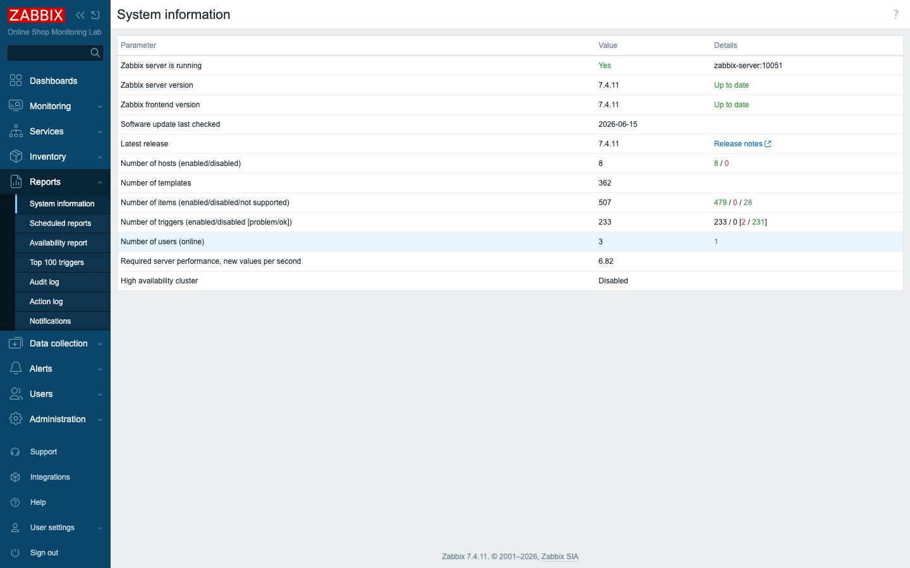
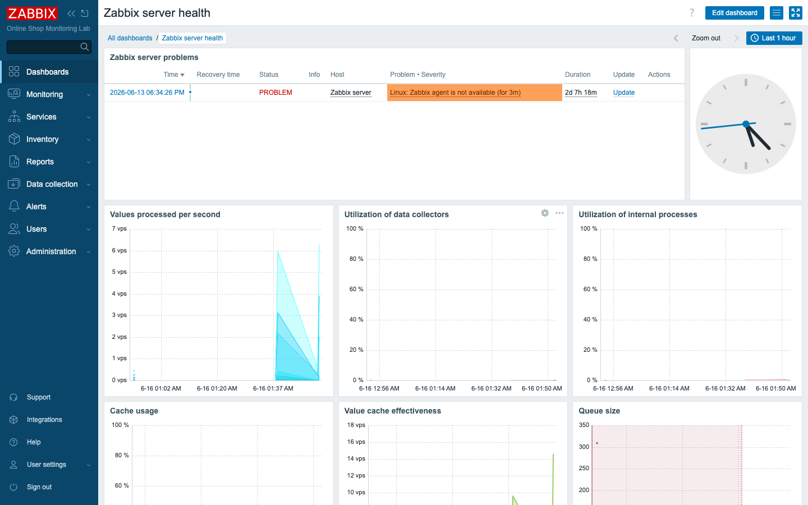
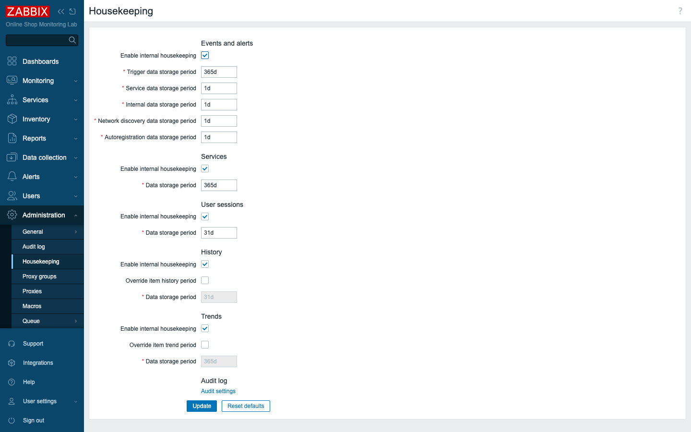
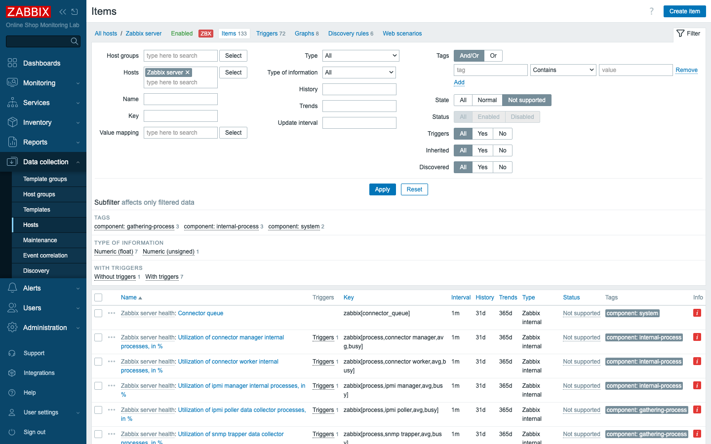

# Module 30: Optimization Techniques

## Learning Objectives

By the end of this module you will be able to reason about Zabbix performance the
way an operator does rather than the way a panicked first-responder does. You will
read the **internal health metrics** — NVPS, process utilization, cache, and queue
— and know what each one is telling you. You will tune **item intervals** and
**housekeeping/retention** to keep the load sustainable, clean up **unsupported
items** that quietly waste effort, and apply sound **database** and **template**
design principles. And you will be able to set all of this against the backdrop of
Zabbix's **release lifecycle** and the lab's **Docker** resource model, so that the
choices you make in a toy lab translate into the right instincts for a production
system.

## Topics

### The one number that matters: NVPS

Everything about Zabbix performance starts with a single figure, so it is worth
fixing it in your mind before anything else. That figure is **NVPS — new values
per second** — the count of metric values the server ingests every second. Think
of it as the flow rate through the whole pipeline: every item you create, at
whatever interval you set, contributes a trickle of values, and NVPS is the sum of
all those trickles arriving at the server's door.

You do not have to estimate it by hand. **Reports → System information** shows the
**Required server performance** for your current configuration. In our Online Shop
lab that number is **~6.8 NVPS** with 8 hosts and ~500 items — a gentle stream
that no hardware would ever notice. A real deployment, by contrast, might be
pushing thousands of values per second. Keep that gap in mind, because almost every
tuning decision you will make for the rest of this module is, at heart, about
keeping NVPS sustainable for the hardware you actually have.

### How the server spends its time: internal processes

NVPS tells you how much work is arriving; the next question is *who does that work*.
The Zabbix server is not a single monolithic loop — it is a pipeline of specialized
internal processes, each responsible for one stage, and any one of them can become
the bottleneck that holds up the rest. Understanding the cast of characters is what
lets you diagnose a slow server instead of guessing.

- **Pollers** actively fetch passive checks; **unreachable pollers** handle
  down hosts; **JMX/HTTP/ICMP** pollers for those types.
- **Trappers** receive pushed data (active agents, `zabbix_sender`, traps).
- **Preprocessing workers** run the preprocessing steps (Module 9).
- **History syncers** write incoming values to the database.
- **Housekeeper** deletes old data.

You do not have to imagine how busy each of these is — Zabbix graphs it for you.
The **Zabbix server health** dashboard plots each process's **% utilization**, the
**cache usage**, the **value cache effectiveness**, and the **queue** — together a
live picture of where the server's time actually goes. The rule of thumb is simple
and reliable: a process pinned near 100% is your bottleneck, and the fix is to give
it more workers by raising its `Start…` count in the server config. Find the busy
process first, then tune *it* — not everything at once.

### The queue

Of all the health signals, the **queue** (Module 13) is the one to watch first,
because it is the earliest to move when something goes wrong. The queue is the
count of values that are waiting to be collected — work that should already have
happened but hasn't. A small, steady queue is perfectly healthy; some latency is
normal in any pipeline. What you are looking for is a *growing* queue, because a
queue that climbs means the server simply can't keep up: too few pollers for the
workload, an overloaded database slowing the whole chain, or unreachable hosts
tying up pollers while they wait to time out.

Both **Administration → Queue** and the health dashboard surface this number. Treat
it as your fuel gauge — the queue is the earliest warning that you are running out
of headroom, well before users notice anything is slow.

### Caches

Hitting the database for every single read would be ruinously slow, so the server
keeps the data it touches most often in memory. These in-memory stores are the
**caches**, and each serves a distinct purpose:

- **Configuration cache** — hosts/items/triggers definitions.
- **Value cache** — recent history for trigger evaluation.
- **History write cache** — buffers values before the history syncers flush them.

Each cache exposes a **% used** metric, and that number is a diagnostic in its own
right. A cache filling toward 100% is the server warning you that it is running out
of room to do its job — and the history write cache especially. When *that* one
fills, it means the database can't absorb writes fast enough, so values pile up in
memory waiting their turn. The remedy is rarely just a bigger cache: you tune the
cache size **and** the database, because a cache only buys time against a slow
backend, it doesn't replace one.

### Housekeeping, history, trends, and database growth

When a Zabbix deployment first strains under load, the part that hurts is almost
always the **database** — and within the database, two tables dwarf all the others.
Knowing what those two tables are, and how long each holds onto data, is the key to
keeping the database from becoming the ceiling on your whole deployment:

- **History** — every raw value (per the item's history period; lab default **31d**).
- **Trends** — hourly min/avg/max rollups, kept far longer (lab default **365d**).

The trade-off here is the heart of retention planning. History gives you every
individual data point, which is wonderful for recent troubleshooting but expensive
to keep; trends compress an hour of readings down to three numbers, which is why
you can afford to keep them for a year. You control both from **Administration →
Housekeeping**, where you set the retention periods and decide whether to
**override** every item's per-item setting with a single global one. The
**housekeeper** process then quietly deletes expired data on schedule. The lever is
blunt but effective: shorter retention means a smaller, faster database.

### Tuning item intervals

Here is the cheapest optimization in all of Zabbix, and it costs nothing but a
moment's thought per item. Every item collected at interval *N* contributes `1/N`
to NVPS — so the interval you choose is a direct multiplier on load. Collecting CPU
every **1s** when **1m** would tell you everything you need multiplies that item's
load by 60×, for no benefit. Right-size each interval to how fast the metric
actually changes: a slow-moving disk usage figure does not need second-by-second
sampling. And when you want long-term graphs, lean on **trends** rather than
hoarding raw 1s history for a year. Fewer items, sampled at sensible intervals, is
the most effective tuning you can do — and you do it for free, before you ever
consider buying hardware.

### Unsupported items

Not every item the server holds is actually collecting data. An **unsupported**
item is one the server *cannot* collect — because of a bad key, a missing
dependency, or a poller type that isn't started — and it is pure dead weight:
configuration the server still has to track and process, returning nothing in
exchange. More often than not, an unsupported item is also a signpost pointing at a
real misconfiguration somewhere.

You find them at **Data collection → Hosts → Items**, filtered to **State: Not
supported**. In our lab the unsupported items turn out to be internal checks for
**processes this deployment doesn't run** — IPMI, SNMP trapper, VMware, connectors
— so they are harmless here. But do not let "harmless in the lab" become "ignore in
production." In a real system you fix or disable these so they stop generating noise
in your views and stop consuming processing cycles for nothing.

### Template design, releases, and Docker limits

The last group of levers is less about live tuning and more about the decisions you
make up front — in how you design templates, which release you run, and how you box
in your containers. Each one shapes performance before a single value is collected.

- **Template design** affects performance: prefer **dependent items** (one request,
  many metrics — Module 9/18) over many separate polls, and reasonable intervals in
  the template so every linked host inherits good defaults.
- **Release lifecycle:** Zabbix ships **LTS** releases (e.g. 7.0, ~5 years support)
  for stable production, and **standard** releases (7.2, **7.4** — this course) with
  the newest features but a short support window. System information shows your
  version and whether it is **up to date**. Plan upgrades around LTS for production.
- **Docker resource limits:** in this lab the containers run unconstrained; in
  production you set `deploy.resources.limits` (CPU/memory) per service in Compose so
  the server, database, and proxies get guaranteed, bounded resources.

## Docker-Based Demonstration

To make these ideas concrete, the instructor walks the same path you are about to
take in the lab. They open **System information** to read the live NVPS, the object
counts, and the version status; tour the **Zabbix server health** dashboard to see
process utilization, cache, and queue in motion; show the **Housekeeping** retention
settings that govern database growth; and filter the items list to **Not supported**
to surface the dead-weight checks. With the signals on screen, the discussion turns
to the levers — interval tuning and Docker resource limits — so you see the
diagnosis and the remedy side by side.

## Hands-On Lab

This lab is deliberately a reading-and-interpreting exercise rather than a building
one. Optimization is mostly about learning to *see* the right numbers and know what
they mean, so each step below points you at one signal and asks you to interpret it.

1. **Read the capacity number.** Open **Reports → System information**.
   **Expected:** *Required server performance, new values per second* (~**6.8** here),
   plus host/item/trigger counts and whether the version is up to date.

2. **View internal process usage.** Open the **Zabbix server health** dashboard
   (**Dashboards → All dashboards → Zabbix server health**).
   **Expected:** graphs for **values processed per second**, **utilization of data
   collectors** and **internal processes**, **cache usage**, and **queue size** — all
   low in this small lab.

3. **Review the queue.** **Administration → Queue**.
   **Expected:** few or zero delayed items (a healthy lab). A growing queue would
   mean the server is under-provisioned (Module 13).

4. **Review unsupported items.** **Data collection → Hosts → Items**, set **State:
   Not supported**.
   **Expected:** the internal checks for processes this deployment doesn't run (IPMI,
   SNMP trapper, VMware, connectors). Read one item's error to see *why*.

5. **Adjust an item's update interval.** Open any high-frequency item and change its
   **Update interval** (e.g. from `30s` to `1m`).
   **Expected:** the item collects half as often — directly lowering NVPS. Multiply
   across thousands of items to see why intervals matter.

6. **Inspect retention.** **Administration → Housekeeping**.
   **Expected:** **History** `31d` and **Trends** `365d`, with the **Override**
   toggles off (per-item settings apply). Discuss shortening history to shrink the
   database.

7. **Discuss Docker limits.** Look at the lab's `compose_lab.yaml`.
   **Expected:** no hard CPU/memory limits in the lab; discuss adding
   `deploy.resources.limits` for the server and database in production.

## Expected Outcome

By the end of this module you can locate and interpret Zabbix's performance signals
— NVPS, process utilization, cache, and queue — and reach for the main levers when
one of them tells you something is wrong: item intervals, history/trends retention,
unsupported-item cleanup, template design, and, in production, database tuning and
Docker resource limits. Above all you leave understanding the lesson that ties them
together: **design decisions drive performance**. The cheapest way to keep the
Online Shop's monitoring fast is to build it thoughtfully in the first place.
