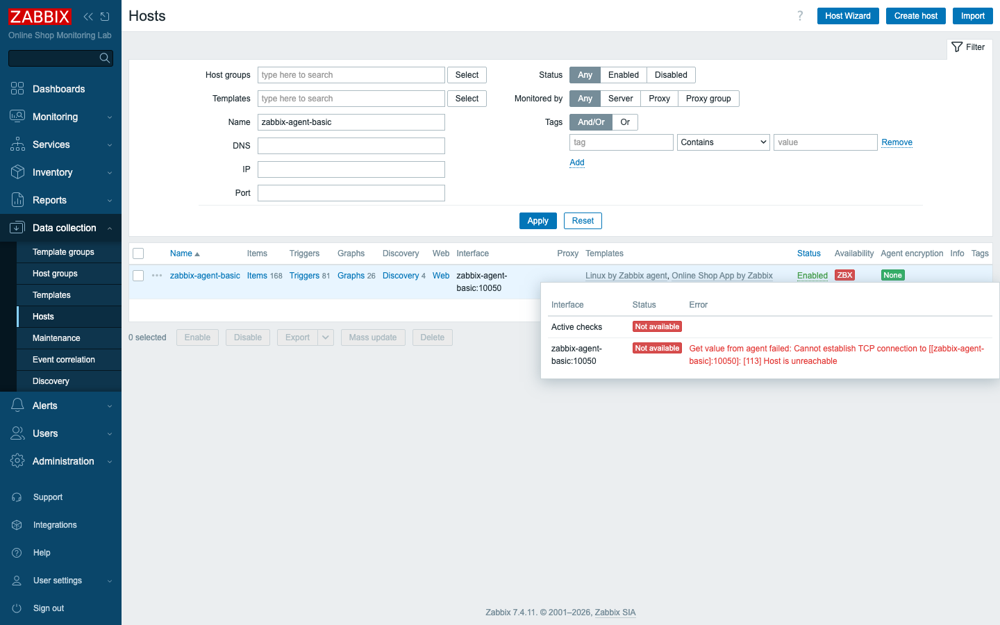
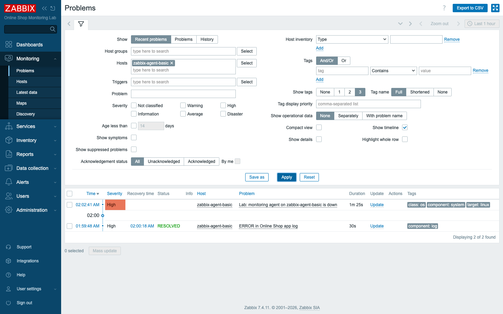
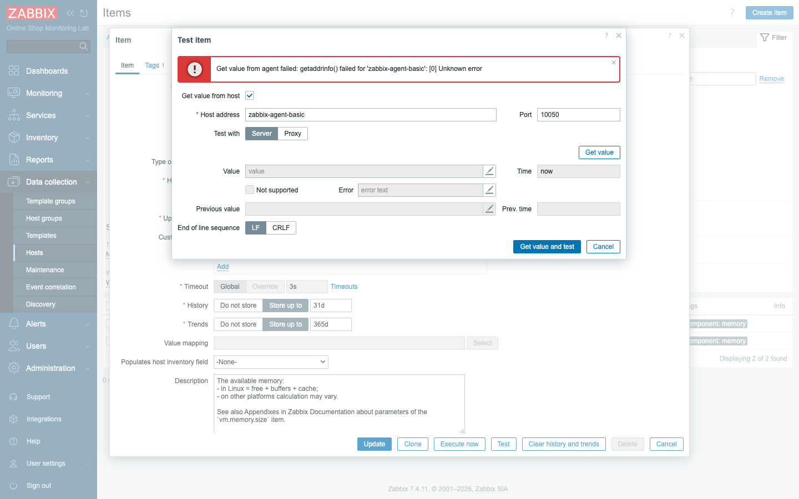
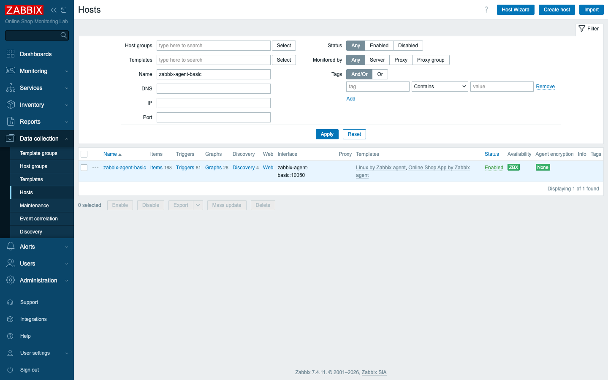

# Module 31: Troubleshooting Zabbix

## Learning Objectives

By the end of this module participants can follow a **structured troubleshooting
process**: read the symptom in the UI, isolate the failing layer, use the diagnostic
toolchain (`docker logs`, the Zabbix logs, `zabbix_get`, network and DNS checks, the
item **Test**), fix the root cause, and verify recovery — applied to the most common
Zabbix failures.

## Topics

### A method, not a guess

When something in the Online Shop stops reporting, the temptation is to start poking
at random — restart a container here, edit a setting there — and hope the symptom
disappears. Resist it. Most Zabbix problems are not mysterious. They are one broken
link in a chain you already understand, and the fastest way to find that link is to
walk the chain in order rather than guessing where it snapped.

The fix is a **repeatable method**, and it is worth internalizing as a sequence you
run every single time, regardless of which component looks sick:

1. **Read the symptom** — what does the UI actually say? (a red availability icon, a
   "not supported" item, a missing alert).
2. **Isolate the layer** — frontend, server, database, network, agent, or config?
3. **Test that layer directly** — from the component that talks to it, with the
   smallest possible check.
4. **Read the logs** — the server/agent log usually states the cause in plain text.
5. **Fix the root cause, then verify** — confirm with the same test that first failed.

The mental model that ties these steps together is to work **outside-in**. Start at
the coarsest possible question and refine: is the container even up? If it is, can we
reach the port? If we can, does the name resolve? If it does, does the check return a
value? Each question is cheaper to answer than the next, and most failures reveal
themselves at the first or second rung — so you rarely have to climb all the way up.
Ask them in that order and the cause falls out quickly.

### The diagnostic toolchain

You do not need a large arsenal to diagnose Zabbix. A handful of commands and two UI
features cover nearly every failure you will meet in this lab, and each one answers a
specific question along the outside-in path:

- **`docker ps -a`** — is the container running, exited, or restarting?
- **`docker logs <container>`** — the dockerized Zabbix server/agent log to stdout;
  this is your **Zabbix log**. Grep it for the host name.
- **`zabbix_get -s <host> -k <key>`** — ask the agent for one value, exactly as the
  server does. The fastest agent test.
- **Network/DNS** — `nc -zv <host> 10050` (port reachable?), `getent hosts <host>`
  (does the name resolve?).
- **The UI** — a host's **availability** icon carries the exact error on hover; an
  item's **Test → Get value** reproduces the failure with the precise message.

The reason `zabbix_get` deserves special attention is that it speaks to the agent in
exactly the way the server does, so it isolates the one hop you most often suspect —
server to agent — from everything else around it. When `zabbix_get` succeeds but the
item still fails, you have learned something valuable: connectivity is fine, and the
problem lives in configuration, not the network.

### The Zabbix data path (where things break)

Before you can isolate a layer, you need a map of the layers. Here is the path a
measurement travels in this lab, drawn so that every arrow is a place a failure can
hide:

```text
frontend ──HTTP──> server ──poll/trap──> agent/device
   │                  │
   └── needs DB ──────┴── needs DB (zabbix-db)
```

Each arrow is a failure point, and each maps to a symptom. The table below is the one
you will reach for most often: it turns a vague "something is broken" into a specific
layer and a specific first check, so you spend your time testing the right hop instead
of all of them.

| Symptom | Likely layer | First check |
|---|---|---|
| Frontend "cannot connect to server" | frontend ↔ server | `ZBX_SERVER_HOST`, server up (`docker ps`) |
| Server won't start / no data at all | server ↔ database | server log "cannot connect to database", DB up |
| One host's agent icon is red | server ↔ agent | `zabbix_get`, port 10050, `Server=` allow-list |
| Active checks missing only | agent `Hostname` | must match the Zabbix host name (Module 7) |
| Item "not supported" | item config | read the item error (Module 30) |
| Alert never arrives | action/media chain | media type template, user media, perms (Module 27) |
| User can't see hosts | permissions | user group host-group rights (Module 25) |

### DNS vs IP, and Docker networking

One category of failure trips up almost everyone the first time they meet it, and it
is worth understanding clearly because Docker makes it behave differently from a
classic network. In this lab every container talks by **name** on the `zabbix-lab`
network. Here is the subtle trap: when a container **stops**, Docker removes its name
from DNS, so the failure shows as a **name-resolution** error (`getaddrinfo() failed`,
`NXDOMAIN`), not a plain "connection refused".

That distinction matters for your diagnosis. A "connection refused" tells you the host
is there but nothing is listening; a name-resolution failure tells you the host is not
even on the map. In production the equivalents are a wrong/locked-down **DNS** entry or
a host that only answers on its **IP** — when DNS is unreliable, configure the interface
with an **IP** instead. There is one more Docker-specific rule to keep in mind:
containers must also share a **network**; a host on a different Docker network simply
can't be reached, no matter how correct its name or port.

## Docker-Based Demonstration

The most convincing way to teach a method is to break things on purpose and watch the
method find each break the same way. The instructor does exactly that: **stop the
database**, **stop an agent**, **change an agent's hostname**, **break the web
endpoint**, **break the SMTP settings**, **break the SNMP community** — showing that
the *method* is the same every time, even though the symptoms differ. Below is the
worked example for an agent, walked end to end.

### Worked example: "Zabbix agent is not available"

**Break it** — stop the agent container:

```bash
docker stop zabbix-agent-basic
```

**1 — is the container up?**

This is the coarsest question, so we ask it first:

```bash
docker ps -a --format '{{.Names}} {{.Status}}' | grep zabbix-agent-basic
# zabbix-agent-basic   Exited (0) ...        <-- not running
```

**2 — can the server reach it on the network / does the name resolve?**

Notice how the stopped container has vanished from DNS rather than merely refusing the
connection — this is the Docker trap in action:

```bash
docker exec zabbix-server nc -zv zabbix-agent-basic 10050
# nc: bad address 'zabbix-agent-basic'
docker exec zabbix-server getent hosts zabbix-agent-basic
# (empty)  -> NXDOMAIN: the stopped container left DNS
```

**3 — ask the agent directly:**

```bash
docker exec zabbix-server zabbix_get -s zabbix-agent-basic -k agent.ping
# zabbix_get: Get value error: getaddrinfo() failed for 'zabbix-agent-basic'
```

**4 — read the server log:**

The log states the cause in plain English, confirming what the earlier checks implied:

```bash
docker logs --since 2m zabbix-server | grep zabbix-agent-basic
# ...failed: another network error, wait for 15 seconds
# temporarily disabling Zabbix agent checks on host "zabbix-agent-basic": interface unavailable
```

**In the UI**, the host's availability icon turns red; hovering it shows the exact
error — *Cannot establish TCP connection … Host is unreachable* — so you can diagnose
without the CLI at all.



A trigger also raises a problem, so the failure is alerted, not just visible:



The item **Test → Get value** reproduces the failure at the item level with the
precise message — the fastest way to confirm a single check:



**Fix and verify:**

The discipline closes the loop by re-running the exact check that first failed, so you
know the fix actually worked rather than merely hoping it did:

```bash
docker start zabbix-agent-basic
docker exec zabbix-server zabbix_get -s zabbix-agent-basic -k agent.ping
# 1                              <-- recovered
```



## Hands-On Lab

Each scenario below is a different break in the Online Shop, but you will treat them
all identically. Work each one with the **same method**: symptom → isolate → test →
log → fix → verify. The point is not to memorize six fixes; it is to practice the one
process until it becomes reflex.

1. **Agent not available.** `docker stop zabbix-agent-basic`. Diagnose with
   `docker ps -a`, `zabbix_get`, the availability error, and the server log; then
   `docker start` it.
   **Expected:** the red availability icon and `getaddrinfo`/`unreachable` error,
   then green after restart.

2. **Web scenario failing.** `docker stop demo-nginx` (Module 21). Check **Monitoring
   → Web**.
   **Expected:** the scenario names the failed step — *Step "Home page" failed:
   Could not resolve host*. Start the container to recover.

3. **Database unavailable.** Inspect the dependency: `docker logs zabbix-server | grep
   -i database`.
   **Expected:** with `zabbix-db` healthy, no errors; understand that stopping it
   would log *cannot connect to database* and halt the server. (Don't stop the DB in
   a shared lab.)

4. **Unsupported item.** **Data collection → Hosts → Items**, filter **State: Not
   supported** (Module 30), open one and read its **error**.
   **Expected:** the error states the cause (bad key, missing process, permission).

5. **Email alert not sent.** Re-check the Module 27 chain: action enabled & matching,
   user media present, media type **has a message template**.
   **Expected:** the *"No message defined for media type"* class of error is found by
   walking the chain.

6. **SNMP check failing.** Recall Module 20: test from the CLI
   `docker exec demo-snmp-device snmpget -v2c -c <community> localhost 1.3.6.1.2.1.1.5.0`
   and the item **Test**.
   **Expected:** a wrong community produces an SNMP **timeout**; the correct one
   returns the value.

## Expected Outcome

Participants can troubleshoot Zabbix methodically: map a symptom to a layer, test
that layer with the right tool, confirm the cause in the logs, fix it, and verify —
rather than guessing. They know the common failures and where each one is diagnosed.
