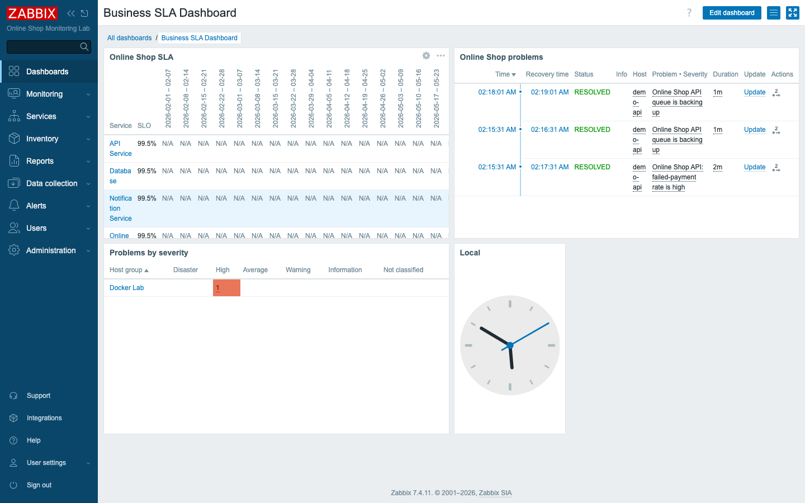
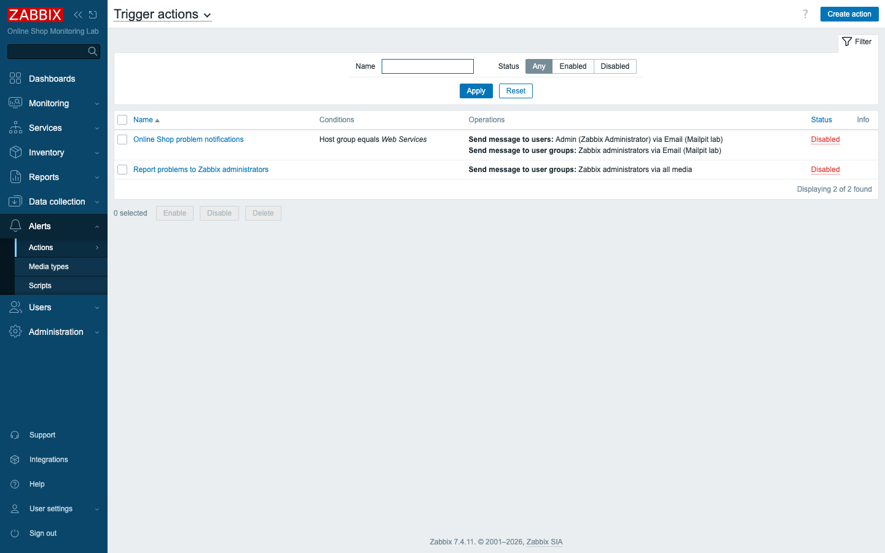
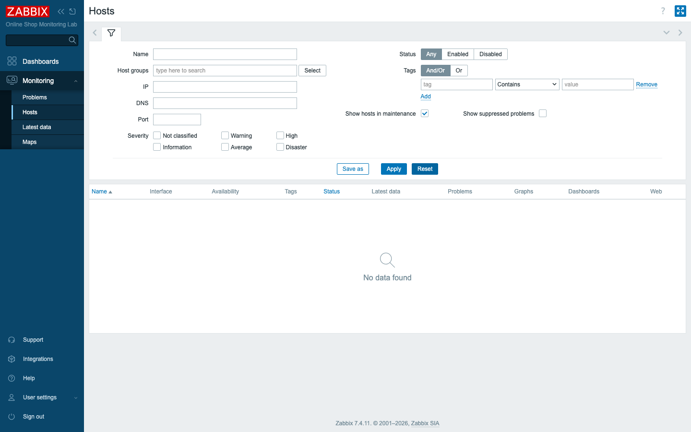
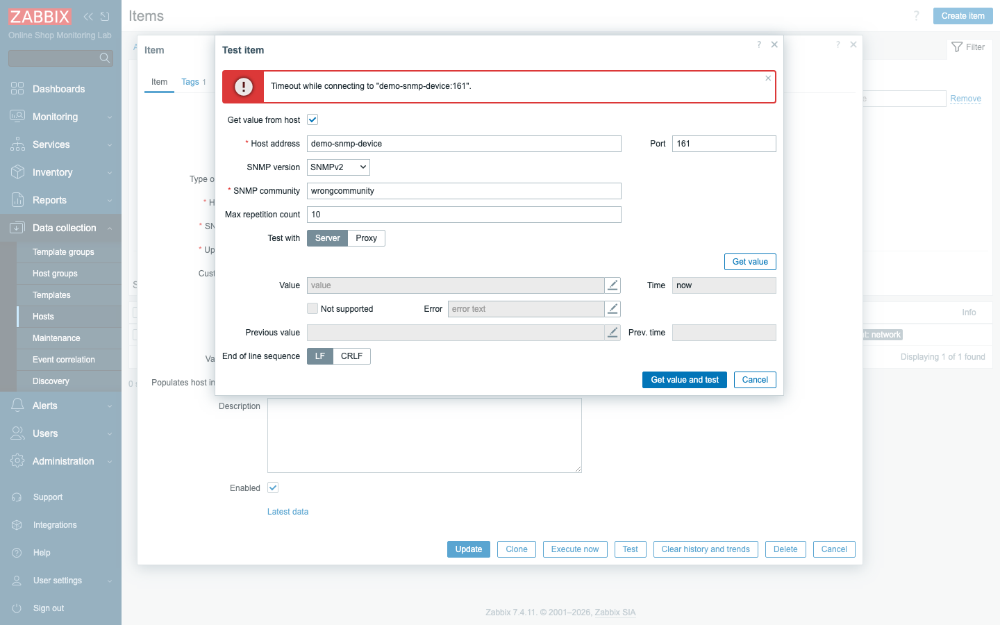

# Module 32: Practical Lab — Day 4

## Learning Objectives

By the end of this module participants can **operate and troubleshoot** the
monitored Online Shop end to end: confirm the Day-4 administration, security,
alerting, and business-monitoring setup is in place, build a **Business SLA
Dashboard** that presents it to leadership, and **diagnose and fix three injected
failures** — documenting findings and fixes like an on-call engineer.

## Topics

### What Day 4 built — now run it

Day 4 turned the monitoring platform into an operated service: **users, roles, and
permissions** (Module 25), **security hardening, audit, and maintenance** (Module
26), **email alerting with escalation** (Module 27), the **business service tree and
SLA** (Module 28), **import/export** (Module 29), **performance tuning** (Module 30),
and a **structured troubleshooting method** (Module 31). This practical lab makes you
*use* all of it together — administer, secure, alert, present, and fix — which is the
actual job of running Zabbix.

It has three parts: **operate** (verify the platform), **present** (build a business
dashboard), and **troubleshoot** (diagnose three injected failures and document the
fixes).

### Presenting monitoring to the business

Engineers read item graphs; managers read **services and SLAs**. A **Business SLA
Dashboard** (Module 12 technique, business data) puts the **SLA report**, the Online
Shop's **problems**, and a **severity overview** on one screen — so leadership sees
"is the Online Shop up and are we meeting the 99.5% SLA?" without touching a single
trigger.

### Diagnosing injected failures

Real operations means things break in ways you didn't cause. The drill injects
**three failures across the Day-4 domains** and asks you to find and fix each with
the Module 31 method — *symptom → layer → test → fix → verify* — and **write down**
what you found. The discipline of documenting findings is what turns a lucky fix
into a repeatable runbook.

## Docker-Based Demonstration

The instructor confirms the Day-4 platform (users, alerting, services, SLA, exported
template), builds the Business SLA Dashboard, then injects three failures —
**disable the alert action**, **deny the viewer's host-group permission**, and
**break the SNMP community** — and walks the diagnosis and fix of each.

## Hands-On Lab

### Part A — Operate: verify the platform

1. **Users and permissions (Module 25).** Confirm `shop.viewer` exists with the
   `Online Shop Viewer` role and the `Online Shop Viewers` group (Read on **Web
   Services**). Log in as the viewer.
   **Expected:** a trimmed menu and only the Web Services hosts.

2. **Maintenance (Module 26).** Confirm you can create a maintenance window for a
   host and that it suppresses its problems while active (remove it afterward).
   **Expected:** the host shows the maintenance (wrench) icon.

3. **Email alerting (Module 27).** Confirm the `Online Shop problem notifications`
   action is **enabled**, the Email (Mailpit) media type has message templates, and
   Admin has email media.
   **Expected:** a problem on a Web Services host produces an email in Mailpit
   (http://localhost:8025).

4. **Business service tree + SLA (Module 28).** Confirm the `Online Shop` service
   tree (Web Frontend, API Service, Database, Notification) and the `Online Shop SLA`
   (99.5%, enabled).
   **Expected:** the services reflect their hosts; the SLA reports an SLI.

5. **Exported template (Module 29).** Confirm
   `content/lab/templates/online-shop-api-by-http.yaml` exists and re-imports cleanly.
   **Expected:** import reports "No changes" (already in sync).

### Part B — Present: build the Business SLA Dashboard

6. **Create the dashboard.** **Dashboards → Create dashboard**, name `Business SLA
   Dashboard`. Add widgets:
   - **SLA report** — SLA `Online Shop SLA`.
   - **Problems** — host group `Web Services`.
   - **Problems by severity** — host group `Docker Lab`.
   - a **Clock**.

   **Expected:** one business-facing page showing SLA attainment per service and
   current Online Shop problems.

### Part C — Troubleshoot: diagnose three injected failures

The instructor injects three failures. For each, find the cause, fix it, and
**document** the finding — then verify recovery.

7. **Failure 1 — "alerts stopped arriving."** Problems still appear in *Monitoring →
   Problems*, but no email reaches Mailpit.
   **Diagnose:** walk the alerting chain (Module 27). **Alerts → Actions → Trigger
   actions** shows `Online Shop problem notifications` is **Disabled**.
   **Fix:** enable the action. **Verify:** the next problem emails again.

   

8. **Failure 2 — "the viewer can't see anything."** `shop.viewer` logs in but
   **Monitoring → Hosts** is empty.
   **Diagnose:** capability vs visibility (Module 25). The `Online Shop Viewers`
   group's **Web Services** permission was changed to **Deny**.
   **Fix:** set it back to **Read**. **Verify:** the viewer sees demo-api and
   demo-nginx again.

   

9. **Failure 3 — "the network device went silent."** `demo-snmp-device` SNMP items
   stopped updating.
   **Diagnose:** test the check (Modules 20/31). The item **Test → Get value** returns
   **`Timeout while connecting to "demo-snmp-device:161"`** — the **SNMP community**
   is wrong (`wrongcommunity`).
   **Fix:** set `{$SNMP_COMMUNITY}` back to `public`. **Verify:** SNMP items collect
   again.

   

10. **Document.** Record each finding in a short runbook table: *symptom → layer →
    root cause → fix → how verified*.
    **Expected:** a written record another engineer could follow.

## Expected Outcome

Participants can administer, secure, alert on, present, and troubleshoot a Zabbix
environment: a verified Day-4 platform, a business dashboard for non-engineers, and a
documented diagnosis-and-fix of three independent failures — the full operational
skill set of a Zabbix specialist.

## Instructor Notes

- **This is the day's integration test.** Resist re-teaching; let students drive and
  coach when stuck, pointing back to the specific module (25–31). The goal is fluency
  across domains under mild pressure.
- **The findings table is the deliverable.** Insist on written findings: *symptom,
  layer, root cause, fix, verification*. "I clicked around and it works now" is not a
  runbook. This habit is what separates an operator from a guesser.
- **The three failures map to three domains on purpose** — alerting (27), security
  (25), monitoring/SNMP (20/31) — so students must switch tools, not repeat one. Each
  has a *silent* symptom (problems still show, the UI still loads, the host still
  exists) so the diagnosis matters.
- **Capability vs visibility, again.** Failure 2 is the classic permission trap: the
  user, role, and hosts all exist — only the **host-group permission** is wrong.
  Diagnose at the user **group**, not the user or the host.
- **Silent alerting is the dangerous one.** Failure 1 produces no error anywhere
  obvious — the action is just disabled. Teach students to verify the **whole chain**
  periodically, and to monitor that alerts are flowing (an internal action or a
  heartbeat).
- **Lab vs production.** We inject failures with API toggles and `docker`; in
  production they arrive as a colleague's change, an expired secret, or a network
  event. The method and the runbook habit are identical — and the **audit log**
  (Module 26) often tells you *who* changed what.
- **Keep the dashboard.** The Business SLA Dashboard is a real deliverable for the
  final project (Day 5) — the executive view of the Online Shop.
- **Timing (~45 min).** ~10 min Part A platform checks, ~10 min Part B dashboard, ~20
  min Part C three failures + documentation, ~5 min recap and Day-4 wrap-up.

## Lab-State Delta

Added in Module 32 (Day-4 capstone — kept):

- **Dashboard:** `Business SLA Dashboard` (dashboardid `412`) — widgets: **SLA
  report** (Online Shop SLA, slaid 1), **Problems** (Web Services group 24),
  **Problems by severity** (Docker Lab group 23), **Clock**. KEPT.
- **Verified platform (Part A):** `shop.viewer`/role/group (M25), `Online Shop
  problem notifications` action enabled + Email media (M27), 5-service tree + SLA
  99.5% (M28), exported template re-imports clean (M29).
- **Three failures injected, diagnosed, and reverted (Part C):**
  1. Alert action `9` disabled → re-enabled.
  2. `Online Shop Viewers` group Web Services permission Deny → restored to Read.
  3. `{$SNMP_COMMUNITY}` on demo-snmp-device → `wrongcommunity` → restored to
     `public`.
  All recoveries verified (action enabled, viewer Read, SNMP sysName collecting).
  Screenshots in `content/day-4/assets/module-32/`. Lab at 8 hosts. **Day 4 complete.**
