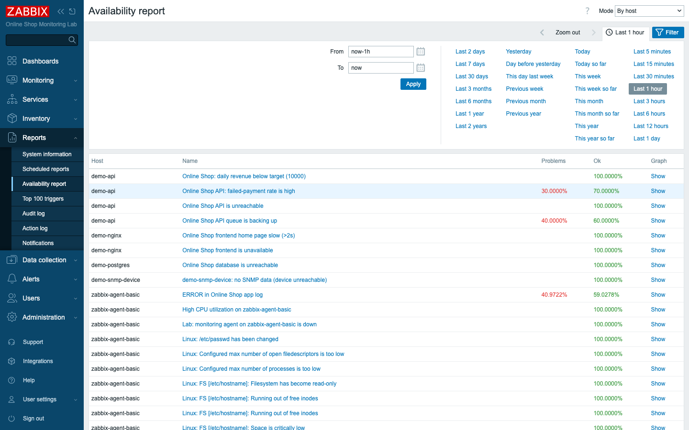
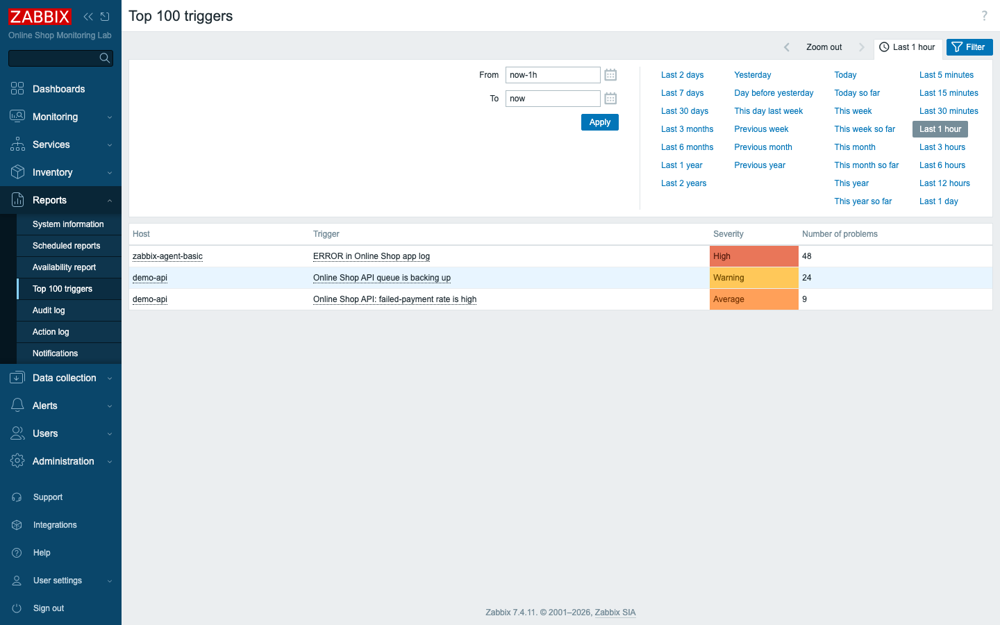
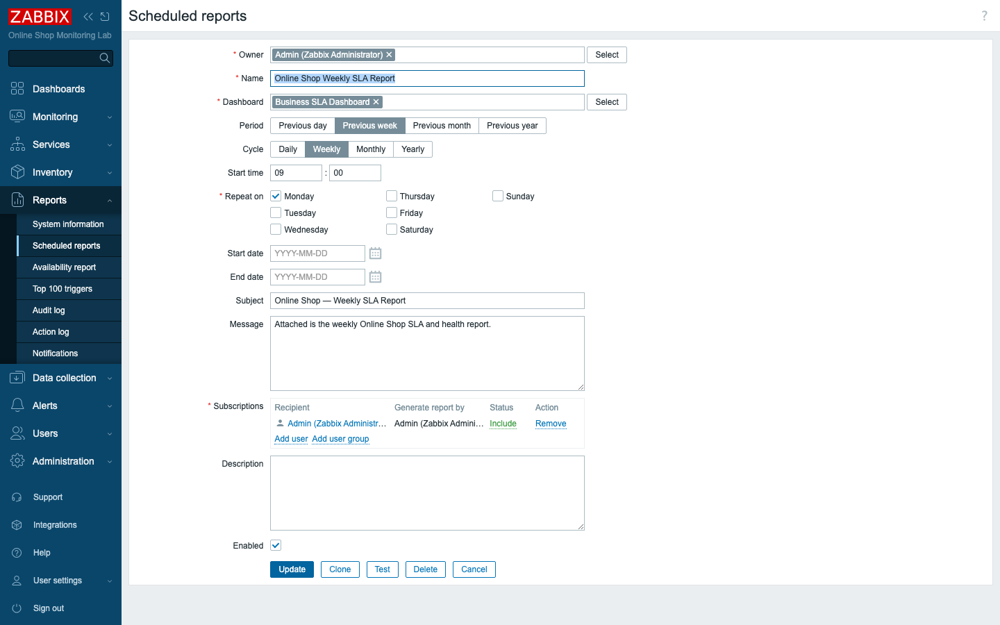
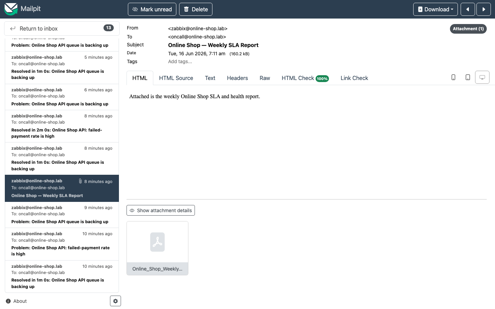

# Module 33: System Reports

## Learning Objectives

By the end of this module participants can use Zabbix's reporting: read the **System
information** and **Availability** reports, find noisy triggers with **Top 100
triggers**, and configure and generate a **scheduled PDF report** of a dashboard via
the **Zabbix Web Service** — delivered by email — understanding what reporting
requires and who each report is for.

## Topics

### Two audiences, several reports

Day 5 is about turning monitoring into *deliverables*. Reports serve two audiences:

- **Operations** want to know *where the pain is right now*: which triggers fire
  most, which hosts are least available.
- **Management** want a *periodic summary*: an SLA report in their inbox every
  Monday, no login required.

Zabbix's **Reports** menu covers both, and the **Zabbix Web Service** turns any
dashboard into an emailed PDF.

### System information

**Reports → System information** is the platform's vital-signs snapshot (Module 30):
server running, version and update status, host/item/trigger counts, the
**not-supported** count, and **Required server performance (NVPS)**. It is the first
screen to glance at — "is Zabbix itself healthy?" — before trusting any other report.

### Availability report

**Reports → Availability report** answers *"how available has this been?"* For each
trigger it shows the percentage of the period spent in **Problem** vs **OK** — the
raw material of uptime SLAs. Filter by host group or trigger over a time range to get
"the Online Shop frontend was OK 99.x% of last week".



### Top 100 triggers

**Reports → Top 100 triggers** ranks triggers by **number of problems** over a
period — your noise and instability map. In our lab the *ERROR in Online Shop app
log* trigger leads (the demo app logs errors continuously), followed by the demo-api
queue and failed-payment triggers. Use it to find what to **fix or tune**: a trigger
firing hundreds of times is either a real chronic problem or a threshold that needs
adjusting.



### Scheduled reports and the Zabbix Web Service

A **scheduled report** renders a **dashboard** to **PDF** and emails it on a cycle —
the management deliverable. Because a dashboard is a live web page, Zabbix needs a
headless browser to render it: the **Zabbix Web Service** container
(`zabbix-web-service`), which loads the frontend and exports the PDF.

The report itself defines the **dashboard**, the **period** (previous day/week/month),
the **cycle** and **start time**, the **subject/message**, and the **subscribers**.
We report the **Business SLA Dashboard** (Module 32) weekly.



When generated, the web service renders the dashboard and the report is emailed with
the **PDF attached** — here delivered to the on-call address via the Module 27 email
media type and caught by Mailpit.



### What report generation requires

Scheduled reports only work when **all** of these are in place:

- The **`zabbix-web-service`** container is running and reachable from the server.
- The server is configured with **`ZBX_WEBSERVICEURL`** and at least one
  **report writer** (`ZBX_STARTREPORTWRITERS ≥ 1`) — both set in `compose_lab.yaml`.
- A **Frontend URL** is set in **Administration → General → Other configuration
  parameters**, pointing at a URL the web service can reach
  (`http://zabbix-web:8080/` on the lab network).
- The recipient has **email media** and the **Email** media type works (Module 27).

Miss any one and reports silently fail to send — the same "walk the chain" discipline
as alerting.

## Docker-Based Demonstration

The instructor reviews System information and the Availability and Top-100-triggers
reports, confirms the Frontend URL and the running `zabbix-web-service`, then creates
a scheduled report of the Business SLA Dashboard and **tests** it — showing the PDF
arrive in Mailpit.

## Hands-On Lab

1. **Review system information.** Open **Reports → System information**.
   **Expected:** server running, version up to date, host/item/trigger counts, NVPS —
   the platform health snapshot (Module 30).

2. **Open the availability report.** **Reports → Availability report**, pick a host
   group/trigger and a time range.
   **Expected:** per-trigger **OK%** and **Problem%** for the period — e.g. how
   available the Online Shop frontend was.

3. **Review top triggers.** **Reports → Top 100 triggers** over the last day.
   **Expected:** the most-active triggers ranked by problem count — *ERROR in Online
   Shop app log* at the top, then the demo-api triggers. Identify what to fix or tune.

4. **Check report prerequisites.** Confirm the **Frontend URL** is set in
   **Administration → General → Other configuration parameters**
   (`http://zabbix-web:8080/`) and that `zabbix-web-service` is running:
   ```bash
   docker ps | grep zabbix-web-service
   docker exec zabbix-server nc -zv zabbix-web-service 10053
   ```
   **Expected:** the URL is set and the web service port is open.

5. **Create a scheduled report.** **Reports → Scheduled reports → Create report**:
   Name `Online Shop Weekly SLA Report`, **Dashboard** `Business SLA Dashboard`,
   **Period** *Previous week*, **Cycle** *Weekly*, **Start time** `09:00`, **Repeat
   on** Monday, a **Subject/Message**, and add **Admin** as a subscriber. Enable it.
   **Expected:** the report is saved and **Enabled**.

6. **Test it.** Open the report and click **Test**.
   **Expected:** within a few seconds the web service renders the dashboard and an
   email **`Online Shop — Weekly SLA Report`** with a **PDF attachment** arrives in
   Mailpit (http://localhost:8025). On Monday at 09:00 it would send automatically.

## Expected Outcome

Participants can read Zabbix's operational reports (system information, availability,
top triggers) and produce a management-ready **scheduled PDF report** of a dashboard
via the Zabbix Web Service — and they know the prerequisites that make report
generation work.

## Instructor Notes

- **Lab vs production.** Reporting works fully here because the lab ships the
  `zabbix-web-service` container, report writers, and Mailpit. In production you run
  the web service alongside the server, set a real **Frontend URL** (HTTPS), and
  deliver to real mailboxes. The architecture is identical.
- **Reports are the "so what" of monitoring.** Engineers live in Latest data;
  leadership reads the Monday SLA PDF. Teach students to match the **report to the
  audience** — Top 100 triggers for the team, the scheduled SLA report for managers.
- **The web service is a headless browser.** It literally loads the dashboard URL and
  prints to PDF — which is why the **Frontend URL** must be reachable *from the web
  service container* (a container name, not `localhost`). A blank/unreachable URL is
  the #1 reason reports don't render.
- **Report delivery reuses the alerting chain.** A scheduled report needs a working
  **media type** and **user media** (Module 27) just like an alert. If alerts work,
  reports deliver; if not, fix the media first.
- **Top 100 triggers drives tuning.** A trigger at the top is either a real chronic
  fault to fix or a noisy threshold to adjust (Module 30). Use the report to decide
  where to spend effort, not just to admire the numbers.
- **Availability ≠ SLA, but feeds it.** The availability report is per-trigger uptime;
  the **SLA** (Module 28) is the business-service rollup with a target. Use
  availability to investigate, the SLA report to report.
- **Timing (~45 min).** ~8 min audiences + system information, ~10 min availability +
  top triggers, ~12 min web service + prerequisites, ~12 min build + test the
  scheduled report, ~3 min recap.

## Lab-State Delta

Added in Module 33 (reporting — kept):

- **Setting:** **Frontend URL** set to `http://zabbix-web:8080/` (Administration →
  General → Other configuration parameters) so the web service can render dashboards.
- **Scheduled report:** `Online Shop Weekly SLA Report` (reportid `1`) — dashboard
  **Business SLA Dashboard** (412), period *Previous week*, cycle *Weekly*, Monday
  09:00, subject *Online Shop — Weekly SLA Report*, subscriber Admin, **enabled**.
- **Verified:** **Test** generated the PDF via `zabbix-web-service` and emailed it —
  Mailpit received *Online Shop — Weekly SLA Report* with a **PDF attachment** (~160
  kB). Availability and Top-100-triggers reports reviewed (real data). Screenshots in
  `content/day-5/assets/module-33/`. Lab at 8 hosts. **Day 5 begins.**
