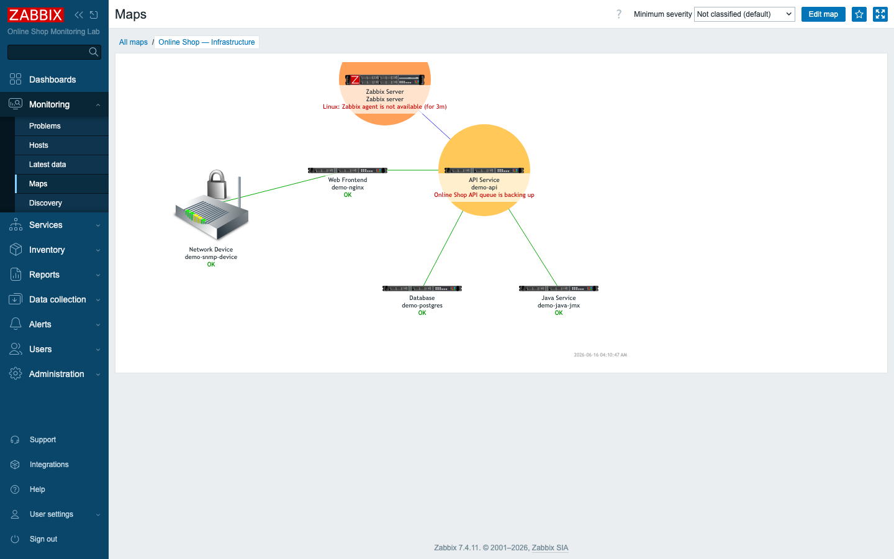
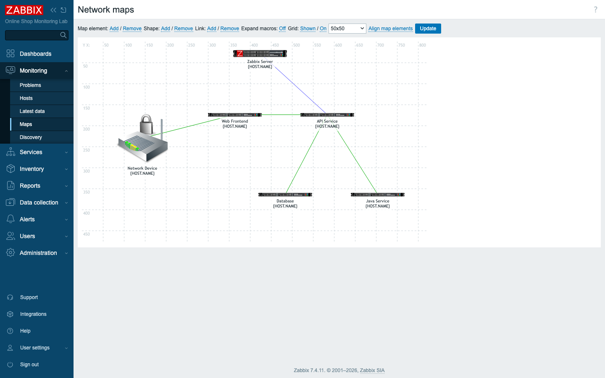
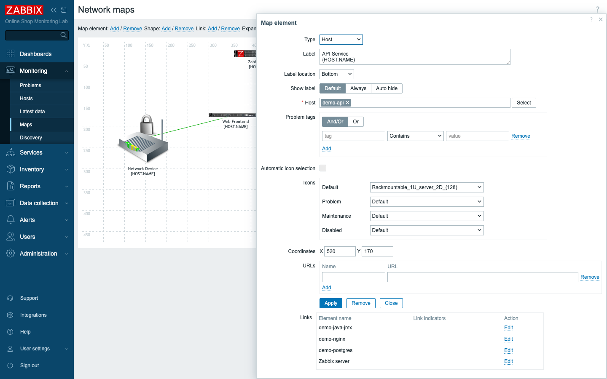
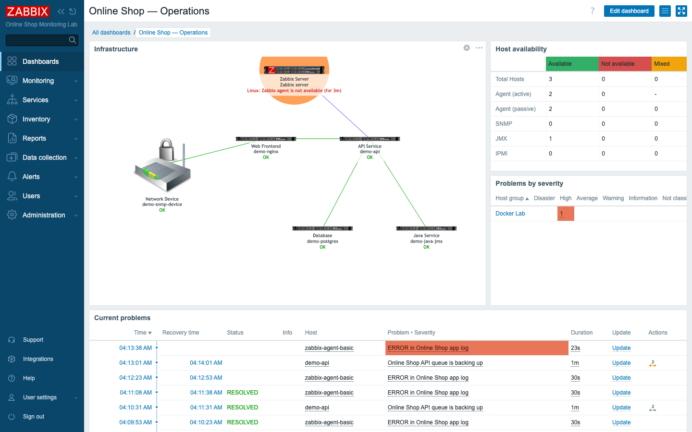
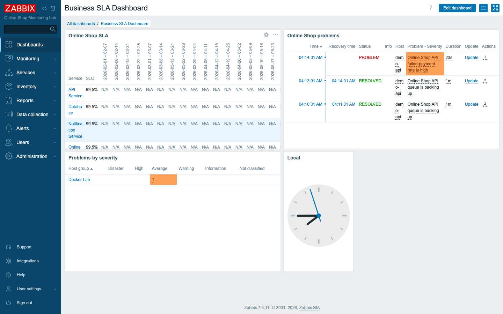

# Module 34: Advanced Visualization

## Learning Objectives

By the end of this module participants can design monitoring views for **different
audiences**: build a status-aware **infrastructure map**, embed it and live data in
an **operations dashboard**, contrast it with a **management dashboard**, customize
graphs, and explain when to use Zabbix's native dashboards versus an **external tool
like Grafana**.

## Topics

### Visualization is about the audience, not the data

The same monitoring data serves very different people, and a good view answers **one
question for one audience**:

- **Operations** need *"what is broken right now and where?"* — a live map, current
  problems, host availability.
- **Management** need *"is the service healthy and meeting its SLA?"* — service
  status, SLA attainment, trends.

Putting everything on one screen serves no one. The skill is choosing the right
widgets for the right viewer — which is what this module practises.

### Infrastructure maps

A **map** (Monitoring → Maps) is a picture of your environment where each element is
a live object that **colours by status**. We build one for the Online Shop:
`demo-snmp-device` (the network edge) → `demo-nginx` (web) → `demo-api` → the
`demo-postgres` database and `demo-java-jmx` service, with the Zabbix server watching
over it.

Elements with active problems light up and show the problem name (here **API
Service** and the **Zabbix Server** are highlighted), so one glance tells you both
*what* is wrong and *where it sits* in the topology.

#### Building a map, step by step

A map is assembled in the **map constructor** (Monitoring → Maps → *map* → **Edit
map**). The toolbar adds **map elements**, **shapes**, and **links**; a grid helps
alignment.

Each **element** is configured to a real object — its **Type** (Host), the **Host**
it represents, its **label** (we use `{HOST.NAME}` macros), and per-status **icons**
(Default / Problem / Maintenance / Disabled) so the picture changes as state changes.
Elements are joined by **links**, which can themselves colour by a trigger.

### Service maps

The same map tool can picture **business services** instead of hosts — element type
**Trigger** or links coloured by trigger let you draw the Online Shop's logical
service flow (Module 28) rather than its physical hosts. Use a **host map** for
infrastructure and a **service/trigger map** for the business view.

### Advanced dashboards for two audiences

Dashboards combine **widgets** (Module 12) into a purpose-built screen. The power is
the **widget mix**, and a **map widget** can embed the map you just built.

The **operations dashboard** answers "what's broken now": the infrastructure **map**,
**host availability**, **problems by severity**, and the live **problem list**.

The **management dashboard** (the Business SLA Dashboard, Module 32) answers "are we
healthy and meeting the SLA": the **SLA report** per service and the Online Shop's
problems — no engineering detail.

Same platform, same data, **two deliberately different screens** — that is the
lesson.

### Graph customization

Beyond simple item history, a **custom graph** (Data collection → Hosts → Graphs)
lets you place **multiple items on one chart**, choose draw styles (line, filled,
stacked), set Y-axis scale and units, and add a legend — for example overlaying the
API's response time and queue length to see them correlate. Dashboards then surface
these via the **Graph** and **Item value** widgets.

### External visualization: Grafana (concept)

Zabbix's dashboards are native, problem- and service-aware, and need no extra
infrastructure. **Grafana** is an external dashboard tool with a **Zabbix data source
plugin**; teams use it to **combine Zabbix with other data sources** (logs, cloud
metrics, application traces) and for highly customised or public display panels.

> **Concept only:** this lab does not ship Grafana. The integration is a Grafana
> instance pointed at the Zabbix API via the Zabbix plugin — out of scope to build
> here, but important to know.

**When to use which:** stay in **Zabbix dashboards** for monitoring-native views
(problems, services, SLAs, maps) with zero extra moving parts; reach for **Grafana**
when you must blend Zabbix with **other systems** or need panel types Zabbix doesn't
offer.

## Docker-Based Demonstration

The instructor builds the infrastructure map (elements → icons → links → status),
embeds it in an operations dashboard alongside availability and problems, contrasts
that with the management SLA dashboard, customizes a graph, and discusses where
Grafana fits.

## Hands-On Lab

1. **Create an infrastructure map.** **Monitoring → Maps → Create map**: name
   `Online Shop — Infrastructure`, set a size, then **Edit map**.
   **Expected:** an empty constructor canvas with the element/link toolbar.

2. **Add elements.** **Map element → Add**, then configure each: Type **Host**, pick
   the host (`demo-nginx`, `demo-api`, `demo-postgres`, `demo-java-jmx`,
   `demo-snmp-device`, and the Zabbix server), set a **label** (`{HOST.NAME}`) and a
   fitting **icon** (router for the network device, server for the rest).
   **Expected:** six elements on the canvas, each tied to a host.

3. **Link them.** **Link → Add** between elements to draw the topology (edge → web →
   api → db/java). **Update** the map.
   **Expected:** a connected diagram; in **Monitoring → Maps** the elements are
   **green (OK)** and turn **red/orange** when their host has a problem.

4. **Build an operations dashboard.** **Dashboards → Create dashboard**, name `Online
   Shop — Operations`. Add a **Map** widget (the infrastructure map), a **Host
   availability** widget, a **Problems by severity** widget, and a **Problems**
   widget.
   **Expected:** a live "what's broken now" screen with the map embedded.

5. **Review the management dashboard.** Open the **Business SLA Dashboard** (Module
   32).
   **Expected:** SLA-per-service and service problems — the same data, shaped for
   leadership. Compare the two dashboards' intent.

6. **Customize a graph.** Create a custom graph combining two `demo-api` items (e.g.
   response time and queue length) with a legend.
   **Expected:** both series on one chart; add it to a dashboard via the **Graph**
   widget.

7. **Discuss external tools.** Note where a Grafana dashboard (Zabbix data source)
   would add value — blending Zabbix with other data sources.

## Expected Outcome

Participants can build a status-aware infrastructure map, assemble distinct
operations and management dashboards from the right widgets, customize graphs, and
decide between native Zabbix dashboards and an external tool like Grafana — designing
visualization that fits each audience.

## Instructor Notes

- **Lab vs production.** Maps and dashboards are identical at any scale; production
  maps just have more elements (often auto-populated by **map navigation trees** or
  scripts) and dashboards are shared per team/role. Grafana, if used, runs as its own
  service pointed at the Zabbix API.
- **Design for one question.** Before adding a widget, ask "whose question does this
  answer?" An operations screen and a board-room screen should look different. Mixing
  them produces a dashboard nobody reads.
- **Maps make topology legible.** A list of red hosts doesn't show *impact*; a map
  does — "the database is down, and everything downstream of it is red." Tie element
  status to the hosts/triggers that matter and keep the layout close to reality.
- **Common dashboard mistakes** to call out: too many widgets; vanity metrics with no
  action; graphs so small they're unreadable; no time context; one dashboard trying
  to serve every audience; static screens that never get reviewed.
- **Use the map widget.** Embedding the map in the operations dashboard means one
  screen for the NOC — topology + problems + availability together.
- **Zabbix vs Grafana — be balanced.** Don't reach for Grafana by default: native
  dashboards are problem/service-aware and need no extra infra. Use Grafana for
  genuine multi-source needs, not because it looks fashionable.
- **Timing (~45 min).** ~8 min audience/visualization principles, ~15 min build the
  map (elements, icons, links, status), ~12 min operations vs management dashboards +
  map widget, ~6 min graph customization, ~4 min Grafana concept + design-mistakes
  recap.

## Lab-State Delta

Added in Module 34 (visualization — kept):

- **Map:** `Online Shop — Infrastructure` (sysmapid `3`, 820×480) — 6 host elements
  (Zabbix Server, Network Device/demo-snmp-device, Web Frontend/demo-nginx, API
  Service/demo-api, Database/demo-postgres, Java Service/demo-java-jmx) with
  type-specific icons and 5 links forming the Online Shop topology; elements colour by
  host trigger status. (Prior basic map `2` "Online Shop — Network Map" left as-is.)
- **Dashboard:** `Online Shop — Operations` (dashboardid `413`) — **Map** widget
  (sysmap 3), **Host availability**, **Problems by severity**, **Problems** (Docker
  Lab group). KEPT, contrasts with the management `Business SLA Dashboard` (412).
- Graph customization and Grafana covered (Grafana concept only — not in lab).
  Screenshots in `content/day-5/assets/module-34/`. Lab at 8 hosts.
