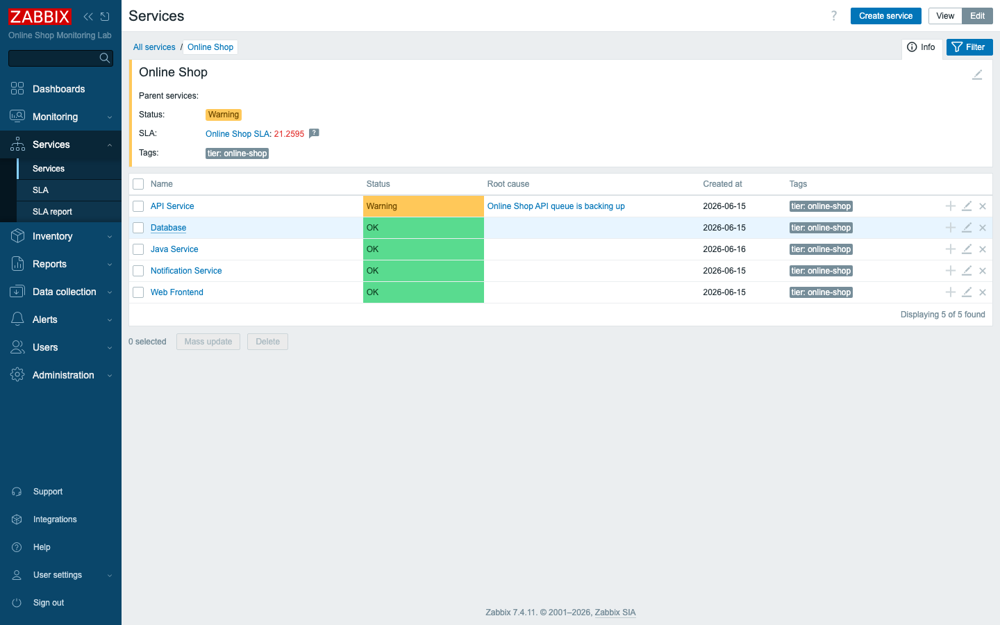
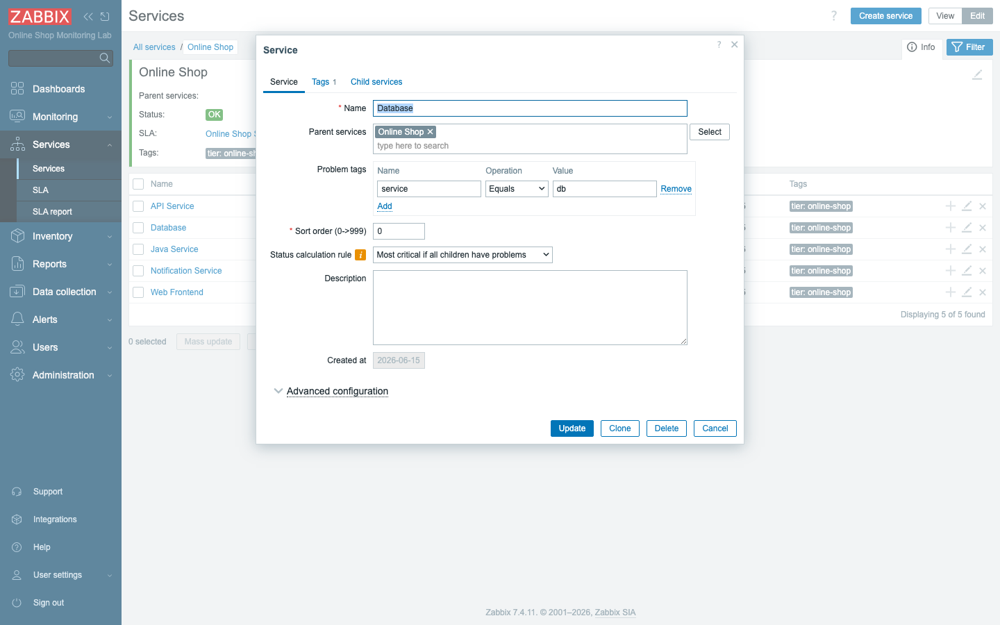
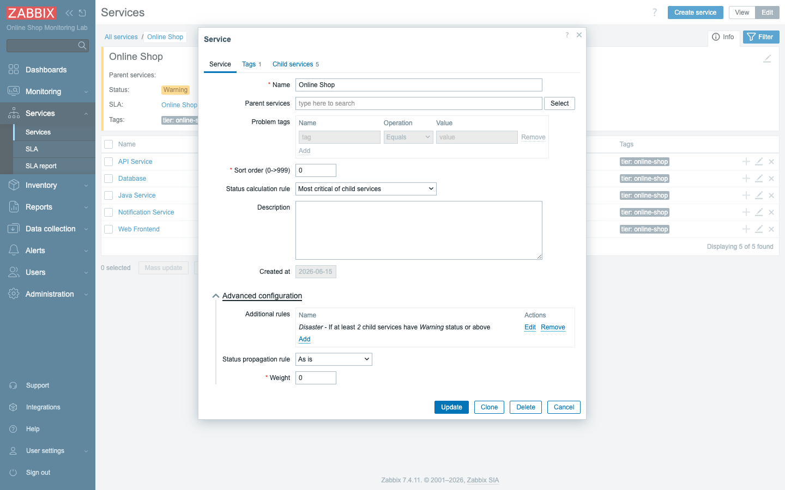
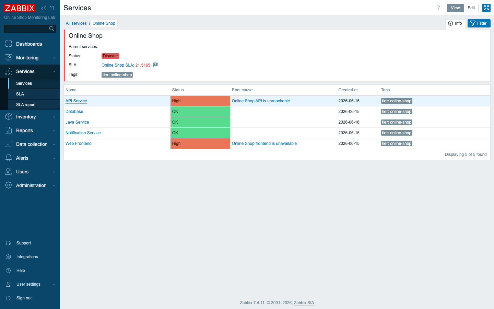
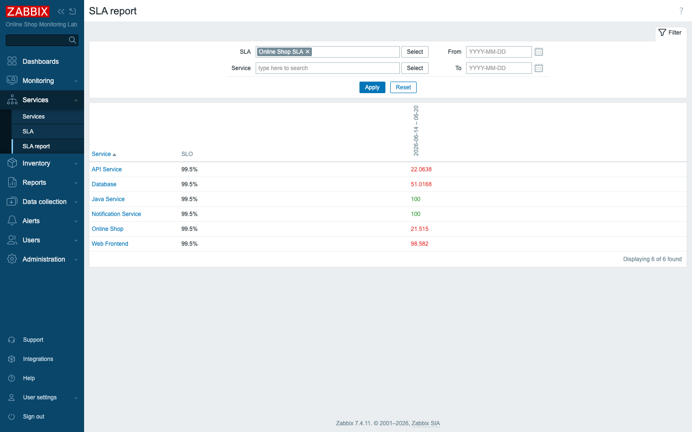

# Module 35: Business Service Monitoring

## Learning Objectives

By the end of this module you will be able to model and report on **business
services** in depth, not just sketch a tree and walk away. You will refine the
Online Shop **service tree** so it matches the real architecture, map **technical
triggers to services** using tags, and take control of **status calculation** with
algorithms and **additional rules** rather than accepting whatever the defaults
hand you. You will then make a failure happen and watch **service impact** and
**root cause** ripple upward through the tree, and finally read a **detailed SLA
report** that measures uptime and downtime against a target. The thread running
through all of it is a single idea: connecting one broken host to its business
consequence, so that a red trigger on `demo-api` becomes a sentence a manager can
act on.

## Topics

### From hosts to services — the business view

Module 28 introduced business services and got the tree off the ground; this
module goes deep. Recall what a **business service** actually is: it is something
the company sells or depends on — *the Online Shop* — modeled independently of the
hosts that happen to implement it today. The whole reason to maintain a separate
layer of "services" on top of your hosts is translation. When `demo-api` fails, an
engineer sees a trigger and knows exactly what to do with it. A manager, by
contrast, does not want to read a trigger; a manager needs to hear *"the API
Service is down, so the Online Shop is degraded, and we're breaching our SLA."*
That second sentence is the one that gets budget approved and incidents
prioritized, and services are the machinery that produces it automatically from
the raw triggers underneath.

### Refining the service tree

The Online Shop tree already carries the components that matter, but a tree is only
as honest as it is complete. We **refine** it to match the full architecture by
adding the **Java Service** (`demo-java-jmx`) alongside the Web Frontend, the API
Service, the Database, and the Notification service — five children sitting under
the Online Shop root. Leaving the Java service out would have meant a Java outage
silently failing to register at the business level, which is exactly the blind spot
service monitoring exists to close.



### Technical-trigger-to-service mapping

A leaf service is useless until it is wired to reality, and the wire is the
**problem tag**. The rule is simple: any problem event carrying a matching tag
counts against the service it is mapped to. The **Database** service maps
`service = db`; because we tagged the `demo-postgres` **host** with `service:db`
back in Module 28, every problem raised on that host automatically inherits the tag
and flows straight to the service — there is no per-trigger wiring to maintain, and
no risk of forgetting to connect a newly created trigger. That single act of
tagging the host once is what makes the join scale. This **technical-trigger →
business-service mapping** is the heart of the model, so it is worth pausing on:
the tag is the join key between the world of infrastructure and the world of
business.



### Service dependencies and status calculation

Once leaves are mapped, parents derive their status from their children — and the
interesting design work is in controlling *how* that derivation happens. Zabbix
gives you several levers:

- **Status calculation rule (algorithm):**
  - *Most critical of child services* — the parent is as bad as its worst child
    (right for "is the shop up?").
  - *Most critical if all children have problems* — only fails when every child does
    (for redundant components).
- **Status propagation rule** — *As is / Increase / Decrease / Fixed* — adjusts how a
  child's severity contributes to the parent, and **weight** lets some children
  matter more than others.
- **Additional rules** — override the algorithm in defined conditions.

Each of these encodes a business judgment, not just a technical setting. To see why
they matter, consider what happens at the very top of the tree. We add an
**additional rule** to the Online Shop root: *"If at least 2 child services have
Warning status or above → set the service to Disaster."* This says something a plain
algorithm cannot: *multiple simultaneous failures are worse than the sum of their
parts*. One degraded component might be a recoverable hiccup; two at once usually
signals a real, customer-visible outage, and the rule makes the dashboard scream
accordingly.



### Service impact and root cause

Now we make it happen, because a model you have never seen fail is a model you do
not yet trust. With the web and API components both failing, watch the chain move
upward: the **Web Frontend** and **API Service** turn **High**, and because two
children are simultaneously in a problem state, the additional rule fires and
escalates the **Online Shop** root all the way to **Disaster** — not merely High,
which is the point of the rule. Better still, the Services view does not just paint
things red; it names the **root cause** for each affected service (*frontend is
unavailable*, *API is unreachable*), so you are handed the explanation alongside the
symptom.



This is **business impact from a technical failure**, made explicit and traceable
end to end: two hosts down → two services degraded → the whole Online Shop in
Disaster → the SLA breaking. You can read that chain in either direction, which is
exactly what makes it valuable in an incident — top-down to explain the impact to a
manager, bottom-up to find the host an engineer must fix.

### Uptime, downtime, and how the SLA is calculated

An **SLA** is what turns service status into a measured promise rather than a
feeling. Over a **reporting period** (daily, weekly, or monthly), Zabbix
accumulates the time a service spent in **problem** — its **downtime** — versus the
time it spent healthy — its **uptime** — and from those two numbers computes the
**SLI**, the achieved availability you actually delivered:

```text
SLI = uptime / (uptime + downtime) × 100%
```

That SLI is then compared against the **SLO** target, which in our lab is **99.5%**.
One subtlety matters in real operations and is easy to overlook: **scheduled
maintenance** (Module 26) can be **excluded** from downtime, so the planned work you
announced in advance doesn't unfairly count against your number. Each service is
evaluated independently, and the root simply rolls up the picture from its children.

### Detailed SLA reports

The **SLA report** (Services → SLA report) is where the abstract promise becomes a
concrete grade. It shows the SLI per service per period, colored against the SLO so a
breach is obvious at a glance. After our outage the Online Shop and its failed
components sit well below 99.5%, while the untouched Java and Notification services
stay at 100% — and that contrast is the whole value of the report. It quantifies
exactly which part of the business missed its target and by how much, turning "we had
an outage" into a specific, defensible figure.



### Executive reporting

There is one last gap to close: managers don't open Zabbix. A beautifully accurate
SLA report that no executive ever logs in to see has no business effect. The
**scheduled report** (Module 33) solves this by rendering the Business SLA Dashboard
to **PDF** and emailing it every Monday — the SLI and service health delivered to the
board without anyone needing a login. Put the three pieces together — business
service monitoring, the SLA, and the scheduled report — and you have the full
executive-reporting pipeline, from a raw trigger all the way to a slide in front of
the people who fund the work.

## Docker-Based Demonstration

Using the Online Shop services from Module 28, the instructor adds the Java Service,
shows the problem-tag mapping and the additional status rule, then stops two
components to escalate the root to Disaster — and opens the SLA report to show the
SLI fall against the 99.5% target.

## Hands-On Lab

1. **Refine the service tree.** Tag `demo-java-jmx` with `service:java`, add a trigger
   so it can fail, then **Monitoring → Services → (Edit) → Create service** `Java
   Service` under **Online Shop** with problem tag `service = java`.
   **Expected:** the Online Shop shows **five** child services.

2. **Inspect a mapping.** Open the **Database** service (Edit). Confirm **Problem
   tags** `service = db` and the **Status calculation rule**.
   **Expected:** the service is joined to `demo-postgres`'s problems by tag.

3. **Add an additional rule.** Edit the **Online Shop** root → **Advanced
   configuration → Additional rules → Add**: *If at least **2** child services have
   status **Warning** or above → set status to **Disaster***.
   **Expected:** the rule is listed under the root.

4. **Confirm the SLA target.** **Services → SLA** — `Online Shop SLA`, SLO **99.5%**,
   weekly, covering `tier = online-shop`.
   **Expected:** the SLA is enabled and covers all Online Shop services.

5. **Trigger a service failure.** Stop two components:
   ```bash
   docker stop demo-nginx demo-api
   ```
   **Expected:** within ~1 min **Web Frontend** and **API Service** go **High**; the
   additional rule escalates **Online Shop** to **Disaster**, with root causes named.

6. **Review the SLA calculation.** **Services → SLA report**, select `Online Shop
   SLA`.
   **Expected:** the SLI per service for the period — Online Shop and the failed
   components below **99.5%**, the untouched ones at **100%**. Explain the
   uptime/downtime math.

7. **Explain the business impact, then recover.** State the chain: *hosts down →
   services degraded → Online Shop in Disaster → SLA breached*. Then
   `docker start demo-nginx demo-api` and watch it recover.
   **Expected:** services return to OK; the breach remains recorded in the SLA history.

## Expected Outcome

Participants can build and refine a business service tree, map technical triggers to
services with tags, shape status with algorithms and additional rules, demonstrate
service impact and root cause from a real failure, and read a detailed SLA report —
fully connecting infrastructure monitoring to business outcomes.
