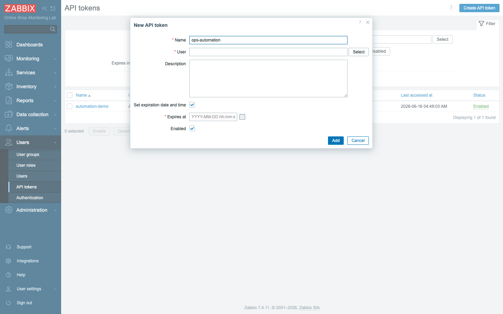
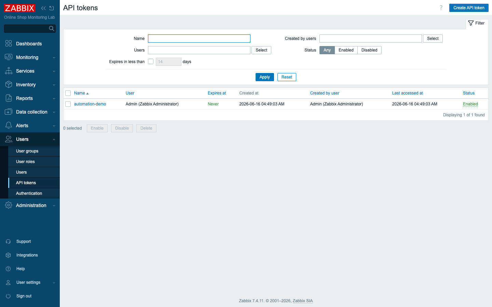
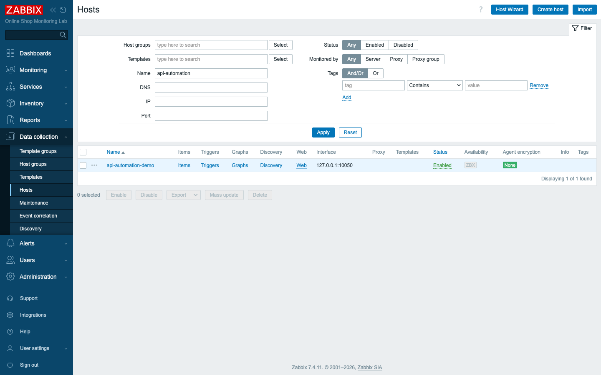

# Module 36: Zabbix API and Automation

## Learning Objectives

By the end of this module participants can drive Zabbix from code: explain the
**JSON-RPC API** and **token authentication**, call it with **curl** and **Python**,
perform the common operations (**list hosts**, **read problems**, **create/update a
host**, **export configuration**), and write a small **automation script** —
understanding where the API fits in real operations and third-party integration.

## Topics

### What is the Zabbix API?

For thirty-five modules you have built the Online Shop's monitoring by clicking:
you opened forms, filled in fields, and pressed buttons. That is the right way to
learn, but it does not scale. Imagine onboarding two hundred new web servers, or
recreating the whole environment from scratch after a rebuild, one mouse click at
a time. At some point you stop being a person who configures Zabbix and start
wishing you were a program. This module is where you become that program.

Everything you have done by clicking — hosts, items, triggers, services, users — is
also available through the **API**. It is a single HTTP endpoint,
**`/api_jsonrpc.php`**, speaking **JSON-RPC 2.0**: you POST a JSON request naming a
**method** and its **params**, and get a JSON **result** back. The frontend itself
uses this API, so anything the UI can do, your scripts can do — which is the
foundation of automating Zabbix.

That last point is worth dwelling on, because it is the source of the whole
discipline. The web pages you have been using are not a separate, privileged way
into Zabbix; they are themselves a client of the same API. When you saved a host
in a form, the browser quietly sent a `host.create` call behind the scenes. So
there is no feature locked away from automation: if you can reach it with a mouse,
you can reach it with a `POST`.

### The JSON-RPC request

The pleasant thing about this API is that there is essentially one shape to learn,
and every call you ever make is a variation on it. Once the structure below is in
your fingers, the only thing that changes from call to call is the method name and
the parameters you hand it.

Every call has the same shape:

```json
{
  "jsonrpc": "2.0",
  "method": "host.get",
  "params": { "output": ["hostid", "host"] },
  "id": 1
}
```

- **`method`** — `<object>.<action>`, e.g. `host.get`, `trigger.create`,
  `problem.get`.
- **`params`** — the arguments (filters for reads, fields for writes).
- **`id`** — any number you choose; echoed back so you can match responses.

Read that example as a sentence: "On the `host` object, perform the `get` action;
return only the `hostid` and `host` fields for every host you find." The `output`
parameter is your way of saying *which columns you care about* — ask for two
fields instead of everything and you get a smaller, faster response. The `id` is
housekeeping: when you fire several calls at once, the server stamps each reply
with the same `id` you sent, so you can tell which answer belongs to which
question.

The reply is `{"jsonrpc":"2.0","result": …,"id":1}` on success or
`{… "error": {…}}` on failure.

That fork — `result` versus `error` — is the first thing any script you write
should check. A successful call carries a `result`; a failed one carries an
`error` object explaining what went wrong (bad method, missing permission,
malformed params). Get into the habit of branching on which key came back rather
than assuming success.

### Authentication: API tokens

A program that can create and delete hosts is a program you want to be careful
about who runs. So before Zabbix will honor any real call, it needs to know *who
is asking*. In Zabbix 7.4 that proof of identity is an API token.

In Zabbix 7.4 you authenticate with an **API token** sent in the HTTP header
**`Authorization: Bearer <token>`** — *not* the deprecated `auth` field in the body.
Create one under **Users → API tokens → Create API token**: give it a name and a
user; it inherits **that user's permissions** (Module 25), so a token for a limited
user can only do what that user can.

The permission inheritance is the part to internalize. A token is not a master
key; it is a badge that carries the exact rights of the user it was issued for. If
you mint a token for a read-only operator, that token can list hosts and read
problems but cannot delete anything — which is precisely how you keep an
automation script from doing more damage than its job requires.



The token's secret is shown **once** at creation — copy it then; you cannot see it
again (only revoke and regenerate). Tokens are listed, auditable, and revocable.

Treat that one-time display the way you would treat a password reset link: copy it
straight into your secret store the moment it appears. If you navigate away
without saving it, the secret is gone for good — there is no "show me again." The
list view does, however, keep a permanent record of *which* tokens exist and lets
you revoke any of them, so a leaked token is a quick fix, not a catastrophe.



> **One special case:** `apiinfo.version` must be called **without** the
> authorization header — it's the only method that takes no auth.

There is a small logic to that exception: you might want to ask "what version of
Zabbix am I talking to?" *before* you even have credentials, so that one method is
deliberately left open. Every other method in the API expects the Bearer header.

### Calling the API with curl

The fastest way to feel how the API behaves is to talk to it by hand, and `curl`
is the tool for that. There is nothing magic here — you are POSTing the same JSON
you saw above to the endpoint and reading the JSON that comes back.

The smallest possible call (no auth) — the version:

```bash
curl -s -X POST -H 'Content-Type: application/json-rpc' \
  -d '{"jsonrpc":"2.0","method":"apiinfo.version","params":{},"id":1}' \
  http://localhost:8080/api_jsonrpc.php
# {"jsonrpc":"2.0","result":"7.4.11","id":1}
```

Notice what this call needs and what it doesn't. It sets the content type, it
POSTs the request body with `-d`, and it points at `/api_jsonrpc.php` — but it
carries no `Authorization` header, because `apiinfo.version` is the open method.
The comment line shows the reply you should see: a `result` of `7.4.11`, which is
both a sanity check that the endpoint is alive and confirmation that you are
indeed on 7.4.

With a token, read the hosts:

```bash
TOKEN=<your API token>
curl -s -X POST -H 'Content-Type: application/json-rpc' \
  -H "Authorization: Bearer $TOKEN" \
  -d '{"jsonrpc":"2.0","method":"host.get","params":{"output":["hostid","host"]},"id":1}' \
  http://localhost:8080/api_jsonrpc.php
```

This is the same pattern as before with two additions: you stash the secret in a
shell variable so it never appears inline twice, and you pass it in the
`Authorization: Bearer $TOKEN` header so the server knows who you are. The method
is `host.get` and the params ask only for `hostid` and `host`, so the response is
a tidy list of every host the token's user is allowed to see — the Online Shop's
inventory, returned as JSON instead of a web table.

### Common operations

You do not need to memorize the whole API to be productive. Almost everything you
will reach for follows one naming rule, and once you see the rule, you can guess
method names instead of looking them up.

The method pattern is `<object>.<action>` with `get / create / update / delete`:

| Task | Method | Notes |
|---|---|---|
| List hosts | `host.get` | filter with `output`, `groupids`, `filter`, `search` |
| Read current problems | `problem.get` | live problems; `event.get` for history |
| Create a host | `host.create` | needs `groups` and (for agent) `interfaces` |
| Update a host | `host.update` | by `hostid`; e.g. add tags, change name |
| Export config | `configuration.export` | YAML/XML/JSON for a template or host (Module 29) |

Read the table as four verbs applied to whatever object you have in mind. `get`
reads, `create` makes a new one, `update` changes an existing one by its id, and
`delete` removes it — and the same four work on `item`, `trigger`, `service`,
`user`, and the rest. The Notes column points out the one detail per operation
that beginners trip on: reads are shaped by filters like `groupids` and `search`,
a host create won't succeed without at least a `groups` entry, and an update keys
off the `hostid` rather than the name.

### Automating with Python

`curl` is great for poking at the API and for one-off jobs, but you would not build
a provisioning pipeline out of shell one-liners. Real automation lives in a script
that you can read, test, and re-run safely — and that is where Python comes in.

`curl` is fine for one-offs; real automation uses a script. The committed example
`content/lab/api/zbx_automation.py` is a dependency-free Python client that
authenticates with a token, lists hosts, reads problems, and **creates a host** — its
output against the lab:

```text
API version: 7.4.11

Hosts (8):
   10084  Zabbix server
   10783  demo-api
   ...
Current problems (2):
  [3] Linux: Zabbix agent is not available (for 3m)
  [4] ERROR in Online Shop app log

Created host api-automation-demo -> hostid 10798
Read back: {'hostid': '10798', 'host': 'api-automation-demo', 'status': '0'}
```

Walk down that output and you are watching a tiny operations workflow run start to
finish. The script first confirms it is talking to a 7.4.11 server, then lists the
eight hosts in the lab, then reads the two live problems — the same data the
Monitoring views show, just delivered to code. Then it does the interesting part:
it issues a `host.create` for `api-automation-demo`, receives the new `hostid` of
`10798` back, and immediately performs a read-back to *prove* the host now exists
with the status it expects. That read-after-write is not decoration; it is the
discipline that turns "I sent a request" into "I confirmed the result."

The host it creates appears immediately in the UI — a host built entirely from code:



### Automation use cases and integration

Stepping back from the syntax: why does any of this matter for the Online Shop?
Because the API is the seam where Zabbix stops being an island and becomes part of
how your organization actually runs. The three patterns below are the ones you
will meet most often.

The API is how Zabbix fits into a larger toolchain:

- **Bulk and self-service provisioning** — create hundreds of hosts from a CSV or a
  CMDB; let teams onboard services via a form instead of a ticket.
- **Configuration as code** — `configuration.export` templates into git (Module 29),
  import them via API in CI.
- **Integration with third-party tools** — push problems into **ticketing**
  (Jira/ServiceNow), **ChatOps** (Slack/Teams), or pull data into **Grafana** and
  data warehouses. Webhook media types (Module 27) are the *outbound* path; the API
  is the *inbound/management* path.

That final distinction is the one to carry forward. Back in Module 27 you wired up
webhook media types so Zabbix could *push* alerts out to Slack or a ticketing
system — that is the outbound door. The API is the other door: it is how the
outside world *reaches in* to query state and manage configuration. A mature
setup uses both, so the Online Shop's monitoring both speaks to your tooling and
listens to it.

## Docker-Based Demonstration

The instructor creates an API token, calls the API with **curl** (`apiinfo.version`,
`host.get`, `problem.get`), then runs the **Python** script to list hosts, read
problems, and create a host — showing it appear in the UI — and finishes with a
`host.update` and a `configuration.export`.

## Hands-On Lab

1. **Create an API token.** **Users → API tokens → Create API token**: name it,
   assign your user, leave expiry off for the lab, **Add**, and **copy the token now**
   (it is shown once).
   **Expected:** the token is listed and Enabled.

2. **Authenticate and check the version.** From a terminal:
   ```bash
   curl -s -X POST -H 'Content-Type: application/json-rpc' \
     -d '{"jsonrpc":"2.0","method":"apiinfo.version","params":{},"id":1}' \
     http://localhost:8080/api_jsonrpc.php
   ```
   **Expected:** `"result":"7.4.11"` (no auth header needed for this method).

3. **Get the host list.** Call `host.get` with your token in the `Authorization:
   Bearer` header. This proves your token works and returns the same inventory you
   normally read off the Hosts page.
   **Expected:** the lab's 8 hosts with their ids.

4. **Get current problems.** Call `problem.get`. You are now reading live alert
   state straight from code — the foundation of any integration that forwards
   problems elsewhere.
   **Expected:** the live problems (e.g. the recurring log ERROR).

5. **Create / update a host.** Run the script
   `content/lab/api/zbx_automation.py` (set `ZBX_URL` and `ZBX_TOKEN` first), or call
   `host.create` directly. Then `host.update` to add a tag. This is the full
   write path: make a host from nothing, then modify it in place by its `hostid`.
   **Expected:** `api-automation-demo` appears in **Data collection → Hosts**;
   the tag is set.

6. **Export a host's config.** Call `configuration.export` with
   `{"options":{"hosts":["<hostid>"]}}`. The YAML you get back is exactly the
   config-as-code artifact you would commit to git for review and re-import.
   **Expected:** YAML for that host — config-as-code from the API.

7. **Write/extend a Python script.** Read
   `content/lab/api/zbx_automation.py`, then modify it (e.g. print only Web Services
   hosts, or create a host from variables). Owning a script you can change is the
   point — it is the difference between running someone else's automation and
   writing your own.
   **Expected:** a working script you understand end to end.

## Expected Outcome

Participants can authenticate to the Zabbix API with a token, perform read and write
operations from curl and Python, automate host management and configuration export,
and explain how the API integrates Zabbix with the wider toolchain — the foundation
of operating Zabbix at scale.
