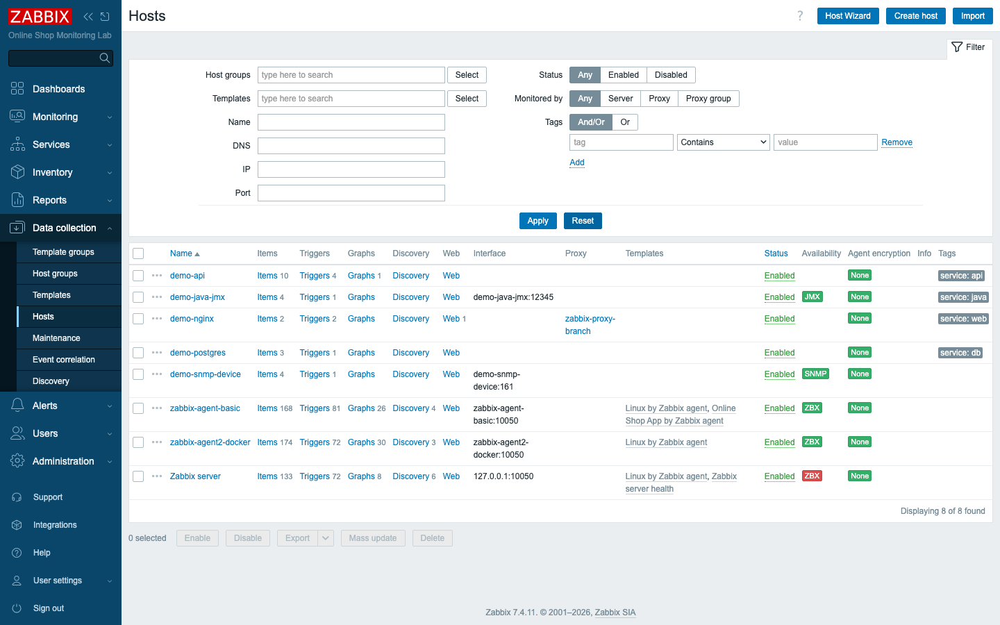
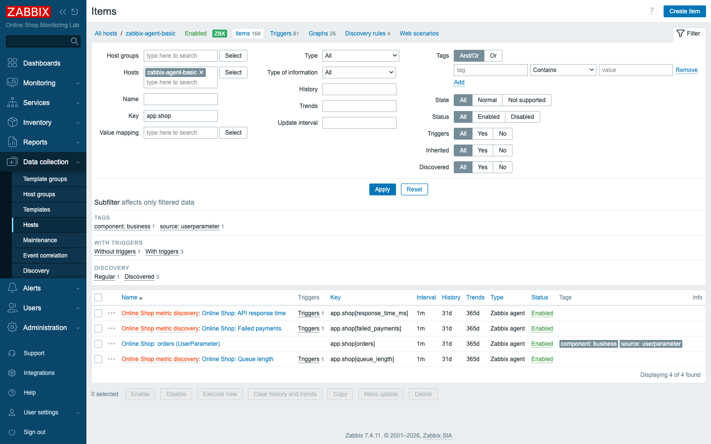
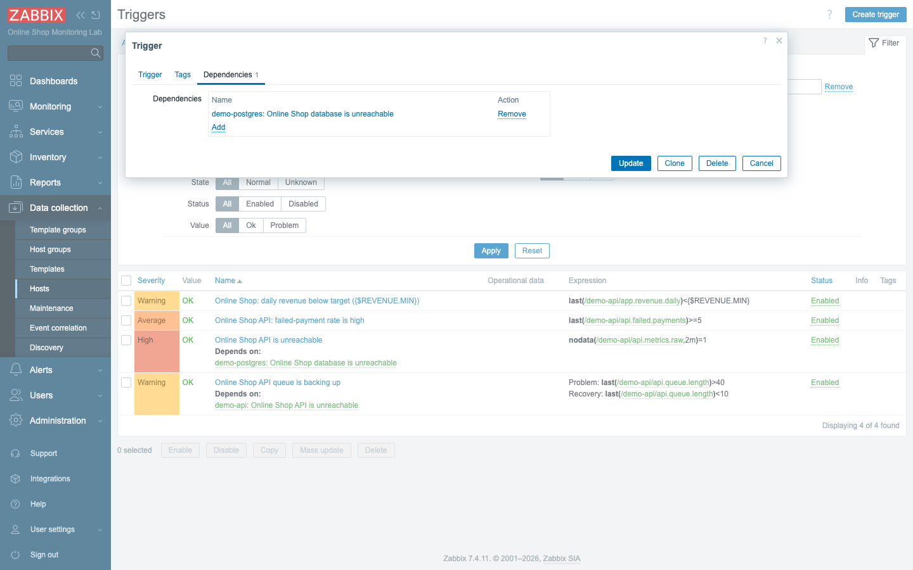
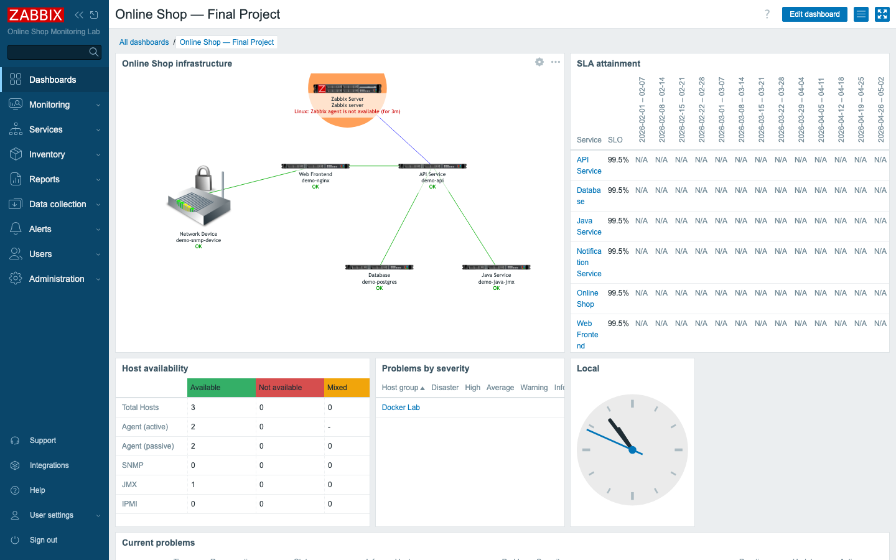
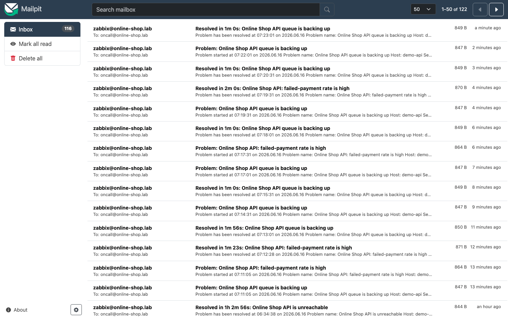
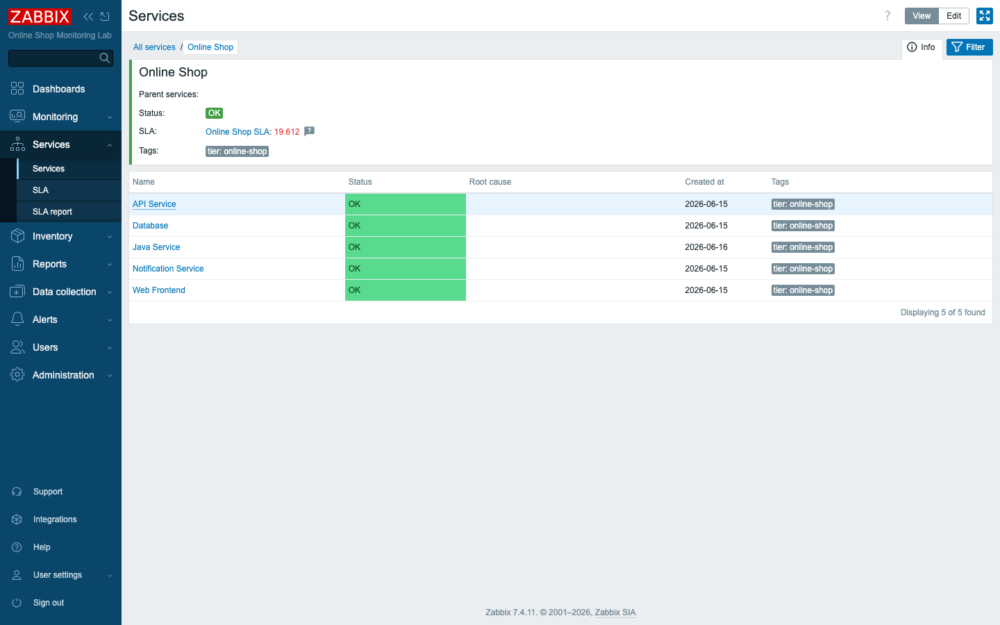
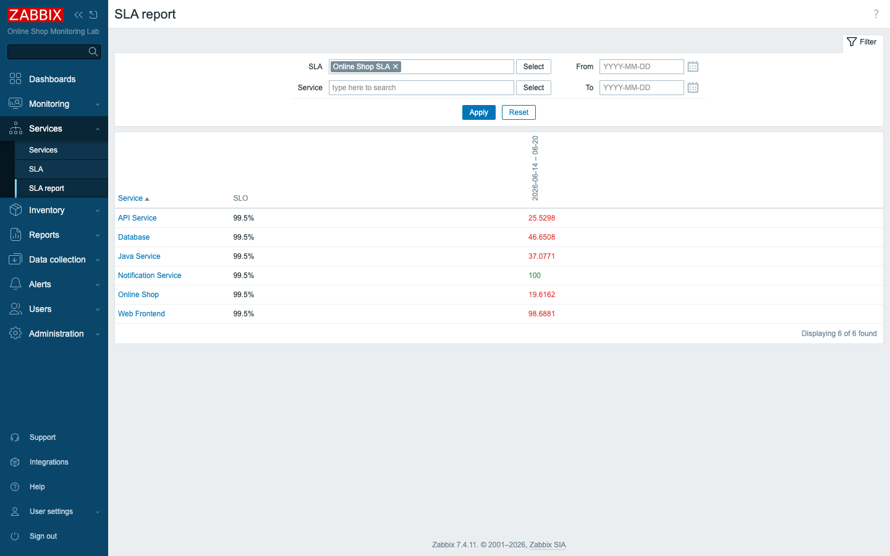
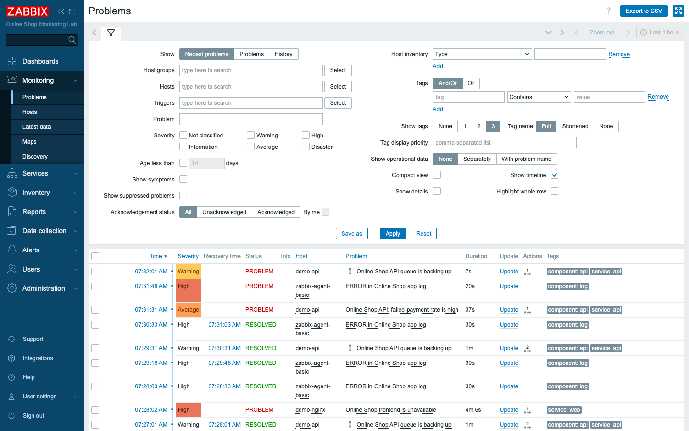

# Module 40: Final Practical Lab (Capstone Project)

> **Duration: 90 minutes.** This is the course capstone. You assemble everything from
> Modules 1–36 into one complete, operating monitoring system for the Online Shop,
> add the last required pieces (a trigger **dependency** and a **troubleshooting**
> drill), produce a set of **deliverables**, and **present** your design.

## Learning Objectives

This is where every thread of the course is pulled into one rope. By the end of this
module participants can **design, build, operate, and troubleshoot a complete Zabbix
monitoring environment** on Docker — covering hosts, templates, custom items,
web/log/DB/SNMP/JMX monitoring, triggers and dependencies, dashboards, alerting,
business services and SLAs, configuration export, the API, and incident troubleshooting
— and present the result as an engineer would to a team. The earlier modules taught each
of those skills in isolation; the work here is to make them function together as one
operating system and to prove that they do.

## Topics

### The project brief

Picture yourself on the first day of the job. You are the monitoring engineer for a
small company's **Online Shop**, running entirely on Docker. Your job: deliver a
monitoring system that watches every tier, alerts the on-call, reports SLA to
management, and can be operated and debugged. The environment is the one this whole
course has built:

```text
Online Shop
├── Nginx frontend        (demo-nginx)        — web monitoring
├── API application       (demo-api)          — HTTP agent + custom items
├── PostgreSQL database   (demo-postgres)     — ODBC monitoring
├── Java/JMX service      (demo-java-jmx)      — JMX via Java gateway
├── SNMP simulated device (demo-snmp-device)  — SNMP monitoring
├── Log-generating service(demo-log-app)      — log monitoring (via agent)
└── Notification channel  (demo-mailhog)      — local SMTP for email alerts
```

monitored by the Zabbix server, two agents, a proxy, the Java gateway, and the web
service — **8 hosts** in all. Each line in that tree is a different kind of thing to
watch, which is exactly why the brief exercises the whole skill set rather than one
corner of it.

### The tasks

Here is the full build as a checklist. Each task maps back to an earlier module, so when
something is missing you know precisely where to relearn it:

A complete build (each task maps to an earlier module):

1. Start the lab and **add all hosts** (M2–M6, M22) · 2. **Link templates** (M17–18)
· 3. **Custom items** (M11, M18, M23) · 4. **Web** (M21) · 5. **Log** (M19) · 6.
**Database/ODBC** (M22) · 7. **SNMP** (M20) · 8. **Java/JMX** (M22) · 9. **≥5
triggers** (M10) · 10. **≥1 trigger dependency** (this module) · 11. **Dashboard**
(M12, M34) · 12. **Email alerting via local SMTP** (M27) · 13. **Business service
tree** (M28, M35) · 14. **SLA** (M28, M35) · 15. **Export a template** (M29) · 16.
**Use the API** (M36) · 17. **Troubleshoot ≥2 injected problems** (M31) · 18.
**Present the design**.

### The deliverables

A monitoring system is only as credible as the evidence that it works, so each phase
leaves behind a concrete artifact you can show. You submit evidence that it works: a
**dashboard** screenshot, the **host list**, the **custom items**, the **triggers**
(incl. the dependency), an **alerting summary**, the **business service tree**, an **SLA
result**, **API output**, **troubleshooting notes**, and a short **design explanation**.
Each phase below produces one of these.

## Docker-Based Demonstration

The instructor sets the destination in your mind before you set out. They walk the
finished Online Shop end to end — host list, dashboard, service tree, SLA, alerting —
then add the trigger dependency, inject two faults, diagnose and fix them, and model the
final presentation. Watching the finished system once makes assembling your own far
faster.

## Hands-On Lab

> Work the phases in order. Each ends with a **deliverable** to capture. Times are a
> guide for the 90-minute session.

### Phase 1 — Foundation: the environment (≈10 min)

Nothing else can be true until the stack is up and every host is onboarded, so this is
where you begin.

1. **Start and verify the stack.**
   ```bash
   docker compose -f compose_lab.yaml ps
   ```
   **Expected:** all platform and demo containers **Up** (server, web, db, agents,
   proxy, java-gateway, web-service, and the seven demo systems).

2. **Confirm all hosts are monitored.** **Data collection → Hosts**.
   **Expected:** **8 hosts** — demo-nginx, demo-api, demo-postgres, demo-java-jmx,
   demo-snmp-device, the two agents, and the Zabbix server — each with the right
   interfaces, linked templates, and service tags. *(Deliverable: host list.)*

   

### Phase 2 — Data collection across every tier (≈12 min)

A host that is onboarded but silent is no use to anyone. Here you confirm that each tier
is genuinely producing values, then that your custom business metrics are flowing too.

3. **Verify each monitoring type is collecting** in **Monitoring → Latest data**:
   - **Web** (M21): `demo-nginx` web scenario *Online Shop Frontend* — OK.
   - **Log** (M19): `zabbix-agent-basic` `log[/var/log/demo/app.log]`.
   - **Database/ODBC** (M22): `demo-postgres` active connections, DB size.
   - **SNMP** (M20): `demo-snmp-device` sysName, ifNumber.
   - **Java/JMX** (M22): `demo-java-jmx` heap, threads, uptime.

   **Expected:** every tier reports current values.

4. **Confirm the custom items.** `zabbix-agent-basic`, filter key `app.shop`.
   **Expected:** the UserParameter item (`app.shop[orders]`) and the LLD-discovered
   metrics (`queue_length`, `failed_payments`, `response_time_ms`). *(Deliverable:
   custom items.)*

   

### Phase 3 — Triggers and a dependency (≈12 min)

Data only becomes monitoring once Zabbix knows which values mean trouble. Then comes the
genuinely new work of this module: teaching it which trouble is the cause and which is
merely a symptom.

5. **Confirm at least five triggers** across the Online Shop (web unavailable, API
   queue/response/failed-payments, DB unreachable, log ERROR, SNMP unreachable, …).
   **Expected:** well over five, spanning multiple hosts and severities.

6. **Create a trigger dependency (required).** Make *Online Shop API is unreachable*
   (on `demo-api`) **depend on** *Online Shop database is unreachable* (on
   `demo-postgres`): open the API trigger → **Dependencies → Add** → select the DB
   trigger.
   **Expected:** the API trigger lists the DB trigger as a dependency. **Why:** if the
   database is down, the API failure is a *symptom* — the dependency **suppresses** the
   API alert so the on-call is paged about the **root cause** (the DB), not the
   cascade. *(Deliverable: triggers + dependency.)*

   

### Phase 4 — Visualization (≈10 min)

With collection and detection in place, build the single screen that lets anyone — not
just you — read the shop's health at a glance.

7. **Build/confirm the project dashboard.** Assemble an *Online Shop — Final Project*
   dashboard with a **map** widget (the infrastructure map, M34), an **SLA report**, a
   **problems** widget, **host availability**, and **problems by severity**.
   **Expected:** one screen showing topology, SLA, and live health. *(Deliverable:
   dashboard.)*

   

### Phase 5 — Alerting via local SMTP (≈8 min)

The dashboard serves the person who is watching; alerting reaches the one who has gone
home. Confirm the path from a real problem to a human inbox works end to end.

8. **Confirm end-to-end alerting** (M27): the **Email (Mailpit)** media type → SMTP
   `demo-mailhog:1025`, Admin's email media, and the enabled trigger action on the
   Web Services group. Trigger a problem and check **http://localhost:8025**.
   **Expected:** problem and recovery emails arrive in Mailpit. *(Deliverable:
   alerting summary.)*

   

### Phase 6 — Business services and SLA (≈12 min)

Now translate the engineering view into the business view. Management does not think in
items and triggers; it thinks in services and the promises made about them.

9. **Confirm the business service tree** (M28/M35): **Monitoring → Services →** *Online
   Shop* with five components (Web Frontend, API Service, Database, Java Service,
   Notification Service), tag-mapped to their hosts, with the root status rule.
   **Expected:** the tree reflects component health and root cause. *(Deliverable:
   business service tree.)*

   

10. **Review the SLA.** **Services → SLA report**, select *Online Shop SLA* (99.5%).
    **Expected:** SLI per service against the target. *(Deliverable: SLA result.)*

    

### Phase 7 — Export and the API (≈8 min)

A setup that exists only in one running server is fragile. Prove yours travels as code
and can be driven without touching the UI at all.

11. **Export a custom template** (M29). **Data collection → Templates**, select *Online
    Shop API by HTTP*, **Export → YAML**.
    **Expected:** a portable YAML file (config-as-code).

12. **Use the API** (M36). Run a token-authenticated call to list hosts or problems —
    e.g. the committed script:
    ```bash
    export ZBX_URL=http://localhost:8080/api_jsonrpc.php ZBX_TOKEN=<your token>
    python3 content/lab/api/zbx_automation.py
    ```
    **Expected:** the script prints the API version, the 8 hosts, current problems, and
    creates a host — proof you can automate Zabbix. *(Deliverable: API output.)*

    ```text
    API version: 7.4.11
    Hosts (8): 10084 Zabbix server / 10783 demo-api / ... / 10781 zabbix-agent2-docker
    Current problems (2): [3] Linux: Zabbix agent is not available ; [4] ERROR in Online Shop app log
    Created host api-automation-demo -> hostid 10798
    ```

### Phase 8 — Troubleshooting two injected problems (≈12 min)

Building monitoring is one skill; using it to find a fault you didn't cause is another.
This phase tests the second, under a small clock.

The instructor injects two faults. Diagnose each with the Module 31 method —
*symptom → layer → test → fix → verify* — and write a note.

13. **Problem 1 — the website is down.** `demo-nginx` is stopped.
    **Diagnose:** **Monitoring → Web** / **Problems** shows *Online Shop frontend is
    unavailable*; `docker ps -a` shows the container exited. **Fix:** `docker start
    demo-nginx`. **Verify:** the scenario returns to OK.

14. **Problem 2 — the SNMP device went silent.** The `{$SNMP_COMMUNITY}` is wrong.
    **Diagnose:** the SNMP item **Test → Get value** returns *Timeout while connecting
    to "demo-snmp-device:161"*; the community is `wrongcommunity`. **Fix:** set it back
    to `public`. **Verify:** SNMP items collect again.

    

15. **Write troubleshooting notes** for each: *symptom → layer → root cause → fix →
    verification.* *(Deliverable: troubleshooting notes.)*

### Phase 9 — Present the design (≈8 min)

The final phase is the one that turns a built system into a defended design. A
specialist can explain the reasoning, not just point at the screen.

16. **Present your monitoring design** (2–3 minutes): walk the dashboard, name the
    tiers and how each is monitored, show the service tree and SLA, explain the
    alerting flow and the trigger dependency, and summarise the two incidents you
    fixed. *(Deliverable: design explanation.)*

## Expected Outcome

Participants demonstrate that they can **design, build, operate, and troubleshoot a
complete Zabbix monitoring environment using Docker** — the full Certified Specialist
skill set — and produce the evidence and explanation a real engagement requires.
