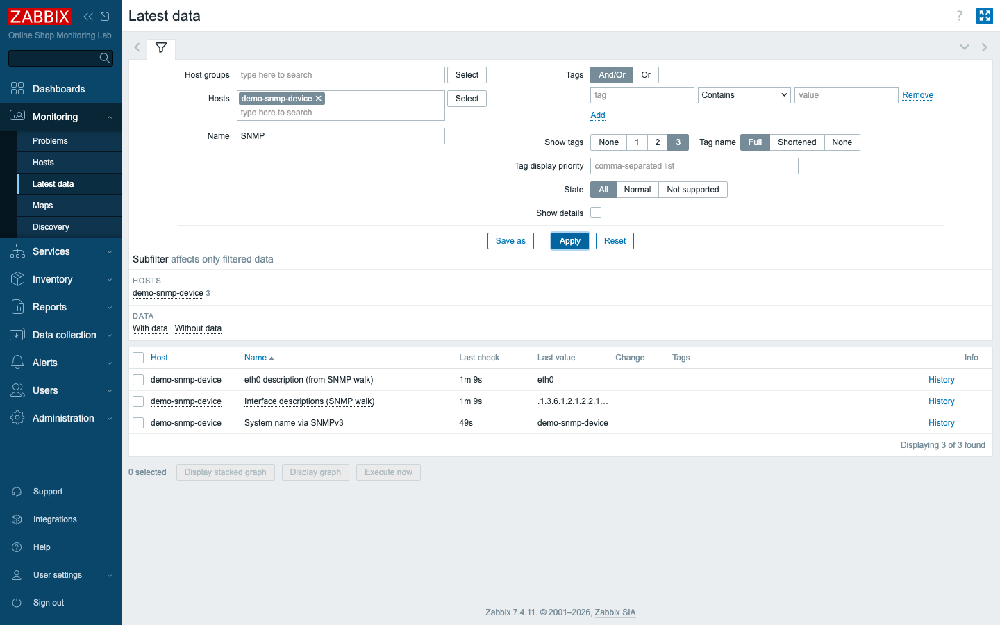

# Module 41: Advanced SNMP — SNMPv3 and Bulk Walks

> **Optional advanced module (extra).** Builds on Module 20 (SNMP monitoring).
> Edits `content/lab/demo-snmp-device/snmpd.conf` and rebuilds that one
> container — no new services added.

## Learning Objectives

By the end of this module you can monitor a device with **SNMPv3** — the secure,
authenticated, encrypted version of SNMP that production networks actually use —
and store its credentials safely in **secret macros**. You can also collect SNMP
data **the efficient way**: instead of one request per value, you will use a
**bulk `walk[]` item** to pull an entire table in a single GetBulk and then split
it into individual metrics with **SNMP walk value** preprocessing. Both
techniques are what separate the Module 20 fundamentals from how SNMP is run at
scale.

## Topics

### Why SNMPv2c is not enough

In Module 20 you monitored `demo-snmp-device` over **SNMPv2c**, whose only
"authentication" is a community string — usually `public`. Treat that string for
what it is: a password sent in clear text that everyone already knows. It is fine
for a closed lab, but on a real network it means anyone who can reach UDP 161 can
read your device, and anyone watching the wire can read the data. That is why
every serious SNMP deployment uses **SNMPv3**.

### The SNMPv3 security model

SNMPv3 replaces the shared community string with a proper **user** plus two
independent protections, and you choose how much protection you want with a
**security level**:

- **noAuthNoPriv** — a named user, but no authentication and no encryption (rare).
- **authNoPriv** — the user authenticates (the manager proves who it is), but data
  travels in clear text.
- **authPriv** — the user authenticates **and** the data is encrypted. This is the
  production default, and what we configure here.

Under authPriv you pick an **authentication protocol** (we use **SHA**) with an
auth passphrase, and a **privacy protocol** (we use **AES**) with a privacy
passphrase. On the device, that user is created in `snmpd.conf`:

```conf
createUser snmpv3user SHA "authpass123" AES "privpass123"
rouser snmpv3user authpriv
```

### Keeping the passphrases secret

Two passphrases now matter, and you do not want them sitting in plain text on
every item or interface. Zabbix solves this with **secret macros** — user macros
whose *type* is **Secret text**, so their value is masked in the UI and not
returned by the API. We store the SNMPv3 credentials in three host macros and
reference them from the interface:

| Macro | Type | Value |
|---|---|---|
| `{$SNMPV3_SECNAME}` | Text | `snmpv3user` |
| `{$SNMPV3_AUTH}` | **Secret text** | the auth passphrase |
| `{$SNMPV3_PRIV}` | **Secret text** | the privacy passphrase |

Now the credential lives in exactly one place per host, is masked, and rotating
it is a one-field change — the same discipline you applied to `{$SNMP_COMMUNITY}`
in Module 20, raised to v3.

### SNMP "the new way": one walk instead of many gets

Module 20 created one item per OID, and each item is a separate SNMP request on
every interval. That is fine for four values; it does not scale to a 48-port
switch where you want a dozen metrics *per port*. The efficient pattern, available
since Zabbix 6.4 and standard in 7.x, is to fetch a whole table in **one GetBulk**
and split it locally.

You do this with a **master item whose SNMP OID is `walk[...]`**. For example:

```
walk[1.3.6.1.2.1.2.2.1.2]
```

asks the device, in a single bulk request, for the entire `ifDescr` column — every
interface's description at once. The master item stores the raw walk as text. Then
**dependent items** carve individual values out of it using the **SNMP walk
value** preprocessing step, which takes a specific OID (base + index) and returns
just that entry. One request to the device; many metrics derived from it, all on
the Zabbix side. At scale this is the difference between hammering a device with
hundreds of requests and politely asking once.

## Docker-Based Demonstration

The instructor adds a v3 user to the simulated device, proves it from the command
line, then wires both SNMPv3 and a bulk walk into Zabbix.

First, add the user to `demo-snmp-device` and rebuild just that container:

```bash
docker compose -f compose_lab.yaml up -d --build demo-snmp-device
```

Prove SNMPv3 authPriv works from the device's own net-snmp tools — and that v2c
still works, so nothing regressed:

```bash
docker exec demo-snmp-device snmpget -v3 -l authPriv -u snmpv3user \
  -a SHA -A authpass123 -x AES -X privpass123 localhost 1.3.6.1.2.1.1.5.0
# -> SNMPv2-MIB::sysName.0 = STRING: demo-snmp-device

docker exec demo-snmp-device snmpget -v2c -c public localhost 1.3.6.1.2.1.1.5.0
# -> SNMPv2-MIB::sysName.0 = STRING: demo-snmp-device
```

A single bulk walk returns the whole interface-description table — this is what
the `walk[]` item will collect:

```bash
docker exec demo-snmp-device snmpbulkwalk -v2c -c public localhost 1.3.6.1.2.1.2.2.1.2
# -> IF-MIB::ifDescr.1 = STRING: lo
#    IF-MIB::ifDescr.2 = STRING: tunl0  ...  ifDescr.11 = STRING: eth0
```

The instructor then adds an SNMPv3 interface (with the secret macros), a v3 item,
the bulk-walk master, and one walk-value dependent — and all three collect.


*`System name via SNMPv3` (over authPriv), the raw `walk[]` master, and the `eth0`
value extracted from it by SNMP walk value preprocessing.*

## Hands-On Lab

1. **Add the SNMPv3 user to the device.** In
   `content/lab/demo-snmp-device/snmpd.conf`, add:
   ```conf
   createUser snmpv3user SHA "authpass123" AES "privpass123"
   rouser snmpv3user authpriv
   ```
   then rebuild the container:
   ```bash
   docker compose -f compose_lab.yaml up -d --build demo-snmp-device
   ```
   Expected: the container recreates and starts; the `public` v2c community from
   Module 20 still works.

2. **Prove v3 from the CLI first.** Always test SNMP outside Zabbix before
   blaming Zabbix:
   ```bash
   docker exec demo-snmp-device snmpget -v3 -l authPriv -u snmpv3user \
     -a SHA -A authpass123 -x AES -X privpass123 localhost 1.3.6.1.2.1.1.5.0
   ```
   Expected: `SNMPv2-MIB::sysName.0 = STRING: demo-snmp-device`. A wrong
   passphrase or protocol fails here, isolating the problem to the device.

3. **Store the v3 credentials as macros.** On host `demo-snmp-device`
   (**Data collection → Hosts → demo-snmp-device → Macros**) add
   `{$SNMPV3_SECNAME}` = `snmpv3user` (Text), `{$SNMPV3_AUTH}` = `authpass123`
   (**Secret text**), `{$SNMPV3_PRIV}` = `privpass123` (**Secret text**).
   Expected: the two passphrase macros show masked values (dots), not the text.

4. **Add an SNMPv3 interface.** On the same host's **Interfaces**, add a second
   **SNMP** interface: DNS `demo-snmp-device`, port `161`, **SNMP version
   SNMPv3**, **Security name** `{$SNMPV3_SECNAME}`, **Security level** *authPriv*,
   **Authentication protocol** *SHA1*, **Authentication passphrase**
   `{$SNMPV3_AUTH}`, **Privacy protocol** *AES128*, **Privacy passphrase**
   `{$SNMPV3_PRIV}`.
   Expected: the host now has two SNMP interfaces (the v2c one from Module 20 and
   the new v3 one), and the v3 interface shows green (available) once polled.

5. **Create a v3 item.** Add an item: Type **SNMP agent**, on the **SNMPv3
   interface**, Name `System name via SNMPv3`, key `snmp.v3.sysname`, SNMP OID
   `1.3.6.1.2.1.1.5.0`, type *Character*.
   Expected: in Latest data the item reports `demo-snmp-device` — collected over
   encrypted, authenticated SNMPv3.

6. **Create the bulk-walk master.** Add an item: Type **SNMP agent**, on the v2c
   interface, Name `Interface descriptions (SNMP walk)`, key `snmp.walk.ifdescr`,
   **SNMP OID** `walk[1.3.6.1.2.1.2.2.1.2]`, type *Character*, interval `2m`.
   Expected: the item's value is the **raw walk** — many lines like
   `.1.3.6.1.2.1.2.2.1.2.11 = STRING: "eth0"` — fetched in a single request.

7. **Split out one interface with a dependent item.** Add an item: Type
   **Dependent item**, Master item = `Interface descriptions (SNMP walk)`, Name
   `eth0 description (from SNMP walk)`, key `snmp.walk.ifdescr.eth0`. Add a
   preprocessing step **SNMP walk value** with OID `1.3.6.1.2.1.2.2.1.2.11`.
   Expected: the dependent reports `eth0`, derived from the master's single walk
   with no extra request to the device. This is the pattern a vendor SNMP template
   uses for every port at once.

## Expected Outcome

`demo-snmp-device` is now monitored two advanced ways: over **SNMPv3 authPriv**
(SHA + AES) with its passphrases held in **secret macros**, and via an efficient
**bulk `walk[]` master** whose values are split into per-interface metrics with
**SNMP walk value** preprocessing. You can explain why v3 replaces the community
string, what authPriv protects, and why one bulk walk beats many single-OID gets
when a device has dozens of interfaces.

