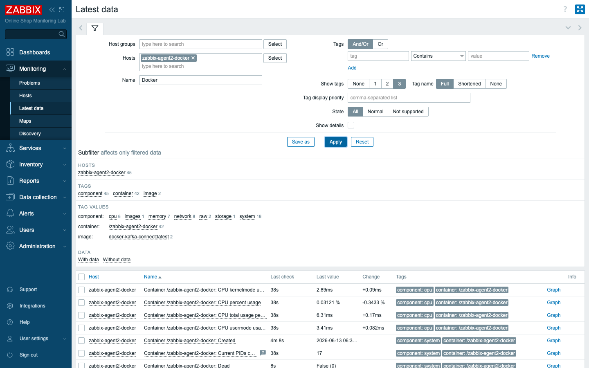
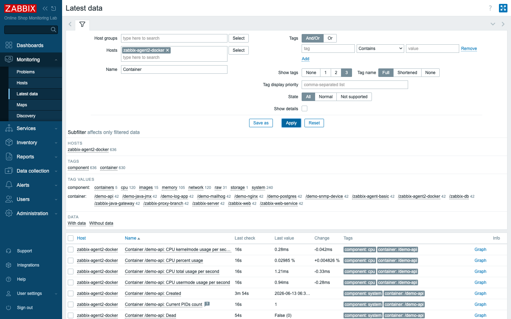

# Module 43: Monitoring Docker with Zabbix Agent 2

> **Optional advanced module (extra).** Builds on Module 6 (Zabbix agent 2) and
> Module 23 (low-level discovery). Everything here runs in the existing
> `compose_lab.yaml` stack — no new containers required.

## Learning Objectives

By the end of this module you can explain why the Docker engine itself is worth
monitoring, link the built-in **Docker by Zabbix agent 2** template to a host
whose agent can see the Docker socket, and read the engine-level and
per-container metrics it collects. You will understand how the template's
**master `docker.info` item** feeds a family of dependent items, and how its
**container low-level discovery** turns "one host" into a live, self-updating
inventory of every container on the machine.

## Topics

### Why monitor the engine, not just the containers

Up to now you have monitored the *workloads* inside the Online Shop's
containers — the web frontend, the API, the database. But all of those
containers share one thing: they run on a **Docker engine**, and if that engine
is unhealthy, every workload on it suffers at once. A host that is out of image
storage cannot pull a new release; an engine pinned at its container limit cannot
start the next service; a daemon that has quietly died takes the whole shop down
with it. Monitoring the engine is monitoring the floor the entire shop stands on.

There is a second, quieter benefit. The Docker engine already *knows* things your
individual workload checks do not — how many containers exist versus how many are
actually running, how many images are taking up disk, and per-container resource
use — and it will tell you all of it through one API. Rather than instrument each
container, you ask the engine once.

### How Zabbix agent 2 reaches Docker

The classic Zabbix agent cannot do this; the capability lives in **Zabbix agent
2**, whose built-in **Docker plugin** speaks to the Docker daemon over its Unix
socket, `/var/run/docker.sock`. In this lab the `zabbix-agent2-docker` container
already has that socket mounted read-only:

```yaml
  zabbix-agent2-docker:
    image: zabbix/zabbix-agent2:alpine-7.4-latest
    volumes:
      - /var/run/docker.sock:/var/run/docker.sock:ro
```

That single mount is what makes everything in this module possible. The agent
asks the daemon for engine and container facts and exposes them under item keys
that begin with `docker.` — for example `docker.info`, `docker.ping`, and
`docker.containers.discovery`.

> **Lab vs production:** mounting the Docker socket into a container grants broad
> control over the host's Docker engine, so in production you would restrict it to
> read-only (as we do here), run the agent with least privilege, and consider the
> socket a sensitive resource. The mechanics of the monitoring are identical
> whether agent 2 runs in a container or directly on a Docker host.

### The template's shape: one master, many dependents, one discovery

Rather than poll the Docker daemon separately for every metric, the **Docker by
Zabbix agent 2** template is built around the efficient master/dependent pattern
you met in Module 9. A single master item, **`docker.info`**, makes one call to
the engine and returns a JSON blob describing it. A whole family of **dependent
items** then extract individual numbers from that one blob — containers total,
containers running, images total, and so on — without making any further calls to
Docker. The master keeps no history of its own (its job is to feed the
dependents), which is why its *Latest data* value can look empty even while its
dependents are full of numbers.

Alongside that, the template ships a **Containers discovery** low-level discovery
rule (`docker.containers.discovery`). It asks the engine for the list of
containers and, for each one it finds, creates per-container items from
prototypes — so a host monitored this way maintains a living inventory: start a
new container and its items appear, remove one and (after the lost-resource
period) they age out. This is the same LLD machinery from Module 23, pointed at
Docker.

## Docker-Based Demonstration

The instructor shows that the agent can already see Docker, links the template,
and watches the engine and per-container metrics arrive.

First, prove the agent can read the daemon — ask it directly with `zabbix_get`
from the server, exactly as you would diagnose any agent item:

```bash
docker exec zabbix-server zabbix_get -s zabbix-agent2-docker -k docker.info
```

Verified output (trimmed) — the engine answers with its full status:

```json
{"Containers":19,"ContainersRunning":15,"ContainersPaused":0,"ContainersStopped":4,"Images":33,"ServerVersion":"29.5.3","NCPU":10,"MemTotal":12528381952, ...}
```

```bash
docker exec zabbix-server zabbix_get -s zabbix-agent2-docker -k docker.containers.discovery
```

Verified output (trimmed) — the LLD payload, one object per container:

```json
[{"{#ID}":"cbf2205003...","{#NAME}":"/zabbix-agent-basic"},{"{#NAME}":"/zabbix-web"}, ...]
```

The instructor then links the template in the frontend and, after a config-cache
reload, opens **Monitoring → Latest data** filtered to `zabbix-agent2-docker`.


*Engine and per-container Docker metrics collecting under Latest data.*


*The Containers discovery rule has created an item set for every running
container, including each Online-Shop demo system.*

## Hands-On Lab

1. **Confirm the agent can see Docker.** From a terminal:
   ```bash
   docker exec zabbix-server zabbix_get -s zabbix-agent2-docker -k docker.info
   ```
   Expected: a JSON object including `"ContainersRunning":15` and
   `"Images":33`. If you instead get a timeout, the agent 2 host or the socket
   mount is the problem — not Zabbix.

2. **Link the Docker template.** Go to **Data collection → Hosts**, open
   `zabbix-agent2-docker`, switch to the **Templates** tab, and in *Link new
   templates* add **`Docker by Zabbix agent 2`**. Click **Update**.
   Expected: the host now lists two templates (Linux by Zabbix agent **and**
   Docker by Zabbix agent 2), and gains ~40 new items plus discovery rules
   including **Containers discovery** and **Images discovery**.

3. **Let the server pick up the new items.** New template items are only polled
   after the server reloads its configuration cache (within a minute, or force
   it):
   ```bash
   docker exec zabbix-server zabbix_server -R config_cache_reload
   ```
   Expected: `Runtime control command was forwarded successfully`.

4. **Read the engine metrics.** Open **Monitoring → Latest data**, filter Host =
   `zabbix-agent2-docker`, Name = `Docker`, and Apply.
   Expected: within ~1 minute you see **Ping = 1**, **Containers total = 19**,
   **Containers running = 15**, and **Images total = 33** (your exact numbers
   will match your machine).

5. **Read the per-container inventory.** Change the Name filter to `Container`
   and Apply.
   Expected: the **Containers discovery** rule has created an item set for each
   running container — including `/demo-nginx`, `/demo-api`, `/demo-postgres`,
   `/demo-java-jmx`, `/demo-log-app`, and `/demo-mailhog` — reporting per-container
   facts such as CPU and status. You are now watching the platform the Online Shop
   runs on, container by container.

6. **(Optional) Prove the inventory is live.** Note the current container count,
   then nothing else — the point is that the master `docker.info` value is empty
   in Latest data because the master keeps no history; its **dependent** items
   (Containers running, etc.) carry the values.
   Expected: `Get info` shows no value while `Containers running` shows `15` —
   confirming the master/dependent design rather than a fault.

## Expected Outcome

The `zabbix-agent2-docker` host carries the **Docker by Zabbix agent 2** template
and is collecting engine-level metrics (ping, container counts, image counts)
plus a per-container item set generated by the Containers discovery rule. You can
explain why the master `docker.info` item feeds dependents, why its own history is
empty by design, and how container LLD keeps the inventory current — and you have
made the Docker engine that hosts the entire Online Shop a first-class monitored
host.

