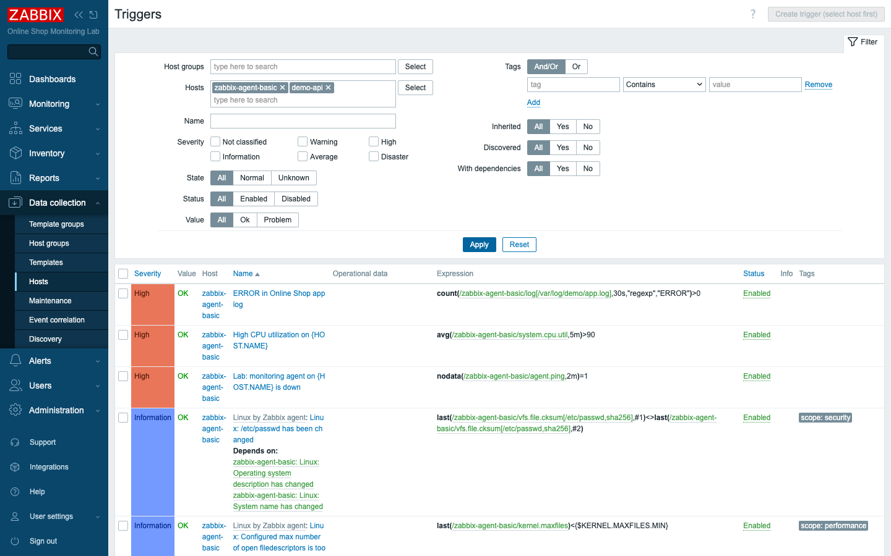

# Module 44: Predictive and Trend Triggers

> **Optional advanced module (extra).** Builds on Module 10 (triggers and alerts).
> No new containers — uses the existing `app.shop` items on `zabbix-agent-basic`.

## Learning Objectives

By the end of this module you can write triggers that look **forward** instead of
only at the present. You will use the **`timeleft()`** function to forecast when a
metric will cross a threshold and alert *before* it does, and you will use the
**trend functions** (`trendavg` and its siblings) to compare current behavior
against a historical baseline drawn from Zabbix's long-term trend storage. You
will understand the difference between **history** and **trends**, and why
predictive alerting is the difference between fixing a problem on a Tuesday
afternoon and being paged at 3 a.m.

## Topics

### History vs. trends — the two timescales Zabbix keeps

Every numeric item in Zabbix is stored two ways. **History** is the raw stream of
individual values at full resolution — every poll, kept for a relatively short
window (in this lab, 31 days). **Trends** are hourly roll-ups: for each item, each
hour, Zabbix stores the *min*, *max*, *average*, and *count* of that hour's
values, and keeps them far longer (a year here). Trends are what let you ask
questions across weeks and months without storing every single sample forever.

This split matters for triggers because the two timescales answer different
questions. History answers "what is happening right now?" Trends answer "what is
*normal* for this time, and is today different?" Predictive and baseline triggers
lean on both.

### Why look forward at all

Most triggers you have written so far are reactive: the disk *is* full, the queue
*is* backed up, the API *is* down. That is necessary, but it is also the worst
moment to find out — the damage is already happening. The capacity-and-trends
question from Module 1 ("where is this heading?") deserves its own kind of
trigger: one that fires while there is still time to act.

For the Online Shop, the order counter `app.shop[orders]` only ever climbs. A
reactive trigger can tell you the counter *has* hit some ceiling; a predictive
trigger tells you it *will* in a few hours, so you can provision ahead of the
rush instead of during it.

### The `timeleft()` function

`timeleft()` fits a line to an item's recent history and extrapolates: given the
current trend, how long until the value reaches a target? Its shape is:

```
timeleft(/host/key, <evaluation window>, <threshold>)
```

It returns a number of **seconds**. So a predictive trigger reads almost like
English — "fire if, at the current rate, the order counter will reach 100,000
within a day":

```
timeleft(/zabbix-agent-basic/app.shop[orders],30m,100000)<1d
```

The `30m` is how much recent history to use for the slope; `100000` is the target
value; `<1d` is your alert horizon. Because `app.shop[orders]` climbs at a steady
pace, Zabbix can project a real time-to-threshold from it. Right now the forecast
is comfortably more than a day away, so the trigger sits in **OK** — exactly what
you want from a forecast that is working but not yet alarming.

> The classic production use of `timeleft()` is **disk-full prediction**:
> `timeleft(/host/vfs.fs.size[/,pused],1h,100)<1w` — "warn a week before the root
> filesystem fills." The mechanics are identical; only the item and horizon
> change.

### The trend functions: alerting against a baseline

The second family reads from **trend** storage rather than history. `trendavg`,
`trendmax`, `trendmin`, `trendsum`, and `trendcount` each summarize an item over a
**named time period** in the past. The period uses Zabbix's time-shift syntax,
for example `1h:now/h-1h` — "the one-hour trend block ending at the start of the
current hour," i.e. the previous completed hour.

This lets you compare *now* against *normal*. For the Online Shop's API response
time, a fixed threshold is crude — what counts as "slow" at peak differs from
3 a.m. A trend trigger can instead ask whether the most recent completed hour ran
hotter than a baseline you trust:

```
trendavg(/zabbix-agent-basic/app.shop[response_time_ms],1h:now/h-1h)>200
```

Here the previous hour's average response time is compared against a 200 ms
baseline. Because trends are cheap to query and span long windows, the same idea
scales to week-over-week comparisons (`1w:now/w-1w`) once you have enough history.

### Time-shifting for "compared to last week"

A natural extension is to subtract a time-shifted value from the current one and
alert on the *difference* — "memory use is 20% higher than the same hour last
week." This is just arithmetic over two time-shifted function calls, and it is one
of the most powerful patterns in Zabbix triggering. It only works once enough
trend history has accumulated to reach back that far, so in a freshly started lab
you build up to it; the syntax is the same time-shift notation shown above.

## Docker-Based Demonstration

The instructor creates both forward-looking triggers on `zabbix-agent-basic` and
shows that each one validates and evaluates against the live `app.shop` data.

```bash
# (API verification, run from content/verification/api with ZBX_TOKEN set)
./zbx.sh trigger.create '{"description":"Online Shop: order counter will reach 100000 within a day (capacity forecast)","priority":"2","expression":"timeleft(/zabbix-agent-basic/app.shop[orders],30m,100000)<1d"}'
./zbx.sh trigger.create '{"description":"Online Shop: API response time this hour above 200ms baseline","priority":"2","expression":"trendavg(/zabbix-agent-basic/app.shop[response_time_ms],1h:now/h-1h)>200"}'
```

Reading them back confirms both are accepted and evaluating — `state` normal,
no error, current `value` OK (neither is firing, because neither forecast has
crossed its horizon yet):

```text
- order counter will reach 100000 within a day  -> value:OK  state:normal  error:''
- API response time this hour above 200ms baseline -> value:OK  state:normal  error:''
```

The Triggers list shows the forward-looking expressions alongside the reactive
ones built earlier in the course.


*Predictive (`timeleft`) and baseline (`trendavg`) triggers live alongside the
reactive triggers — same syntax, different question.*

## Hands-On Lab

1. **Confirm the source metrics carry data.** In **Monitoring → Latest data**,
   filter Host = `zabbix-agent-basic`, and find `app.shop[orders]` and
   `app.shop[response_time_ms]`.
   Expected: `orders` is a steadily climbing number (it only goes up);
   `response time` hovers around a few dozen milliseconds.

2. **Create the predictive trigger.** In **Data collection → Hosts →
   zabbix-agent-basic → Triggers → Create trigger**, set Name to
   `Online Shop: order counter will reach 100000 within a day (capacity forecast)`,
   Severity *Warning*, and Expression:
   ```
   timeleft(/zabbix-agent-basic/app.shop[orders],30m,100000)<1d
   ```
   Expected: Zabbix accepts the expression (a malformed function or `/host/key`
   reference is rejected here). The trigger is created and shows **OK** — the
   forecast is more than a day away.

3. **Create the trend-baseline trigger.** Create a second trigger named
   `Online Shop: API response time this hour above 200ms baseline`, Severity
   *Warning*, Expression:
   ```
   trendavg(/zabbix-agent-basic/app.shop[response_time_ms],1h:now/h-1h)>200
   ```
   Expected: accepted and **OK** (the previous hour's average is well under
   200 ms). This trigger reads from *trend* storage, not history.

4. **Read the expressions in the list.** Open **Data collection → Hosts →
   zabbix-agent-basic → Triggers** and look at the Expression column.
   Expected: both new triggers appear with their function-first expressions, OK
   value, alongside the reactive triggers from earlier modules.

5. **Understand why they are OK, not broken.** Note that an OK predictive trigger
   is a *success*: it means the forecast horizon has not been crossed.
   Expected: you can explain that `timeleft()` returns seconds-to-threshold and
   the trigger fires only when that drops below `1d`, and that `trendavg()` reads
   the previous completed hour from trend storage rather than the live stream.

## Expected Outcome

`zabbix-agent-basic` now carries two forward-looking triggers: a **`timeleft()`**
capacity forecast on the order counter and a **`trendavg()`** baseline check on
API response time. You can explain the difference between history and trend
storage, write a predictive trigger that alerts before a threshold is reached,
and write a baseline trigger that compares current behavior against a historical
norm — the two patterns that turn monitoring from reactive into anticipatory.

## Instructor Notes

- **OK is the goal, not a failure.** Students expect a new trigger to "do
  something." Stress that a predictive trigger sitting in OK is working correctly —
  it is a smoke detector that hasn't gone off. Show the expression evaluates
  (state normal, no error) rather than waiting for it to fire.
- **`timeleft()` needs a trend, not noise.** It fits a line to recent history; it
  shines on monotonic or steadily-trending metrics (counters, disk usage) and is
  meaningless on a flat or wildly noisy metric. `app.shop[orders]` is monotonic by
  design, which is why it demonstrates cleanly. In production, point it at disk
  `pused`.
- **Trend vs history.** Reinforce that `trendavg` and friends read the hourly
  roll-ups, so they are cheap over long windows and unaffected by short history
  retention — but they have no data for the *current* incomplete hour, which is
  why the example uses `now/h-1h` (the previous completed hour).
- **Time-shift caveat.** Week-over-week comparisons (`1w:now/w-1w`) need a week of
  trend data. In a freshly started lab they return "no data," so build up to them;
  don't put an unbacked time-shift in a live trigger and wonder why it errors.
- **Thresholds chosen to avoid noise.** Both example thresholds were picked so the
  triggers stay OK in the running lab (the `orders` forecast is ~5 days out; the
  response baseline is ~65 ms vs a 200 ms line). Adjust to provoke a fire in class
  if you want to demonstrate the problem event.
- **Timing (~30 min):** ~12 min history-vs-trends and the function families,
  ~13 min build and verify both triggers, ~5 min discussion of disk-full
  prediction and week-over-week patterns.

## Lab-State Delta

Added in Module 44 (kept — both triggers stay OK and produce no noise):

- **Triggers added on `zabbix-agent-basic` (hostid `10780`):**
  - `Online Shop: order counter will reach 100000 within a day (capacity forecast)`
    (triggerid `33108`, Warning) — `timeleft(/zabbix-agent-basic/app.shop[orders],30m,100000)<1d`.
  - `Online Shop: API response time this hour above 200ms baseline`
    (triggerid `33109`, Warning) — `trendavg(/zabbix-agent-basic/app.shop[response_time_ms],1h:now/h-1h)>200`.
- **No new items, hosts, or containers.** Uses existing `app.shop[orders]` and
  `app.shop[response_time_ms]` (from Module 11) and their accumulated trend data.
  Screenshot in `content/extra/assets/module-44/`.
