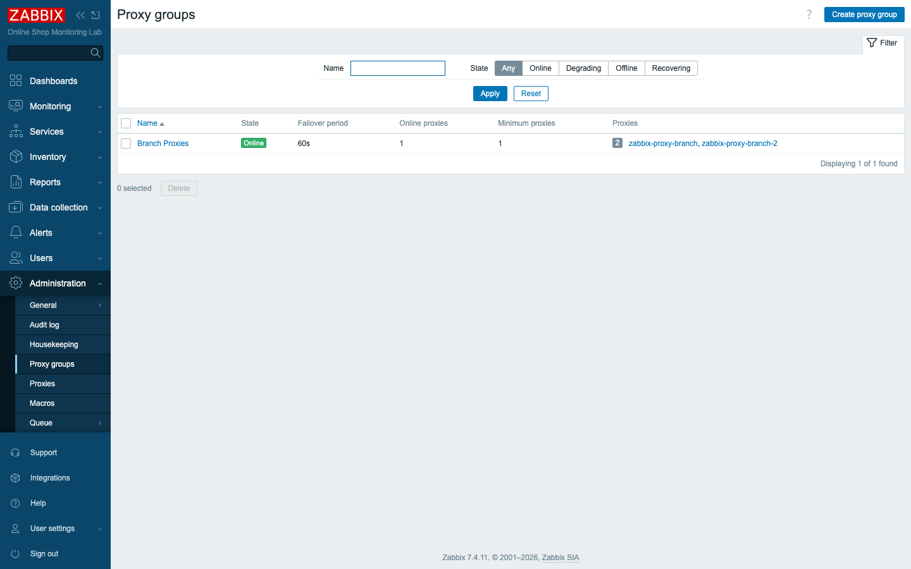
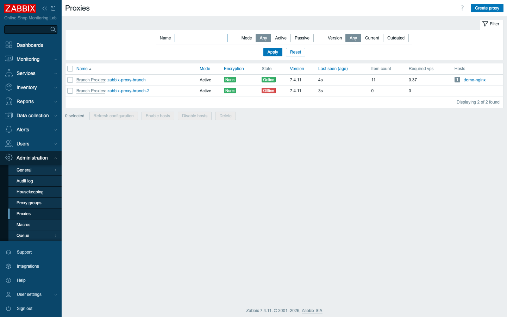

# Module 45: Proxy High Availability with Proxy Groups

> **Optional advanced module (extra).** Builds on Module 14 (Zabbix proxy). Adds
> one new container, `zabbix-proxy-branch-2`, to `compose_lab.yaml`.

## Learning Objectives

By the end of this module you can remove the single point of failure that a lone
proxy represents. You will pool two proxies into a **proxy group** — a Zabbix 7.0
feature — assign a host to the *group* rather than to one proxy, and watch the
server automatically **fail the host over** to a healthy proxy when its current
one goes down. You will understand the two settings that govern a proxy group,
**minimum number of proxies** and **failover period**, and why the group's
*address for active agents* lets failover happen without a virtual IP.

## Topics

### One proxy is a single point of failure

In Module 14 you put `demo-nginx` behind `zabbix-proxy-branch` so the server
collected the branch office's data through a single forwarder. That solved the
network problem, but it created a reliability one: if that proxy stops — a crash,
a host reboot, a network cut — every host behind it goes dark until someone
notices and intervenes. For a branch you actually care about, one proxy is not
enough.

The traditional answer was clumsy: run a spare proxy and move hosts by hand, or
script a floating IP. Zabbix 7.0 replaced all of that with **proxy groups**.

### What a proxy group does

A **proxy group** is a named pool of proxies that the server treats as one
resilient unit. You assign a host to the *group* instead of to a specific proxy,
and the server distributes hosts across the group's online proxies. If a proxy
drops out, the server **reassigns its hosts to the remaining proxies** — and when
it comes back, the load rebalances. The host never has to be touched; its
"monitored by" simply says the group.

Two settings control the group's behavior:

- **Minimum number of proxies** — how many proxies must be online for the group
  to be considered healthy and to keep collecting. Set it to `1` and the group
  works as long as a single proxy survives; set it higher to demand redundancy.
- **Failover period** — how long a proxy may be unreachable before the server
  declares it failed and moves its hosts elsewhere. Too short and a brief network
  blip causes churn; too long and an outage lingers. We use `60s`.

### Address for active agents — failover without a virtual IP

There is one subtlety for **active** agents (and active proxies). An agent
pushing data needs to know *which* proxy to talk to, and in a group that proxy
can change at any time. Rather than force you to manage a floating/virtual IP, a
proxy group lets each proxy advertise an **address for active agents**; the server
hands agents the address of whichever proxy currently owns them. That is why,
when you add each proxy to the group, you also give it a reachable local address
(here, the proxy's container name on the `zabbix-lab` network).

> **Lab vs production:** in this lab both proxies are containers on one host, so
> "failover" is instantaneous and clean. In production the two proxies live at the
> branch (or across two branches) on separate machines, and the proxy group gives
> you genuine resilience against a proxy host dying — the operational reason the
> feature exists.

## Docker-Based Demonstration

The instructor adds a second proxy, pools both into a group, points `demo-nginx`
at the group, then kills the proxy that owns it and watches the host move.

```bash
# Bring up the second branch proxy (active, SQLite — same as Module 14's proxy)
docker compose -f compose_lab.yaml up -d zabbix-proxy-branch-2
```

After creating the group and adding both proxies, both report in and show
**online** under Administration → Proxies, each a member of *Branch Proxies*:


*The `Branch Proxies` group: minimum 1 proxy online, 60-second failover.*


*`zabbix-proxy-branch` and `zabbix-proxy-branch-2`, both online in the group.*

With `demo-nginx` assigned to the group, the server places it on one proxy
(`assigned_proxyid` = 2, `zabbix-proxy-branch-2`). Stop that proxy and, after the
failover period, the host reappears on the other proxy (`assigned_proxyid` → 1)
with no manual action — then rebalances when the proxy returns.

## Hands-On Lab

1. **Add a second proxy.** It is already defined in `compose_lab.yaml` as an
   active SQLite proxy named `zabbix-proxy-branch-2`. Start it:
   ```bash
   docker compose -f compose_lab.yaml up -d zabbix-proxy-branch-2
   ```
   Expected: the container starts and connects to the server.

2. **Create the proxy group.** In **Administration → Proxy groups → Create proxy
   group**, set Name `Branch Proxies`, **Failover period** `60s`, **Minimum
   number of proxies** `1`. Save.
   Expected: the group appears with 0 proxies (none assigned yet).

3. **Add both proxies to the group.** In **Administration → Proxies**, open
   `zabbix-proxy-branch`, set **Proxy group** to `Branch Proxies` and **Address
   for active agents** to `zabbix-proxy-branch:10051`. Then register
   `zabbix-proxy-branch-2` the same way (active mode, group `Branch Proxies`,
   address `zabbix-proxy-branch-2:10051`).
   Expected: both proxies list `Branch Proxies` as their group.

4. **Confirm both are online.** Still under **Administration → Proxies**, wait a
   moment and refresh.
   Expected: both proxies show **Online** (a recent *Last seen*) and the proxy
   group reports its members online — the group is healthy.

5. **Point a host at the group.** Open `demo-nginx` (**Data collection → Hosts**),
   and in **Monitored by** choose **Proxy group**, then `Branch Proxies`. Save.
   Expected: the host is now monitored by the group; the server assigns it to one
   of the two proxies (you can confirm via the API that `assigned_proxyid` is set
   to one of them — in this run, proxy 2).

6. **Force a failover.** Stop the proxy currently assigned the host:
   ```bash
   docker stop zabbix-proxy-branch-2
   ```
   Expected: within roughly the failover period plus offline-detection (~80–90s),
   the server reassigns `demo-nginx` to `zabbix-proxy-branch` — `assigned_proxyid`
   changes to the surviving proxy, and collection continues without you touching
   the host.

7. **Restore the pair.** Bring the proxy back:
   ```bash
   docker start zabbix-proxy-branch-2
   ```
   Expected: it rejoins the group as online; the group is once again redundant and
   load can rebalance.

## Expected Outcome

The branch is now monitored by a **proxy group** of two proxies instead of a
single one. You assigned `demo-nginx` to the group, saw the server place it on a
proxy automatically, and proved that stopping that proxy fails the host over to
the other within the failover period — no manual reassignment, no virtual IP. You
can explain the **minimum number of proxies** and **failover period** settings
and why active agents need the group's *address for active agents*.

