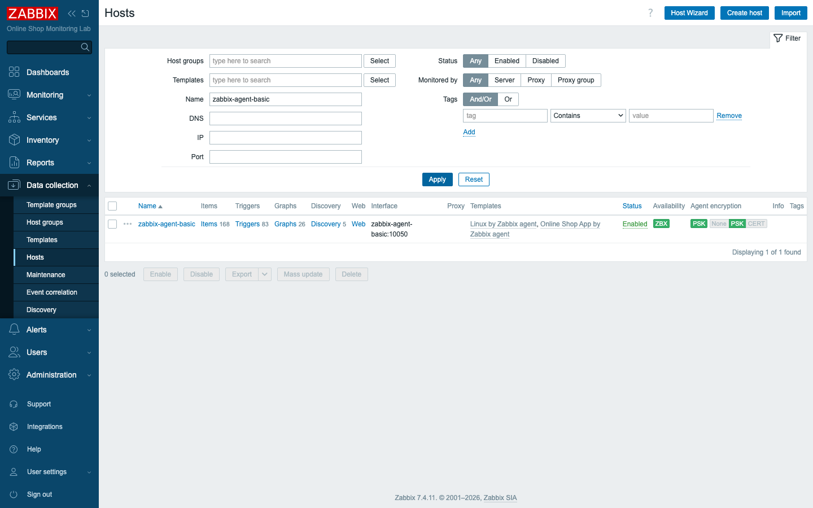
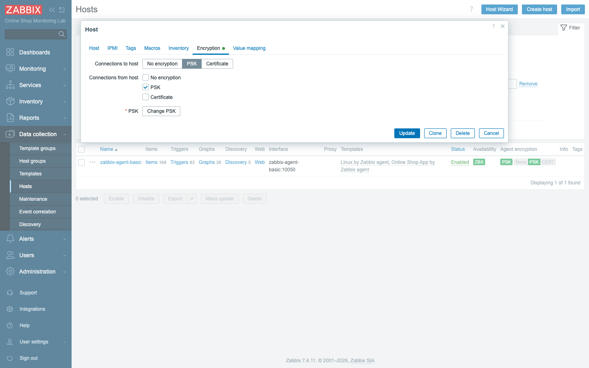

# Module 46: Encrypting Zabbix — PSK and Database TLS

> **Optional advanced module (extra).** Builds on Module 26 (security best
> practices), where encryption was discussed but left as `No encryption`. Here we
> actually turn it on. No new containers.

## Learning Objectives

By the end of this module you can encrypt the two most important channels in a
Zabbix deployment. You will put a **pre-shared key (PSK)** between the server and
an agent so their traffic is authenticated and encrypted — and prove it by
watching an unencrypted request get refused. You will also examine the
**server-to-database** connection — finding it is plain TCP by default, confirming
the encrypted channel is nonetheless available, and understanding how to enforce
and certificate-verify it with a private CA in production.

## Topics

### Why encrypt agent traffic

By default, a Zabbix agent and server talk in clear text. On a trusted private
network that may be acceptable, but the moment that traffic crosses anything you
do not fully control — a branch link, a cloud VPC boundary, a shared segment —
anyone who can see the packets can read your metrics, and anyone who can reach
port 10050 can query the agent. Module 26 flagged this and left it for here.

Zabbix offers two encryption mechanisms: **certificates** (PKI, scales to many
hosts, certs expire) and **pre-shared keys** (a single shared secret per host or
group, never expires, trivial to set up). PSK is the right first step and what we
use: it both **encrypts** the channel and **authenticates** both ends, because
only parties holding the key can complete the handshake.

### How PSK works

A PSK is two things: a **PSK identity** (a non-secret label, here `PSK001`) and a
**PSK key** (the secret — a long hex string). Both the agent and the server must
be configured with the same identity and key. Once they are, the agent will
**refuse** any connection that does not present the right PSK — which is the
behavior you will verify directly. You generate the key with:

```bash
openssl rand -hex 32
```

That yields a 256-bit key (64 hex characters). The agent is then told to require
PSK for both directions (it initiates active checks and accepts passive ones), and
the server is told to use that same PSK when it talks to this host.

### Encrypting the database connection

The agent channel is the obvious one, but the **server-to-database** connection
carries everything — every value, every credential, your whole configuration.
That link deserves encryption too.

An important subtlety in this lab: MySQL 8.4 **supports** TLS (it ships with a
self-signed cert and offers TLSv1.2/1.3), but the Zabbix server image links the
**MariaDB Connector/C** client, which does **not** negotiate TLS automatically.
So out of the box the server-to-database connection is **plain TCP** — you will
verify that directly by asking MySQL how the `zabbix` user is connected (you will
see `TCP/IP`, not `SSL/TLS`). You will then prove the encrypted channel *is*
available by forcing a client to require it. The lesson is that opportunistic TLS
is not automatic: you have to turn it on. In production you go further and
*enforce* it — refuse any unencrypted database connection and verify the
database's certificate against a private CA — which is the `verify_full` setup
shown in Part 2 of the lab.

## Docker-Based Demonstration

The instructor generates a PSK, switches the agent to require it, proves an
unencrypted request is now rejected, configures the server side, and watches
monitoring resume over the encrypted channel.

```bash
# 1. Generate a PSK key
openssl rand -hex 32
# -> e.g. 7c92a7dee2dd...bca59c44  (64 hex chars)

# 2. With the agent configured for PSK, an UNENCRYPTED request is refused:
docker exec zabbix-server zabbix_get -s zabbix-agent-basic -k agent.ping
# -> ZBX_NOTSUPPORTED: Received empty response ... agent dropped connection
#    because of access permissions

# 3. The SAME request WITH the PSK succeeds:
docker exec zabbix-server sh -c 'echo "<key>" > /tmp/t.psk; \
  zabbix_get -s zabbix-agent-basic -k agent.ping \
  --tls-connect psk --tls-psk-identity PSK001 --tls-psk-file /tmp/t.psk; rm -f /tmp/t.psk'
# -> 1
```

Once the host's **Encryption** is set to PSK in the frontend, the server itself
reconnects with the key and monitoring resumes.


*`zabbix-agent-basic` now reports PSK encryption rather than `No encryption`.*


*Server-side PSK: connections to and from the host require PSK, identity `PSK001`.*

## Hands-On Lab

### Part 1 — PSK between server and agent

1. **Generate a PSK key.**
   ```bash
   openssl rand -hex 32
   ```
   Expected: a 64-character hex string. Save it to
   `content/lab/agent-psk/agent.psk` (a single line).

2. **Configure the agent to require PSK.** The PSK key file is already mounted
   into `zabbix-agent-basic`; **add** the PSK environment to that service in
   `compose_lab.yaml` so the agent enforces encryption (the baseline agent runs
   unencrypted so Modules 5–8 work — you turn PSK on here):
   ```yaml
   environment:
     ZBX_SERVER_HOST: "zabbix-server"
     ZBX_HOSTNAME: "zabbix-agent-basic"
     # add these four lines:
     ZBX_TLSCONNECT: "psk"
     ZBX_TLSACCEPT: "psk"
     ZBX_TLSPSKIDENTITY: "PSK001"
     ZBX_TLSPSKFILE: "/var/lib/zabbix/enc/agent.psk"
   # the key file mount is already present:
   #   - ./content/lab/agent-psk/agent.psk:/var/lib/zabbix/enc/agent.psk:ro
   ```
   Apply it:
   ```bash
   docker compose -f compose_lab.yaml up -d zabbix-agent-basic
   ```
   Expected: the agent restarts and now requires PSK for all connections.

3. **Prove unencrypted access is refused.**
   ```bash
   docker exec zabbix-server zabbix_get -s zabbix-agent-basic -k agent.ping
   ```
   Expected: it **fails** — `ZBX_NOTSUPPORTED: ... agent dropped connection
   because of access permissions`. The agent rejected the plaintext request.

4. **Prove the PSK works.** Repeat the request with the key (see the Demonstration
   block).
   Expected: `1`. The encrypted, authenticated request succeeds.

5. **Configure the server side (host Encryption).** In **Data collection → Hosts →
   zabbix-agent-basic → Encryption**, set **Connections to host** = *PSK* and
   check **PSK** under *Connections from host*. Enter **PSK identity** `PSK001`
   and paste the **PSK** key. Save.
   Expected: the host's encryption shows **PSK** (no longer `No encryption`).

6. **Confirm monitoring resumes over PSK.** Watch **Monitoring → Latest data** for
   `zabbix-agent-basic`.
   Expected: after a short reconnect delay (the interface was briefly marked
   unavailable, so the server waits out its retry backoff — about a minute),
   `agent.ping` updates again and the host's interface returns to **available**.
   You are now monitoring it over an encrypted, authenticated channel.

### Part 2 — Database connection encryption

7. **Check how the server actually connects to the database.** Ask MySQL how the
   `zabbix` user's connections are made:
   ```bash
   docker exec zabbix-db mysql -uroot -proot_pwd -N -e \
     "SELECT connection_type, COUNT(*) FROM performance_schema.threads \
      WHERE processlist_user='zabbix' GROUP BY connection_type;"
   ```
   Expected: every row shows **`TCP/IP`**, not `SSL/TLS`. The server image links
   the **MariaDB Connector/C** client, which does **not** negotiate TLS
   automatically — so by default this critical link is **plain TCP**, even though
   the database supports encryption.

8. **Prove the encrypted channel is available.** The database *can* do TLS; the
   client just has to ask for it. Force a client to require TLS and read back the
   cipher:
   ```bash
   docker exec zabbix-db mysql -uzabbix -pzabbix -h 127.0.0.1 \
     --ssl-mode=REQUIRED -e "SHOW STATUS LIKE 'Ssl_cipher';"
   ```
   Expected: a non-empty cipher such as **`TLS_AES_128_GCM_SHA256`**. The channel
   exists and works — it simply is not used until you turn it on. (You can also
   confirm the server offers it with `SHOW GLOBAL VARIABLES LIKE 'tls_version';`,
   which returns `TLSv1.2,TLSv1.3`.)

9. **Understand production enforcement.** Confirming TLS is *available* is not the
   same as *enforcing* it. In production you (a) make the database **require** TLS
   for every client, (b) point the Zabbix server at the encrypted connection with
   `DBTLSConnect`, and (c) have the server **verify** the database's certificate
   against a private CA, so it cannot be tricked into talking to an impostor
   database. On a real external database that means: build a private CA with
   **OpenSSL**;
   configure MySQL/MariaDB with `ssl-ca` / `ssl-cert` / `ssl-key` and
   `require_secure_transport=ON`; set the Zabbix server's
   `DBTLSConnect=verify_full` with `DBTLSCAFile` / `DBTLSCertFile` /
   `DBTLSKeyFile`; and require the DB user with `ALTER USER 'zabbix'@'%' REQUIRE
   SSL`. (We do not force this in the lab because MySQL's auto-generated CA
   changes on `down -v`, which would break a committed CA file.)
   Expected: you can explain the difference between an *available but unused* TLS
   channel (the lab default — the client never asks for it) and *enforced,
   verified* TLS (production, where the database refuses plaintext and the server
   validates the certificate).

## Expected Outcome

The `zabbix-agent-basic` host is monitored over an **encrypted, PSK-authenticated**
channel — you proved that an unencrypted request is refused and that the server
resumes collection once it holds the key, closing the encryption gap left open in
Module 26. You have also determined that the **server-to-database** connection is
**plain TCP by default** (the server's MariaDB client does not negotiate TLS),
proved that the encrypted channel is nonetheless **available**, and you understand
how to enforce and certificate-verify it in production.

