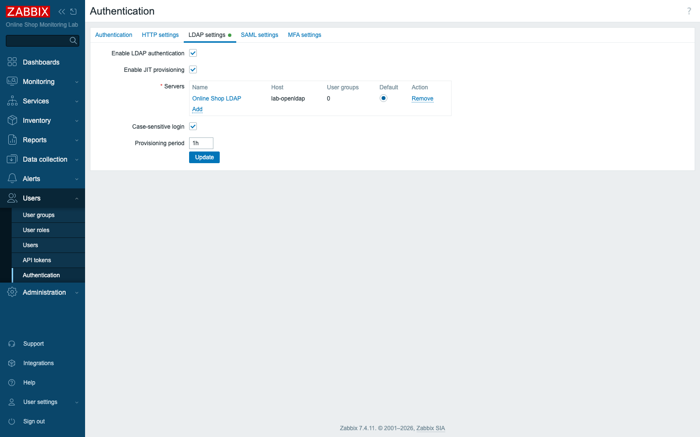
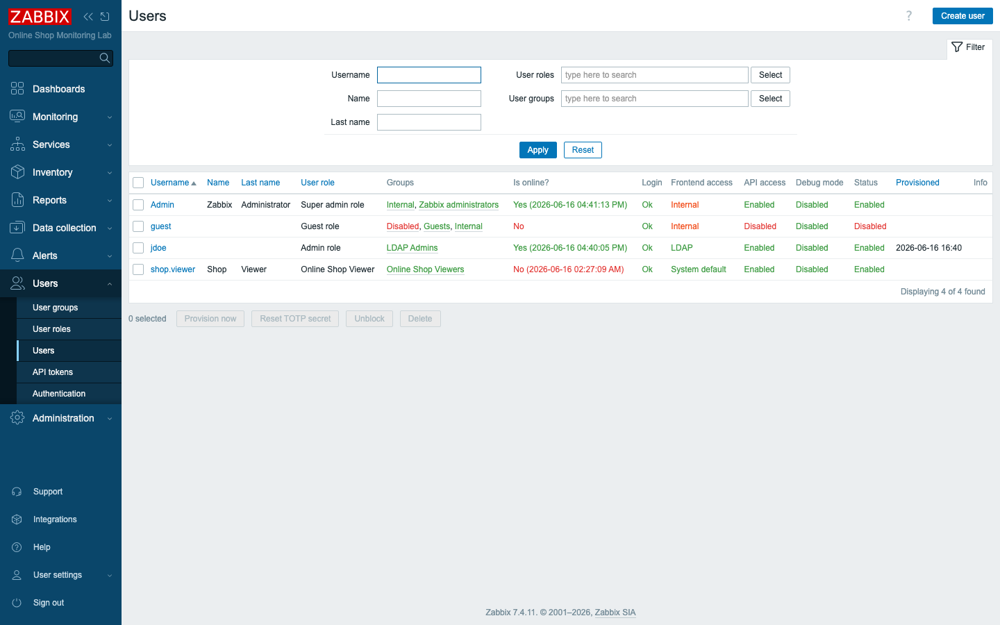

# Module 47: Directory Authentication with OpenLDAP and JIT Provisioning

> **Optional advanced module (extra).** Builds on Module 25 (user management),
> where external authentication was discussed but not deployed. Adds one new
> container, `lab-openldap`.

## Learning Objectives

By the end of this module you can authenticate Zabbix users against an external
**LDAP directory** instead of Zabbix's internal accounts, and you can have Zabbix
**just-in-time (JIT) provision** users automatically on first login — creating
the Zabbix user, assigning a role, and placing them in user groups based on their
**LDAP group membership**. This is how real organizations run Zabbix: accounts
live in one directory, and joining or leaving a team grants or revokes Zabbix
access with no manual user administration.

## Topics

### Why authenticate against a directory

In Module 25 you created Zabbix users by hand. That does not scale, and it is a
security liability: when someone leaves, their Zabbix account is one more thing
to remember to disable. Every sizable organization already has a central
directory — Active Directory, OpenLDAP, an identity provider — that is the single
source of truth for who works there and which teams they belong to. The right
design is to let *that* directory decide who can log in to Zabbix, so access is
granted and revoked in one place.

In this lab we stand up an **OpenLDAP** server (`lab-openldap`) as that directory.
In production it would be your real Active Directory or LDAP; the Zabbix
configuration is identical.

### How Zabbix LDAP authentication works

When an unknown user tries to log in, Zabbix performs a **search-then-bind**:

1. It binds to LDAP as a **service account** (here `cn=admin`) and searches under
   a **base DN** for a user whose **search attribute** matches the typed username
   (`uid=jdoe`).
2. It takes the DN that search returns and **re-binds as that user** with the
   typed password. If that bind succeeds, the password is correct.

No password ever leaves the directory, and Zabbix never stores it.

### JIT provisioning: users that create themselves

Authentication alone is not enough — an authenticated user still needs a Zabbix
**role** (what they may do) and **user groups** (what they may see). **JIT
provisioning** supplies both automatically. On first successful login, Zabbix:

- reads the user's **LDAP group memberships**,
- matches them against **provisioning rules** you define, and
- creates the Zabbix user with the mapped role and groups.

In this lab, anyone in the LDAP group **`zabbixadmins`** is provisioned as a Zabbix
**Admin** in the **LDAP Admins** user group. Add a person to `zabbixadmins` in the
directory and they can log in to Zabbix as an admin — without anyone touching
Zabbix. Remove them, and a **deprovisioned-users group** (a disabled group)
catches the account so it loses access.

### Three settings that make it work — and the lockout trap

Getting JIT to fire on the login form takes three coordinated settings, and
missing any one of them produces the same unhelpful "incorrect username or
password" error:

- **Enable LDAP** and turn on **JIT provisioning** (with a deprovisioned-users
  group selected).
- **Make LDAP the default authentication method.** With *internal* as the
  default, the login form only checks internal accounts and never reaches LDAP for
  an unknown user. Switching the default to LDAP is what lets JIT run.
- **Keep your break-glass admin on internal.** The instant you make LDAP the
  default, every user authenticates against LDAP — *including* `Admin`. To avoid
  locking yourself out, `Admin` must belong to a user group whose **frontend
  access** is set to **Internal** (in this lab, the built-in *Internal* group),
  so `Admin` always authenticates locally no matter what the default is.

> **Lab vs production:** `lab-openldap` is OpenLDAP standing in for your real
> directory. Against Active Directory the search attribute is typically
> `sAMAccountName` and groups use `member`; against OpenLDAP with posix groups it
> is `uid` and `memberUid`, as here. The Zabbix side is otherwise the same, and
> the same JIT model is used for SAML/SSO identity providers.

## Docker-Based Demonstration

The instructor starts the directory, adds a user and a group, points Zabbix at
LDAP with JIT, makes LDAP the default (Admin safely on internal), and logs in as
the LDAP user — who appears in Zabbix fully provisioned.

```bash
# Start the directory
docker compose -f compose_lab.yaml up -d lab-openldap

# Add the demo user (jdoe / jdoepass) and the zabbixadmins group
docker cp content/lab/openldap/seed.ldif lab-openldap:/tmp/seed.ldif
docker exec lab-openldap ldapadd -x -H ldap://localhost:1389 \
  -D "cn=admin,dc=shop,dc=example,dc=org" -w adminpassword -f /tmp/seed.ldif

# Verify jdoe can bind (the password is correct)
docker exec lab-openldap ldapwhoami -x -H ldap://localhost:1389 \
  -D "uid=jdoe,ou=users,dc=shop,dc=example,dc=org" -w jdoepass
# -> dn:uid=jdoe,ou=users,dc=shop,dc=example,dc=org
```

With Zabbix configured, logging in as `jdoe` / `jdoepass` lands straight on the
dashboard, and `jdoe` now exists in Zabbix as a provisioned Admin:


*LDAP enabled with JIT provisioning and the `zabbixadmins` → LDAP Admins mapping.*


*`jdoe`, created automatically on first login with the Admin role.*

## Hands-On Lab

1. **Start the directory.**
   ```bash
   docker compose -f compose_lab.yaml up -d lab-openldap
   ```
   Expected: `lab-openldap` starts; its base tree is `dc=shop,dc=example,dc=org`
   with admin bind `cn=admin,dc=shop,dc=example,dc=org` / `adminpassword`.

2. **Add the user and group.** The directory entries live in
   `content/lab/openldap/seed.ldif` (a user `uid=jdoe` and a posix group
   `cn=zabbixadmins` with `memberUid: jdoe`):
   ```bash
   docker cp content/lab/openldap/seed.ldif lab-openldap:/tmp/seed.ldif
   docker exec lab-openldap ldapadd -x -H ldap://localhost:1389 \
     -D "cn=admin,dc=shop,dc=example,dc=org" -w adminpassword -f /tmp/seed.ldif
   ```
   Expected: `adding new entry "uid=jdoe,..."` and `"cn=zabbixadmins,..."`. Confirm
   the password binds:
   ```bash
   docker exec lab-openldap ldapwhoami -x -H ldap://localhost:1389 \
     -D "uid=jdoe,ou=users,dc=shop,dc=example,dc=org" -w jdoepass
   ```
   Expected: `dn:uid=jdoe,ou=users,dc=shop,dc=example,dc=org`.

3. **Create the Zabbix targets for provisioning.** In **Users → User groups**,
   create `LDAP Admins` (the group JIT users land in). JIT will map them to the
   built-in **Admin** role.
   Expected: the empty `LDAP Admins` group exists.

4. **Configure the LDAP directory.** In **Users → Authentication → LDAP
   settings**, enable LDAP and add a server: Host `lab-openldap`, Port `1389`,
   Base DN `ou=users,dc=shop,dc=example,dc=org`, Search attribute `uid`, Bind DN
   `cn=admin,dc=shop,dc=example,dc=org`, Bind password `adminpassword`.
   Expected: a **Test** of the directory with `jdoe` / `jdoepass` succeeds — this
   is the fast way to validate the config without logging out.

5. **Turn on JIT provisioning and the group mapping.** Enable **JIT
   provisioning** on the directory. Set the **group configuration** so Zabbix
   finds the user's groups — Group base DN `ou=users,dc=shop,dc=example,dc=org`,
   Group name attribute `cn`, Group member attribute `memberUid`, user reference
   attribute `uid`, and a group filter of `(memberUid=%{user})`. Add a
   provisioning mapping: LDAP group **`zabbixadmins`** → Zabbix user group **LDAP
   Admins**, role **Admin**.
   Expected: the **Test** with `jdoe` now returns the **Admin** role and the
   **LDAP Admins** group — proof that membership matching works.

6. **Enable JIT and a deprovisioned-users group.** In the **Authentication**
   settings, switch on **LDAP JIT provisioning** and select a **Deprovisioned
   users group** (create a disabled group `Deprovisioned Users` for this).
   Expected: JIT is enabled with a landing group for removed users.

7. **Make LDAP the default — safely.** First confirm `Admin` is in a group whose
   **Frontend access** is **Internal** (the built-in *Internal* group), so `Admin`
   keeps authenticating locally. Then set the **Default authentication** method to
   **LDAP**.
   Expected: the setting saves. (This is the step that lets the login form trigger
   JIT for unknown users — without it, JIT never runs.)

8. **Log in as the directory user.** Sign out and log in as `jdoe` / `jdoepass`.
   Expected: `jdoe` lands on the dashboard. In **Users → Users**, `jdoe` now
   exists as a **provisioned** user with the **Admin** role and the **LDAP
   Admins** group — created automatically, by membership, with no manual user
   administration.

9. **Confirm your break-glass admin still works.** Log in as `Admin` / `zabbix`.
   Expected: `Admin` logs in normally over **internal** auth, unaffected by the
   LDAP default — exactly why step 7's group check matters.

## Expected Outcome

Zabbix now authenticates users against the `lab-openldap` directory and **JIT
provisions** them on first login: `jdoe`, who exists only in LDAP, logged in and
was created automatically as a Zabbix **Admin** in the **LDAP Admins** group
because of his `zabbixadmins` membership — while the local `Admin` account remains
safely on internal authentication. You can explain the search-then-bind flow, the
three settings JIT needs (enable LDAP+JIT, LDAP as default, admin on internal),
and how group membership drives Zabbix roles.

