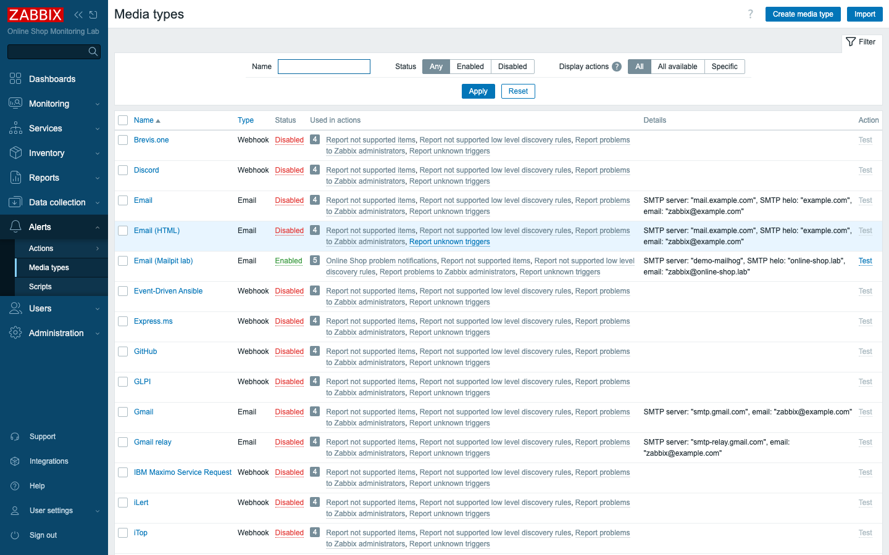
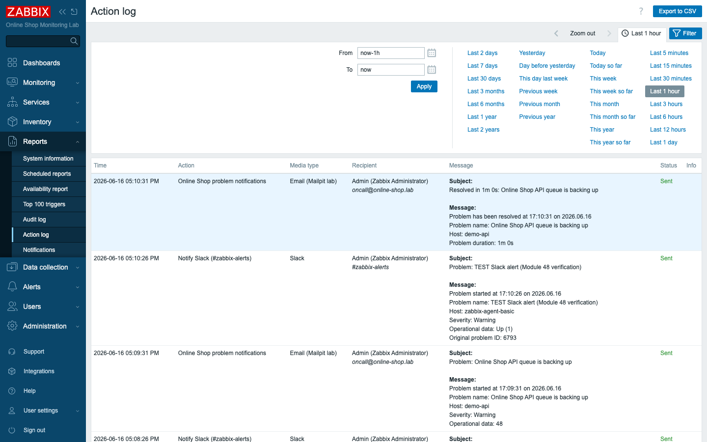

# Module 48: External Alerting with Slack

> **Optional advanced module (extra).** Builds on Module 27 (alerting and
> notifications), which delivered email to the local Mailpit sink. Here we deliver
> real alerts to **Slack**. No new containers — Zabbix ships the Slack webhook.

## Learning Objectives

By the end of this module you can route Zabbix problem alerts to a **Slack
channel** using Zabbix's built-in Slack **webhook media type** — where teams
actually watch for incidents, rather than an inbox no one reads. You will create a
Slack **bot token**, wire it into Zabbix, attach the channel to a user, and fire a
real trigger that lands a message in Slack.

## Topics

### Why alert to chat, not just email

Module 27 proved the alerting pipeline by sending email to Mailpit. Email is the
lowest common denominator, but it is not where modern teams live during an
incident — they live in chat. Routing alerts to a Slack channel means the whole
on-call team sees a problem the instant it happens, can discuss it in thread, and
can acknowledge it together. Zabbix treats this as just another **media type**, so
nothing about triggers or actions changes — only the delivery channel does.

### Media types and webhooks

A **media type** is *how* Zabbix delivers a message; an **action** decides *when*
and *to whom*. Zabbix ships dozens of preconfigured media types — Slack, Microsoft
Teams, Telegram, Opsgenie, PagerDuty, and more — implemented as **webhooks**: a
small piece of JavaScript that calls the service's API when an alert fires. You do
not write the webhook; you only supply its credentials and turn it on.

The **Slack** media type needs three things to work:

- a **bot token** (the credential it authenticates with),
- a **channel** to post to (supplied per user, via the "Send to" field), and
- the Zabbix **frontend URL**, so the message can link back to the problem.

### The Slack side: an app, a bot token, and an invite

Slack will not let just anyone post to a workspace. You create a small **Slack
app**, give its **bot** the `chat:write` permission, install it, and Slack issues
a **Bot User OAuth token** that starts with `xoxb-`. That token — and only that
token type — can post messages. Finally, a bot can only post to channels it has
been **invited** to, so you run `/invite @your-app` in the target channel.

> Watch the token type: an `xoxb-…` **bot** token is the only one that works.
> App-level tokens (`xapp-…`, for Socket Mode) and user/config tokens
> (`xoxe.xoxp-…`) are rejected by `chat.postMessage` with
> `not_allowed_token_type` / `missing_scope`.

### The frontend-URL gotcha

The Slack webhook builds a clickable link back to the Zabbix problem, so it needs
to know the frontend's URL. Zabbix reads this from the global macro
**`{$ZABBIX.URL}`** (or you can hard-code it in the media type's `zabbix_url`
parameter). If it is left unset, every Slack alert fails with *"URL value
'{$ZABBIX.URL}' must contain…"* — a very common first-time error. Set the macro to
your frontend URL (here `http://localhost:8080`) before you test.

## Docker-Based Demonstration

The instructor creates the Slack app and bot token, wires the token into the
Slack media type, attaches the `#zabbix-alerts` channel to the Admin user, and
fires a trigger that posts to Slack.

```bash
# Confirm the bot token works and can post to the invited channel
curl -s -H "Authorization: Bearer xoxb-<your-bot-token>" https://slack.com/api/auth.test
# -> {"ok":true,"team":"...","user":"<your-bot>", ...}

curl -s -X POST https://slack.com/api/chat.postMessage \
  -H "Authorization: Bearer xoxb-<your-bot-token>" -H "Content-Type: application/json" \
  -d '{"channel":"#zabbix-alerts","text":":white_check_mark: Zabbix connected"}'
# -> {"ok":true,"channel":"C...","ts":"..."}    (ok:false / not_in_channel => invite the bot)
```

With the media type, user media, and a trigger action configured, a fired problem
is delivered — Zabbix records the alert as **Sent**, and the message appears in
the channel.


*The built-in Slack webhook media type, enabled with the bot token.*


*Reports → Action log showing the alert delivered to `#zabbix-alerts` with status
**Sent**.*

## Hands-On Lab

1. **Create a Slack app and bot token.** At **api.slack.com/apps**, create an app
   in your workspace. Under **OAuth & Permissions → Bot Token Scopes**, add
   **`chat:write`**, then **Install to Workspace**. Copy the **Bot User OAuth
   Token** (starts with `xoxb-`).
   Expected: you have an `xoxb-…` token. (Not `xapp-…`, not `xoxe.xoxp-…` — those
   cannot post.)

2. **Invite the bot to a channel.** In Slack, open or create a channel (e.g.
   `#zabbix-alerts`) and run:
   ```
   /invite @your-app-name
   ```
   Expected: the bot is a member. Confirm it can post:
   ```bash
   curl -s -X POST https://slack.com/api/chat.postMessage \
     -H "Authorization: Bearer xoxb-<your-bot-token>" -H "Content-Type: application/json" \
     -d '{"channel":"#zabbix-alerts","text":"Zabbix test"}'
   ```
   Expected: `{"ok":true,...}` and the message appears in the channel. `ok:false`
   with `not_in_channel` means the invite did not take.

3. **Set the frontend URL macro.** In **Administration → Macros**, add the global
   macro **`{$ZABBIX.URL}`** = `http://localhost:8080`.
   Expected: the macro is saved. (Skipping this is the #1 cause of failed Slack
   alerts.)

4. **Configure the Slack media type.** In **Alerts → Media types**, open **Slack**,
   set the **`bot_token`** parameter to your `xoxb-…` token, ensure **`zabbix_url`**
   resolves to your frontend (the macro covers it), and set the media type to
   **Enabled**.
   Expected: the Slack media type is enabled with the token in place.

5. **Attach the channel to a user.** In **Users → Users → Admin → Media**, add a
   **Slack** medium with **Send to** = `#zabbix-alerts`, active, all severities.
   Expected: Admin now has a Slack medium pointed at the channel.

6. **Create a trigger action.** In **Alerts → Actions → Trigger actions → Create
   action**, name it `Notify Slack (#zabbix-alerts)`, add a condition **Trigger
   severity ≥ High**, and an operation **Send message** to **Admin** via the
   **Slack** media type.
   Expected: the action exists. (In the lab it is left *disabled* so it does not
   immediately post pre-existing problems to your workspace — enable it to go
   live.)

7. **Fire a real alert and verify delivery.** Create a temporary trigger that
   fires immediately — for example
   `last(/zabbix-agent-basic/agent.ping)=1` — with a name containing a marker you
   can scope the action to, or temporarily relax the action condition. When it
   fires, check **Reports → Action log**.
   Expected: the alert shows **Sent** to `#zabbix-alerts`, and the message appears
   in your Slack channel. (This run was verified: a fired trigger produced an alert
   with status **Sent** and a message in `#zabbix-alerts`.) Delete the temporary
   trigger afterward.

## Expected Outcome

Zabbix now delivers problem alerts to **Slack**. You created a Slack app and
`xoxb-` bot token, invited the bot to `#zabbix-alerts`, configured the built-in
Slack webhook media type, attached the channel to a user, and verified end to end
that a fired trigger is delivered to the channel (status **Sent** in the action
log). You can explain the bot-token requirement, the `{$ZABBIX.URL}` gotcha, and
that switching delivery from email to chat changes only the media type — not your
triggers or actions.

## Instructor Notes

- **Lab vs production.** This uses a real Slack workspace and a real bot token —
  the only extra module that reaches outside the lab. In production you would scope
  the bot tightly, store the token in a secret manager (or Zabbix Vault
  integration), route different severities to different channels, and pair Slack
  with a paging tool (Opsgenie/PagerDuty) for true on-call escalation. The same
  webhook pattern covers Microsoft Teams and Telegram (book Chapter 9).
- **Token type is the whole battle.** Most first attempts fail because the wrong
  token is used. Drill it: only **`xoxb-`** (Bot User OAuth) works; `xapp-` and
  `xoxe.xoxp-` do not. And the bot must be **invited** to the channel, or
  `chat.postMessage` returns `not_in_channel`.
- **`{$ZABBIX.URL}` first.** Set the global macro before testing, or every alert
  fails on URL validation. This is the single most common Slack-integration
  support ticket.
- **Never commit the token.** The bot token is a workspace credential. Keep it in
  the Zabbix media-type config (in the database), not in the repository; this
  module uses an `xoxb-<your-bot-token>` placeholder.
- **Action left disabled on purpose.** The verification action is configured for
  *severity ≥ High* but disabled, so it does not flood a real workspace with the
  lab's existing problems. Enable it deliberately when you want live alerting.
- **Timing (~35 min):** ~8 min why-chat + media types + token types, ~12 min Slack
  app + bot token + invite, ~10 min Zabbix media type + user media + macro +
  action, ~5 min fire and verify in the action log.

## Lab-State Delta

Added in Module 48 (kept):

- **Slack media type** (mediatypeid `94`) enabled, `bot_token` set to the
  workspace's `xoxb-…` bot token (kept in the DB, **placeholder in content**),
  `zabbix_url` = `http://localhost:8080`.
- **Global macro** `{$ZABBIX.URL}` = `http://localhost:8080` (globalmacroid `3`).
- **Admin user** gained a **Slack** medium → `#zabbix-alerts` (workspace `bigeeks`).
- **Trigger action** `Notify Slack (#zabbix-alerts)` (actionid `10`): condition
  *trigger severity ≥ High*, operation message Admin via Slack — left **disabled**
  (enable to go live).
- **Verified:** a fired test trigger produced an alert with status **Sent** to
  `#zabbix-alerts`; temporary test trigger deleted afterward.
- **No new containers.** Screenshots in `content/extra/assets/module-48/`.
