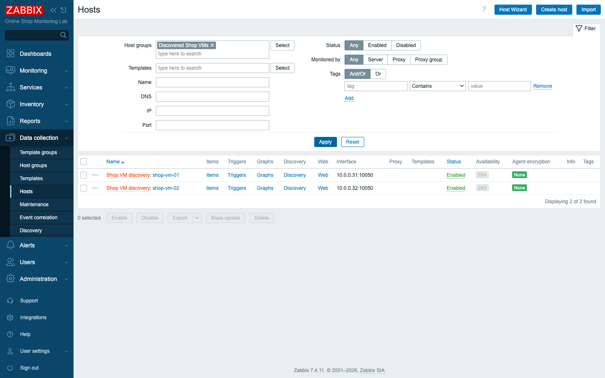
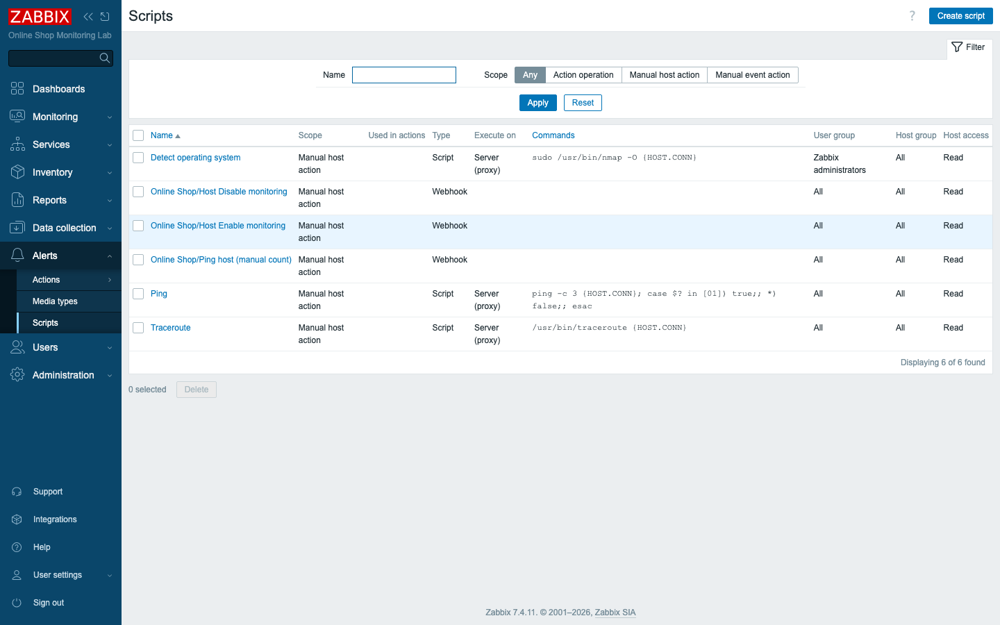

# Module 50: LLD Host Prototypes and Interactive Frontend Scripts

> **Optional advanced module (extra).** Builds on Module 23 (low-level discovery)
> and Module 36 (the API). No new containers — uses `zabbix_sender` and the
> existing frontend.

## Learning Objectives

By the end of this module you can use low-level discovery to create **whole
hosts**, not just items — the mechanism behind every "monitor my cloud
automatically" template in Zabbix. You will feed a custom JSON inventory in with
`zabbix_sender`, have Zabbix create a host per entry from a **host prototype**,
and give each discovered host an interface built from discovery macros. You will
also build **interactive frontend scripts**: an operator-run script that prompts
for input with the **`{MANUALINPUT}`** macro and validates it, and a pair of
scripts that **enable and disable a host** straight from a map or host menu.

## Topics

### Part 1 — Discovery that creates hosts

In Module 23 low-level discovery created *items* from prototypes — one item per
filesystem, one per interface. LLD can go a level higher and create entire
**hosts** from **host prototypes**. This is exactly how the built-in *VMware*,
*AWS*, *Azure*, and *Kubernetes* templates work: a discovery rule asks the cloud
or hypervisor "what exists?" and Zabbix spins up a monitored host for every VM,
instance, or pod it finds — and removes them when they disappear.

The moving parts mirror item LLD:

- A **discovery rule** produces a JSON list of objects, each carrying LLD macros
  like `{#VMNAME}` and `{#VMIP}`.
- A **host prototype** is a template-for-a-host: its name (`{#VMNAME}`), its host
  groups, its linked templates, and its interfaces all use those macros, so each
  discovered object becomes a real host with its own identity.

For the Online Shop, imagine the shop's VMs are listed in an external CMDB. Rather
than add each by hand, you push that list to Zabbix and let discovery build the
hosts. We simulate the CMDB feed with **`zabbix_sender`**, which pushes a JSON
payload to a **trapper** discovery rule:

```json
{"data":[
  {"{#VMNAME}":"shop-vm-01","{#VMIP}":"10.0.0.31"},
  {"{#VMNAME}":"shop-vm-02","{#VMIP}":"10.0.0.32"}
]}
```

Each object becomes a host whose name is the `{#VMNAME}` and whose agent interface
address is the `{#VMIP}`. Add a third VM to the feed and a third host appears; the
inventory stays in sync with its source.

### Part 2 — Interactive frontend scripts

Frontend scripts let an operator *act* from the monitoring UI — run a command,
call an API, ping a device — from a host or map context menu. Two Zabbix 7
capabilities make them genuinely useful.

**`{MANUALINPUT}`** lets a script *ask the operator a question* before it runs,
with a default and a **validation rule** so it can only receive sane values. A
script that takes a packet count, for instance, can prompt "Ping packet count
(1-5)" with a default of `3` and a validator of `^[1-5]$` — type `9` and the
frontend refuses to run it. This turns one rigid script into a small, safe tool.

The second pattern is the operational classic: **enable or disable a host from a
map**. During a planned maintenance you often want to silence one host with a
single click rather than digging through configuration. A frontend **Webhook**
script can call the Zabbix API's `host.update` to flip the host's status, runnable
straight from the host's icon on a map. The script authenticates with an **API
token** — and here you apply the least-privilege lesson from Module 25: the token
belongs to a scoped user, not Super Admin, so the worst a misused script can do is
bounded.

## Docker-Based Demonstration

The instructor pushes a VM inventory in with `zabbix_sender`, shows the hosts
appear, then builds the interactive scripts and runs them.

```bash
# Push the "CMDB" inventory to a trapper discovery rule on zabbix-agent-basic
docker exec zabbix-agent-basic zabbix_sender -z zabbix-server -s zabbix-agent-basic -k lld.vms \
  -o '{"data":[{"{#VMNAME}":"shop-vm-01","{#VMIP}":"10.0.0.31"},{"{#VMNAME}":"shop-vm-02","{#VMIP}":"10.0.0.32"}]}'
# -> processed: 1; failed: 0; total: 1
```

Within moments, two hosts exist that nobody created by hand:


*`shop-vm-01` and `shop-vm-02`, created automatically from the JSON feed, each
with an interface built from `{#VMIP}`.*

The interactive scripts live under **Alerts → Scripts** and are launched from a
host or map menu.


*A `{MANUALINPUT}` ping script and the Host enable/disable scripts.*

## Hands-On Lab

### Part 1 — Host prototypes

1. **Create a host group for the discovered hosts.** In **Data collection → Host
   groups**, create `Discovered Shop VMs`.
   Expected: the empty group is listed.

2. **Create a trapper discovery rule.** On **Data collection → Hosts →
   zabbix-agent-basic → Discovery rules → Create discovery rule**, set Name
   `Shop VM discovery`, Type **Zabbix trapper**, Key `lld.vms`.
   Expected: the rule is saved and waiting for data.

3. **Add a host prototype.** Open the rule's **Host prototypes → Create host
   prototype**. Set Host name `{#VMNAME}`, add it to group `Discovered Shop VMs`.
   On the **Interfaces** tab choose **Custom interfaces** and add an **Agent**
   interface with **IP** `{#VMIP}`, port `10050`.
   Expected: the prototype is saved; its name and interface are macro-driven.

4. **Push the inventory.** Send the JSON feed:
   ```bash
   docker exec zabbix-agent-basic zabbix_sender -z zabbix-server -s zabbix-agent-basic -k lld.vms \
     -o '{"data":[{"{#VMNAME}":"shop-vm-01","{#VMIP}":"10.0.0.31"},{"{#VMNAME}":"shop-vm-02","{#VMIP}":"10.0.0.32"}]}'
   ```
   Expected: `processed: 1; failed: 0; total: 1`.

5. **Confirm the hosts were created.** In **Data collection → Hosts**, filter Host
   group = `Discovered Shop VMs`.
   Expected: `shop-vm-01` (interface `10.0.0.31`) and `shop-vm-02` (interface
   `10.0.0.32`) exist, marked as discovered — created entirely from the feed. Add
   a third object to the JSON and re-send to watch a third host appear.

### Part 2 — Interactive scripts

6. **Create a `{MANUALINPUT}` script.** In **Alerts → Scripts → Create script**,
   set Name `Online Shop/Ping host (manual count)`, Type **Webhook**, Scope
   **Manual host action**. Add parameters `host` = `{HOST.HOST}` and `count` =
   `{MANUALINPUT}`, and a short script body that returns a message using them.
   Enable **Manual input**: prompt `Ping packet count (1-5)`, **Input validation
   rule** `^[1-5]$`, default `3`.
   Expected: the script is saved with a manual-input prompt.

7. **Run it from a host.** In **Monitoring → Hosts**, open a host's context menu
   and run the script. Enter `4`.
   Expected: the result echoes the host and `4` (e.g.
   *"Would ping demo-api 4 times (operator-selected)."*). Run it again and enter
   `9`: the frontend rejects it — *"Provided script user input failed
   validation."* The validator did its job.

8. **Create Disable / Enable host scripts.** Create two more **Webhook** scripts,
   `Online Shop/Host Disable monitoring` and `Online Shop/Host Enable monitoring`,
   Scope **Manual host action**. Each calls the Zabbix API (`host.get` to resolve
   the host by `{HOST.HOST}`, then `host.update` to set `status` to `1` or `0`),
   authenticating with a scoped **API token** parameter:
   ```javascript
   var p = JSON.parse(value);
   var r = new HttpRequest();
   r.addHeader('Content-Type: application/json-rpc');
   r.addHeader('Authorization: Bearer ' + p.token);
   var g = JSON.parse(r.post(p.url, JSON.stringify({jsonrpc:'2.0',method:'host.get',
     params:{filter:{host:[p.host]},output:['hostid']},id:1})));
   var hostid = g.result[0].hostid;
   r.post(p.url, JSON.stringify({jsonrpc:'2.0',method:'host.update',
     params:{hostid:hostid,status:1},id:2}));     // status 0 for the Enable script
   return 'Disabled ' + p.host + ' (hostid ' + hostid + ')';
   ```
   Parameters: `url` = `http://zabbix-web:8080/api_jsonrpc.php`, `token` = your API
   token, `host` = `{HOST.HOST}`.
   Expected: both scripts save.

9. **Toggle a host from the UI.** Run **Host Disable monitoring** on `shop-vm-02`.
   Expected: the script returns `Disabled shop-vm-02 (hostid …)` and the host's
   status flips to **Disabled** in the hosts list. Run **Host Enable monitoring**
   to bring it back to **Enabled**. From **Monitoring → Maps**, the same scripts
   are available on a host element's menu — silencing a host during maintenance is
   now one click.

## Expected Outcome

You have used low-level discovery to **create hosts** — `shop-vm-01` and
`shop-vm-02` appeared from a JSON feed via a host prototype, each with a
macro-built interface — and you understand that this is the engine behind the
cloud and virtualization templates. You have also built **interactive frontend
scripts**: a `{MANUALINPUT}` script that safely prompts and validates operator
input, and Enable/Disable scripts that toggle a host's monitoring straight from a
map or host menu using a scoped API token.

